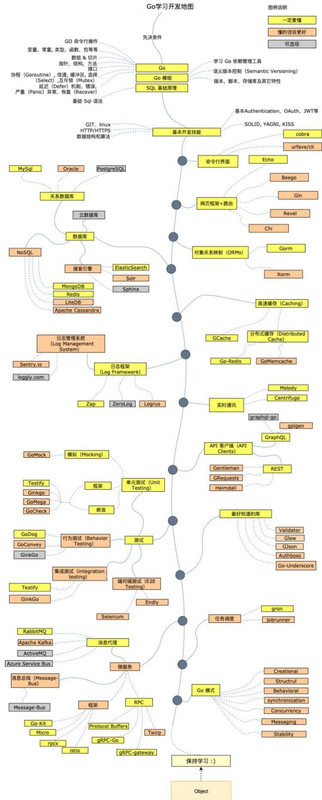

## 💻 Golang

工作量较大, 急需pr

### golang-Interview

- [Golang八股 (必看👍)](https://github.com/870869624/Golang-Guide/blob/main/Golang/go-interview/golang%E5%85%AB%E8%82%A1%E6%96%87.md)
- [Golang实战面经 (必看👍)](https://github.com/870869624/Golang-Guide/tree/main/%E5%AE%9E%E6%88%98)
- 数据结构与算法Guide【Golang实现】(必看👍)
- 数据结构-Golang代码
- 算法-Golang代码
- 哔站讲解：算法和数据结构 ——【Golang实现】(必看👍)
- [Gin源码阅读与分析](https://github.com/870869624/Golang-Guide/blob/main/Golang/%E6%A1%86%E6%9E%B6/Gin/Gin%E6%BA%90%E7%A0%81%E9%98%85%E8%AF%BB.md)

### golang-study

- golang学习路线
- golang项目 (必看👍 )
    - [7 个 yyds 的 Go 项目](https://github.com/870869624/Golang-Guide/blob/main/Golang/go-study/%E9%A1%B9%E7%9B%AE/7%E4%B8%AAyyds%E7%9A%84Go%E9%A1%B9%E7%9B%AE.md)
    - [成为 Go 高手的 8 个 GitHub 开源项目](https://github.com/870869624/Golang-Guide/blob/main/Golang/go-study/%E9%A1%B9%E7%9B%AE/%E6%88%90%E4%B8%BAGo%E9%AB%98%E6%89%8B%E7%9A%848%E4%B8%AAgithub%E5%BC%80%E6%BA%90%E9%A1%B9%E7%9B%AE.md)
- Go语言学习之路--李文周
- 第五届字节跳动青训营
- 超高质量网站 (必看👍 )
- Go 学习推荐社区/网站/博主(必看👍 )
- 常用组件库 持续更新中～
- [规范]

### golang-project

📚 飞书书库 [关注公众号回复：飞书书库 获取密码]
内包含：

#### 面经

- Golang面试题120天

#### 学习资料

- Golang三色标记+混合写屏障机制

- Golang修养之路

- gopl-zh (1)

- GORM+夜读

- Go语言中文文档

- redis

- Uber Go 语言编程规范

- 百度Golang编码规范V1.1

- 部署课程[ubuntu]

- Golang协程调度器原理与GMP设计思想

- 用户模块讲义

- 字节跳动求职精华宝典-西安电子科技大学

#### Go ApI

- Golang_Manual_By_AstaXie_20120522

#### 知识图谱和路线图

- 2021版本-Go语言学习路线图

- Golang来啦

- Go开发者成长路线图

- Go语言学习路线图

- Go知识图谱

## 框架 ~

- [Gin](https://gin-gonic.com/zh-cn/docs/introduction/)

- [Gin源码阅读与分析(必看👍)](https://github.com/870869624/Golang-Guide/blob/main/Golang/%E6%A1%86%E6%9E%B6/Gin/Gin%E6%BA%90%E7%A0%81%E9%98%85%E8%AF%BB.md)

- [go-zero](https://go-zero.dev/cn/docs/introduction)

- [字节-CloudWeGo](https://www.cloudwego.io/zh/docs/)

- [HTTP-Hertz](https://www.cloudwego.io/zh/docs/hertz/overview/)

- [RPC-Kitex](https://www.cloudwego.io/zh/docs/kitex/overview/)

