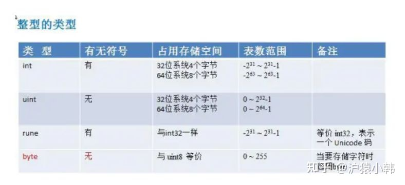

## go与其他语言

### 什么是[面向对象](https://so.csdn.net/so/search?q=%E9%9D%A2%E5%90%91%E5%AF%B9%E8%B1%A1&spm=1001.2101.3001.7020)

在了解 Go 语言是不是面向对象（简称：OOP） 之前，我们必须先知道 OOP 是啥，得先给他 “下定义”
根据 Wikipedia 的定义，我们梳理出 OOP 的几个基本认知：

* 面向对象编程（OOP）是一种基于 “对象” 概念的编程范式，它可以包含数据和代码：数据以字段的形式存在（通常称为属性或属性），代码以程序的形式存在（通常称为方法）。
* 对象自己的程序可以访问并经常修改自己的数据字段。
* 对象经常被定义为类的一个实例。
* 对象利用属性和方法的私有/受保护/公共可见性，对象的内部状态受到保护，不受外界影响（被封装）。

基于这几个基本认知进行一步延伸出，面向对象的三大基本特性：

* 封装
* 继承
* 多态

### Go语言和Java有什么区别?

1、Go上不允许函数重载，必须具有方法和函数的唯一名称，而Java允许函数重载。
2、在速度方面，Go的速度要比Java快。
3、Java默认允许多态，而Go没有。
4、Go语言使用HTTP协议进行路由配置，而Java使用Akka.routing.ConsistentHashingRouter和Akka.routing.ScatterGatherFirstCompletedRouter进行路由配置。
5、Go代码可以自动扩展到多个核心，而Java并不总是具有足够的可扩展性。
6、Go语言的继承通过匿名组合完成，基类以Struct的方式定义，子类只需要把基类作为成员放在子类的定义中，支持多继承;而Java的继承通过extends关键字完成，不支持多继承。

### Go 是面向对象的语言吗？

是的，也不是。原因是：

1. Go 有类型和方法，并且允许面向对象的编程风格，但没有类型层次。
2. Go 中的 "接口 "概念提供了一种不同的方法，我们认为这种方法易于使用，而且在某些方面更加通用。还有一些方法可以将类型嵌入到其他类型中，以提供类似的东西，但不等同于子类。
3. Go 中的方法比 C++ 或 Java 中的方法更通用：它们可以为任何类型的数据定义，甚至是内置类型，如普通的、"未装箱的 "整数。它们并不局限于结构（类）。
4. Go 由于缺乏类型层次，Go 中的 "对象 "比 C++ 或 Java 等语言更轻巧。

#### 封装

面向对象中的 “封装” 指的是可以隐藏对象的内部属性和实现细节，仅对外提供公开接口调用，这样子用户就不需要关注你内部是怎么实现的。
**在 Go 语言中的属性访问权限，通过首字母大小写来控制：**

* 首字母大写，代表是公共的、可被外部访问的。
* 首字母小写，代表是私有的，不可以被外部访问。

Go 语言的例子如下：

```go
type Animal struct {
    name string
}

func NewAnimal() *Animal {
     return &Animal{}
}

func (p *Animal) SetName(name string) {
     p.name = name
}

func (p *Animal) GetName() string {
     return p.name
}
```

在上述例子中，我们声明了一个结构体 Animal，其属性 name 为小写。没法通过外部方法，在配套上存在 Setter 和 Getter 的方法，用于统一的访问和设置控制。
以此实现在 Go 语言中的基本封装。

#### 继承

面向对象中的 “继承” 指的是子类继承父类的特征和行为，使得子类对象（实例）具有父类的实例域和方法，或子类从父类继承方法，使得子类具有父类相同的行为。


从实际的例子来看，就是动物是一个大父类，下面又能细分为 “食草动物”、“食肉动物”，这两者会包含 “动物” 这个父类的基本定义。
从实际的例子来看，就是动物是一个大父类，下面又能细分为 “食草动物”、“食肉动物”，这两者会包含 “动物” 这个父类的基本定义。
 **在 Go 语言中，是没有类似 extends 关键字的这种继承的方式，在语言设计上采取的是组合的方式** ：

```go
 type Animal struct {
     Name string
}

type Cat struct {
     Animal
     FeatureA string
}

type Dog struct {
     Animal
     FeatureB string
}
```

在上述例子中，我们声明了 Cat 和 Dog 结构体，其在内部匿名组合了 Animal 结构体。因此 Cat 和 Dog 的实例都可以调用 Animal 结构体的方法：

```go
func main() {
     p := NewAnimal()
     p.SetName("我是搬运工，去给煎鱼点赞~")

    dog := Dog{Animal: *p}
     fmt.Println(dog.GetName())
}
```

同时 Cat 和 Dog 的实例可以拥有自己的方法：

```go
func main() {
     p := NewAnimal()
     p.SetName("我是搬运工，去给煎鱼点赞~")

    dog := Dog{Animal: *p}
     fmt.Println(dog.GetName())
}
```

上述例子能够正常包含调用 Animal 的相关属性和方法，也能够拥有自己的独立属性和方法，在 Go 语言中达到了类似继承的效果。

#### 多态

多态
面向对象中的 “多态” 指的同一个行为具有多种不同表现形式或形态的能力，具体是指一个类实例（对象）的相同方法在不同情形有不同表现形式。
多态也使得不同内部结构的对象可以共享相同的外部接口，也就是都是一套外部模板，内部实际是什么，只要符合规格就可以。
**在 Go 语言中，多态是通过接口来实现的：**

```go
type AnimalSounder interface {
     MakeDNA()
}

func MakeSomeDNA(animalSounder AnimalSounder) {		// 参数是AnimalSounder接口类型
     animalSounder.MakeDNA()
}
```

在上述例子中，我们声明了一个接口类型 AnimalSounder，配套一个 MakeSomeDNA 方法，其接受 AnimalSounder 接口类型作为入参。
因此在 Go 语言中。只要配套的 Cat 和 Dog 的实例也实现了 MakeSomeDNA 方法，那么我们就可以认为他是 AnimalSounder 接口类型：

```go
type AnimalSounder interface {
     MakeDNA()
}

func MakeSomeDNA(animalSounder AnimalSounder) {
     animalSounder.MakeDNA()
}

func (c *Cat) MakeDNA() {
     fmt.Println("煎鱼是煎鱼")
}

func (c *Dog) MakeDNA() {
     fmt.Println("煎鱼其实不是煎鱼")
}

func main() {
     MakeSomeDNA(&Cat{})
     MakeSomeDNA(&Dog{})
}
```

当 Cat 和 Dog 的实例实现了 AnimalSounder 接口类型的约束后，就意味着满足了条件，他们在 Go 语言中就是一个东西。能够作为入参传入 MakeSomeDNA 方法中，再根据不同的实例实现多态行为。

在日常工作中，基本了解这些概念就可以了。**若是面试，可以针对三大特性：“封装、继承、多态” 和 五大原则 “单一职责原则（SRP）、开放封闭原则（OCP）、里氏替换原则（LSP）、依赖倒置原则（DIP）、接口隔离原则（ISP）” 进行深入理解和说明。**

### go语言和python的区别：

**1、范例**
Python是一种基于面向对象编程的多范式，命令式和函数式编程语言。它坚持这样一种观点，即如果一种语言在某些情境中表现出某种特定的方式，理想情况下它应该在所有情境中都有相似的作用。但是，它又不是纯粹的OOP语言，它不支持强封装，这是OOP的主要原则之一。
Go是一种基于并发编程范式的过程编程语言，它与C具有表面相似性。实际上，Go更像是C的更新版本。
**2、类型化**
Python是动态类型语言，而Go是一种静态类型语言，它实际上有助于在编译时捕获错误，这可以进一步减少生产后期的严重错误。
**3、并发**
Python没有提供内置的并发机制，而Go有内置的并发机制。
**4、安全性**
Python是一种强类型语言，它是经过编译的，因此增加了一层安全性。Go具有分配给每个变量的类型，因此，它提供了安全性。但是，如果发生任何错误，用户需要自己运行整个代码。
**5、管理内存**
Go允许程序员在很大程度上管理内存。而，Python中的内存管理完全自动化并由Python VM管理；它不允许程序员对内存管理负责。
**6、库**
与Go相比，Python提供的库数量要大得多。然而，Go仍然是新的，并且还没有取得很大进展。
**7、语法**
Python的语法使用缩进来指示代码块。Go的语法基于打开和关闭括号。
**8、详细程度**
为了获得相同的功能，Golang代码通常需要编写比Python代码更多的字符。

### go 与 node.js

深入对比Node.js和Golang 到底谁才是NO.1 : [https://zhuanlan.zhihu.com/p/421352168](https://zhuanlan.zhihu.com/p/421352168)
从 Node 到 Go：一个粗略的比较 : [https://zhuanlan.zhihu.com/p/29847628](https://zhuanlan.zhihu.com/p/29847628)

## **基础部分**

### 为什么选择golang

**0、高性能-协程**
golang 源码级别支持协程，实现简单；对比进程和线程，协程占用资源少，能够简洁高效地处理高并发问题。
**1、学习曲线容易-代码极简**
Go语言语法简单，包含了类C语法。因为Go语言容易学习，所以一个普通的大学生花几个星期就能写出来可以上手的、高性能的应用。在国内大家都追求快，这也是为什么国内Go流行的原因之一。
Go 语言的语法特性简直是太简单了，简单到你几乎玩不出什么花招，直来直去的，学习曲线很低，上手非常快。
**2、效率：快速的编译时间，开发效率和运行效率高**
开发过程中相较于 Java 和 C++呆滞的编译速度，Go 的快速编译时间是一个主要的效率优势。Go拥有接近C的运行效率和接近PHP的开发效率。
C 语言的理念是信任程序员，保持语言的小巧，不屏蔽底层且底层友好，关注语言的执行效率和性能。而 Python 的姿态是用尽量少的代码完成尽量多的事。于是我能够感觉到，Go 语言想要把 C 和 Python 统一起来，这是多棒的一件事啊。
**3、出身名门、血统纯正**
之所以说Go出身名门，从Go语言的创造者就可见端倪，Go语言绝对血统纯正。其次Go语言出自Google公司，Google在业界的知名度和实力自然不用多说。Google公司聚集了一批牛人，在各种编程语言称雄争霸的局面下推出新的编程语言，自然有它的战略考虑。而且从Go语言的发展态势来看，Google对它这个新的宠儿还是很看重的，Go自然有一个良好的发展前途。
**4、自由高效：组合的思想、无侵入式的接口**
Go语言可以说是开发效率和运行效率二者的完美融合，天生的并发编程支持。Go语言支持当前所有的编程范式，包括过程式编程、面向对象编程、面向接口编程、函数式编程。程序员们可以各取所需、自由组合、想怎么玩就怎么玩。
**5、强大的标准库-生态**
背靠谷歌，生态丰富，轻松 go get 获取各种高质量轮子。用户可以专注于业务逻辑，避免重复造轮子。
这包括互联网应用、系统编程和网络编程。Go里面的标准库基本上已经是非常稳定了，特别是我这里提到的三个，网络层、系统层的库非常实用。Go 语言的 lib 库麻雀虽小五脏俱全。Go 语言的 lib 库中基本上有绝大多数常用的库，虽然有些库还不是很好，但我觉得不是问题，因为我相信在未来的发展中会把这些问题解决掉。
**6、部署方便：二进制文件，Copy部署**
部署简单，源码编译成执行文件后，可以直接运行，减少了对其它插件依赖。不像其它语言，执行文件依赖各种插件，各种库，研发机器运行正常，部署到生产环境，死活跑不起来 。
**7、简单的并发**
并行和异步编程几乎无痛点。Go 语言的 Goroutine 和 Channel 这两个神器简直就是并发和异步编程的巨大福音。像 C、C++、Java、Python 和 JavaScript 这些语言的并发和异步方式太控制就比较复杂了，而且容易出错，而 Go 解决这个问题非常地优雅和流畅。这对于编程多年受尽并发和异步折磨的编程者来说，完全就是让人眼前一亮的感觉。Go 是一种非常高效的语言，高度支持并发性。Go是为大数据、微服务、并发而生的一种编程语言。
Go 作为一门语言致力于使事情简单化。它并未引入很多新概念，而是聚焦于打造一门简单的语言，它使用起来异常快速并且简单。其唯一的创新之处是 goroutines 和通道。Goroutines 是 Go 面向线程的轻量级方法，而通道是 goroutines 之间通信的优先方式。
创建 Goroutines 的成本很低，只需几千个字节的额外内存，正由于此，才使得同时运行数百个甚至数千个 goroutines 成为可能。可以借助通道实现 goroutines 之间的通信。Goroutines 以及基于通道的并发性方法使其非常容易使用所有可用的 CPU 内核，并处理并发的 IO。相较于 Python/Java，在一个 goroutine 上运行一个函数需要最小的代码。
**8、稳定性**
Go拥有强大的编译检查、严格的编码规范和完整的软件生命周期工具，具有很强的稳定性，稳定压倒一切。那么为什么Go相比于其他程序会更稳定呢？这是因为Go提供了软件生命周期（开发、测试、部署、维护等等）的各个环节的工具，如go tool、gofmt、go test。
**9、跨平台**
很多语言都支持跨平台，把这个优点单独拿出来，貌似没有什么值得称道的，但是结合上述优点，它的综合能力就非常强了。

### golang 缺点

**①右大括号不允许换行，否则编译报错**
**②不允许有未使用的包或变量**
 **③错误处理原始，虽然引入了defer、panic、recover处理出错后的逻辑，函数可以返回多个值，但基本依靠返回错误是否为空来判断函数是否执行成功，if err != nil语句较多，比较繁琐，程序没有java美观。** (官方解释：提供了多个返回值，处理错误方便，如加入异常机制会要求记住一些常见异常，例如IOException，go的错误Error类型较统一方便)
**④[]interface{}不支持下标操作**
**⑤struct没有构造和析构，一些资源申请和释放动作不太方便**
 **⑥仍然保留C/C++的指针操作，取地址&，取值** *

### **golang 中 make 和 new 的区别？（基本必问）**

**共同点：**给变量分配内存
**不同点：**
1）作用变量类型不同，new给string,int和数组分配内存，make给切片，map，channel分配内存；
2）返回类型不一样，new返回指向变量的指针，make返回变量本身；
3）new 分配的空间被清零。make 分配空间后，会进行初始化；
4) 字节的面试官还说了另外一个区别，就是分配的位置，在堆上还是在栈上？这块我比较模糊，大家可以自己探究下，我搜索出来的答案是golang会弱化分配的位置的概念，因为编译的时候会自动内存逃逸处理，懂的大佬帮忙补充下：make、new内存分配是在堆上还是在栈上？

### [IO多路复用](https://zhuanlan.zhihu.com/p/115220699)

### **for range 的时候它的地址会发生变化么？**

答：在 for a,b := range c 遍历中， a 和 b 在内存中只会存在一份，即之后每次循环时遍历到的数据都是以值覆盖的方式赋给 a 和 b，a，b 的内存地址始终不变。由于有这个特性，for 循环里面如果开协程，不要直接把 a 或者 b 的地址传给协程。解决办法：在每次循环时，创建一个临时变量。

### **go defer，多个 defer 的顺序，defer 在什么时机会修改返回值？**

[Golang中的Defer必掌握的7知识点-地鼠文档](https://www.topgoer.cn/docs/golangxiuyang/golangxiuyang-1cmee0q64ij5p)
作用：defer延迟函数，释放资源，收尾工作；如释放锁，关闭文件，关闭链接；捕获panic;
避坑指南：defer函数紧跟在资源打开后面，否则defer可能得不到执行，导致内存泄露。
多个 defer 调用顺序是 LIFO（后入先出），defer后的操作可以理解为压入栈中
defer，return，return value（函数返回值） 执行顺序：首先return，其次return value，最后defer。defer可以修改函数最终返回值，修改时机：**有名返回值或者函数返回指针** 参考：
[【Golang】Go语言defer用法大总结(含return返回机制)__奶酪的博客-CSDN博客blog.csdn.net/Cassie_zkq/article/details/108567205](https://link.zhihu.com/?target=https%3A//blog.csdn.net/Cassie_zkq/article/details/108567205)

**有名返回值**

```go
func b() (i int) { 
    defer func() { 
        i++ 
        fmt.Println("defer2:", i) 
    }() 
    defer func() { 
        i++ 
        fmt.Println("defer1:", i) 
    }() 
    return i
    //或者直接写成
    return
}
func main() { 
    fmt.Println("return:", b())
}
```

函数返回指针

```go
func c() *int { 
    var i int 
    defer func() { 
        i++ 
        fmt.Println("defer2:", i) 
    }() 
    defer func() { 
        i++ 
        fmt.Println("defer1:", i) 
    }() 
    return &i 
} 
func main() { 
    fmt.Println("return:", *(c())) 
}
```

### **uint 类型溢出问题**

超过最大存储值如uint8最大是255
var a uint8 =255
var b uint8 =1
a+b = 0总之类型溢出会出现难以意料的事



### **能介绍下 rune 类型吗？**

相当int32
golang中的字符串底层实现是通过byte数组的，中文字符在unicode下占2个字节，在utf-8编码下占3个字节，而golang默认编码正好是utf-8
byte 等同于int8，常用来处理ascii字符
rune 等同于int32,常用来处理unicode或utf-8字符

### **golang 中解析 tag 是怎么实现的？反射原理是什么？(中高级肯定会问，比较难，需要自己多去总结)**

### **参考如下连接**

[golang中struct关于反射tag_paladinosment的博客-CSDN博客_golang 反射tagblog.csdn.net/paladinosment/article/details/42570937](https://link.zhihu.com/?target=https%3A//blog.csdn.net/paladinosment/article/details/42570937)
type User struct { name string `json:name-field` age int } func main() { user := &User{"John Doe The Fourth", 20} field, ok := reflect.TypeOf(user).Elem().FieldByName("name") if !ok { panic("Field not found") } fmt.Println(getStructTag(field)) } func getStructTag(f reflect.StructField) string { return string(f.Tag) }
Go 中解析的 tag 是通过反射实现的，反射是指计算机程序在运行时（Run time）可以访问、检测和修改它本身状态或行为的一种能力或动态知道给定数据对象的类型和结构，并有机会修改它。反射将接口变量转换成反射对象 Type 和 Value；反射可以通过反射对象 Value 还原成原先的接口变量；反射可以用来修改一个变量的值，前提是这个值可以被修改；tag是啥:结构体支持标记，name string `json:name-field` 就是 `json:name-field` 这部分
**gorm json yaml gRPC protobuf gin.Bind()都是通过反射来实现的**

### **调用函数传入结构体时，应该传值还是指针？ （Golang 都是传值）**

Go 的函数参数传递都是值传递。所谓值传递：指在调用函数时将实际参数复制一份传递到函数中，这样在函数中如果对参数进行修改，将不会影响到实际参数。参数传递还有引用传递，所谓引用传递是指在调用函数时将实际参数的地址传递到函数中，那么在函数中对参数所进行的修改，将影响到实际参数
因为 Go 里面的 map，slice，chan 是引用类型。变量区分值类型和引用类型。所谓值类型：变量和变量的值存在同一个位置。所谓引用类型：变量和变量的值是不同的位置，变量的值存储的是对值的引用。但并不是 map，slice，chan 的所有的变量在函数内都能被修改，不同数据类型的底层存储结构和实现可能不太一样，情况也就不一样。

### goroutine什么情况下会阻塞

在 Go 里面阻塞主要分为以下 4 种场景：

1. 由于原子、互斥量或通道操作调用导致 Goroutine 阻塞，调度器将把当前阻塞的 Goroutine 切换出去，重新调度 LRQ 上的其他 Goroutine；
2. 由于网络请求和 IO 操作导致 Goroutine 阻塞。Go 程序提供了网络轮询器（NetPoller）来处理网络请求和 IO 操作的问题，其后台通过 kqueue（MacOS），epoll（Linux）或 iocp（Windows）来实现 IO 多路复用。通过 **使用 NetPoller 进行网络系统调用** ，调度器可以防止 Goroutine 在进行这些系统调用时阻塞 M。这可以让 M 执行 P 的 LRQ 中其他的 Goroutines，而不需要创建新的 M。执行网络系统调用不需要额外的 M， **网络轮询器使用系统线程** ，它时刻处理一个有效的事件循环，有助于减少操作系统上的调度负载。用户层眼中看到的 Goroutine 中的“block socket”，实现了 goroutine-per-connection 简单的网络编程模式。实际上是通过 Go runtime 中的 netpoller 通过 Non-block socket + I/O 多路复用机制“模拟”出来的。
3. 当调用一些系统方法的时候（如文件 I/O），如果系统方法调用的时候发生阻塞，这种情况下，网络轮询器（NetPoller）无法使用，而进行系统调用的 G1 将阻塞当前 M1。调度器引入 其它M 来服务 M1 的P。
4. 如果在 Goroutine 去执行一个 sleep 操作，导致 M 被阻塞了。Go 程序后台有一个监控线程 sysmon，它监控那些长时间运行的 G 任务然后设置可以强占的标识符，别的 Goroutine 就可以抢先进来执行。

### **讲讲 Go 的 select 底层数据结构和一些特性？（难点，没有项目经常可能说不清，面试一般会问你项目中怎么使用select）**

答：go 的 select 为 golang 提供了多路 IO 复用机制，和其他 IO 复用一样，用于检测是否有读写事件是否 ready。linux 的系统 IO 模型有 select，poll，epoll，go 的 select 和 linux 系统 select 非常相似。
select 结构组成主要是由 case 语句和执行的函数组成 select 实现的多路复用是：每个线程或者进程都先到注册和接受的 channel（装置）注册，然后阻塞，然后只有一个线程在运输，当注册的线程和进程准备好数据后，装置会根据注册的信息得到相应的数据。
**select 的特性**
1）select 操作至少要有一个 case 语句，出现读写 nil 的 channel 该分支会忽略，在 nil 的 channel 上操作则会报错。
2）select 仅支持管道，而且是单协程操作。
3）每个 case 语句仅能处理一个管道，要么读要么写。
4）多个 case 语句的执行顺序是随机的。
5）存在 default 语句，select 将不会阻塞，但是存在 default 会影响性能。

### **讲讲 Go 的 defer 底层数据结构和一些特性？**

答：每个 defer 语句都对应一个_defer 实例，多个实例使用指针连接起来形成一个单连表，保存在 gotoutine 数据结构中，每次插入_defer 实例，均插入到链表的头部，函数结束再一次从头部取出，从而形成后进先出的效果。
 **defer 的规则总结** ：
延迟函数的参数是 defer 语句出现的时候就已经确定了的。
延迟函数执行按照后进先出的顺序执行，即先出现的 defer 最后执行。
延迟函数可能操作主函数的返回值。
申请资源后立即使用 defer 关闭资源是个好习惯。

### **单引号，双引号，反引号的区别？**

单引号，表示byte类型或rune类型，对应 uint8和int32类型，默认是 rune 类型。byte用来强调数据是raw data，而不是数字；而rune用来表示Unicode的code point。
双引号，才是字符串，实际上是字符数组。可以用索引号访问某字节，也可以用len()函数来获取字符串所占的字节长度。
反引号，表示字符串字面量，但不支持任何转义序列。字面量 raw literal string 的意思是，你定义时写的啥样，它就啥样，你有换行，它就换行。你写转义字符，它也就展示转义字符。

### go出现panic的场景

### [Go出现panic的场景](https://www.cnblogs.com/paulwhw/p/15585467.html)

* 数组/切片越界
* 空指针调用。比如访问一个 nil 结构体指针的成员
* 过早关闭 HTTP 响应体
* 除以 0
* 向已经关闭的 channel 发送消息
* 重复关闭 channel
* 关闭未初始化的 channel
* 未初始化 map。注意访问 map 不存在的 key 不会 panic，而是返回 map 类型对应的零值，但是不能直接赋值
* 跨协程的 panic 处理
* sync 计数为负数。
* 类型断言不匹配。`var a interface{} = 1; fmt.Println(a.(string))` 会 panic，建议用 `s,ok := a.(string)`

### go是否支持while循环，如何实现这种机制

[https://blog.csdn.net/chengqiuming/article/details/115573947](https://blog.csdn.net/chengqiuming/article/details/115573947)

### go里面如何实现set？

Go中是不提供Set类型的，Set是一个集合，其本质就是一个List，只是List里的元素不能重复。
Go提供了map类型，但是我们知道，map类型的key是不能重复的，因此，我们可以利用这一点，来实现一个set。那value呢？value我们可以用一个常量来代替，比如一个空结构体，实际上空结构体不占任何内存，使用空结构体，能够帮我们节省内存空间，提高性能
代码实现：[https://blog.csdn.net/haodawang/article/details/80006059](https://blog.csdn.net/haodawang/article/details/80006059)

### go如何实现类似于java当中的继承机制？

[两分钟让你明白Go中如何继承](https://zhuanlan.zhihu.com/p/88480107)
说到继承我们都知道，在Go中没有extends关键字，也就意味着Go并没有原生级别的继承支持。这也是为什么我在文章开头用了**伪继承**这个词。本质上，Go使用interface实现的功能叫组合，Go是使用组合来实现的继承，说的更精确一点，是使用组合来代替的继承，举个很简单的例子:
**通过组合实现了继承：**

```go
type Animal struct {
    Name string
}

func (a *Animal) Eat() {
    fmt.Printf("%v is eating", a.Name)
    fmt.Println()
}

type Cat struct {
    *Animal
}

cat := &Cat{
    Animal: &Animal{
        Name: "cat",
    },
}
cat.Eat() // cat is eating
```

首先，我们实现了一个Animal的结构体，代表动物类。并声明了Name字段，用于描述动物的名字。
然后，实现了一个以Animal为receiver的Eat方法，来描述动物进食的行为。
最后，声明了一个Cat结构体，组合了Cat字段。再实例化一个猫，调用Eat方法，可以看到会正常的输出。
可以看到，Cat结构体本身没有Name字段，也没有去实现Eat方法。唯一有的就是组合了Animal父类，至此，我们就证明了已经通过组合实现了继承。
总结：

如果一个 struct 嵌套了另一个匿名结构体，那么这个结构可以直接访问匿名结构体的属性和方法，从而实现继承。
如果一个 struct 嵌套了另一个有名的结构体，那么这个模式叫做组合。
如果一个 struct 嵌套了多个匿名结构体，那么这个结构可以直接访问多个匿名结构体的属性和方法，从而实现多重继承。

### 怎么去复用一个接口的方法？

[怎么在golang中通过接口嵌套实现复用 - 开发技术 - 亿速云](https://www.yisu.com/zixun/452409.html)
