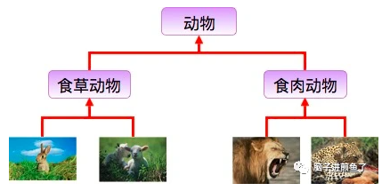
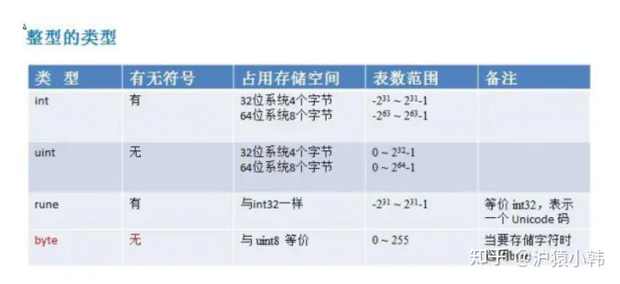

# go与其他语言

# map 循环是有序的还是无序的？

在Go语言中，map的循环（遍历）是无序的。这意味着当你遍历map时，每次遍历的顺序可能都不同。Go语言的map是基于哈希表的，因此元素的存储顺序是不确定的，并且可能会随着元素的添加、删除等操作而改变。

如果你需要按照特定的顺序处理map中的元素，你应该先将key提取到一个切片中，对切片进行排序，然后按照排序后的顺序遍历切片，并从map中取出对应的值。这样，你就可以按照特定的顺序处理map中的元素了。

# 什么是[面向对象](https://so.csdn.net/so/search?q=%E9%9D%A2%E5%90%91%E5%AF%B9%E8%B1%A1&spm=1001.2101.3001.7020)

在了解 Go 语言是不是面向对象（简称：OOP） 之前，我们必须先知道 OOP 是啥，得先给他 “下定义”
根据 Wikipedia 的定义，我们梳理出 OOP 的几个基本认知：

* 面向对象编程（OOP）是一种基于 “对象” 概念的编程范式，它可以包含数据和代码：数据以字段的形式存在（通常称为属性或属性），代码以程序的形式存在（通常称为方法）。
* 对象自己的程序可以访问并经常修改自己的数据字段。
* 对象经常被定义为类的一个实例。
* 对象利用属性和方法的私有/受保护/公共可见性，对象的内部状态受到保护，不受外界影响（被封装）。

基于这几个基本认知进行一步延伸出，面向对象的三大基本特性：

* 封装
* 继承
* 多态

# Go语言和Java有什么区别?

1. Go上不允许函数重载，必须具有方法和函数的唯一名称，而Java允许函数重载。

2. 在速度方面，Go的速度要比Java快。

3. Java默认允许多态，而Go没有。

4. Go语言使用HTTP协议进行路由配置，而Java使用`Akka.routing.ConsistentHashingRouter`和`Akka.routing.ScatterGatherFirstCompletedRouter`进行路由配置。

5. Go代码可以自动扩展到多个核心，而Java并不总是具有足够的可扩展性。

6. Go语言的继承通过匿名组合完成，基类以Struct的方式定义，子类只需要把基类作为成员放在子类的定义中，支持多继承;而Java的继承通过extends关键字完成，不支持多继承。

# Go 是面向对象的语言吗？

是的，也不是。原因是：

1. Go 有类型和方法，并且允许面向对象的编程风格，但没有类型层次。
2. Go 中的 "接口 "概念提供了一种不同的方法，我们认为这种方法易于使用，而且在某些方面更加通用。还有一些方法可以将类型嵌入到其他类型中，以提供类似的东西，但不等同于子类。
3. Go 中的方法比 C++ 或 Java 中的方法更通用：它们可以为任何类型的数据定义，甚至是内置类型，如普通的、"未装箱的 "整数。它们并不局限于结构（类）。
4. Go 由于缺乏类型层次，Go 中的 "对象 "比 C++ 或 Java 等语言更轻巧。

## 封装

面向对象中的 “封装” 指的是可以隐藏对象的内部属性和实现细节，仅对外提供公开接口调用，这样子用户就不需要关注你内部是怎么实现的。
**在 Go 语言中的属性访问权限，通过首字母大小写来控制：**

* 首字母大写，代表是公共的、可被外部访问的。
* 首字母小写，代表是私有的，不可以被外部访问。

Go 语言的例子如下：

```go
type Animal struct {
    name string
}

func NewAnimal() *Animal {
     return &Animal{}
}

func (p *Animal) SetName(name string) {
     p.name = name
}

func (p *Animal) GetName() string {
     return p.name
}
```

在上述例子中，我们声明了一个结构体 Animal，其属性 name 为小写。没法通过外部方法，在配套上存在 Setter 和 Getter 的方法，用于统一的访问和设置控制。
以此实现在 Go 语言中的基本封装。

## 继承

面向对象中的 “继承” 指的是子类继承父类的特征和行为，使得子类对象（实例）具有父类的实例域和方法，或子类从父类继承方法，使得子类具有父类相同的行为。



从实际的例子来看，就是动物是一个大父类，下面又能细分为 “食草动物”、“食肉动物”，这两者会包含 “动物” 这个父类的基本定义。
从实际的例子来看，就是动物是一个大父类，下面又能细分为 “食草动物”、“食肉动物”，这两者会包含 “动物” 这个父类的基本定义。

**在 Go 语言中，是没有类似 extends 关键字的这种继承的方式，在语言设计上采取的是组合的方式** ：

```go
 type Animal struct {
     Name string
}

type Cat struct {
     Animal
     FeatureA string
}

type Dog struct {
     Animal
     FeatureB string
}
```

在上述例子中，我们声明了 Cat 和 Dog 结构体，其在内部匿名组合了 Animal 结构体。因此 Cat 和 Dog 的实例都可以调用 Animal 结构体的方法：

```go
func main() {
     p := NewAnimal()
     p.SetName("我是搬运工，去给煎鱼点赞~")

     dog := Dog{Animal: *p}
     fmt.Println(dog.GetName())
}
```

同时 Cat 和 Dog 的实例可以拥有自己的方法：

```go
func main() {
     p := NewAnimal()
     p.SetName("我是搬运工，去给煎鱼点赞~")

     dog := Dog{Animal: *p}
     fmt.Println(dog.GetName())
}
```

上述例子能够正常包含调用 Animal 的相关属性和方法，也能够拥有自己的独立属性和方法，在 Go 语言中达到了类似继承的效果。

## 多态

多态
面向对象中的 “多态” 指的同一个行为具有多种不同表现形式或形态的能力，具体是指一个类实例（对象）的相同方法在不同情形有不同表现形式。
多态也使得不同内部结构的对象可以共享相同的外部接口，也就是都是一套外部模板，内部实际是什么，只要符合规格就可以。
**在 Go 语言中，多态是通过接口来实现的：**

```go
type AnimalSounder interface {
     MakeDNA()
}

func MakeSomeDNA(animalSounder AnimalSounder) {		// 参数是AnimalSounder接口类型
     animalSounder.MakeDNA()
}
```

在上述例子中，我们声明了一个接口类型 AnimalSounder，配套一个 MakeSomeDNA 方法，其接受 AnimalSounder 接口类型作为入参。
因此在 Go 语言中。只要配套的 Cat 和 Dog 的实例也实现了 MakeSomeDNA 方法，那么我们就可以认为他是 AnimalSounder 接口类型：

```go
type AnimalSounder interface {
     MakeDNA()
}

func MakeSomeDNA(animalSounder AnimalSounder) {
     animalSounder.MakeDNA()
}

func (c *Cat) MakeDNA() {
     fmt.Println("煎鱼是煎鱼")
}

func (c *Dog) MakeDNA() {
     fmt.Println("煎鱼其实不是煎鱼")
}

func main() {
     MakeSomeDNA(&Cat{})
     MakeSomeDNA(&Dog{})
}
```

当 Cat 和 Dog 的实例实现了 AnimalSounder 接口类型的约束后，就意味着满足了条件，他们在 Go 语言中就是一个东西。能够作为入参传入 MakeSomeDNA 方法中，再根据不同的实例实现多态行为。

在日常工作中，基本了解这些概念就可以了。**若是面试，可以针对三大特性：“封装、继承、多态” 和 五大原则 “单一职责原则（SRP）、开放封闭原则（OCP）、里氏替换原则（LSP）、依赖倒置原则（DIP）、接口隔离原则（ISP）” 进行深入理解和说明。**

# go语言和python的区别：

**1. 范例**
Python是一种基于面向对象编程的多范式，命令式和函数式编程语言。它坚持这样一种观点，即如果一种语言在某些情境中表现出某种特定的方式，理想情况下它应该在所有情境中都有相似的作用。但是，它又不是纯粹的OOP语言，它不支持强封装，这是OOP的主要原则之一。
Go是一种基于并发编程范式的过程编程语言，它与C具有表面相似性。实际上，Go更像是C的更新版本。

**2. 类型化**
Python是动态类型语言，而Go是一种静态类型语言，它实际上有助于在编译时捕获错误，这可以进一步减少生产后期的严重错误。

**3. 并发**
Python没有提供内置的并发机制，而Go有内置的并发机制。

**4. 安全性**
Python是一种强类型语言，它是经过编译的，因此增加了一层安全性。Go具有分配给每个变量的类型，因此，它提供了安全性。但是，如果发生任何错误，用户需要自己运行整个代码。

**5. 管理内存**
Go允许程序员在很大程度上管理内存。而，Python中的内存管理完全自动化并由Python VM管理；它不允许程序员对内存管理负责。

**6. 库**
与Go相比，Python提供的库数量要大得多。然而，Go仍然是新的，并且还没有取得很大进展。

**7. 语法**
Python的语法使用缩进来指示代码块。Go的语法基于打开和关闭括号。

**8. 详细程度**
为了获得相同的功能，Golang代码通常需要编写比Python代码更多的字符。

# go 与 node.js

深入对比Node.js和Golang 到底谁才是NO.1 : [https://zhuanlan.zhihu.com/p/421352168](https://zhuanlan.zhihu.com/p/421352168)

从 Node 到 Go：一个粗略的比较 : [https://zhuanlan.zhihu.com/p/29847628](https://zhuanlan.zhihu.com/p/29847628)

# **基础部分**

# 为什么选择golang

**0. 高性能-协程**
golang 源码级别支持协程，实现简单；对比进程和线程，协程占用资源少，能够简洁高效地处理高并发问题。

**1. 学习曲线容易-代码极简**
Go语言语法简单，包含了类C语法。因为Go语言容易学习，所以一个普通的大学生花几个星期就能写出来可以上手的、高性能的应用。在国内大家都追求快，这也是为什么国内Go流行的原因之一。
Go 语言的语法特性简直是太简单了，简单到你几乎玩不出什么花招，直来直去的，学习曲线很低，上手非常快。

**2. 效率：快速的编译时间，开发效率和运行效率高**
开发过程中相较于 Java 和 C++呆滞的编译速度，Go 的快速编译时间是一个主要的效率优势。Go拥有接近C的运行效率和接近PHP的开发效率。
C 语言的理念是信任程序员，保持语言的小巧，不屏蔽底层且底层友好，关注语言的执行效率和性能。而 Python 的姿态是用尽量少的代码完成尽量多的事。于是我能够感觉到，Go 语言想要把 C 和 Python 统一起来，这是多棒的一件事啊。

**3. 出身名门、血统纯正**
之所以说Go出身名门，从Go语言的创造者就可见端倪，Go语言绝对血统纯正。其次Go语言出自Google公司，Google在业界的知名度和实力自然不用多说。Google公司聚集了一批牛人，在各种编程语言称雄争霸的局面下推出新的编程语言，自然有它的战略考虑。而且从Go语言的发展态势来看，Google对它这个新的宠儿还是很看重的，Go自然有一个良好的发展前途。

**4. 自由高效：组合的思想、无侵入式的接口**
Go语言可以说是开发效率和运行效率二者的完美融合，天生的并发编程支持。Go语言支持当前所有的编程范式，包括过程式编程、面向对象编程、面向接口编程、函数式编程。程序员们可以各取所需、自由组合、想怎么玩就怎么玩。

**5. 强大的标准库-生态**
背靠谷歌，生态丰富，轻松 go get 获取各种高质量轮子。用户可以专注于业务逻辑，避免重复造轮子。
这包括互联网应用、系统编程和网络编程。Go里面的标准库基本上已经是非常稳定了，特别是我这里提到的三个，网络层、系统层的库非常实用。Go 语言的 lib 库麻雀虽小五脏俱全。Go 语言的 lib 库中基本上有绝大多数常用的库，虽然有些库还不是很好，但我觉得不是问题，因为我相信在未来的发展中会把这些问题解决掉。

**6. 部署方便：二进制文件，Copy部署**
部署简单，源码编译成执行文件后，可以直接运行，减少了对其它插件依赖。不像其它语言，执行文件依赖各种插件，各种库，研发机器运行正常，部署到生产环境，死活跑不起来 。

**7. 简单的并发**
并行和异步编程几乎无痛点。Go 语言的 Goroutine 和 Channel 这两个神器简直就是并发和异步编程的巨大福音。像 C、C++、Java、Python 和 JavaScript 这些语言的并发和异步方式太控制就比较复杂了，而且容易出错，而 Go 解决这个问题非常地优雅和流畅。这对于编程多年受尽并发和异步折磨的编程者来说，完全就是让人眼前一亮的感觉。Go 是一种非常高效的语言，高度支持并发性。Go是为大数据、微服务、并发而生的一种编程语言。

Go 作为一门语言致力于使事情简单化。它并未引入很多新概念，而是聚焦于打造一门简单的语言，它使用起来异常快速并且简单。其唯一的创新之处是 goroutines 和通道。Goroutines 是 Go 面向线程的轻量级方法，而通道是 goroutines 之间通信的优先方式。
创建 Goroutines 的成本很低，只需几千个字节的额外内存，正由于此，才使得同时运行数百个甚至数千个 goroutines 成为可能。可以借助通道实现 goroutines 之间的通信。Goroutines 以及基于通道的并发性方法使其非常容易使用所有可用的 CPU 内核，并处理并发的 IO。相较于 Python/Java，在一个 goroutine 上运行一个函数需要最小的代码。

**8. 稳定性**
Go拥有强大的编译检查、严格的编码规范和完整的软件生命周期工具，具有很强的稳定性，稳定压倒一切。那么为什么Go相比于其他程序会更稳定呢？这是因为Go提供了软件生命周期（开发、测试、部署、维护等等）的各个环节的工具，如go tool、gofmt、go test。

**9. 跨平台**
很多语言都支持跨平台，把这个优点单独拿出来，貌似没有什么值得称道的，但是结合上述优点，它的综合能力就非常强了。

## golang 缺点

**1. 右大括号不允许换行，否则编译报错**

**2. 不允许有未使用的包或变量**

**3. 错误处理原始，虽然引入了defer、panic、recover处理出错后的逻辑，函数可以返回多个值，但基本依靠返回错误是否为空来判断函数是否执行成功，if err != nil语句较多，比较繁琐，程序没有java美观。**
(官方解释：提供了多个返回值，处理错误方便，如加入异常机制会要求记住一些常见异常，例如IOException，go的错误Error类型较统一方便)

**4. []interface{}不支持下标操作**

**5. struct没有构造和析构，一些资源申请和释放动作不太方便**

**6. 仍然保留C/C++的指针操作，取地址&，取值**

## **golang 中 make 和 new 的区别？（基本必问）**

**共同点：**

1) 给变量分配内存

**不同点：**

1) 作用变量类型不同，new给string,int和数组分配内存，make给切片，map，channel分配内存；
2) 返回类型不一样，new返回指向变量的指针，make返回变量本身；
3) new 分配的空间被清零。make 分配空间后，会进行初始化；
4) 字节的面试官还说了另外一个区别，就是分配的位置，在堆上还是在栈上？这块我比较模糊，大家可以自己探究下，我搜索出来的答案是golang会弱化分配的位置的概念，因为编译的时候会自动内存逃逸处理，懂的大佬帮忙补充下：make、new内存分配是在堆上还是在栈上？

# [IO多路复用](https://zhuanlan.zhihu.com/p/115220699)

## **for range 的时候它的地址会发生变化么？**

答：在 for a,b := range c 遍历中， a 和 b 在内存中只会存在一份，即之后每次循环时遍历到的数据都是以值覆盖的方式赋给 a 和 b，a，b 的内存地址始终不变。由于有这个特性，for 循环里面如果开协程，不要直接把 a 或者 b 的地址传给协程。解决办法：在每次循环时，创建一个临时变量。

## **go defer，多个 defer 的顺序，defer 在什么时机会修改返回值？**

[Golang中的Defer必掌握的7知识点-地鼠文档](https://www.topgoer.cn/docs/golangxiuyang/golangxiuyang-1cmee0q64ij5p)

作用：

- defer延迟函数，释放资源，收尾工作；

- 如释放锁，关闭文件，关闭链接；捕获panic;

避坑指南：

- defer函数紧跟在资源打开后面，否则defer可能得不到执行，导致内存泄露。

- 多个 defer 调用顺序是 LIFO（后入先出），defer后的操作可以理解为压入栈中
defer，return，return value（函数返回值） 

执行顺序：

- 首先return，其次return value，最后defer。defer可以修改函数最终返回值,修改时机：**有名返回值或者函数返回指针** 参考：
[【Golang】Go语言defer用法大总结(含return返回机制)__奶酪的博客-CSDN博客blog.csdn.net/Cassie_zkq/article/details/108567205](https://link.zhihu.com/?target=https%3A//blog.csdn.net/Cassie_zkq/article/details/108567205)

**有名返回值**

```go
func b() (i int) { 
    defer func() { 
        i++ 
        fmt.Println("defer2:", i) 
    }() 
    defer func() { 
        i++ 
        fmt.Println("defer1:", i) 
    }() 
    return i
    //或者直接写成
    return
}
func main() { 
    fmt.Println("return:", b())
}
```

函数返回指针

```go
func c() *int { 
    var i int 
    defer func() { 
        i++ 
        fmt.Println("defer2:", i) 
    }() 
    defer func() { 
        i++ 
        fmt.Println("defer1:", i) 
    }() 
    return &i 
} 
func main() { 
    fmt.Println("return:", *(c())) 
}
```

# **uint 类型溢出问题**

超过最大存储值如uint8最大是255

```go
var a uint8 =255
var b uint8 =1
```

a+b = 0总之类型溢出会出现难以意料的事



# **能介绍下 rune 类型吗？**

相当int32
golang中的字符串底层实现是通过byte数组的，中文字符在unicode下占2个字节，在utf-8编码下占3个字节，而golang默认编码正好是utf-8
byte 等同于int8，常用来处理ascii字符
rune 等同于int32,常用来处理unicode或utf-8字符

# **golang 中解析 tag 是怎么实现的？反射原理是什么？(中高级肯定会问，比较难，需要自己多去总结)**

## **参考如下连接**

[golang中struct关于反射tag_paladinosment的博客-CSDN博客_golang 反射tagblog.csdn.net/paladinosment/article/details/42570937](https://link.zhihu.com/?target=https%3A//blog.csdn.net/paladinosment/article/details/42570937)

```go
type User struct { 
    name string `json:name-field` age int
}

func main() { 
    user := &User{
        "John Doe The Fourth", 
        20
    } 
  
    field, ok := reflect.TypeOf(user).Elem().FieldByName("name") if !ok { 
        panic("Field not found") 
    } 
  
    fmt.Println(getStructTag(field)) 
} 

func getStructTag(f reflect.StructField) string { 
    return string(f.Tag) 
}
```

Go 中解析的 tag 是通过反射实现的，反射是指计算机程序在运行时（Run time）可以访问、检测和修改它本身状态或行为的一种能力或动态知道给定数据对象的类型和结构，并有机会修改它。

反射将接口变量转换成反射对象 Type 和 Value；反射可以通过反射对象 Value 还原成原先的接口变量；反射可以用来修改一个变量的值，前提是这个值可以被修改；tag是啥:结构体支持标记，name string `json:name-field` 就是 `json:name-field` 这部分

**`gorm、json、yaml、gRPC、protobuf、gin.Bind()`都是通过反射来实现的**

# **调用函数传入结构体时，应该传值还是指针？ （Golang 都是传值）**

Go 的函数参数传递都是值传递。所谓值传递：指在调用函数时将实际参数复制一份传递到函数中，这样在函数中如果对参数进行修改，将不会影响到实际参数。参数传递还有引用传递，所谓引用传递是指在调用函数时将实际参数的地址传递到函数中，那么在函数中对参数所进行的修改，将影响到实际参数

因为 Go 里面的 map，slice，chan 是引用类型。变量区分值类型和引用类型。所谓值类型：变量和变量的值存在同一个位置。所谓引用类型：变量和变量的值是不同的位置，变量的值存储的是对值的引用。但并不是 map，slice，chan 的所有的变量在函数内都能被修改，不同数据类型的底层存储结构和实现可能不太一样，情况也就不一样。

# goroutine什么情况下会阻塞

在 Go 里面阻塞主要分为以下 4 种场景：

1. 由于原子、互斥量或通道操作调用导致 Goroutine 阻塞，调度器将把当前阻塞的 Goroutine 切换出去，重新调度 LRQ 上的其他 Goroutine；
2. 由于网络请求和 IO 操作导致 Goroutine 阻塞。Go 程序提供了网络轮询器（NetPoller）来处理网络请求和 IO 操作的问题，其后台通过 kqueue（MacOS），epoll（Linux）或 iocp（Windows）来实现 IO 多路复用。
   通过 **使用 NetPoller 进行网络系统调用** ，调度器可以防止 Goroutine 在进行这些系统调用时阻塞 M。这可以让 M 执行 P 的 LRQ 中其他的 Goroutines，而不需要创建新的 M。执行网络系统调用不需要额外的 M， **网络轮询器使用系统线程** ，它时刻处理一个有效的事件循环，有助于减少操作系统上的调度负载。
   用户层眼中看到的 Goroutine 中的“block socket”，实现了 goroutine-per-connection 简单的网络编程模式。实际上是通过 Go runtime 中的 netpoller 通过 Non-block socket + I/O 多路复用机制“模拟”出来的。
3. 当调用一些系统方法的时候（如文件 I/O），如果系统方法调用的时候发生阻塞，这种情况下，网络轮询器（NetPoller）无法使用，而进行系统调用的 G1 将阻塞当前 M1。调度器引入 其它M 来服务 M1 的P。
4. 如果在 Goroutine 去执行一个 sleep 操作，导致 M 被阻塞了。Go 程序后台有一个监控线程 sysmon，它监控那些长时间运行的 G 任务然后设置可以强占的标识符，别的 Goroutine 就可以抢先进来执行。

# **讲讲 Go 的 select 底层数据结构和一些特性？（难点，没有项目经常可能说不清，面试一般会问你项目中怎么使用select）**

答：go 的 select 为 golang 提供了多路 IO 复用机制，和其他 IO 复用一样，用于检测是否有读写事件是否 ready。linux 的系统 IO 模型有 select，poll，epoll，go 的 select 和 linux 系统 select 非常相似。
select 结构组成主要是由 case 语句和执行的函数组成 select 实现的多路复用是：每个线程或者进程都先到注册和接受的 channel（装置）注册，然后阻塞，然后只有一个线程在运输，当注册的线程和进程准备好数据后，装置会根据注册的信息得到相应的数据。

## **select 的特性**

1) select 操作至少要有一个 case 语句，出现读写 nil 的 channel 该分支会忽略，在 nil 的 channel 上操作则会报错。
2) select 仅支持管道，而且是单协程操作。
3) 每个 case 语句仅能处理一个管道，要么读要么写。
4) 多个 case 语句的执行顺序是随机的。
5) 存在 default 语句，select 将不会阻塞，但是存在 default 会影响性能。

# **讲讲 Go 的 defer 底层数据结构和一些特性？**

答：
每个 defer 语句都对应一个_defer 实例，多个实例使用指针连接起来形成一个单连表，保存在 gotoutine 数据结构中，每次插入_defer 实例，均插入到链表的头部，函数结束再一次从头部取出，从而形成后进先出的效果。

## **defer 的规则总结** ：

延迟函数的参数是 defer 语句出现的时候就已经确定了的。
延迟函数执行按照后进先出的顺序执行，即先出现的 defer 最后执行。
延迟函数可能操作主函数的返回值。
申请资源后立即使用 defer 关闭资源是个好习惯。

# **单引号，双引号，反引号的区别？**

- 单引号，表示byte类型或rune类型，对应 uint8和int32类型，默认是 rune 类型。byte用来强调数据是raw data，而不是数字；而rune用来表示Unicode的code point。
- 双引号，才是字符串，实际上是字符数组。可以用索引号访问某字节，也可以用len()函数来获取字符串所占的字节长度。
- 反引号，表示字符串字面量，但不支持任何转义序列。字面量 raw literal string 的意思是，你定义时写的啥样，它就啥样，你有换行，它就换行。你写转义字符，它也就展示转义字符。

# go出现panic的场景

## [Go出现panic的场景](https://www.cnblogs.com/paulwhw/p/15585467.html)

* 数组/切片越界
* 空指针调用。比如访问一个 nil 结构体指针的成员
* 过早关闭 HTTP 响应体
* 除以 0
* 向已经关闭的 channel 发送消息
* 重复关闭 channel
* 关闭未初始化的 channel
* 未初始化 map。注意访问 map 不存在的 key 不会 panic，而是返回 map 类型对应的零值，但是不能直接赋值
* 跨协程的 panic 处理
* sync 计数为负数。
* 类型断言不匹配。`var a interface{} = 1; fmt.Println(a.(string))` 会 panic，建议用 `s,ok := a.(string)`

# go是否支持while循环，如何实现这种机制

[https://blog.csdn.net/chengqiuming/article/details/115573947](https://blog.csdn.net/chengqiuming/article/details/115573947)

# go里面如何实现set？

Go中是不提供Set类型的，Set是一个集合，其本质就是一个List，只是List里的元素不能重复。
Go提供了map类型，但是我们知道，map类型的key是不能重复的，因此，我们可以利用这一点，来实现一个set。那value呢？value我们可以用一个常量来代替，比如一个空结构体，实际上空结构体不占任何内存，使用空结构体，能够帮我们节省内存空间，提高性能
代码实现：[https://blog.csdn.net/haodawang/article/details/80006059](https://blog.csdn.net/haodawang/article/details/80006059)

# go如何实现类似于java当中的继承机制？

[两分钟让你明白Go中如何继承](https://zhuanlan.zhihu.com/p/88480107)
说到继承我们都知道，在Go中没有extends关键字，也就意味着Go并没有原生级别的继承支持。这也是为什么我在文章开头用了**伪继承**这个词。本质上，Go使用interface实现的功能叫组合，Go是使用组合来实现的继承，说的更精确一点，是使用组合来代替的继承，举个很简单的例子:

## **通过组合实现了继承：**

```go
type Animal struct {
    Name string
}

func (a *Animal) Eat() {
    fmt.Printf("%v is eating", a.Name)
    fmt.Println()
}

type Cat struct {
    *Animal
}

cat := &Cat{
    Animal: &Animal{
        Name: "cat",
    },
}
cat.Eat() // cat is eating
```

首先，我们实现了一个Animal的结构体，代表动物类。并声明了Name字段，用于描述动物的名字。
然后，实现了一个以Animal为receiver的Eat方法，来描述动物进食的行为。
最后，声明了一个Cat结构体，组合了Cat字段。再实例化一个猫，调用Eat方法，可以看到会正常的输出。
可以看到，Cat结构体本身没有Name字段，也没有去实现Eat方法。唯一有的就是组合了Animal父类，至此，我们就证明了已经通过组合实现了继承。

总结：

- 如果一个 struct 嵌套了另一个匿名结构体，那么这个结构可以直接访问匿名结构体的属性和方法，从而实现继承。
- 如果一个 struct 嵌套了另一个有名的结构体，那么这个模式叫做组合。
- 如果一个 struct 嵌套了多个匿名结构体，那么这个结构可以直接访问多个匿名结构体的属性和方法，从而实现多重继承。

# 怎么去复用一个接口的方法？

[怎么在golang中通过接口嵌套实现复用 - 开发技术 - 亿速云](https://www.yisu.com/zixun/452409.html)

# go里面的 _

1. **忽略返回值**
   1. 比如某个函数返回三个参数，但是我们只需要其中的两个，另外一个参数可以忽略，这样的话代码可以这样写：

```go
v1, v2, _ := function(...)
v1, _, _ := function(...)
```

1. **用在变量(特别是接口断言)**

```go
type T struct{}
var _ X = T{}
//其中 I为interface
```

上面用来判断 type T是否实现了X,用作类型断言，如果T没有实现接口X，则编译错误.

1. **用在import package**

```go
import _ "test/food"
```

引入包时，会先调用包中的初始化函数，这种使用方式仅让导入的包做初始化，而不使用包中其他功能

# 写go单元测试的规范？

1. **单元测试文件命名规则 ：**

单元测试需要创建单独的测试文件，不能在原有文件中书写，名字规则为 xxx_test.go。这个规则很好理解。

1. **单元测试包命令规则**

单元测试文件的包名为原文件的包名添加下划线接test，举例如下：

```go
// 原文件包名：

package xxx

// 单元测试文件包名：

package xxx_test
```

1. **单元测试方法命名规则**

单元测试文件中的测试方法和原文件中的待测试的方法名相对应，以Test开头，举例如下：

```go
// 原文件方法：
func Xxx(name string) error 
 
// 单元测试文件方法：
func TestXxx()
```

1. **单元测试方法参数**

单元测试方法的参数必须是t *testing.T，举例如下：

```go
func TestZipFiles(t *testing.T) { ...
```

# 单步调试？

[golang单步调试神器delve](https://www.jianshu.com/p/21ed30859d80)

# 导入一个go的工程，有些依赖找不到，改怎么办？

[Go是怎么解决包依赖管理问题的？ - 牛奔 - 博客园](https://www.cnblogs.com/niuben/p/16182001.html)

# [值拷贝 与 引用拷贝，深拷贝 与 浅拷贝](https://www.cnblogs.com/yizhixiaowenzi/p/14664222.html)

map，slice，chan 是引用拷贝；引用拷贝 是 浅拷贝
其余的，都是 值拷贝；值拷贝 是 深拷贝

## 深浅拷贝的本质区别：

是否真正获取对象实体，而不是引用

**深拷贝：**

拷贝的是数据本身，创造一个新的对象，并在内存中开辟一个新的内存地址，与原对象是完全独立的，不共享内存，修改新对象时不会影响原对象的值。释放内存时，也没有任何关联。

**值拷贝：**

接收的是  整个array的值拷贝，所以方法对array中元素的重新赋值不起作用。

```go
package main  

import "fmt"  

func modify(a [3]int) {  
    a[0] = 4  
    fmt.Println("modify",a)             // modify [4 2 3]
}  

func main() {  
    a := [3]int{1, 2, 3}  
    modify(a)  
    fmt.Println("main",a)                  // main [1 2 3]
}  
```

**浅拷贝：**

拷贝的是数据地址，只复制指向的对象的指针，新旧对象的内存地址是一样的，修改一个另一个也会变。释放内存时，同时释放。

**引用拷贝：**

函数的引用拷贝与原始的引用指向同一个数组，所以对数组中元素的修改，是有效的

```go
package main  
  
import "fmt"  
  
func modify(s []int) {  
    s[0] = 4  
    fmt.Println("modify",s)          // modify [4 2 3]
}  
  
func main() {  
    s := []int{1, 2, 3}  
    modify(s)  
    fmt.Println("main",s)              // main [4 2 3]
}
```

# [精通Golang项目依赖Go modules](https://www.topgoer.cn/docs/golangxiuyang/golangxiuyang-1cmee13oek1e8)

# Go 多返回值怎么实现的？

答：Go 传参和返回值是通过 FP+offset 实现，并且存储在调用函数的栈帧中。FP 栈底寄存器，指向一个函数栈的顶部;PC 程序计数器，指向下一条执行指令;SB 指向静态数据的基指针，全局符号;SP 栈顶寄存器。

# Go 语言中不同的类型如何比较是否相等？

答：像 string，int，float interface 等可以通过 reflect.DeepEqual 和等于号进行比较，像 slice，struct，map 则一般使用 reflect.DeepEqual 来检测是否相等。

# Go中init 函数的特征?

答：一个包下可以有多个 init 函数，每个文件也可以有多个 init 函数。多个 init 函数按照它们的文件名顺序逐个初始化。应用初始化时初始化工作的顺序是，从被导入的最深层包开始进行初始化，层层递出最后到 main 包。不管包被导入多少次，包内的 init 函数只会执行一次。应用初始化时初始化工作的顺序是，从被导入的最深层包开始进行初始化，层层递出最后到 main 包。但包级别变量的初始化先于包内 init 函数的执行。

# Go中 uintptr和 unsafe.Pointer 的区别？

答：unsafe.Pointer 是通用指针类型，它不能参与计算，任何类型的指针都可以转化成 unsafe.Pointer，unsafe.Pointer 可以转化成任何类型的指针，uintptr 可以转换为 unsafe.Pointer，unsafe.Pointer 可以转换为 uintptr。uintptr 是指针运算的工具，但是它不能持有指针对象（意思就是它跟指针对象不能互相转换），unsafe.Pointer 是指针对象进行运算（也就是 uintptr）的桥梁。

# 什么是goroutine

1. **定义**：
   - goroutine 是 Go 语言中的一种轻量级线程，由 Go 运行时管理。

2. **使用方法**：
   - 使用 `go` 关键字启动一个新的 goroutine。例如：`go 函数名(参数列表)`。

3. **优势**：
   - goroutine 的创建和销毁开销非常小，可以高效地创建成千上万个 goroutine。
   - goroutine 是并发执行的，可以提高程序的执行效率。

4. **调度**：
   - 由 Go 运行时调度和管理，无需手动管理线程。

5. **通信**：
   - goroutine 之间通过 channel 进行通信，确保数据传递的安全性和同步性。

6. **典型应用**：
   - 适用于并发任务处理，如网络请求处理、并发计算等。

7. **示例**：
   - 在 Web 服务器中，每个请求可以由一个单独的 goroutine 处理，从而提高并发处理能力。

这样回答简洁明了，可以帮助面试官快速了解你对 goroutine 的理解。

# slice

## **数组和切片的区别 （基本必问）**

**相同点：**

1) 只能存储一组相同类型的数据结构

2) 都是通过下标来访问，并且有容量长度，长度通过 len 获取，容量通过 cap 获取

**区别：**

1) 数组是定长，访问和复制不能超过数组定义的长度，否则就会下标越界，切片长度和容量可以自动扩容

2) 数组是值类型，切片是引用类型，每个切片都引用了一个底层数组，切片本身不能存储任何数据，都是这底层数组存储数据，所以修改切片的时候修改的是底层数组中的数据。切片一旦扩容，指向一个新的底层数组，内存地址也就随之改变

**简洁的回答：**

1) 定义方式不一样

2) 初始化方式不一样，数组需要指定大小，大小不改变

3) 在函数传递中，数组切片都是值传递。

**数组的定义**

```go
var a1 [3]int  
var a2 [...]int{1,2,3}  
```

**切片的定义**

```go
var a1 []int  
var a2 :=make([]int,3,5)  
```

**数组的初始化**

```go
a1 := [...]int{1,2,3}  
a2 := [5]int{1,2,3}  
```

**切片的初始化**

```go
b:= make([]int,3,5)
```

[数组和切片有什么异同 - 码农桃花源](https://qcrao91.gitbook.io/go/shu-zu-he-qie-pian/shu-zu-he-qie-pian-you-shi-mo-yi-tong)
【引申1】 [3]int 和 [4]int 是同一个类型吗？
不是。因为数组的长度是类型的一部分，这是与 slice 不同的一点。

## [**讲讲 Go 的 slice 底层数据结构和一些特性？**](https://www.topgoer.cn/docs/gozhuanjia/gozhuanjiaslice)

答：Go 的 slice 底层数据结构是由一个 array 指针指向底层数组，len 表示切片长度，cap 表示切片容量。
slice 的主要实现是扩容。对于 append 向 slice 添加元素时，假如 slice 容量够用，则追加新元素进去，slice.len++，返回原来的 slice。当原容量不够，则 slice 先扩容，扩容之后 slice 得到新的 slice，将元素追加进新的 slice，slice.len++，返回新的 slice。对于切片的扩容规则：当切片比较小时（容量小于 1024），则采用较大的扩容倍速进行扩容（新的扩容会是原来的 2 倍），避免频繁扩容，从而减少内存分配的次数和数据拷贝的代价。
当切片较大的时（原来的 slice 的容量大于或者等于 1024），采用较小的扩容倍速（新的扩容将扩大大于或者等于原来 1.25 倍），主要避免空间浪费，网上其实很多总结的是 1.25 倍，那是在不考虑内存对齐的情况下，实际上还要考虑内存对齐，扩容是大于或者等于 1.25 倍。

注：Go的切片扩容[源代码](https://github.com/golang/go/blob/master/src/runtime/slice.go)在runtime下的growslice函数

（关于刚才问的 slice 为什么传到函数内可能被修改，如果 slice 在函数内没有出现扩容，函数外和函数内 slice 变量指向是同一个数组，则函数内复制的 slice 变量值出现更改，函数外这个 slice 变量值也会被修改。如果 slice 在函数内出现扩容，则函数内变量的值会新生成一个数组（也就是新的 slice，而函数外的 slice 指向的还是原来的 slice，则函数内的修改不会影响函数外的 slice。）

## golang中数组和slice作为参数的区别？slice作为参数传递有什么问题？

[golang数组和切片作为参数和返回值_weixin_44387482的博客-CSDN博客_golang 返回数组](https://blog.csdn.net/weixin_44387482/article/details/119763558)

1. 当使用数组作为参数和返回值的时候，传进去的是值，在函数内部对数组进行修改并不会影响原数据

2. 当切片作为参数的时候穿进去的是值，也就是值传递，但是当我在函数里面修改切片的时候，我们发现源数据也会被修改，这是因为我们在切片的底层维护这一个匿名的数组，当我们把切片当成参数的时候，会重现创建一个切片，但是创建的这个切片和我们原来的数据是共享数据源的，所以在函数内被修改，源数据也会被修改

3. 数组还是切片，在函数中传递的时候如果没有指定为指针传递的话，都是值传递，但是切片在传递的过程中，有着共享底层数组的风险，所以如果在函数内部进行了更改的时候，会修改到源数据，所以我们需要根据不同的需求来处理，如果我们不希望源数据被修改话的我们可以使用copy函数复制切片后再传入，如果希望源数据被修改的话我们应该使用指针传递的方式

## 从数组中取一个相同大小的slice有成本吗？

在Go语言中，从数组中取一个相同大小的slice（切片）实际上是一个非常低成本的操作。这是因为slice在Go中是一个引用类型，它内部包含了指向数组的指针、切片的长度以及切片的容量。当你从一个数组创建一个相同大小的slice时，你实际上只是创建了一个新的slice结构体，它包含了**指向原数组的指针、原数组的长度作为切片的长度，以及原数组的长度作为切片的容量。**

这个操作的成本主要在于内存的分配（为新的slice结构体分配内存），但这个成本是非常小的，因为它只是分配了一个很小的结构体，而不是复制数组的内容。数组的内容仍然是共享的，即新的slice和原数组指向相同的内存区域。

因此，从数组中取一个相同大小的slice是一个低成本的操作，它允许你高效地操作数组的部分或全部元素，而不需要复制这些元素。

## 新旧扩容策略

### 1.18之前

Go 1.18版本 之前扩容原理在分配内存空间之前需要先确定新的切片容量，运行时根据切片的当前容量选择不同的策略进行扩容：

1. 如果**期望容量大于当前容量的两倍**就会使用期望容量；
2. 如果当前**切片的长度=小于 1024** 就会将容量翻倍；
3. 如果当前**切片的长度=大于等于 1024 就会每次增加 25% 的容量**，直到新容量大于期望容量；

> 注：解释一下第一条：

> 比如 nums := []int{1, 2} nums = append(nums, 2, 3, 4)，这样期望容量为2+3 = 5，而5 > 2*2，故使用期望容量（这只是不考虑内存对齐的情况下）

在分配内存空间之前需要先确定新的切片容量，运行时根据切片的当前容量选择不同的策略进行扩容：

1. 如果=期望容量大于当前容量的两倍就会使用期望容；
2. 当原 =slice 容量 < threshold（阈值默认 256）的时候，=新 slice 容量变成原来的 2 ；
3. 当原 slice 容量 > =threshold（阈值默认 256，进入一个循环，每次容量增加（旧容量+3*threshold）/4。


下对应的“扩容系数”：

| oldcap | 扩容系数 |
| ------ | -------- |
| 256    | 2.0      |
| 512    | 1.63     |
| 1024   | 1.44     |
| 2048   | 1.35     |
| 4096   | 1.30     |

> 可以看到，Go1.18的扩容策略中，随着容量的增大，其扩容系数是越来越小的，可以更好地节省内存

### 总的来说

Go的设计者不断优化切片扩容的机制，其目的只有一个：**就是控制让小的切片容量增长速度快一点，减少内存分配次数，而让大切片容量增长率小一点，更好地节省内存**。

如果只选择翻倍的扩容策略，那么对于较大的切片来说，现有的方法可以更好的节省内存。

如果只选择每次系数为1.25的扩容策略，那么对于较小的切片来说扩容会很低效。

之所以选择一个小于2的系数，在扩容时被释放的内存块会在下一次扩容时更容易被重新利用。

# **map相关**

## 什么类型可以作为map 的key

在Go语言中，map的key可以是任何可以**比较** `的类型。这包括所有的基本类型，如**整数、浮点数、字符串和布尔值，以及结构体和数组**`，只要它们没有被定义为包含不可比较的类型（如切片、映射或函数）。

1. `整数类型：

```go
m := make(map[int]string)  
m[1] = "one"
```

2. `字符串类型：

```go
m := make(map[string]int)  
m["one"] = 1
```

3. `布尔类型：

```go
m := make(map[bool]string)  
m[true] = "yes"  
m[false] = "no"
```

4. `结构体类型（只要结构体的所有字段都是可比较的）：

```go
type Point struct {  
    X, Y int  
}  
  
m := make(map[Point]string)  
m[Point{1, 2}] = "1,2"
```

5. `数组类型（数组的元素类型必须是可比较的）：

```go
m := make(map[[2]int]string)  
m[[2]int{1, 2}] = "1,2"
```

注意，切片、映射和函数类型是不可比较的，因此不能作为map的key。如果你需要一个包含这些类型的key，你可以考虑使用一个指向这些类型的指针，或者将它们封装在一个可比较的结构体中，并确保结构体不包含任何不可比较的类型。

## map 使用注意的点，是否并发安全？

### map使用的注意点

1. **key的唯一性**：map中的每个key必须是唯一的。如果尝试使用已存在的key插入新值，则会覆盖旧值。
2. **key的不可变性**：作为key的类型必须是可比较的，这通常意味着它们应该是不可变的。例如，在Go语言中，切片、映射和函数类型因为包含可变状态，所以不能直接作为map的key。
3. **初始化和nil map**：在Go语言中，声明一个map变量不会自动初始化它。未初始化的map变量的零值是nil，对nil map进行读写操作会引发panic。因此，在使用map之前，应该使用 `make`函数进行初始化。
4. **遍历顺序**：map的遍历顺序是不确定的，每次遍历的结果可能不同。如果需要按照特定顺序处理map中的元素，应该先对key进行排序。
5. **并发安全性**：默认情况下，map并不是并发安全的。在并发环境下对同一个map进行读写操作可能会导致竞态条件和数据不一致性。

## 并发安全性

**Go语言中的map并发安全性**：

+ Go语言中的map类型并不是并发安全的。这意味着，如果有多个goroutine尝试同时读写同一个map，可能会导致竞态条件和数据损坏。
+ 为了在并发环境下安全地使用map，可以采取以下几种策略：

  1. **使用互斥锁（sync.Mutex）**：在读写map的操作前后加锁，确保同一时间只有一个goroutine可以访问map。
  2. **使用读写互斥锁（sync.RWMutex）**：如果读操作远多于写操作，可以使用读写锁来提高性能。读写锁允许多个goroutine同时读取map，但在写入时需要独占访问。
  3. **使用并发安全的map（sync.Map）**：从Go 1.9版本开始，标准库中的 `sync`包提供了 `sync.Map`类型，这是一个专为并发环境设计的map。它提供了一系列方法来安全地在多个goroutine之间共享数据。

## 结论：

在使用map时，需要注意其key的唯一性和不可变性，以及初始化和并发安全性的问题。特别是在并发环境下，应该采取适当的措施来确保map的安全访问，以避免竞态条件和数据不一致性。在Go语言中，可以通过使用互斥锁、读写互斥锁或并发安全的map（`sync.Map`）来实现这一点。

## map 循环是有序的还是无序的？

在Go语言中，map的循环（遍历）是无序的。这意味着当你遍历map时，每次遍历的顺序可能都不同。Go语言的map是基于哈希表的，因此元素的存储顺序是不确定的，并且可能会随着元素的添加、删除等操作而改变。

如果你需要按照特定的顺序处理map中的元素，你应该先将key提取到一个切片中，对切片进行排序，然后按照排序后的顺序遍历切片，并从map中取出对应的值。这样，你就可以按照特定的顺序处理map中的元素了。

## map 中删除一个 key，它的内存会释放么？

在Go语言中，从map中删除一个key时，其内存释放的行为并非直观且立即的，这涉及到Go语言的内存管理机制。具体来说，删除map中的key后，其内存释放情况如下：

### 内存标记与垃圾回收

1. **删除操作** ：使用函数从map中删除一个key时，该key及其关联的值会被从map的内部数据结构中移除。此时，这些值在逻辑上不再属于map的一部分。
2. **内存标记** ：删除操作后，如果没有任何其他变量或数据结构引用被删除的值，那么这些值就变成了垃圾回收器的目标。Go语言的垃圾回收器（Garbage Collector, GC）会定期扫描内存，标记那些不再被使用的内存区域。
3. **内存释放** ：在垃圾回收过程中，被标记为垃圾的内存区域会被释放回堆内存，供后续的内存分配使用。然而，这个过程并不是立即发生的，而是由垃圾回收器的触发条件和回收策略决定的。

### 注意事项

1. **内存释放时机** ：由于垃圾回收器的非确定性，删除map中的key后，其内存释放的时机是不确定的。因此，不能依赖删除操作来立即释放内存。
2. **map底层存储不变** ：删除操作只是逻辑上移除了key-value对，但map底层分配的内存（如哈希表的桶和溢出桶）并不会立即减小。这是因为map的设计优先考虑的是访问速度，而不是空间效率。如果需要释放大量内存，一种方法是创建一个新的map，并将旧map中需要保留的元素复制过去。
3. **并发安全** ：如果map在多个goroutine之间共享，那么删除操作需要考虑并发安全问题。可以使用互斥锁（如 **sync.Mutex**）来保护对map的访问，或者使用Go 1.9引入的 **sync.Map**，它提供了内置的并发安全机制。

### 结论

从map中删除一个key后，其内存并不会立即释放。内存释放取决于Go语言的垃圾回收器何时触发回收过程。在大多数情况下，开发者不需要过于担心内存释放的问题，因为Go的内存管理机制相当智能。然而，在处理大量数据时，了解这些内存管理的细节对于优化程序性能是非常有帮助的。

## 怎么处理对 map 进行并发访问？有没有其他方案？ 区别是什么？

处理对map进行并发访问的问题，主要需要确保在多个goroutine同时访问map时不会出现竞态条件和数据不一致的情况。以下是几种处理并发访问map的方案及其区别：

### 使用互斥锁（sync.Mutex）

**方案描述** ：

使用 **sync.Mutex** 或 **sync.RWMutex**（读写互斥锁）来控制对map的访问。在访问map之前加锁，访问完成后释放锁。这样可以保证在同一时间内只有一个goroutine可以访问map。

 **优点** ：

* 实现简单，容易理解。
* 对于写操作频繁的场景，能够较好地保证数据一致性。

 **缺点** ：

* 在读多写少的场景下，性能可能不是最优的，因为读操作也需要获取锁。
* 锁的粒度较大，可能会影响并发性能。

### 使用读写互斥锁（sync.RWMutex）

**方案描述** ：
与 **sync.Mutex**类似，但 **sync.RWMutex**`允许多个goroutine同时读取map，只有在写入时才需要独占访问。

 **优点** ：

* 在读多写少的场景下，性能优于 **sync.Mutex**，因为读操作不需要获取写锁。

 **缺点** ：

* 写入操作仍然需要独占访问，可能会影响并发写入的性能。
* 实现略复杂于 sync.Mutex，需要区分读写操作。

### 使用并发安全的map（sync.Map）

**方案描述** ：
从Go 1.9版本开始，标准库中的sync包提供了**sync.Map**类型，它是一个专为并发环境设计的map。sync.Map内部使用了读写锁和其他同步机制来保证并发访问的安全性。

 **优点** ：

* 无需显式加锁，简化了并发编程。
* 针对读多写少的场景进行了优化，如读写分离等，提高了并发性能。
* 提供了特定的方法（如**Load、Store、Delete**等）来安全地访问map。

 **缺点** ：

* 在某些情况下，性能可能不如使用 sync.RWMutex 的自定义map（尤其是在写入操作频繁时）。
* sync.Map 的API与内置map不同，可能需要适应新的使用方式。

### 区别总结

| **方案** | **实现复杂度** | **性能（读多写少）** | **性能（写多）** | **使用场景**               |
| -------------- | -------------------- | -------------------------- | ---------------------- | -------------------------------- |
| sync.Mutex     | 低                   | 中等                       | 中等                   | 写操作频繁，对并发性能要求不高   |
| sync.RWMutex   | 中等                 | 高                         | 中等                   | 读多写少，需要较高并发读性能     |
| sync.Map       | 低（API不同）        | 高                         | 中等偏下               | 读多写少，追求简洁的并发编程模型 |

## 注意事项

+ 在选择方案时，需要根据实际的应用场景（如读写比例、并发级别等）来决定使用哪种方案。
+ 如果并发级别不高，且对性能要求不高，也可以考虑使用简单的锁机制（如 `sync.Mutex`）来简化实现。
+ 对于性能要求极高的场景，可能需要考虑更复杂的并发数据结构或算法来优化性能。

**综上所述，处理对map的并发访问需要根据具体情况选择合适的方案，并在实际使用中不断优化和调整以达到最佳性能。**

## nil map 和空 map 有何不同？

在Go语言中，nil map和空map之间存在一些关键的不同点，主要体现在它们的初始状态、对增删查操作的影响以及内存占用等方面。

### 初始状态与内存占用

+ **nil map**：未初始化的map的零值是nil。这意味着map变量被声明后，如果没有通过 `make`函数或其他方式显式初始化，它将保持nil状态。nil map不占用实际的内存空间来存储键值对，因为它没有底层的哈希表结构。
+ **空map**：空map是通过 `make`函数或其他方式初始化但没有添加任何键值对的map。空map已经分配了底层的哈希表结构，但表中没有存储任何键值对。因此，空map占用了一定的内存空间，尽管这个空间相对较小。

### 对增删查操作的影响

+ **nil map**：

  - **添加操作**：向nil map中添加键值对将导致运行时panic，因为nil map没有底层的哈希表来存储数据。
  - **删除操作**：在早期的Go版本中，尝试从nil map中删除键值对也可能导致panic，但在最新的Go版本中，这一行为可能已经被改变（具体取决于Go的版本），但通常不建议对nil map执行删除操作。
  - **查找操作**：从nil map中查找键值对不会引发panic，但会返回对应类型的零值，表示未找到键值对。
+ **空map**：

  - **添加操作**：向空map中添加键值对是安全的，键值对会被添加到map中。
  - **删除操作**：从空map中删除键值对是一个空操作，不会引发panic，因为map中原本就没有该键值对。
  - **查找操作**：从空map中查找不存在的键值对也会返回对应类型的零值，表示未找到键值对。

### 总结

nil map和空map的主要区别在于它们的初始状态和对增删查操作的影响。nil map未初始化且**不能用于存储键值对**，而空map已初始化且**可以安全地用于增删查操作**。在编写Go程序时，应根据需要选择使用nil map还是空map，并注意处理nil map可能引发的panic。

## map 的数据结构是什么？

[map-地鼠文档](https://www.topgoer.cn/docs/gozhuanjia/gozhuanjiamap)
答：golang 中 map 是一个 kv 对集合。底层使用 hash table，用链表来解决冲突 ，出现冲突时，不是每一个 key 都申请一个结构通过链表串起来，而是以 bmap 为最小粒度挂载，一个 bmap 可以放 8 个 kv。在哈希函数的选择上，会在程序启动时，检测 cpu 是否支持 aes，如果支持，则使用 aes hash，否则使用 memhash。每个 map 的底层结构是 hmap，是有若干个结构为 bmap 的 bucket 组成的数组。每个 bucket 底层都采用链表结构。

### hmap 的结构如下：

```go
type hmap struct {   
    count     int                  // 元素个数   
    flags     uint8   
    B         uint8                // 扩容常量相关字段B是buckets数组的长度的对数 2^B   
    noverflow uint16               // 溢出的bucket个数   
    hash0     uint32               // hash seed   
    buckets    unsafe.Pointer      // buckets 数组指针   
    oldbuckets unsafe.Pointer      // 结构扩容的时候用于赋值的buckets数组   
    nevacuate  uintptr             // 搬迁进度   
    extra *mapextra                // 用于扩容的指针 
}
```

**下图展示一个拥有4个bucket的map：**

本例中, hmap.B=2， 而hmap.buckets长度是2^B为4. 元素经过哈希运算后会落到某个bucket中进行存储。查找过程类似。
bucket很多时候被翻译为桶，所谓的哈希桶实际上就是bucket。

### bucket数据结构

bucket数据结构由runtime/map.go:bmap定义：

```go
type bmap struct {
    tophash [8]uint8 //存储哈希值的高8位
    data    byte[1]  //key value数据:key/key/key/.../value/value/value...
    overflow *bmap   //溢出bucket的地址
}
```

每个bucket可以存储8个键值对。

+ tophash是个长度为8的数组，哈希值相同的键（准确的说是哈希值低位相同的键）存入当前bucket时会将哈希值的高位存储在该数组中，以方便后续匹配。
+ data区存放的是key-value数据，存放顺序是key/key/key/…value/value/value，如此存放是为了节省字节对齐带来的空间浪费。
+ overflow 指针指向的是下一个bucket，据此将所有冲突的键连接起来。

注意：上述中data和overflow并不是在结构体中显示定义的，而是直接通过指针运算进行访问的。
下图展示bucket存放8个key-value对：


## [解决哈希冲突（四种方法）](https://blog.csdn.net/qq_48241564/article/details/118613312)

### 哈希冲突

当有两个或以上数量的键被哈希到了同一个bucket时，我们称这些键发生了冲突。Go使用**链地址法**来解决键冲突。
由于每个bucket可以存放8个键值对，所以同一个bucket存放超过8个键值对时就会再创建一个键值对，用类似链表的方式将bucket连接起来。
下图展示产生冲突后的map：

bucket数据结构指示下一个bucket的指针称为overflow bucket，意为当前bucket盛不下而溢出的部分。事实上哈希冲突并不是好事情，它降低了存取效率，好的哈希算法可以保证哈希值的随机性，但冲突过多也是要控制的，后面会再详细介绍。

### 链地址法：

将所有哈希地址相同的记录都链接在同一链表中。

+ 当两个不同的键通过哈希函数计算得到相同的哈希值时，Go的map并不直接覆盖旧的值，而是将这些具有相同哈希值的键值对存储在同一个桶（bucket）中的链表中。这样，即使哈希值相同，也可以通过遍历链表来找到对应的键值对。
+ 当桶中的链表长度超过一定阈值时（通常是8个元素），Go的map会进行扩容和重新哈希，以减少哈希冲突，并优化查找、插入和删除操作的性能。

### 负载因子

负载因子用于衡量一个哈希表冲突情况，公式为：

> 负载因子 = 键数量/bucket数量

例如，对于一个bucket数量为4，包含4个键值对的哈希表来说，这个哈希表的负载因子为1.
哈希表需要将负载因子控制在合适的大小，超过其阀值需要进行rehash，也即键值对重新组织：

每个哈希表的实现对负载因子容忍程度不同，比如Redis实现中负载因子大于1时就会触发rehash，而Go则在在负载因子达到6.5时才会触发rehash，因为Redis的每个bucket只能存1个键值对，而Go的bucket可能存8个键值对，所以Go可以容忍更高的负载因子。

## 是怎么实现扩容？

### map 的容量大小

底层调用 makemap 函数，计算得到合适的 B，map 容量最多可容纳 6.52 `<sup>`B 个元素，6.5 为装载因子阈值常量。装载因子的计算公式是：装载因子=填入表中的元素个数/散列表的长度，装载因子越大，说明空闲位置越少，冲突越多，散列表的性能会下降。底层调用 makemap 函数，计算得到合适的 B，map 容量最多可容纳 6.52 `</sup>`B 个元素，6.5 为装载因子阈值常量。装载因子的计算公式是：装载因子=填入表中的元素个数/散列表的长度，装载因子越大，说明空闲位置越少，冲突越多，散列表的性能会下降。

### 触发 map 扩容的条件

为了保证访问效率，当新元素将要添加进map时，都会检查是否需要扩容，扩容实际上是以空间换时间的手段。触发扩容的条件有二个：

1. 负载因子 > 6.5时，也即平均每个bucket存储的键值对达到6.5个。
2. overflow数量 > 2^15时，也即overflow数量超过32768时。

### 增量扩容

当负载因子过大时，就新建一个bucket，新的bucket长度是原来的2倍，然后旧bucket数据搬迁到新的bucket。
考虑到如果map存储了数以亿计的key-value，一次性搬迁将会造成比较大的延时，Go采用**逐步搬迁策略**，即每次访问map时都会触发一次搬迁，每次搬迁2个键值对。
下图展示了包含一个bucket满载的map(为了描述方便，图中bucket省略了value区域):


当前map存储了7个键值对，只有1个bucket。此地负载因子为7。再次插入数据时将会触发扩容操作，扩容之后再将新插入键写入新的bucket。
当第8个键值对插入时，将会触发扩容，扩容后示意图如下：


hmap数据结构中**oldbuckets**成员指身原bucket，而buckets指向了新申请的bucket。新的键值对被插入新的bucket中。
后续对map的访问操作会触发迁移，将oldbuckets中的键值对逐步的搬迁过来。当oldbuckets中的键值对全部搬迁完毕后，删除oldbuckets。
搬迁完成后的示意图如下：


数据搬迁过程中原bucket中的键值对将存在于新bucket的前面，新插入的键值对将存在于新bucket的后面。
实际搬迁过程中比较复杂，将在后续源码分析中详细介绍。

### 等量扩容

所谓等量扩容，实际上并不是扩大容量，buckets数量不变，重新做一遍类似增量扩容的搬迁动作，把松散的键值对重新排列一次，以使bucket的使用率更高，进而保证更快的存取。

在极端场景下，比如不断地增删，而键值对正好集中在一小部分的bucket，这样会造成overflow的bucket数量增多，但负载因子又不高，从而无法执行增量搬迁的情况，如下图所示：


上图可见，overflow的bucket中大部分是空的，访问效率会很差。此时进行一次等量扩容，即buckets数量不变，经过重新组织后overflow的bucket数量会减少，即节省了空间又会提高访问效率。

## 查找过程

查找过程如下：

1. 根据key值算出哈希值
2. 取哈希值低位与hmap.B取模确定bucket位置
3. 取哈希值高位在tophash数组中查询
4. 如果tophash[i]中存储值也哈希值相等，则去找到该bucket中的key值进行比较
5. 当前bucket没有找到，则继续从下个overflow的bucket中查找。
6. 如果当前处于搬迁过程，则优先从oldbuckets查找

注：如果查找不到，也不会返回空值，而是返回相应类型的0值。

## 插入过程

新元素插入过程如下：

1. 根据key值算出哈希值
2. 取哈希值低位与hmap.B取模确定bucket位置
3. 查找该key是否已经存在，如果存在则直接更新值
4. 如果没找到将key，将key插入

## 增删查的时间复杂度 O(1)

1. 在Go语言中，对于map的查找、插入和删除操作，在大多数情况下，它们的时间复杂度都可以视为O(1)，即常数时间复杂度。
2. map的读写效率之所以在平均情况下能达到O(1)，是因为Go语言的map实现采用了哈希表的方式，通过哈希函数将键映射到哈希表的某个位置（哈希桶）上，从而在常数时间内完成读写操作。
3. 然而，需要明确的是，这个O(1)的复杂度是基于平均情况或假设哈希函数分布均匀的前提下的。在实际应用中，如果哈希函数设计不当或发生了大量的哈希冲突，那么这些操作的时间复杂度可能会受到影响，甚至退化为O(n)，其中n是map中元素的数量。但在正常、合理的使用场景下，这种极端情况是非常罕见的。

## 可以对map里面的一个元素取地址吗

在Go语言中，你不能直接对map中的元素取地址，因为map的元素并不是固定的内存位置。当你从map中获取一个元素的值时，你实际上得到的是该值的一个副本，而不是它的实际存储位置的引用。这意味着，即使你尝试获取这个值的地址，你也只是得到了这个副本的地址，而不是map中原始元素的地址。

例如，考虑以下代码：

```go
m := make(map[string]int)  
m["key"] = 42  
value := m["key"]  
fmt.Println(&value) // 打印的是value变量的地址，而不是map中元素的地址
```

在这个例子中，&value 是变量 value 的地址，它包含了从map中检索出来的值的副本。如果你修改了 value，map中的原始值是不会改变的。

如果你需要修改map中的值，你应该直接通过map的键来设置新的值：

```go
m["key"] = newValue
```

这样，你就会直接修改map中存储的值，而不是修改一个副本。

如果你确实需要引用map中的值，并且希望这个引用能够反映map中值的改变，你可以使用指针类型的值作为map的元素。这样，你就可以存储和修改指向实际数据的指针了。例如：

```go
m := make(map[string]*int)  
m["key"] = new(int)  
*m["key"] = 42  
fmt.Println(*m["key"]) // 输出42
```

在这个例子中，map的值是指向int的指针，所以你可以通过指针来修改map中的实际值。

## sync.map

`sync.Map` 是 Go 语言标准库中提供的并发安全的 Map 类型，它适用于读多写少的场景。以下是 `sync.Map` 的一些关键原理：

1. **读写分离**：`sync.Map` 通过读写分离来提升性能。它内部维护了两种数据结构：一个只读的只读字典 (`read`)，一个读写字典 (`dirty`)。读操作优先访问只读字典，只有在只读字典中找不到数据时才会访问读写字典。
2. **延迟写入**：写操作并不立即更新只读字典(`read`)，而是更新读写字典 (`dirty`)。只有在读操作发现只读字典的数据过时（即 `misses` 计数器超过阈值）时，才会将读写字典中的数据同步到只读字典。这种策略减少了写操作对读操作的影响。
3. **原子操作**：读操作大部分是无锁的，因为它们主要访问只读的 `read` map，并通过原子操作 (`atomic.Value`) 来保护读操作；写操作会加锁（使用 `sync.Mutex`）保护写操作，以确保对 `dirty` map 的并发安全 ，确保高并发环境下的安全性。
4. **条目淘汰**：当一个条目被删除时，它只从读写字典中删除。只有在下一次数据同步时，该条目才会从只读字典中删除。

通过这种设计，`sync.Map` 在读多写少的场景下能够提供较高的性能，同时保证并发安全。

### sync.map的锁机制跟你自己用锁加上map有区别么

`sync.Map` 的锁机制和自己使用锁（如 `sync.Mutex` 或 `sync.RWMutex`）加上 map 的方式有一些关键区别：

**自己使用锁和 map**

1. **全局锁**：

   - 你需要自己管理锁，通常是一个全局的 `sync.Mutex` 或 `sync.RWMutex`。
   - 对于读多写少的场景，使用 `sync.RWMutex` 可以允许多个读操作同时进行，但写操作依然会阻塞所有读操作。
2. **手动处理**：

   - 你需要自己编写代码来处理加锁、解锁、读写操作。
   - 错误使用锁可能导致死锁、竞态条件等问题。
3. **简单直观**：

   - 实现简单，容易理解和调试。

**sync.Map**

1. **读写分离**：

   - `sync.Map` 内部使用读写分离的策略，通过只读和读写两个 map 提高读操作的性能。
   - 读操作大部分情况下是无锁的，只有在只读 map 中找不到数据时，才会加锁访问读写 map。
2. **延迟写入**：

   - 写操作更新读写 map（`dirty`），但不会立即更新只读 map（`read`）。只有当读操作发现只读 map 中的数据过时时，才会将读写 map 的数据同步到只读 map 中。
3. **内置优化**：

   - `sync.Map` 内部有各种优化措施，如原子操作、延迟写入等，使得它在读多写少的场景下性能更高。

**区别总结**

+ **并发性能**：`sync.Map` 通过读写分离和延迟写入在读多写少的场景下提供更高的并发性能，而使用全局锁的 map 在读写频繁时性能较低。
+ **复杂性和易用性**：`sync.Map` 封装了复杂的并发控制逻辑，使用起来更简单，而自己管理锁和 map 需要处理更多的并发控制细节。
+ **适用场景**：**sync.Map** **适用于读多写少的场景**，而使用**全局锁的 map 适用于读写操作较均衡或者对性能要求不高**的场景。
