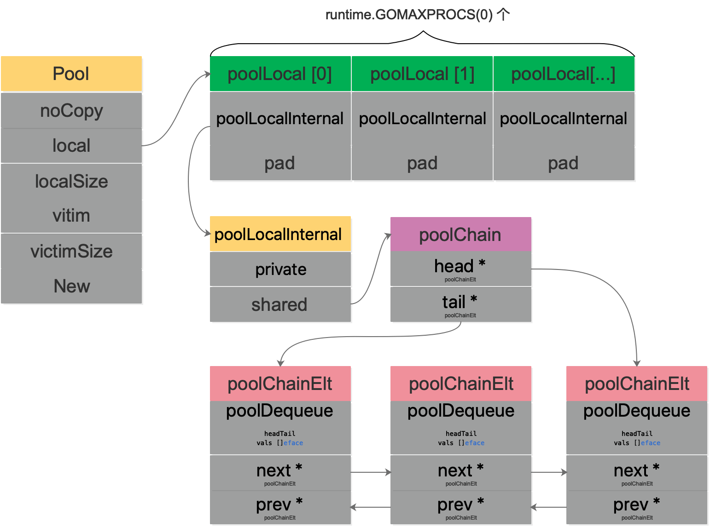
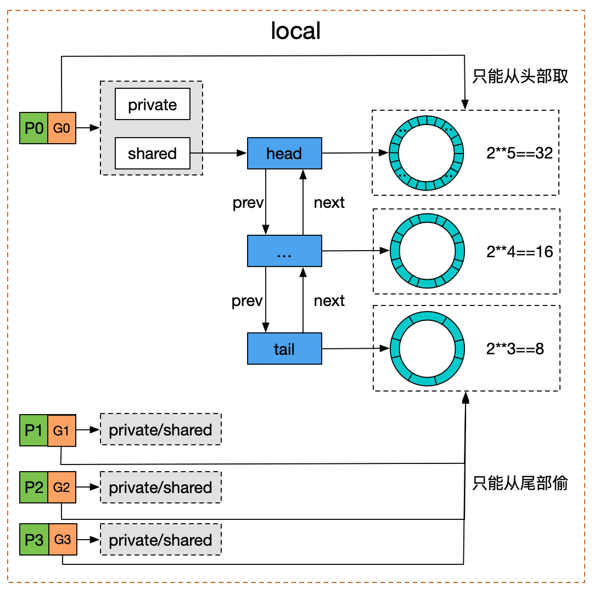
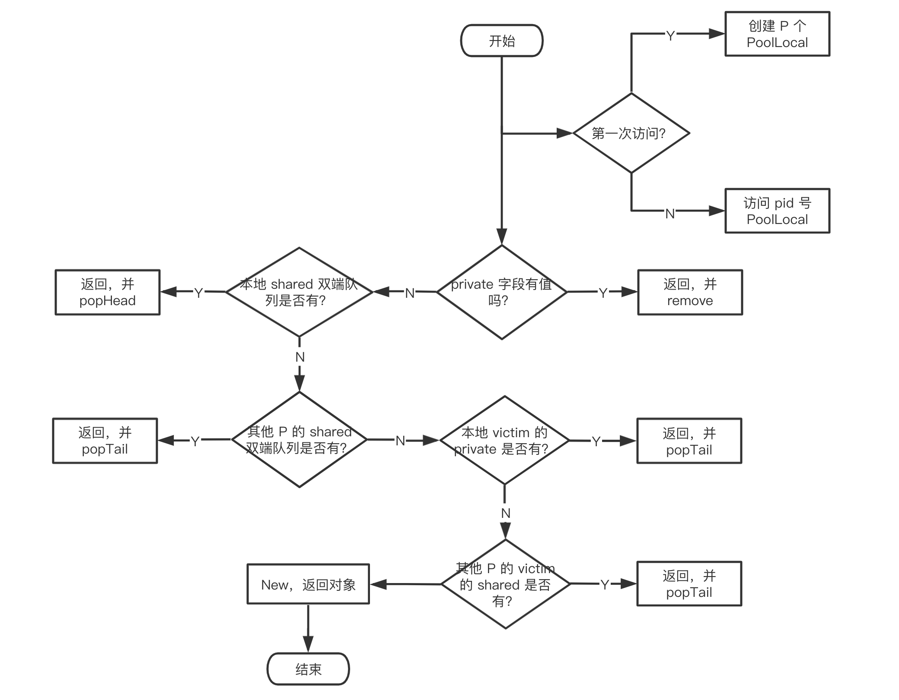

# 深入理解sync pool

## what

1. 可以作为保存临时取还对象的一个"池子"

Pool 里装的对象可以被无通知地被回收

## 有什么用

sync.Pool 可以将暂时不用的对象缓存起来，待下次需要的时候直接使用，不用再次经过内存分配，复用对象的内存，减轻 GC 的压力，提升系统的性能。

## how

- sync.Pool 是协程安全的
- 置好对象的 New 函数，用于在 Pool 里没有缓存的对象时，创建一个
- 任何地方、任何时候仅通过 Get()、Put() 方法就可以取、还对象了
- 当多个 goroutine 都需要创建同一个对象的时候，如果 goroutine 数过多，导致对象的创建数目剧增，进而导致 GC 压力增大。
- 形成 "并发大－占内存大－GC 缓慢－处理并发能力降低－并发更大"这样的恶性循环
- 在这个时候，需要有一个对象池，每个 goroutine 不再自己单独创建对象，而是从对象池中获取出一个对象（如果池中已经有的话）
- 例子见02

  - 需要初始化 Pool，唯一需要的就是设置好 New 函数，
  - 当调用 Get 方法时，如果池子里缓存了对象，就直接返回缓存的对象。如果没有存货，则调用 New 函数创建一个新的对象
  - Get 方法取出来的对象和上次 Put 进去的对象实际上是同一个，Pool 没有做任何"清空"的处理
  - 最好的做法是在 Put 前，将对象清空

## fmt 包如何用

```go
func Printf(format string, a ...interface{}) (n int, err error) {
	return Fprintf(os.Stdout, format, a...)
}
```

- Fprintf的结构

```go
func Fprintf(w io.Writer, format string, a ...interface{}) (n int, err error) {
	p := newPrinter()
	p.doPrintf(format, a)
	n, err = w.Write(p.buf)
	p.free()
	return
}
```

- newPrinter结构

```go
// newPrinter allocates a new pp struct or grabs a cached one.
func newPrinter() *pp {
	p := ppFree.Get().(*pp)
	p.panicking = false
	p.erroring = false
	p.wrapErrs = false
	p.fmt.init(&p.buf)
	return p
}

var ppFree = sync.Pool{
	New: func() interface{} { return new(pp) },
}
```

- Fprintf 函数，拿到 pp 指针后，会做一些 format 的操作，并且将 p.buf 里面的内容写入 w。最后，调用 free 函数，将 pp 指针归还到 Pool 中

```go
// free saves used pp structs in ppFree; avoids an allocation per invocation.
func (p *pp) free() {
	if cap(p.buf) > 64<<10 {
		return
	}

	p.buf = p.buf[:0]
	p.arg = nil
	p.value = reflect.Value{}
	p.wrappedErr = nil
	ppFree.Put(p)
}
```

- 归还到 Pool 前将对象的一些字段清零, 下次Get这个池中的对象就可以安全的用了

## encoding/json 也用sync.pool gin 框架，对 context 取用也到了 sync.Pool

- gin 如何使用 sync.Pool

```go
engine.pool.New = func() interface{} {
	return engine.allocateContext()
}

func (engine *Engine) allocateContext() *Context {
	return &Context{engine: engine, KeysMutex: &sync.RWMutex{}}
}
```

- 如下代码用到了sync.Pool

```go
    // ServeHTTP conforms to the http.Handler interface.
    func (engine *Engine) ServeHTTP(w http.ResponseWriter, req *http.Request) {
        c := engine.pool.Get().(*Context)
        c.writermem.reset(w)
        c.Request = req
        c.reset()
  
        engine.handleHTTPRequest(c)
  
        engine.pool.Put(c)
    }
```

## Echo 框架也使用 sync.Pool 来管理 context，并且几乎达到了零堆内存分配

### 源码分析

- Pool 的结构体

```go
type Pool struct {
	noCopy noCopy

    // 每个 P 的本地队列，实际类型为 [P]poolLocal
	local     unsafe.Pointer // local fixed-size per-P pool, actual type is [P]poolLocal
	// [P]poolLocal的大小
	localSize uintptr        // size of the local array

	victim     unsafe.Pointer // local from previous cycle
	victimSize uintptr        // size of victims array

	// 自定义的对象创建回调函数，当 pool 中无可用对象时会调用此函数
	New func() interface{}
}
```

- Pool 不希望被复制，所以结构体里有一个 noCopy 的字段(cond锁，waitgroup锁也有这个字段)

```go
// noCopy 用于嵌入一个结构体中来保证其第一次使用后不会被复制
//
// 见 https://golang.org/issues/8005#issuecomment-190753527
type noCopy struct{}

// Lock 是一个空操作用来给 `go vet` 的 -copylocks 静态分析
func (*noCopy) Lock()   {}
func (*noCopy) Unlock() {}
```

- local 字段存储指向 [P]poolLocal 数组（严格来说，它是一个切片）的指针
- localSize 则表示 local 数组的大小
- P 的 id 对应 [P]poolLocal 下标索引。通过这样的设计，多个 goroutine 使用同一个 Pool 时，减少了竞争，提升了性能。
- 在一轮 GC 到来时，victim 和 victimSize 会分别"接管" local 和 localSize。victim 的机制用于减少 GC 后冷启动导致的性能抖动，让分配对象更平滑。引入的意图在于降低 GC 压力的同时提高命中率

## Pool 没有缓存的对象时，调用 New 方法生成一个新的对象

```go
type poolLocal struct {
	poolLocalInternal

	// 将 poolLocal 补齐至两个缓存行的倍数，防止 false sharing,
	// 每个缓存行具有 64 bytes，即 512 bit
	// 目前我们的处理器一般拥有 32 * 1024 / 64 = 512 条缓存行
	// 伪共享，仅占位用，防止在 cache line 上分配多个 poolLocalInternal
	pad [128 - unsafe.Sizeof(poolLocalInternal{})%128]byte
}

// Local per-P Pool appendix.
type poolLocalInternal struct {
    // P 的私有缓存区，使用时无需要加锁
	private interface{}
	// 公共缓存区。本地 P 可以 pushHead/popHead；其他 P 则只能 popTail
	shared  poolChain
}
```

- 字段 pad 主要是防止 false sharing
  - why

    - 现代 cpu 中，cache 都划分成以 cache line (cache block) 为单位，在 x86_64 体系下一般都是 64 字节，cache line 是操作的最小单元。
    - 程序即使只想读内存中的 1 个字节数据，也要同时把附近 63 节字加载到 cache 中，如果读取超个 64 字节，那么就要加载到多个 cache line 中
  - how

    - 增加一个 pad，补齐缓存行，让相关的字段能独立地加载到缓存行就不会出现 false sharding 了
- poolChain 是一个双端队列的实现

```go
type poolChain struct {
	// 只有生产者会 push to，不用加锁
	head *poolChainElt

	// 读写需要原子控制。 pop from
	tail *poolChainElt
}

type poolChainElt struct {
	poolDequeue

	// next 被 producer 写，consumer 读。所以只会从 nil 变成 non-nil
	// prev 被 consumer 写，producer 读。所以只会从 non-nil 变成 nil
	next, prev *poolChainElt
}

type poolDequeue struct {
	// The head index is stored in the most-significant bits so
	// that we can atomically add to it and the overflow is
	// harmless.
	// headTail 包含一个 32 位的 head 和一个 32 位的 tail 指针。这两个值都和 len(vals)-1 取模过。
	// tail 是队列中最老的数据，head 指向下一个将要填充的 slot
    // slots 的有效范围是 [tail, head)，由 consumers 持有。
	headTail uint64

	// vals 是一个存储 interface{} 的环形队列，它的 size 必须是 2 的幂
	// 如果 slot 为空，则 vals[i].typ 为空；否则，非空。
	// 一个 slot 在这时宣告无效：tail 不指向它了，vals[i].typ 为 nil
	// 由 consumer 设置成 nil，由 producer 读
	vals []eface
}
```

- poolDequeue 被实现为单生产者、多消费者的固定大小的无锁（atomic 实现） Ring 式队列（底层存储使用数组，使用两个指针标记 head、tail）。
- 生产者可以从 head 插入、head 删除，而消费者仅可从 tail 删除
- headTail 指向队列的头和尾，通过位运算将 head 和 tail 存入 headTail 变量中

## 图解





Pool 并没有直接使用 poolDequeue，原因是它的大小是固定的，而 Pool 的大小是没有限制的。因此，在 poolDequeue 之上包装了一下，变成了一个 poolChainElt 的双向链表，可以动态增长

# Get

## 源码

```go
func (p *Pool) Get() interface{} {
    // ......
	l, pid := p.pin()
	x := l.private
	l.private = nil
	if x == nil {
		x, _ = l.shared.popHead()
		if x == nil {
			x = p.getSlow(pid)
		}
	}
	runtime_procUnpin()
    // ......
	if x == nil && p.New != nil {
		x = p.New()
	}
	return x
}
```

## 过程解释

```text
首先，调用 p.pin() 函数将当前的 goroutine 和 P 绑定，禁止被抢占，返回当前 P 对应的 poolLocal，以及 pid。

然后直接取 l.private，赋值给 x，并置 l.private 为 nil。

判断 x 是否为空，若为空，则尝试从 l.shared 的头部 pop 一个对象出来，同时赋值给 x。

如果 x 仍然为空，则调用 getSlow 尝试从其他 P 的 shared 双端队列尾部"偷"一个对象出来。

Pool 的相关操作做完了，调用 runtime_procUnpin() 解除非抢占。

最后如果没有取到缓存的对象，那就直接调用预先设置好的 New 函数，创建一个出来
```

## 图解



# pin

```go
// src/sync/pool.go

// 调用方必须在完成取值后调用 runtime_procUnpin() 来取消抢占。
func (p *Pool) pin() (*poolLocal, int) {
	pid := runtime_procPin()
	s := atomic.LoadUintptr(&p.localSize) // load-acquire
	l := p.local                          // load-consume
	// 因为可能存在动态的 P（运行时调整 P 的个数）
	if uintptr(pid) < s {
		return indexLocal(l, pid), pid
	}
	return p.pinSlow()
}
```

- pin 的作用就是将当前 groutine 和 P 绑定在一起，禁止抢占。并且返回对应的 poolLocal 以及 P 的 id

- 如果 G 被抢占，则 G 的状态从 running 变成 runnable，会被放回 P 的 localq 或 globaq