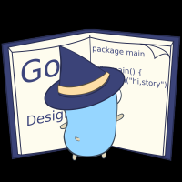

# 1.Golang.Design

- [The golang.design Initiative](https://github.com/golang-design)
- [https://golang.design/](https://golang.design/)

  - [Go 语言原本](https://golang.design/under-the-hood/)
  - [Go 程序员面试笔试宝典](https://golang.design/go-questions/)

# 2.GOLANG ROADMAP

# 3.[地鼠文档](https://www.topgoer.cn/)

1. Golang修养之路

2. GO专家编程

3. go语言中文文档

4. gin中文文档

5. 跟煎鱼学 Go

6. beego中文文档

7. leecode--go

8. Go语言标准库

9. Go以太坊开发
