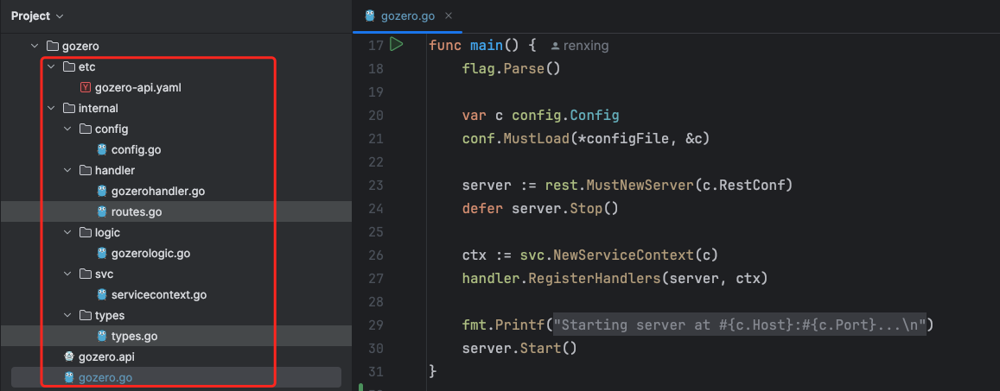
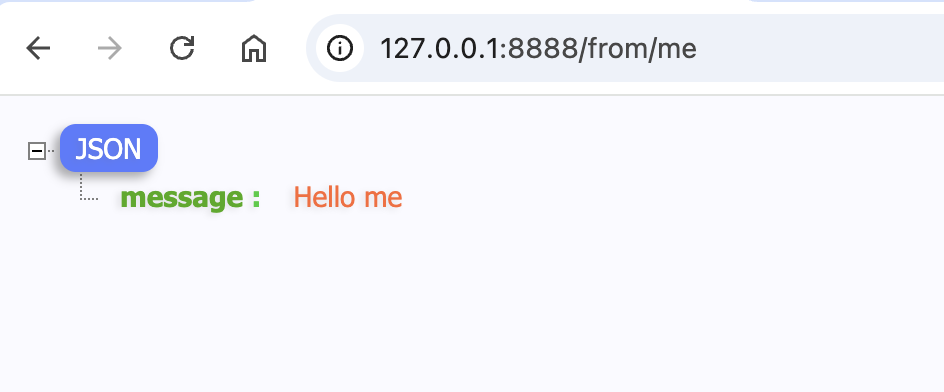
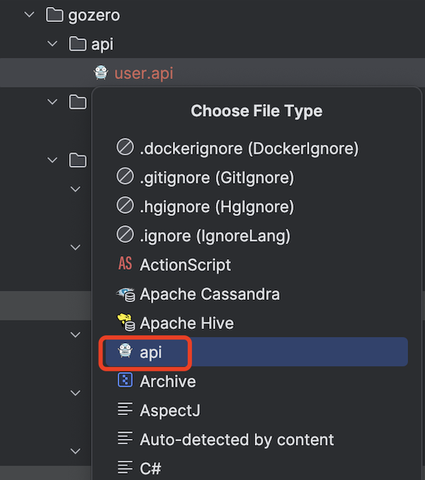
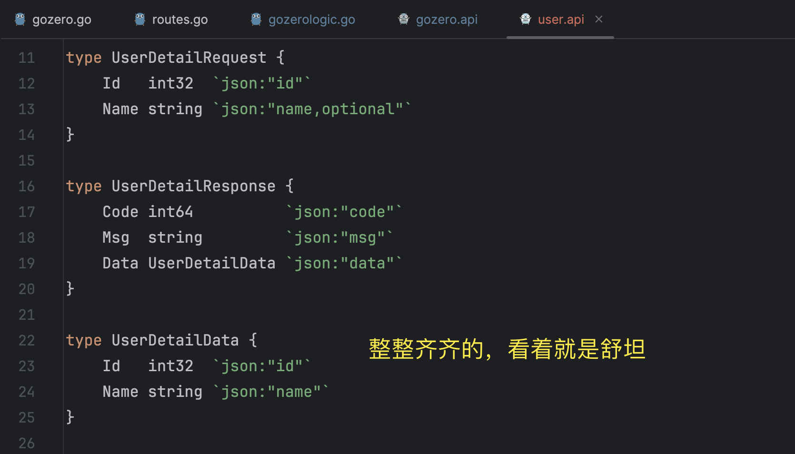
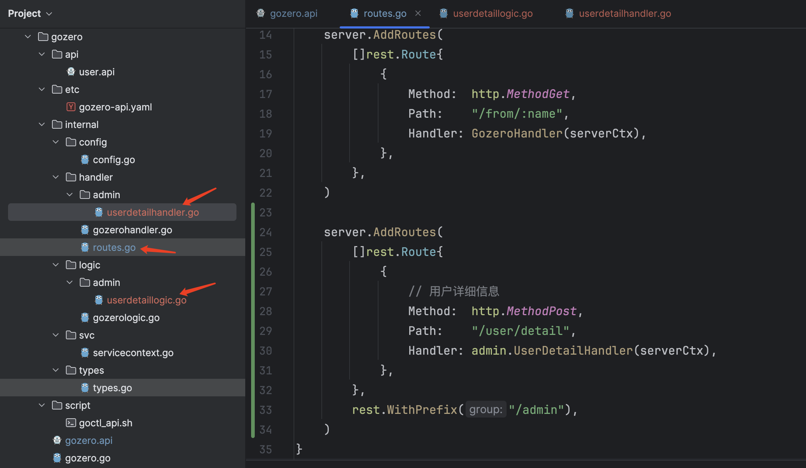
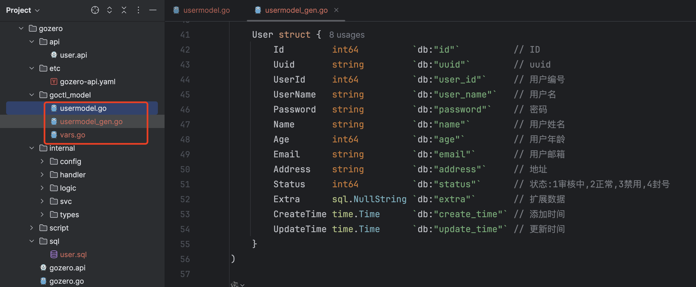

# go-zero框架快速入门

## go-zero 简介

go-zero 是一个集成了各种工程实践的 web 和 rpc 框架。通过弹性设计保障了大并发服务端的稳定性，经受了充分的实战检验。go-zero 包含极简的 API 定义和生成工具 goctl，可以根据定义的 api 文件一键生成代码。

### 安装goctl

我这里使用 goctl 1.6.4 版本进行后续演示，安装命令：

```bash
go install github.com/zeromicro/go-zero/tools/goctl@v1.6.4
```

安装完成后，查看版本：

```bash
goctl --version
```

### 安装go-zero

使用下面的命令安装：

```bash
go get -u github.com/zeromicro/go-zero@latest
```

创建项目：

```bash
cd xxx #进入到指定的目录
go mod init gozero #自定义一个项目名称
goctl api new gozero #创建工作目录
go mod tidy #自动安装扩展
```

执行完上面的命令后，就自动生成了 go-zero 的基本代码结构，如下所示：



### 启动go-zero

接下来，执行 **go run gozero.go** 即可启动HTTP服务，默认端口8888，在浏览器中访问http://127.0.0.1:8888/。

由于默认安装的框架中没有写逻辑层的返回值，我们可以稍微改动一下。在**gozero/internal/logic/gozerologic.go** 中写下如下的测试代码：

```go
func (l *GozeroLogic) Gozero(req *types.Request) (resp *types.Response, err error) {
	// todo: add your logic here and delete this line

	return &types.Response{
		Message: "Hello " + req.Name,
	}, nil
}
```

然后查看路由文件 **gozero/internal/handler/routes.go** 已经定义好了一个路由：**/from/:name**，

接下来，启动服务，在浏览器访问：**http://127.0.0.1:8888/from/me**



同时，查看控制台，打印出了如下的请求日志：

```log
{"@timestamp":"2025-01-06T10:52:50.231+08:00","caller":"handler/loghandler.go:147","content":"[HTTP] 200 - GET /from/me - 127.0.0.1:56698 - Mozilla/5.0 (Macintosh; Intel Mac OS X 10_15_7) AppleWebKit/537.36 (KHTML, like Gecko) Chrome/131.0.0.0 Safari/537.36","duration":"0.2ms","level":"info","span":"b3b8d837f92d24ea","trace":"6810521642bbebef31f2d531e4cf6311"}
```

至此，一个HTTP服务就启动起来啦！是不是很简单~

## API语言

api 是 go-zero 自研的领域特性语言（下文称 api 语言 或 api 描述语言），旨在实现人性化的基础描述语言，作为生成 HTTP 服务最基本的描述语言。

api 领域特性语言包含语法版本，info 块，结构体声明，服务描述等几大块语法组成，其中结构体和 Golang 结构体 语法几乎一样，只是移出了 struct 关键字。

> 参考：[api 语法 | go-zero Documentation](https://go-zero.dev/docs/tasks/dsl/api)

**简单地说，就是可以编写最简洁的结构体定义语句，然后生成完整的go代码块。**

### 定义结构体API

在项目的 gozero/gozero.api 中已经生成好了一个默认的 api文件，现在在这个默认的api文件中引入一个我们自定义的api文件：

```go
import (
	"./api/user.api"
)
```

然后创建我们自定义的api文件：api/user.api，写入如下内容：

```api
syntax = "v1"

info (
	title:   "用户相关业务"
	desc:    "用户的增删改查"
	author:  "renxing"
	email:   "renxing@xxx.com"
	version: "1.0"
)

type UserDetailRequest {
	Id   int32  `json:"id"`
	Name string `json:"name,optional"`
}

type UserDetailResponse {
	Code int64          `json:"code"`
	Msg  string         `json:"msg"`
	Data UserDetailData `json:"data"`
}

type UserDetailData {
	Id   int32  `json:"id"`
	Name string `json:"name"`
}
```

然后，在Goland编辑器中，选中此文件，右键Override File Type，选择api就可以识别为api文件类型了。



### 定义路由API

在 gozero/gozero.api 这个api文件中，已经包含了如下自动生成的代码块：

```api
service gozero-api {
	@handler GozeroHandler
	get /from/:name (Request) returns (Response)
}
```

接下来，我们在这个文件里面定义用户相关的路由和方法。比如，现在需要生成一个查询用户详细信息的接口。

可以如下定义（写在上面service gozero-api {} 方法块的后面，这里以 /admin 作为前缀）：

```api
@server (
	prefix: admin
	group:  admin
)
service gozero-api {
	@doc (
		summary: "用户详细信息"
	)
	@handler UserDetail
	post /user/detail (UserDetailRequest) returns (UserDetailResponse)
}
```

### 格式化对齐

有时候，写完的api文件中的代码比较错乱，如果需要对齐，可以使用下面的命令：

```bash
goctl api format --dir api/user.api
```

然后，就可以对齐工整了，也不怕提交到git仓库的时候一大堆变动了。



## 生成代码

根据上面定义的api的内容，可以快速生成对应的routes 和 handler和 logic 的基本代码。

### 生成基本逻辑代码

使用下面的命令，一键生成基本逻辑代码：

```bash
goctl api go -api gozero.api -dir .
```

执行完上述命令后，就自动生成了下面的文件：



其中，gozero/internal/handler/routes.go 自动添加了路由信息：

```go
server.AddRoutes(
  []rest.Route{
    {
      // 用户详细信息
      Method:  http.MethodPost,
      Path:    "/user/detail",
      Handler: admin.UserDetailHandler(serverCtx),
    },
  },
  rest.WithPrefix("/admin"),
)
```

gozero/internal/handler/admin/userdetailhandler.go 自动生成了handler文件，或者说是controller文件：

```go
// 用户详细信息
func UserDetailHandler(svcCtx *svc.ServiceContext) http.HandlerFunc {
	return func(w http.ResponseWriter, r *http.Request) {
		var req types.UserDetailRequest
		if err := httpx.Parse(r, &req); err != nil {
			httpx.ErrorCtx(r.Context(), w, err)
			return
		}

		l := admin.NewUserDetailLogic(r.Context(), svcCtx)
		resp, err := l.UserDetail(&req)
		if err != nil {
			httpx.ErrorCtx(r.Context(), w, err)
		} else {
			httpx.OkJsonCtx(r.Context(), w, resp)
		}
	}
}
```

gozero/internal/logic/admin/userdetaillogic.go 自动生成了逻辑层文件：

```go
type UserDetailLogic struct {
	logx.Logger
	ctx    context.Context
	svcCtx *svc.ServiceContext
}

// 用户详细信息
func NewUserDetailLogic(ctx context.Context, svcCtx *svc.ServiceContext) *UserDetailLogic {
	return &UserDetailLogic{
		Logger: logx.WithContext(ctx),
		ctx:    ctx,
		svcCtx: svcCtx,
	}
}

func (l *UserDetailLogic) UserDetail(req *types.UserDetailRequest) (resp *types.UserDetailResponse, err error) {
	// todo: add your logic here and delete this line

	return
}
```

接下来，就可以在上面逻辑层的func (l *UserDetailLogic) UserDetail 部分写我们自己的业务逻辑代码了。

### 生成数据库model文件

mysql 代码生成支持从 sql 文件和数据库链接生成， 且支持生成带缓存逻辑代码。

mysql 生成的代码内容有数据表对应的 golang 结构体、CURD 操作方法，缓存逻辑等信息，更多详细的数据库代码生成可参考指南 goctl model

goctl model 的基本用法，可以通过 goctl model mysql -h 查看。

一般常用的有下面两种方式：

```bash
# 通过ddl生成
goctl model mysql ddl -src="./sql/user.sql" -dir="./goctl_model" -c=true

# 通过datasource生成 (多个表用逗号分隔，如果是全部表，使用 -table="*")
goctl model mysql datasource -url="user:password@tcp(127.0.0.1:3306)/database" -table="user,goods,order"  -dir="./goctl_model"
```

生成的数据库model如下：



通过goctl model 生成的model，执行增删改查操作的时候，使用的是原生的SQL语句(**select/update/delete/insert**)，因此不太推荐，这里仅做了解。

> 更多参考：[MySQL 数据库操作 | go-zero Documentation](https://go-zero.dev/docs/tasks/mysql)

一般在项目中，推荐使用更强大的gorm库来操作数据库。可以参考：使用Go语言的gorm框架查询数据库并分页导出到Excel实例_go语言 gorm 输出列表-CSDN博客

Go-zero 相关文档

> golang 安装 | [go-zero Documentation](https://go-zero.dev/docs/tasks)

> go-zero | [《go-zero v1.6 教程》 - 书栈网 · BookStack](https://www.bookstack.cn/read/go-zero-1.6-zh/d41d8cd98f00b204.md)

源代码：[https://github.com/870869624/Golang-Guide](https://github.com/870869624/Golang-Guide)