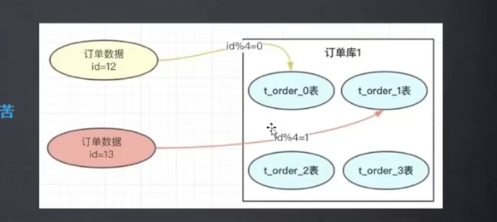
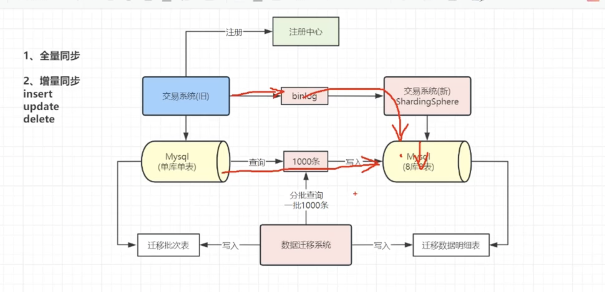

# 分表

## HASH（没有热点问题，在扩容时会很痛苦）

一个订单拆分为多个订单表，每个订单表存储一个订单的明细。

订单表：order_detail

新订单进入时对订单id进行取模运算，将订单id取模后得到的值作为表名后缀，将订单数据存储到对应的订单表中。

* 容易产生问题，当原来四张表的数据拓展为八张表时，原来的取模会落在新的表上，需要重新设计，且原来的数据需要取出来进行取模运算，当数据库停止进行操作时较为容易，但实际中数据库不允许停
  止太久，行刺千万级数据分库分表实际上是一个及其复杂的问题

## RANGE（范围分区，有热点问题，没有扩容问题）

按照id范围分表不存在数据迁移的问题，每张表都代表了数据范围!

# 数据迁移

