> 本文由 [简悦 SimpRead](http://ksria.com/simpread/) 转码， 原文地址 [blog.csdn.net](https://blog.csdn.net/song854601134/article/details/125147625)

一、[脏读](https://so.csdn.net/so/search?q=%E8%84%8F%E8%AF%BB&spm=1001.2101.3001.7020) 幻读 不可重复读
------------------------

1、脏读：脏读就是指当一个事务正在访问数据，并且对数据进行了修改，而这种修改还没有提交到数据库中，这时，另外一个事务也访问这个数据，然后使用了这个数据。
例如：
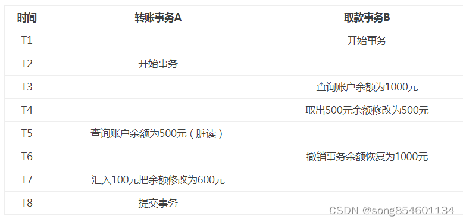

> 这个图对应的数据库[隔离机制](https://so.csdn.net/so/search?q=%E9%9A%94%E7%A6%BB%E6%9C%BA%E5%88%B6&spm=1001.2101.3001.7020)为 “读为提交”

解决办法：如果在第一个事务提交前，任何其他事务不可读取其修改过的值，则可以避免该问题。

2、不可重复读：是指在一个事务内，多次读同一数据。在这个事务还没有结束时，另外一个事务也访问该同一数据。那么，在第一个事务中的两次读数据之间，由于第二个事务的修改，那么第一个事务两次读到的的数据可能是不一样的。这样就发生了在一个事务内两次读到的数据是不一样的，因此称为是不可重复读。例如：

 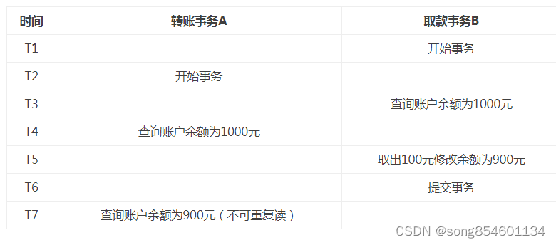

> 这个图对应的数据库隔离机制为读已提交或者读未提交一定不是可重复读，因为可重复机制下，同一个事务多次读同一数据读取到的结果是一样的，所以即使事务 B 修改数据后，A 事务再去读取，由于 A 还没有提交事务，所以读到的结果是一样的

解决办法：如果只有在修改事务完全提交之后才可以读取数据，则可以避免该问题。

3、幻读：

> 说法一：事务 A 根据条件查询得到了 N 条数据，但此时事务 B 删除或者增加了 M 条符合事务 A 查询条件的数据，这样当事务 A 再次进行查询的时候真实的数据集已经发生了变化，但是 A 却查询不出来这种变化，因此产生了幻读。

这一种说法强调幻读在于某一个范围内的数据行变多或者是变少了，侧重说明的是数据集不一样导致了产生了幻读。

> 说法二：幻读并不是说两次读取获取的结果集不同，幻读侧重的方面是某一次的 select 操作得到的结果所表征的数据状态无法支撑后续的业务操作。更为具体一些：A 事务 select 某记录是否存在，结果为不存在，准备插入此记录，但执行 insert 时发现此记录已存在，无法插入，此时就发生了幻读。产生这样的原因是因为有另一个事务往表中插入了数据。

说法二这种情况也属于幻读，说法二归根到底还是数据集发生了改变，查询得到的数据集与真实的数据集不匹配。

对于说法二：当进行 INSERT 的时候，也需要隐式的读取，比如插入数据时需要读取有没有主键冲突，然后再决定是否能执行插入。如果这时发现已经有这个记录了，就没法插入。所以，SELECT 显示不存在，但是 INSERT 的时候发现已存在，说明符合条件的数据行发生了变化，也就是幻读的情况，而不可重复读指的是同一条记录的内容被修改了。

举例来说明：说法二说的是如下的情况 (隔离机制为 `可重复读`)：
有两个事务 A 和 B，A 事务先开启，然后 A 开始查询数据集中有没有 id = 30 的数据，查询的结果显示数据中没有 id = 30 的数据。紧接着又有一个事务 B 开启了，B 事务往表中插入了一条 id = 30 的数据，然后提交了事务。然后 A 再开始往表中插入 id = 30 的数据，由于 B 事务已经插入了 id = 30 的数据，自然是不能插入，紧接着 A 又查询了一次，结果发现表中没有 id = 30 的数据呀，A 事务就很纳闷了，怎么会插入不了数据呢。当 A 事务提交以后，再次查询，发现表中的确存在 id = 30 的数据。但是 A 事务还没提交的时候，却查不出来？
其实，这便是 `可重复读`的作用。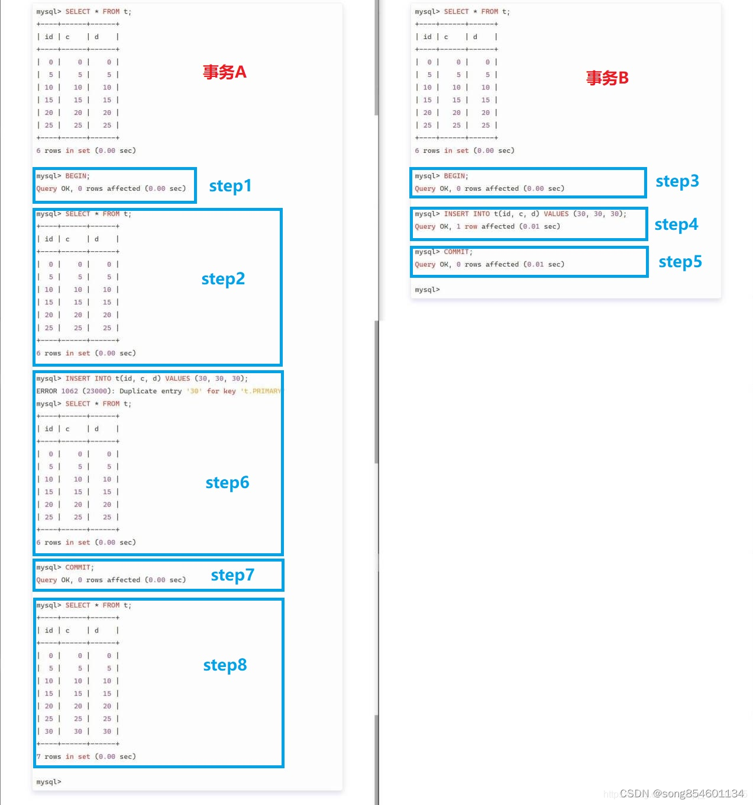
简单来说：`幻读是说数据的条数发生了变化，原本不存在的数据存在了。不可重复读是说数据的内容发生了变化，原本存在的数据的内容发生了改变。`

再例如：

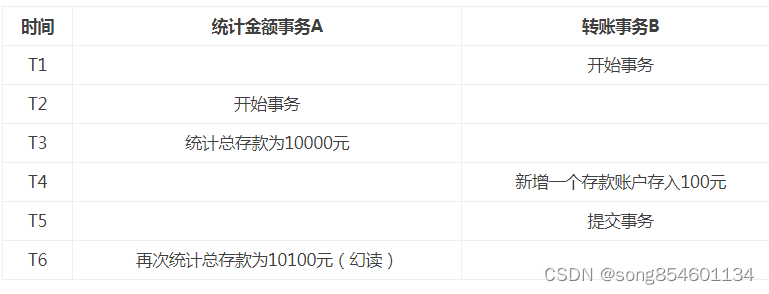

> 这个图对应的数据库隔离机制为读已提交或者读未提交一定不是可重复读

> 事务 B 新增了数据记录行，所以属于幻读，不属于不可重复读

解决办法：如果在操作事务完成数据处理之前，任何其他事务都不可以添加新数据，则可避免该问题。

4、提醒

不可重复度主要是对 `一条数据行`查询，同样的条件，你读取过的数据，再次读取出来发现值不一样了进行查询，不可重复读的重点是 `修改`，而幻读指的是两次查询 (可能对象是 `n条记录`) 获取的结果集不同（因为另一个事务新增或者删除记录行）

5、第一类丢失更新 (回滚覆盖)

A 事务撤销时，把已经提交的 B 事务的更新数据覆盖了。例如：

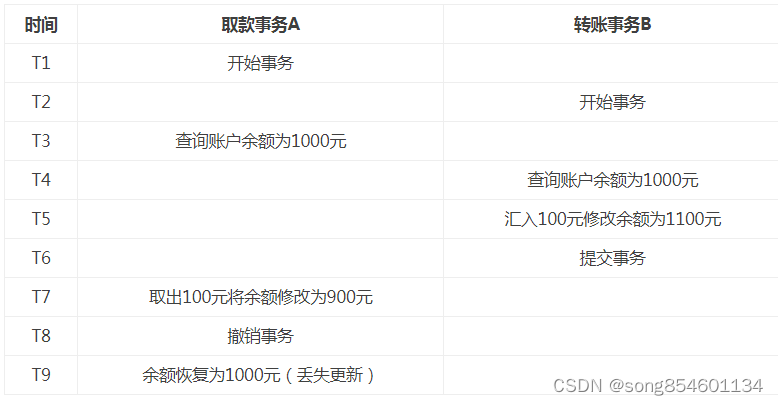

6、第二类丢失更新 (提交覆盖)

A 事务覆盖 B 事务已经提交的数据，造成 B 事务所做的操作丢失

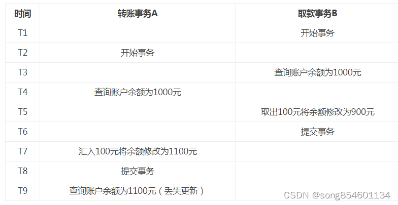

**四大隔离级别解决了什么问题**

* Read uncommitted（读未提交）
  * **存在脏读、不可重复读和幻读问题。**
* Read committed（读已提交）
  * **解决了脏读问题，但仍可能出现不可重复读和幻读。**
* Repeatable read（可重复读取）
  * **解决了脏读和不可重复读问题，但仍可能出现幻读。**
* Serializable（串行化）
  * **解决了脏读、不可重复读和幻读问题，但在效率方面有所牺牲。**

二、数据库的隔离机制
--------------------

为了解决上述问题，数据库通过**锁机制**解决并发访问的问题。根据锁定对象不同：分为行级锁和表级锁；根据并发事务锁定的关系上看：分为共享锁定和独占锁定，共享锁定会防止独占锁定但允许其他的共享锁定。而独占锁定既防止共享锁定也防止其他独占锁定。为了更改数据，数据库必须在进行更改的行上施加行独占锁定，insert、update、delete 和 selsct for update 语句都会隐式采用必要的行锁定。

但是直接使用锁机制管理是很复杂的，基于锁机制，数据库给用户提供了不同的**事务隔离级别**，只要设置了事务隔离级别，数据库就会分析事务中的 sql 语句然后自动选择合适的锁。

不同的隔离级别对并发问题的解决情况如图：

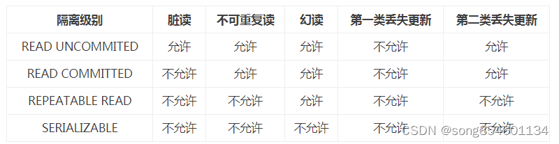

* Read uncommitted(未授权读取、读未提交)：如果一个事务已经开始写数据，则另外一个事务则不允许同时进行写操作，但允许其他事务读此行数据。该隔离级别可以通过 “排他写锁” 实现。这样就避免了更新丢失，却可能出现脏读。也就是说事务 B 读取到了事务 A 未提交的数据。
* Read committed（授权读取、读提交）：读取数据的事务允许其他事务继续访问该行数据，但是未提交的写事务将会禁止其他事务访问该行。该隔离级别避免了脏读，但是却可能出现不可重复读。事务 A 事先读取了数据，事务 B 紧接了更新了数据，并提交了事务，而事务 A 再次读取该数据时，数据已经发生了改变。
* Repeatable read（可重复读取）：可重复读是指在一个事务内，多次读同一数据。在这个事务还没有结束时，另外一个事务也访问该同一数据。那么，在第一个事务中的两次读数据之间，即使第二个事务对数据进行修改，第一个事务两次读到的的数据是一样的。这样就发生了在一个事务内两次读到的数据是一样的，因此称为是可重复读。读取数据的事务将会禁止写事务（但允许读事务），这样避免了不可重复读取和脏读，但是有时可能出现幻象读。（读取数据的事务）这可以通过 “共享读锁” 和“排他写锁”实现。
* Serializable（序列化）：
  提供严格的事务隔离。它要求事务序列化执行，事务只能一个接着一个地执行，但不能并发执行。如果仅仅通过 “行级锁” 是无法实现事务序列化的，必须通过其他机制保证新插入的数据不会被刚执行查询操作的事务访问到。序列化是最高的事务隔离级别，同时代价也花费最高，性能很低，一般很少使用，在该级别下，事务顺序执行，不仅可以避免脏读、不可重复读，还避免了幻像读。

**注意：事务的隔离级别和数据库并发性是成反比的，隔离级别越高，并发性越低。**

可重复读隔离下为什么会产生幻读？
在可重复读隔离级别下，普通的查询是快照读，是不会看到别的事务插入的数据的。因此，幻读在 当前读 下才会出现。

什么是快照读，什么是当前读？

**快照读**读取的是快照数据。**不加锁**的简单的 SELECT 都属于快照读，比如这样：

```sql
SELECT * FROM player WHERE ...

```

**当前读**就是读取最新数据，而不是历史版本的数据。**加锁**的 SELECT，或者对数据进行增删改都会进行当前读。这有点像是 Java 中的 volatile 关键字，被 volatile 修饰的变量，进行修改时，JVM 会强制将其写回内存，而不是放在 CPU 缓存中，进行读取时，JVM 会强制从内存读取，而不是放在 CPU 缓存中。这样就能保证其可见行，保证每次读取到的都是最新的值。如果没有用 volatile 关键字修饰，变量的值可能会被放在 CPU 缓存中，这就导致读取到的值可能是某次修改的值，不能保证是最新的值。

说多了，我们继续来看，如下的操作都会进行 当前读。

```sql
SELECT * FROM player LOCK IN SHARE MODE;
SELECT * FROM player FOR UPDATE;
INSERT INTO player values ...
DELETE FROM player WHERE ...
UPDATE player SET ...

```

说白了，快照读就是普通的读操作，而当前读包括了 **加锁的读取** 和 **DML**（DML 只是对表内部的数据操作，不涉及表的定义，结构的修改。主要包括 insert、update、deletet） 操作。

比如在可重复读的隔离条件下，我开启了两个事务，在另一个事务中进行了插入操作，当前事务如果使用**当前读** 是可以读到最新的数据的。

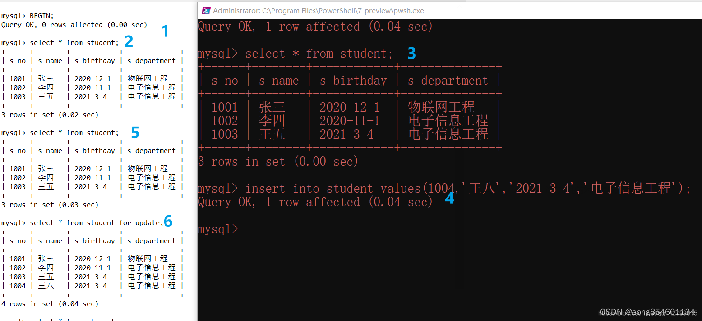

### MVCC（多版本并发控制）

> MVCC，全称为 Multi Version Concurrency Control，翻译过来就是多版本并发控制。最早的数据库只支持并发读读，不支持并发读写和写写，MVCC 的引入就是为了解决并发读写

**MySQL 中如何实现可重复读**

当隔离级别为 `可重复读`(RR) 的时候，**事务只在第一次 SELECT 的时候会获取一次 `Read View`**，而后面所有的 SELECT 都会复用这个 Read View；当隔离机制为 RC 时候，每次查询都会创建一份 Read View。也就是说：对于 A 事务而言，不管其他事务怎么修改数据，对于 A 事务而言，它能看到的数据永远都是第一次 SELECT 时看到的数据。这显然不合理，如果其它事务插入了数据，A 事务却只能看到过去的数据，读取不了当前的数据。

既然都说到 Read View 了，就不得不说 MVCC (多版本并发控制) 机制了。MVCC 其实字面意思还比较好理解，为了防止数据产生冲突，我们可以使用时间戳之类的来进行标识，不同的时间戳对应着不同的版本。比如你现在有 1000 元，你借给了张三 500 元， 之后李四给了你 500 元，虽然你的钱的总额都是 1000 元，但是其实已经和最开始的 1000 元不一样了，为了判断中途是否有修改，我们就可以采用版本号来区分你的钱的变动。

如下，在数据库的数据表中，id，name，type 这三个字段是我自己建立的，但是除了这些字段，其实还有些隐藏字段是 MySQL 偷偷为我们添加的，我们通常是看不到这样的隐藏字段的。我们重点关注这两个隐藏的字段：

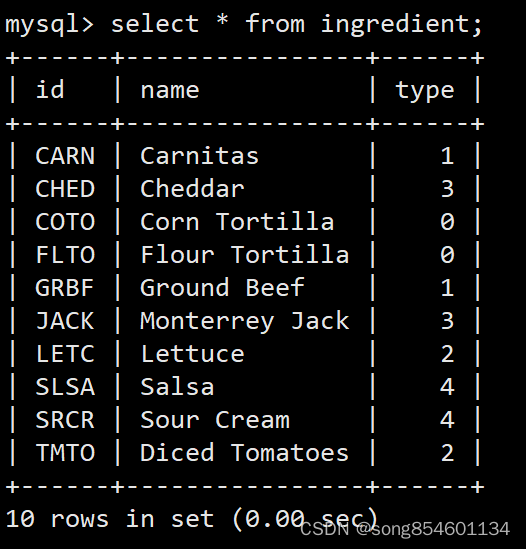

* db_trx_id：操作这行数据的事务 ID，也就是最后一个对该数据进行 `插入或更新`的事务 ID。我们每开启一个事务，都会从数据库中获得一个事务 ID（也就是事务版本号），这个事务 ID 是自增长的，通过 ID 大小，我们就可以判断事务的时间顺序。
* db_roll_ptr：回滚指针，指向这个记录的 **Undo Log** 信息。什么是 Undo Log 呢？可以这么理解，当我们需要修改某条记录时，MySQL 担心以后可能会撤销该修改，回退到之前的状态，所以在修改之前，先把当前的数据存个档，然后再进行修改，Undo Log 就可以理解为是这个存档文件。这就像是我们打游戏一样，打到某个关卡先存个档，然后继续往下一关挑战，如果下一关挑战失败，就回到之前的存档点，不至于从头开始。

在 MVCC（多版本并发控制） 机制中，多个事务对同一个行记录进行更新会产生多个历史快照，这些历史快照保存在 Undo Log 里。如下图所示，当前行记录的 回滚指针 指向的是它的上一个状态，它的上一个状态的 回滚指针 又指向了上一个状态的上一个状态。这样，理论上我们通过遍历 回滚指针，就能找到该行数据的任意一个状态。

Undo Log 示意图

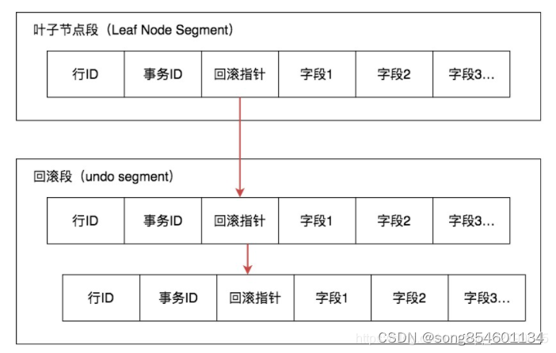
我们没有想到，我们看到的或许只是一条数据，但是 MySQL 却在背后为该条数据存储多个版本，为这条数据存了非常多的档。那问题来了，当我们开启事务时，我们在事务中想要查询某条数据，但是每一条数据，都对应了非常多的版本，这时，我们需要读取哪个版本的行记录呢？

这时就需要用到 Read View 机制了，它帮我们解决了行的可见性问题。Read View 保存了当前事务开启时所有活跃（还没有提交）的事务列表。

在 Read VIew 中有几个重要的属性：

* trx_ids，系统当前正在活跃的事务 ID 集合
* low_limit_id，活跃的事务中最大的事务 ID
  * 为什么是 low_limit ? 因为它也是系统此刻可分配的事务 ID 的最小值
  * 当前最大的事务号 + 1（不是事务 ID+1）
* up_limit_id，活跃的事务中最小的事务 ID
  * 即是 trx_ids 中的最小值
* ID creator_trx_id，创建这个 Read View 的事务 ID

在前面我们说过了，在每一行记录中有一个隐藏字段 db_trx_id，表示操作这行数据的事务 ID ，而且 **事务 ID 是自增长的，通过 ID 大小，我们就可以判断事务的时间顺序。**

#### 可见性规则：

1. 当我们开启事务以后，准备查询某条记录，发现该条记录的 **db_trx_id < up_limit_id**，这说明什么呢？说明该条记录一定是在本次事务开启之前就已经提交的，对于当前事务而言，这属于历史数据，可见，因此，我们通过 select 一定能查出这一条记录。
2. 但是如果发现，要查询的这条记录的**只有 db_trx_id > up_limit_id**。这说明什么呢，说明我在开启事务的时候，这条记录肯定是还没有的，是在之后这条记录才被创建的，不应该被当前事务看见，这时候我们就可以通过 **回滚指针 + Undo Log** 去找一下该记录的历史版本，返回给当前事务。在本文 **什么是幻读** ？ 这一章节中举的一个例子。A 事务开启时，数据库中还没有（30, 30, 30）这条记录。A 事务开启以后，B 事务往数据库中插入了（30, 30, 30）这条记录，这时候，A 事务使用 **不加锁** 的 select 进行 **快照读** 时是查询不出这条新插入的记录的，这符合我们的预期。对于 A 事务而言，（30, 30, 30）这条记录的 db_trx_id 一定大于 A 事务开启时的 up_limit_id，所以这条记录不应该被 A 事务看见。
3. 如果需要查询的这条记录的 db_trx_id 满足 **up_limit_id <= db_trx_id < low_limit_id** 这个条件，说明该行记录所在的事务 db_trx_id 在目前 creator_trx_id 这个事务创建的时候，可能还处于活跃的状态，因此我们需要在 trx_ids 集合中进行遍历，如果 db_trx_id 存在于 trx_ids 集合中，证明这个事务 db_trx_id 还处于活跃状态，不可见，如果该记录有 Undo Log，我们可以通过回滚指针进行遍历，查询该记录的历史版本数据。如果 db_trx_id 不存在于 trx_ids 集合中，证明事务 trx_id 已经提交了，该行记录可见。
4. 如果 **db_trx_id >= low_limit_id**，这种情况意味这个版本的数据是在 **Read View** 生成之后才创建的，对当前的 **Read View** 当然是不可见的

从图中你能看到回滚指针将数据行的所有快照记录都通过链表的结构串联了起来，每个快照的记录都保存了当时的 db_trx_id，也是那个时间点操作这个数据的事务 ID。这样如果我们想要找历史快照，就可以通过遍历回滚指针的方式进行查找。

最后，再来强调一遍：**事务只在第一次 SELECT 的时候会获取一次 `Read View`**

因此，如下图所示，在 可重复读 的隔离条件下，在该事务中不管进行多少次 以 **WHERE heigh > 2.08** 为条件 的查询，最终结果得到都是一样的，尽管可能会有其它事务对这个结果集进行了更改。

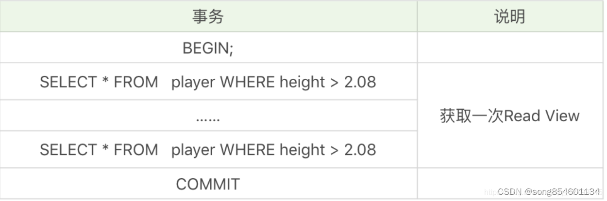

三、数据库锁
------------

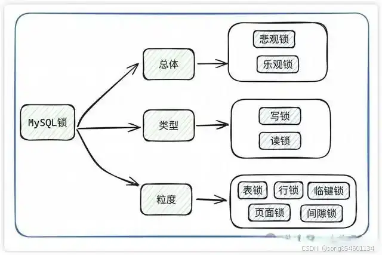

按照粒度来分在 MySQL 中有全局锁、表级锁、行级锁三种类型，其中比较关键的是表级锁盒行级锁。

对于表级锁而言，其又分为表锁、元数据锁、意向锁三种。对于元数据锁而言，基本上都是数据库自行操作，我们无须关心。在 Innodb 存储存储引擎中，表锁也用得比较少。

对于行级锁而言，其又 `记录锁、间隙锁、Next-Key 锁`。记录锁就是某个索引记录的锁，间隙锁就是两个索引记录之间的空隙锁，Next-Key 则是前面两者的结合。

在 Innodb 存储引擎中，我们可以通过下面的命令来查询锁的情况。

```
// 开启锁的日志
set global innodb_status_output_locks=on; 
// 查看innodb引擎的信息(包含锁的信息)
show engine innodb status\G;

```

> 在 MySQL 中，默认使用 InnoDB 存储引擎同时支持行级锁和表级锁，`默认使用行级锁（默认隔离机制为‘可重复读’）`

> 行锁只是阻止另一个事务修改这一行数据，但是其他事务仍可以读取这行数据，然后去进行业务操作，`所以仍然存在“并发问题 ”`

读未提交‌：不使用锁，因此会产生脏读。
‌读已提交‌：使用锁来避免脏读问题，但会产生不可重复读问题。

### 悲观锁和乐观锁

虽然数据库的隔离级别可以解决大多数问题，但是灵活度较差，为此又提出了悲观锁和乐观锁的概念。
**（1）悲观锁**

悲观锁，它指的是对数据被外界（包括本系统当前的其他事务，以及来自外部系统的事务处理）修改持保守态度。因此，在整个数据处理过程中，将数据处于锁定状态。悲观锁的实现，往往依靠数据库提供的锁机制。也只有数据库层提供的锁机制才能真正保证数据访问的排他性，否则，即使在本系统的数据访问层中实现了加锁机制，也无法保证外部系统不会修改数据。

使用场景举例：以 MySQL InnoDB 为例商品 t_items 表中有一个字段 status，status 为 1 代表商品未被下单，status 为 2 代表商品已经被下单（此时该商品无法再次下单），那么我们对某个商品下单时必须确保该商品 status 为 1。假设商品的 id 为 1。如果不采用锁，那么操作方法如下：

* 使用场景举例：以 MySQL InnoDB 为例：

商品 t_items 表中有一个字段 status，status 为 1 代表商品未被下单，status 为 2 代表商品已经被下单（此时该商品无法再次下单），那么我们对某个商品下单时必须确保该商品 status 为 1。假设商品的 id 为 1。
如果不采用锁，那么操作方法如下：

```sql
//1.查询出商品信息
select status from  t_items where id=1;
//2.根据商品信息生成订单,并插入订单表 t_orders 
insert into t_orders (id,goods_id) values (null,1);
//3.修改商品status为2
update t_items set status=2;

```

但是上面这种场景在高并发访问的情况下很可能会出现问题。例如当第一步操作中，查询出来的商品 status 为 1。但是当我们执行第三步 Update 操作的时候，有可能出现其他人先一步对商品下单把 t_items 中的 status 修改为 2 了，但是我们并不知道数据已经被修改了，这样就可能造成同一个商品被下单 2 次，使得数据不一致。所以说这种方式是不安全的。

* 使用悲观锁来解决问题：

在上面的场景中，商品信息从查询出来到修改，中间有一个处理订单的过程，使用悲观锁的原理就是，当我们在查询出 t_items 信息后就把当前的数据锁定，直到我们修改完毕后再解锁。那么在这个过程中，因为 t_items 被锁定了，就不会出现有第三者来对其进行修改了。需要注意的是，要使用悲观锁，我们必须关闭 mysql 数据库的自动提交属性，因为 MySQL 默认使用 autocommit 模式，也就是说，当你执行一个更新操作后，MySQL 会立刻将结果进行提交。我们可以使用命令设置 MySQL 为非 autocommit 模式：`set autocommit=0;`
设置完 autocommit 后，我们就可以执行我们的正常业务了。具体如下：

```sql
//0.开始事务
begin;/begin work;/start transaction; (三者选一就可以)
//1.查询出商品信息
select status from t_items where id=1 for update;
//2.根据商品信息生成订单
insert into t_orders (id,goods_id) values (null,1);
//3.修改商品status为2
update t_items set status=2;
//4.提交事务
commit;/commit work;

```

上面的 begin/commit 为事务的开始和结束，因为在前一步我们关闭了 mysql 的 autocommit，所以需要手动控制事务的提交。
上面的第一步我们执行了一次查询操作：`select status from t_items where id=1 for update;`与普通查询不一样的是，我们使用了 `select…for update`的方式，这样就通过数据库实现了悲观锁。此时在 t_items 表中，id 为 1 的那条数据就被我们锁定了，其它的事务必须等本次事务提交之后才能执行。这样我们可以保证当前的数据不会被其它事务修改。需要注意的是，在事务中，只有 `SELECT ... FOR UPDATE` 或 `LOCK IN SHARE MODE` 操作同一个数据时才会等待其它事务结束后才执行，一般 SELECT … 则不受此影响。拿上面的实例来说，当我执行 `select status from t_items where id=1 for update;`后。我在另外的事务中如果再次执行 `select status from t_items where id=1 for update;`则第二个事务会一直等待第一个事务的提交，此时第二个查询处于阻塞的状态，但是如果我是在第二个事务中执行 `select status from t_items where id=1;`则能正常查询出数据，不会受第一个事务的影响。
**（2）、乐观锁**
乐观锁（ Optimistic Locking ） 相对悲观锁而言，乐观锁假设认为数据一般情况下不会造成冲突，所以只会在数据进行提交更新的时候，才会正式对数据的冲突与否进行检测，如果发现冲突了，则返回用户错误的信息，让用户决定如何去做。实现乐观锁一般来说有以下 2 种方式：

使用版本号
使用数据版本（Version）记录机制实现，这是乐观锁最常用的一种实现方式。何谓数据版本？即为数据增加一个版本标识，一般是通过为数据库表增加一个数字类型的 “version” 字段来实现。当读取数据时，将 version 字段的值一同读出，数据每更新一次，对此 version 值加一。当我们提交更新的时候，判断数据库表对应记录的当前版本信息与第一次取出来的 version 值进行比对，如果数据库表当前版本号与第一次取出来的 version 值相等，则予以更新，否则认为是过期数据。
使用时间戳
乐观锁定的第二种实现方式和第一种差不多，同样是在需要乐观锁控制的 table 中增加一个字段，名称无所谓，字段类型使用时间戳（timestamp）, 和上面的 version 类似，也是在更新提交的时候检查当前数据库中数据的时间戳和自己更新前取到的时间戳进行对比，如果一致则 OK，否则就是版本冲突。

结尾
----

> `如何理解读已提交？？`

同样开启事务 A 和事务 B 两个事务，在事务 A 中使用 update 语句将 id = 1 的记录行 age 字段改为 30。此时，在事务 B 中使用 select 语句进行查询，我们发现在事务 A 提交之前，事务 B 中查询到的记录 age 一直是 14，直到事务 A 提交，此时在事务 B 中查询，发现 age 的值已经是 30 了。这就出现了一个问题，在同一事务中（本例中的事务 B），事务的不同时刻同样的查询条件，查询出来的记录内容是不一样的，事务 A 的提交影响了事务 B 的查询结果，这就是不可重复读，也就是读取已提交隔离级别。

> 所谓的读已提交，是只允许读取提交 (commit) 后的数据，在 commit 之前读取的是上次 commit 后的数据。

参考：
[MySQL 中如何实现可重复读](https://blog.csdn.net/qq_42799615/article/details/110942949?spm=1001.2014.3001.5506)
[行锁和间隙锁](https://blog.csdn.net/qq_42799615/article/details/110942949?spm=1001.2014.3001.5506)
