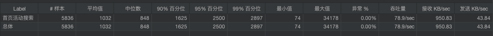

# **一、性能测试流程**

* 喜能需求分析
* 性能方案设计
* 业务建模 脚本优化
* 执行测试 手机性能数据
* 结果分析 性能测试报告

# 二、性能需求分析

* 项目管理系统业务：登录、注册、搜索。。。。
* 需要压测的业务满足条件：核心、用户量、与外部接口对接。。。。
* 经过分析，确认需要压测的业务：登录、搜索
* 性能指标：
  * 非硬件：50%line<1秒,90%line<1秒,TPS,事物成功率100%（响应时间几十毫秒到几百毫秒之间）
  * 硬件：cpu内存<=70%

# 三、性能方案设计

* 七大场景：
  * 单业务基准测试、单业务压力测试、单业务负载测试｜综合业务基准测试、综合业务压力测试、综合业务负载测试、综合业务稳定性测试
    * 单业务：登录
    * 基准：甲方给出的要求30min 2w登录
    * 单业务负载：增加线程数（模拟人数上升）
    * 综合业务稳定性：7*24小时

经过分析，我自己的项目，只做登录和一些搜索压测。提升qps和接口查询效率为主。

性能场景：1s启动所有县城，压测5min，观察性能指标

# 四、业务建模脚本优化

# 五、执行测试收集性能数据

# 六、结果分析

* 分析服务器cpu使用率，TPS以及QPS，该加索引加索引，该优化代码优化代码
