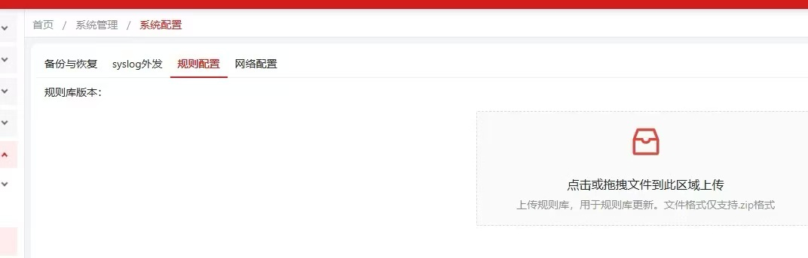

# cbb相关的：

所有的配置文件和外部的接口路径在：F:\gopath\src\cbb\ag\products\edr\app.yaml

几个相关的比如注册和地理位置获取在：F:\gopath\src\cbb\ag\services\agah\server\internal\handler\routes.go

# edr可借鉴的接口

位置在：F:\gopath\src\edr\server\src\git.cloud.top\go\ag\internal\handler\routes.go

# 安管升级日志上报

可以报cleansvc的规则库升级

# 告警日志相关

文档再E2.11 edr代码在F:\gopath\src\edr\server\src\git.cloud.top\go\go-soap\api\alarmlog\alarm.go，很多比如进程名相关的直接手写

# ag_cbb调用我方上报安全配置的位置

F:\gopath\src\cbb\ag\infra\pkg\reportcfgtask\task.go

我方edr内部日志何告警相关的发送模板在F:\gopath\src\edr\server\src\git.cloud.top\go\ag\internal\logic\reportLog\reportLog_test.go

F:\gopath\src\edr\server\src\git.cloud.top\go\ag\internal\logic\reportLog\reportLog_udp_test.go