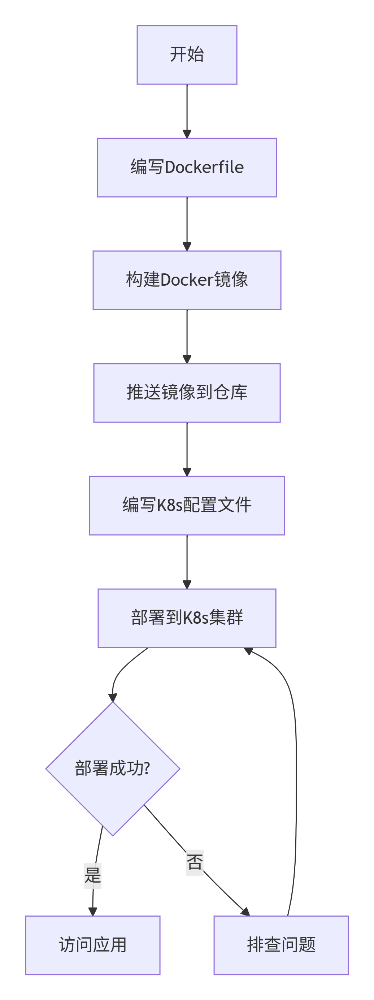
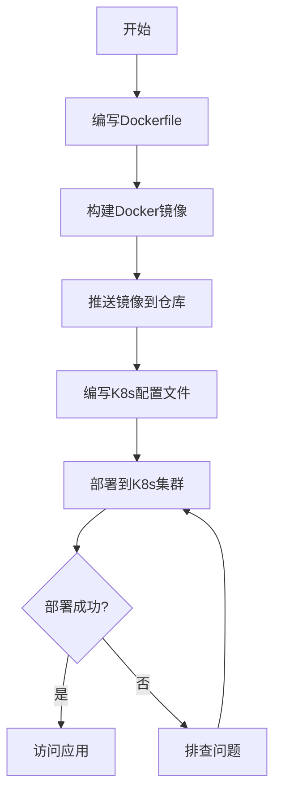

将一个Golang项目打包成镜像并在Kubernetes（k8s）上运行，主要分为两大步骤：**使用Docker将Go应用打包成镜像**，然后**在Kubernetes集群中部署和运行这个镜像**。为了让你能快速上手，我为你梳理了标准流程和关键配置。

下面是这个过程的概览：



### 📦 将Go应用打包成Docker镜像

这一步的目标是将你的Go代码变成一个可以随处运行的容器镜像。

#### 1. 编写Dockerfile

一个高效的标准做法是使用**多阶段构建**，这样可以得到一个非常小巧的镜像。具体来说，先在一个完整的Go环境中编译代码，生成二进制文件，然后把这个二进制文件复制到一个极简的基础镜像（比如`scratch`或`alpine`）中运行。

```Dockerfile
# 第一阶段：构建阶段，使用Go官方镜像
FROM golang:1.19-alpine AS builder

# 设置工作目录
WORKDIR /app
# 复制依赖文件并下载依赖
COPY go.mod go.sum ./
RUN go mod download
# 复制源代码并进行编译
COPY . .
RUN CGO_ENABLED=0 GOOS=linux go build -a -installsuffix cgo -o main .

# 第二阶段：运行阶段，从极简的scratch镜像开始
FROM scratch
# 从构建阶段复制编译好的二进制文件
COPY --from=builder /app/main .
# 声明容器运行时暴露的端口
EXPOSE 8080
# 设置容器启动时执行的命令
CMD ["./main"]
```

**关键点说明：**
*   **多阶段构建**：第一阶段`builder`负责编译。第二阶段`scratch`是一个空镜像，只包含最终的二进制文件，极大地减小了镜像体积。
*   **CGO_ENABLED=0**：禁用CGO，编译纯静态的二进制文件，使其易于在不同Linux环境运行。
*   **小镜像基础选择**：`scratch`是最小选择，但无法执行Shell命令。若需要Shell等基础工具，可换用`alpine`（约5MB）。

#### 2. 构建与推送镜像

在Dockerfile所在目录执行以下命令：

```bash
# 构建镜像，-t参数指定镜像名称和标签
docker build -t your-username/your-go-app:latest .

# 登录镜像仓库（如Docker Hub）
docker login

# 推送镜像到仓库
docker push your-username/your-go-app:latest
```

### 🚀 在Kubernetes中部署镜像

现在，你的应用已经打包成镜像并推送到仓库，接下来就是让K8s集群拉取这个镜像并运行它。

#### 1. 编写Kubernetes配置文件

你需要至少两个YAML文件：一个**Deployment**和一个**Service**。

**Deployment (deployment.yaml)**：负责保持指定数量的应用副本运行。
```yaml
apiVersion: apps/v1
kind: Deployment
metadata:
  name: your-go-app
spec:
  replicas: 3  # 指定副本数量
  selector:
    matchLabels:
      app: your-go-app
  template:
    metadata:
      labels:
        app: your-go-app
    spec:
      containers:
      - name: your-go-app
        image: your-username/your-go-app:latest  # 请替换为你的实际镜像地址
        ports:
        - containerPort: 8080  # 容器内应用监听的端口
        # 建议添加资源限制
        resources:
          requests:
            memory: "64Mi"
            cpu: "250m"
          limits:
            memory: "128Mi"
            cpu: "500m"
        # 强烈建议添加健康检查
        livenessProbe:
          httpGet:
            path: /healthz  # 请替换为你的应用健康检查端点
            port: 8080
          initialDelaySeconds: 3
          periodSeconds: 10
        readinessProbe:
          httpGet:
            path: /ready    # 请替换为你的应用就绪检查端点
            port: 8080
          initialDelaySeconds: 5
          periodSeconds: 10
```

**Service (service.yaml)**：为你的应用提供一个稳定的网络访问入口。
```yaml
apiVersion: v1
kind: Service
metadata:
  name: your-go-app-service
spec:
  selector:
    app: your-go-app  # 这个选择器需要匹配Deployment中Pod的标签
  ports:
    - protocol: TCP
      port: 80        # Service对外服务的端口
      targetPort: 8080 # 将流量转发到容器的这个端口
  type: LoadBalancer  # 如果是云服务商，这会创建一个外部负载均衡器
  # 对于集群内访问，可以使用 ClusterIP 类型
```

#### 2. 部署到Kubernetes集群

使用`kubectl`命令行工具应用配置文件。

```bash
# 应用Deployment和Service配置
kubectl apply -f deployment.yaml
kubectl apply -f service.yaml

# 检查部署状态
kubectl get deployments
kubectl get pods
kubectl get services
```

### 💡 生产环境建议与最佳实践

1.  **健康检查 (Health Checks)**：务必如上面YAML所示，配置`livenessProbe`和`readinessProbe`，这是K8s管理应用生命周期的关键。
2.  **资源配置 (Resource Limits)**：为容器设置CPU和内存的请求(`requests`)和限制(`limits`)，避免单个应用耗尽集群资源。
3.  **私有镜像仓库认证**：如果使用私有镜像仓库，需要在K8s中创建一个`Secret`来存储认证信息，并在Deployment中引用它。
4.  **使用CI/CD自动化**：结合Jenkins、GitLab CI、云效等工具，可以实现代码提交后自动构建、测试、打包和部署的全流程自动化。

### 🛠️ 遇到问题怎么办？

如果部署后应用无法访问，可以按以下步骤排查：

```bash
# 查看Pod的状态
kubectl get pods
# 查看Pod的详细描述
kubectl describe pod <pod-name>
# 查看Pod的日志
kubectl logs <pod-name>
```

希望这份详细的指南能帮助你顺利完成Go应用在K8s上的部署！如果你在实践过程中遇到更具体的问题，比如如何配置特定的健康检查接口，或者如何管理配置文件，可以随时提出。