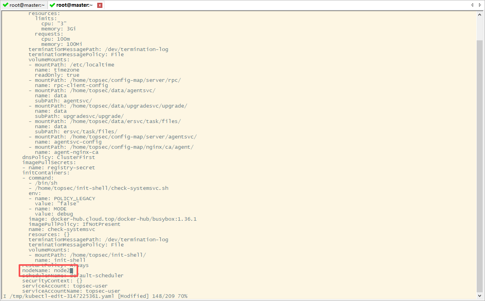

# K8s调度Service至其他节点

## 📋 使用场景

在以下场景中，需要将Service调度到特定的K8s节点或调整副本数：

### 🎯 节点调度场景
- **资源隔离**：某些服务需要运行在高性能节点或专用节点上
- **故障排查**：某个节点出现问题，需要将服务迁移到健康节点
- **硬件依赖**：服务需要特定硬件（如GPU、特定CPU架构）
- **网络要求**：服务需要访问节点本地资源或特定网络环境
- **性能优化**：将服务调度到负载较低的节点

### 📈 副本数调整场景
- **突发流量**：促销活动、业务高峰期需要快速增加处理能力
- **节省资源**：业务低峰期减少实例数，降低资源占用
- **紧急故障**：服务异常需要快速重启所有实例
- **灰度发布**：控制新版本部署到特定节点
- **自动化运维**：根据负载自动扩缩容（HPA）

---

## 🔧 核心命令

### 方法一：编辑Deployment（推荐）

```bash
kubectl edit deploy agentsvc -n topsec-topaiop
```



### 方法二：直接修改Pod（临时方案）

```bash
# 查看Pod当前所在节点
kubectl get pod <pod-name> -n <namespace> -o wide

# 编辑Pod（不推荐，Pod重启后会失效）
kubectl edit pod <pod-name> -n <namespace>
```

---

## 📝 关键字段说明

在 `kubectl edit` 打开的YAML文件中，找到 `spec.template.spec` 部分，可以添加以下字段：

### 1. nodeName（强制指定节点）

```yaml
spec:
  template:
    spec:
      nodeName: worker-node-01  # 直接指定Pod运行的节点名称
```

**特点**：
- ✅ 最简单直接的方式
- ❌ 绕过调度器，硬性绑定
- ⚠️ 如果指定节点不可用，Pod会一直处于Pending状态

### 2. nodeSelector（标签选择）

```yaml
spec:
  template:
    spec:
      nodeSelector:
        disktype: ssd           # 选择带有disktype=ssd标签的节点
        kubernetes.io/arch: arm64  # 选择arm64架构的节点
```

**特点**：
- ✅ 简单且灵活的标签匹配
- ⚠️ 需要节点事先打好对应标签
- 📌 适合简单的调度需求

**节点打标签命令**：

```bash
# 给节点添加标签
kubectl label nodes <node-name> disktype=ssd

# 查看节点标签
kubectl get nodes --show-labels

# 删除节点标签
kubectl label nodes <node-name> disktype-
```

### 3. nodeAffinity（节点亲和性，推荐）

```yaml
spec:
  template:
    spec:
      affinity:
        nodeAffinity:
          requiredDuringSchedulingIgnoredDuringExecution:
            nodeSelectorTerms:
            - matchExpressions:
              - key: kubernetes.io/arch
                operator: In
                values:
                - arm64
                - amd64
          preferredDuringSchedulingIgnoredDuringExecution:
          - weight: 1
            preference:
              matchExpressions:
              - key: node-role.kubernetes.io/worker
                operator: In
                values:
                - high-performance
```

**特点**：
- ✅ 最强大的调度方式，支持硬性要求（required）和偏好（preferred）
- ✅ 支持多种操作符：In, NotIn, Exists, DoesNotExist, Gt, Lt
- 📌 生产环境推荐使用

### 4. tolerations（容忍污点）

如果节点设置了污点（taint），需要配置容忍：

```yaml
spec:
  template:
    spec:
      tolerations:
      - key: "special-node"
        operator: "Equal"
        value: "true"
        effect: "NoSchedule"
```

**查看节点污点**：

```bash
kubectl describe node <node-name> | grep Taints
```

**给节点添加/删除污点**：

```bash
# 添加污点
kubectl taint nodes <node-name> special-node=true:NoSchedule

# 删除污点
kubectl taint nodes <node-name> special-node:NoSchedule-
```

---

## 🔢 Scale副本数调整

调整Pod副本数量是日常运维中最常用的操作之一，通常与节点调度配合使用。

### 场景1：快速扩容（应对突发流量）

**适用场景**：
- 🎯 促销活动、业务高峰期需要快速增加处理能力
- 🎯 某个服务CPU/内存使用率持续高于80%
- 🎯 压测时需要临时增加实例数量

```bash
# 将agentsvc扩容到5个副本
kubectl scale deploy agentsvc --replicas=5 -n topsec-topaiop

# 查看扩容状态
kubectl get deploy agentsvc -n topsec-topaiop
kubectl get pods -n topsec-topaiop -o wide | grep agentsvc
```

**注意事项**：
- 扩容后新Pod会根据调度策略分配到不同节点
- 确保集群有足够的资源（CPU/内存）
- 观察Service的Endpoints是否自动更新

---

### 场景2：快速缩容（节省资源）

**适用场景**：
- 🎯 业务低峰期，减少资源占用
- 🎯 夜间或非工作时间降低服务实例数
- 🎯 下线测试环境或临时服务

```bash
# 将agentsvc缩容到1个副本
kubectl scale deploy agentsvc --replicas=1 -n topsec-topaiop

# 验证缩容结果
kubectl get pods -n topsec-topaiop -o wide | grep agentsvc
```

**注意事项**：
- 缩容会随机终止Pod，确保应用能优雅关闭
- 至少保留1个副本，避免服务完全不可用
- 如果有状态服务，注意数据持久化问题

---

### 场景3：紧急故障处理（快速重启）

**适用场景**：
- 🎯 服务出现异常，需要快速重启所有实例
- 🎯 配置更新后需要重新加载
- 🎯 Pod出现死锁或内存泄漏

```bash
# 方法1：缩容到0再扩容到目标数量（彻底重启）
kubectl scale deploy agentsvc --replicas=0 -n topsec-topaiop
sleep 5  # 等待5秒确保所有Pod终止
kubectl scale deploy agentsvc --replicas=3 -n topsec-topaiop

# 方法2：使用rollout restart（推荐，滚动重启）
kubectl rollout restart deploy agentsvc -n topsec-topaiop

# 查看重启进度
kubectl rollout status deploy agentsvc -n topsec-topaiop
```

**两种方法的区别**：
- `scale 0 → N`：所有Pod同时终止再创建，会有短暂服务中断
- `rollout restart`：逐个替换Pod，保证服务不中断

---

### 场景4：配合节点调度（指定节点扩容）

**适用场景**：
- 🎯 新节点上线后，需要将服务调度到新节点
- 🎯 某个节点负载过高，需要迁移部分副本到其他节点
- 🎯 灰度发布时，控制新版本部署到特定节点

```bash
# 步骤1：先修改调度策略
kubectl edit deploy agentsvc -n topsec-topaiop

# 添加节点亲和性或nodeSelector
spec:
  template:
    spec:
      nodeSelector:
        kubernetes.io/arch: arm64

# 步骤2：保存后，通过scale触发重新调度
kubectl scale deploy agentsvc --replicas=0 -n topsec-topaiop
sleep 3
kubectl scale deploy agentsvc --replicas=3 -n topsec-topaiop

# 步骤3：验证Pod是否调度到目标节点
kubectl get pods -n topsec-topaiop -o wide | grep agentsvc
```

---

### 场景5：HPA自动扩缩容（生产推荐）

**适用场景**：
- 🎯 根据CPU/内存使用率自动调整副本数
- 🎯 应对周期性流量波动（如白天高峰、夜间低谷）
- 🎯 实现自动化运维，减少人工干预

```bash
# 创建HPA（Horizontal Pod Autoscaler）
# 当CPU使用率超过70%时自动扩容，最多10个副本，最少2个副本
kubectl autoscale deploy agentsvc \
  --cpu-percent=70 \
  --min=2 \
  --max=10 \
  -n topsec-topaiop

# 查看HPA状态
kubectl get hpa -n topsec-topaiop

# 查看HPA详细信息
kubectl describe hpa agentsvc -n topsec-topaiop

# 删除HPA（恢复手动控制）
kubectl delete hpa agentsvc -n topsec-topaiop
```

**HPA工作原理**：
- 默认每15秒检查一次指标
- 根据当前指标与目标值的比例计算期望副本数
- 扩容有延迟（通常3分钟），避免频繁波动

**查看自动扩缩容事件**：
```bash
kubectl get events -n topsec-topaiop | grep -i "horizontal"
```

---

### 场景6：查看当前副本状态

```bash
# 查看Deployment副本数配置
kubectl get deploy agentsvc -n topsec-topaiop

# 输出示例：
# NAME      READY   UP-TO-DATE   AVAILABLE   AGE
# agentsvc  3/3     3            3           10d
# READY: 当前就绪副本数/期望副本数
# UP-TO-DATE: 已完成更新的副本数
# AVAILABLE: 可用副本数

# 查看Pod详细信息（包含节点分布）
kubectl get pods -n topsec-topaiop -o wide | grep agentsvc

# 查看Pod所在节点分布
kubectl get pods -n topsec-topaiop -o custom-columns=NAME:.metadata.name,NODE:.spec.nodeName | grep agentsvc

# 统计每个节点的Pod数量
kubectl get pods -n topsec-topaiop -o custom-columns=NODE:.spec.nodeName | sort | uniq -c | sort -rn
```

---

### 场景7：结合节点资源进行扩缩容

```bash
# 1. 查看节点资源使用情况
kubectl top nodes

# 2. 查看Pod资源使用情况
kubectl top pods -n topsec-topaiop | grep agentsvc

# 3. 根据资源情况决定副本数
# 如果节点资源充足，可以扩容
kubectl scale deploy agentsvc --replicas=5 -n topsec-topaiop

# 如果节点资源紧张，需要迁移到其他节点
kubectl edit deploy agentsvc -n topsec-topaiop
# 添加nodeSelector或affinity指向资源充足的节点
```

---

### Scale vs Edit 对比

| 操作方式 | 适用场景 | 优点 | 缺点 |
|---------|---------|------|------|
| `kubectl scale` | 快速调整副本数 | 简单快速，一行命令 | 只能改副本数，不能改其他配置 |
| `kubectl edit` | 修改调度策略+副本数 | 可以修改所有配置 | 需要熟悉YAML格式 |
| `kubectl autoscale` | 自动化扩缩容 | 自动响应负载变化 | 需要配置metrics-server |

**推荐使用策略**：
- 临时调整副本数 → `kubectl scale`
- 修改调度策略 → `kubectl edit` + `kubectl scale` 触发重新调度
- 长期自动化 → `kubectl autoscale` (HPA)

---

## 🎯 完整操作示例

### 示例1：将agentsvc调度到特定节点

```bash
# 1. 查看当前节点列表
kubectl get nodes -o wide

# 2. 查看当前Pod所在节点
kubectl get pods -n topsec-topaiop -o wide | grep agentsvc

# 3. 编辑Deployment
kubectl edit deploy agentsvc -n topsec-topaiop

# 4. 在spec.template.spec下添加nodeName
spec:
  template:
    spec:
      nodeName: worker-node-02  # 添加这一行
      containers:
      - name: agentsvc
        image: xxx

# 5. 保存退出，Pod会自动重建并调度到新节点

# 6. 验证调度结果
kubectl get pods -n topsec-topaiop -o wide | grep agentsvc
```

### 示例2：使用nodeSelector调度到arm64节点

```bash
# 1. 查看节点架构标签
kubectl get nodes --show-labels | grep arch

# 2. 如果没有标签，手动添加
kubectl label nodes arm-worker-01 kubernetes.io/arch=arm64

# 3. 编辑Deployment
kubectl edit deploy agentsvc -n topsec-topaiop

# 4. 添加nodeSelector
spec:
  template:
    spec:
      nodeSelector:
        kubernetes.io/arch: arm64

# 5. 保存并验证
kubectl rollout status deploy agentsvc -n topsec-topaiop
kubectl get pods -n topsec-topaiop -o wide
```

### 示例3：使用节点亲和性（生产推荐）

```bash
kubectl edit deploy agentsvc -n topsec-topaiop
```

添加以下配置：

```yaml
spec:
  template:
    spec:
      affinity:
        nodeAffinity:
          requiredDuringSchedulingIgnoredDuringExecution:
            nodeSelectorTerms:
            - matchExpressions:
              - key: kubernetes.io/arch
                operator: In
                values:
                - arm64
          preferredDuringSchedulingIgnoredDuringExecution:
          - weight: 100
            preference:
              matchExpressions:
              - key: node-role.kubernetes.io/ai
                operator: In
                values:
                - "true"
      tolerations:
      - key: "ai-workload"
        operator: "Equal"
        value: "true"
        effect: "NoSchedule"
```

---

## ✅ 验证调度结果

```bash
# 1. 查看Pod所在节点
kubectl get pods -n <namespace> -o wide | grep <service-name>

# 2. 查看Pod详细信息
kubectl describe pod <pod-name> -n <namespace> | grep Node:

# 3. 查看调度事件
kubectl get events -n <namespace> --sort-by='.lastTimestamp' | grep <pod-name>

# 4. 查看滚动更新状态
kubectl rollout status deploy <deploy-name> -n <namespace>

# 5. 验证服务是否正常
curl http://<service-ip>:<port>/health
```

---

## ↩️ 回滚操作

### 方法一：删除nodeName/nodeSelector

```bash
# 1. 编辑Deployment
kubectl edit deploy agentsvc -n topsec-topaiop

# 2. 删除之前添加的nodeName、nodeSelector或affinity字段

# 3. 保存退出，Pod会重新由调度器分配
```

### 方法二：使用rollout undo

```bash
# 查看历史版本
kubectl rollout history deploy agentsvc -n topsec-topaiop

# 回滚到上一个版本
kubectl rollout undo deploy agentsvc -n topsec-topaiop

# 回滚到指定版本
kubectl rollout undo deploy agentsvc -n topsec-topaiop --to-revision=2
```

---

## ⚠️ 注意事项

1. **nodeName vs nodeSelector**：
   - `nodeName` 是硬绑定，绕过调度器
   - `nodeSelector` 和 `affinity` 会通过调度器，更灵活

2. **Pod重建**：
   - 修改Deployment后，旧Pod会被终止，新Pod在新节点创建
   - 如果有数据持久化需求，确保使用PersistentVolume

3. **节点资源**：
   - 目标节点必须有足够的CPU和内存资源
   - 使用 `kubectl describe node <node-name>` 查看资源使用情况

4. **网络策略**：
   - 确认目标节点的网络策略允许Pod通信
   - 检查Service的Endpoints是否正常更新

5. **污点与容忍**：
   - 如果节点有污点，必须配置对应的tolerations
   - 常见污点：`NoSchedule`、`PreferNoSchedule`、`NoExecute`

6. **多副本调度**：
   - 多个副本可能会被调度到不同节点
   - 使用 `podAntiAffinity` 可以避免副本在同一节点

---

## 🔍 故障排查

### Pod一直处于Pending状态

```bash
# 查看Pod事件
kubectl describe pod <pod-name> -n <namespace>

# 常见原因：
# - 节点资源不足
# - 节点标签不匹配
# - 节点有污点但未配置tolerations
# - 指定的nodeName不存在
```

### Pod调度到节点但无法启动

```bash
# 查看Pod日志
kubectl logs <pod-name> -n <namespace>

# 查看节点状态
kubectl get nodes
kubectl describe node <node-name>

# 检查镜像拉取
docker images | grep <image-name>  # 在目标节点执行
```

### Service无法访问

```bash
# 检查Endpoints
kubectl get endpoints <service-name> -n <namespace>

# 检查Service配置
kubectl get svc <service-name> -n <namespace> -o yaml

# 测试网络连通性
kubectl exec -it <pod-name> -n <namespace> -- curl <service-ip>:<port>
```

---

## 💡 最佳实践

1. **优先使用nodeAffinity**：比nodeSelector更灵活，支持软硬结合
2. **避免硬编码nodeName**：除非有特殊需求，否则让调度器决定
3. **合理设置资源限制**：确保调度器能正确评估节点资源
4. **使用标签管理节点**：为不同用途的节点打上清晰标签
5. **监控节点负载**：避免所有服务都调度到同一节点

---

## 📚 相关命令速查

### 节点管理

```bash
# 查看节点信息
kubectl get nodes -o wide
kubectl describe node <node-name>
kubectl top nodes

# 节点标签管理
kubectl get nodes --show-labels
kubectl label nodes <node-name> key=value
kubectl label nodes <node-name> key-

# 节点污点管理
kubectl taint nodes <node-name> key=value:effect
kubectl taint nodes <node-name> key:effect-
```

### Pod调度查看

```bash
# 查看Pod调度情况
kubectl get pods -o wide
kubectl get pods -n <namespace> -o custom-columns=NAME:.metadata.name,NODE:.spec.nodeName
kubectl describe pod <pod-name> | grep Node:

# 查看Pod资源使用
kubectl top pods -n <namespace>
```

### Deployment管理

```bash
# 编辑Deployment
kubectl edit deploy <name> -n <namespace>

# 查看状态和历史
kubectl rollout status deploy <name> -n <namespace>
kubectl rollout history deploy <name> -n <namespace>
kubectl rollout undo deploy <name> -n <namespace>
kubectl rollout undo deploy <name> -n <namespace> --to-revision=<version>
```

### Scale副本数调整

```bash
# 快速扩缩容
kubectl scale deploy <name> --replicas=<number> -n <namespace>

# 滚动重启
kubectl rollout restart deploy <name> -n <namespace>

# 自动扩缩容（HPA）
kubectl autoscale deploy <name> --cpu-percent=70 --min=2 --max=10 -n <namespace>
kubectl get hpa -n <namespace>
kubectl delete hpa <name> -n <namespace>
```

### 验证和排查

```bash
# 查看Endpoints
kubectl get endpoints <service-name> -n <namespace>

# 查看事件
kubectl get events -n <namespace> --sort-by='.lastTimestamp'

# 查看日志
kubectl logs -f deploy/<name> -n <namespace>
kubectl logs <pod-name> -n <namespace>

# 进入Pod
kubectl exec -it <pod-name> -n <namespace> -- bash
```
