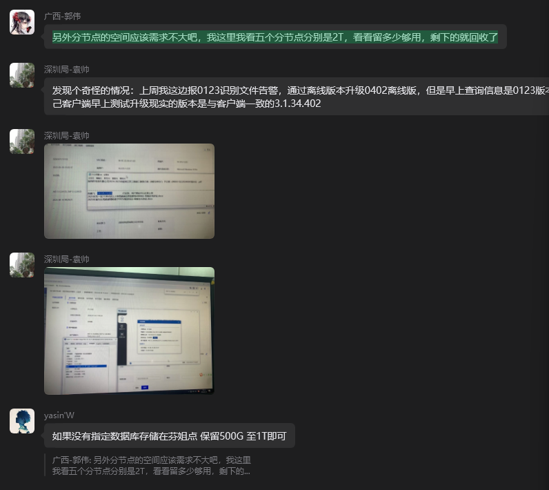

# 磁盘扩容重装

## 第一步、先把之前数据目录压缩打包，拷贝到扩容目录

### 停止服务
```bash
kubectl scale deploy -n topsec-topngdlp --all --replicas=0
```

### 可以选择性清空/var/log/messages
```bash
cat /dev/null > /var/log/messages
```

### 压缩目录/或者直接拷贝
```bash
#比如数据目录是/home/topsec/data
#拷贝data下面的所有文件夹，放到新的目录，比如新目录是/data_new/data
cp /home/topsec/data /data_new/data -rf
```

## 第二步、改nfs 配置目录 /etc/exports的目录

```bash
#把/etc/exports里面，目录改成新目录，ip改成对应的
/data_new/data     10.115.164.118(rw,async,no_wdelay,no_root_squash,insecure,no_subtree_check)

#括号后面的内容参考：rw,async,no_wdelay,no_root_squash,insecure,no_subtree_check
然后exportfs -rv && systemctl restart nfs-server
```

## 第三步、安装前检查
### 数据迁移完，检查下新目录是否有数据
```bash
ll /data_new/data
检查下目录是否齐全，如果有压缩包，记得解压
```
### 使用df -h 检查新加的磁盘大小，是否有数据
```bash
df -h 
```

### 删除旧pv
```bash
kubectl delete ns topsec-topngdlp && kubectl delete pv topsec-cloud
```

## 第四步、安装管理中心
```bash
PV_NFS_HOST=10.115.164.118 PV_NFS_PATH=/data_new/data ./install.sh install -f
说明：
PV_NFS_HOST=10.115.164.118 是主节点的IP
PV_NFS_PATH： 迁移后的路径（就是新目录，pwd显示的目录，data目录下面就是clickhouse、cofig-map、ersvc等这些目录）
安装过程中，需要忽略资源检测
```

## 安装完成后， 用get pods 看下pod是否运行正常 ，可以删除旧目录，比如旧目录是/home/topsec/data


## 精简版
1. 停止管理中心：kubectl scale deploy,sts -n <namespace> --all --replicas=0；
2. 压缩备份现有数据目录；
3. 扩容；
4. 卸载重装管理中心

(广西我记得之前是卷的模式吧？直接把新增磁盘加到卷就好了,内存和cpu南网云可以热扩容的)
(错误的：涉及到数据目录的所有操作 都需要完全停止管理中心服务)
