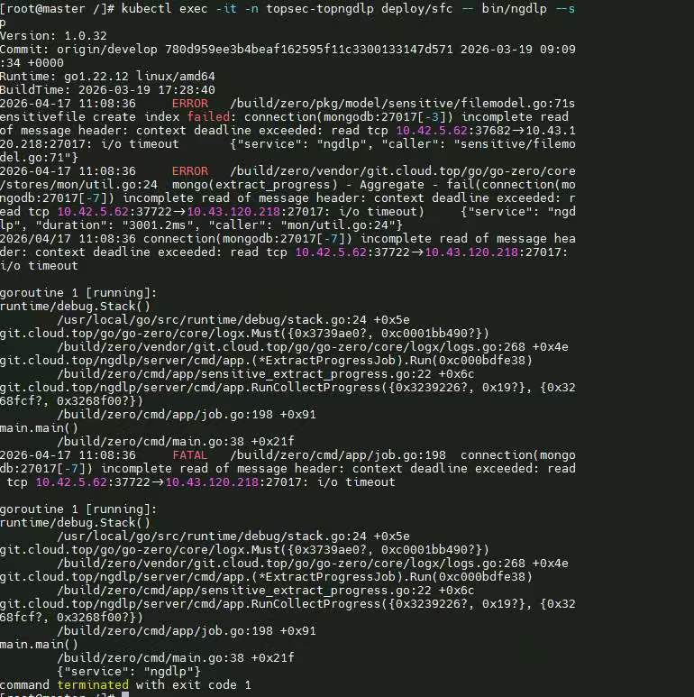
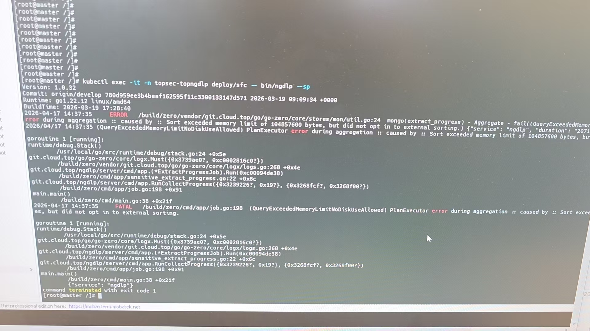

# mongo超时，采集日志

如果是敏感文件超时的问题，就查看索引

```bash
kubectl exec -it -n topsec-topngdlp statefulsets/mongodb  -- sh  -c 'mongo sensitive -uroot -pTopsecCdu_1130 --authenticationDatabase admin --eval  "db.file.getIndexes()" '

# 查看版本
kubectl exec -it -n topsec-topngdlp deploy/ngdlp -- bin/ngdlp -v

# 增加索引
kubectl exec -it -n topsec-topngdlp statefulsets/mongodb  -- mongo sensitive -uroot -pTopsecCdu_1130 --authenticationDatabase admin --eval 'db.file.createIndex({tenant_id:1,file_id:1,platform:1})'

# 查看索引是否生效
kubectl exec -it -n topsec-topngdlp sts/mongodb  -- mongo sensitive -uroot -pTopsecCdu_1130 --authenticationDatabase admin --eval "db.file.explain('executionStats').find({tenant_id:'6463251914242fcfcb345c4b',md5:'2eac4b6e208efbbf631ef7f4fc74fc2c',platform:'locality'})" 
```

# 再来sfc的问题就变了



这个问题是数据太多

```bash
# 进入mongo
kubectl exec -it -n topsec-topngdlp statefulsets/mongodb -- sh -c 'mongo progress -uroot -pTopsecCdu_1130 --authenticationDatabase admin'


# 查看提取总数
db.extract_progress.count()
# 删除一个月之前的记录
 db.extract_progress.deleteMany({created_at: {$lt: Math.floor((Date.now() - 30 * 24 * 60 * 60 * 1000) / 1000)}})
 ```

 