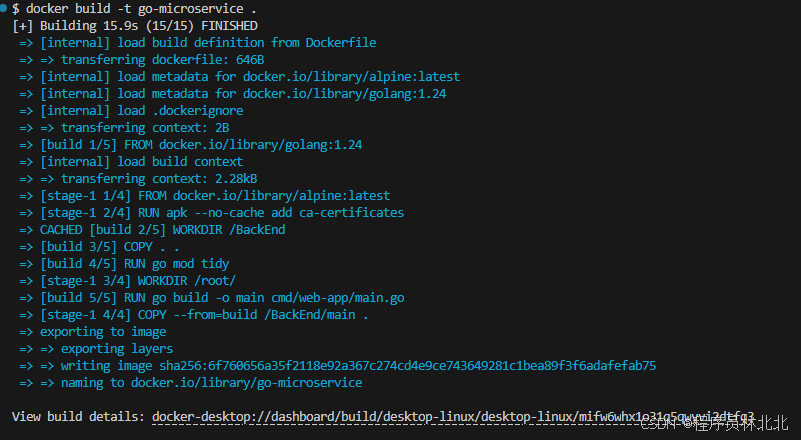
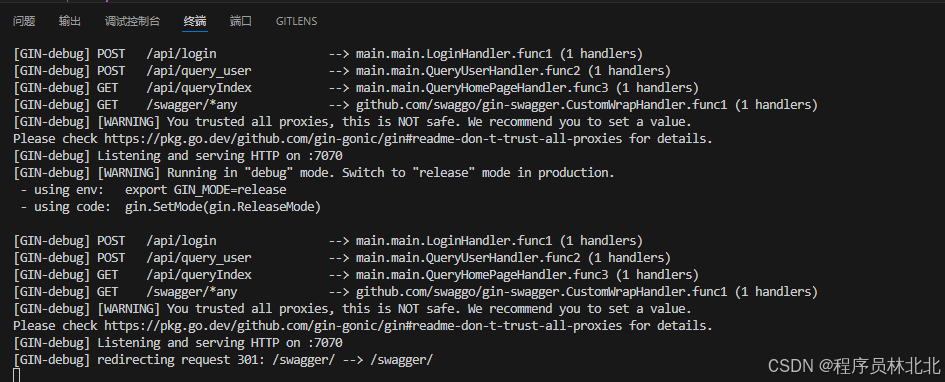

# 5.Docker 在 Go 微服务架构中的应用

## 5.1 什么是 Docker？

Docker 是一种开源的容器化平台，能够帮助开发者快速构建、部署和运行应用。Docker 使用容器技术将应用及其依赖打包到一个标准化的单元中，可以在任何地方运行。容器化技术使得应用具有跨平台、跨环境的一致性，特别适合微服务架构。

- 环境一致性：无论在开发、测试还是生产环境，Docker 容器中的应用行为都完全一致。

- 轻量级：与虚拟机不同，容器共享操作系统内核，因此相对于虚拟机，容器更加轻量级，启动速度更快。

- 高效的资源利用：容器使用系统资源更加高效，多个容器可以共享相同的操作系统资源。

- 易于扩展和部署：Docker 与 Kubernetes 等容器编排工具结合，能快速、自动化地进行部署和扩展。

## 5.2 使用 Docker 容器化 Go 微服务

将 Go 微服务应用容器化是构建微服务架构的一个重要步骤。在 Docker 中，我们需要创建一个 Dockerfile 来描述如何构建一个 Go 服务的镜像，并将其部署到 Docker 容器中。

步骤 1：创建 Dockerfile
在 Go 服务的根目录下创建一个 Dockerfile 文件，定义如何构建 Go 应用的镜像：

```dockerfile
# 使用官方 Golang 镜像作为基础镜像
FROM golang:1.24

# 为镜像设置必要的环境变量
ENV GO111MODULE=on \
    GOPROXY=https://goproxy.cn,direct \
    CGO_ENABLED=0 \
    GOOS=linux \
    GOARCH=amd64

# 设置工作目录为 /build
WORKDIR /build

# 复制 go.mod 和 go.sum 文件，以便安装依赖
COPY go.mod go.sum ./

# 安装 Go 依赖
RUN go mod download

# 将源代码复制到容器中的工作目录
COPY . .

# 复制 .env 文件到容器的根目录（确保路径正确）
COPY .env /dist/.env

# 复制 configs 目录到容器的 /dist/configs 目录
COPY configs /dist/configs

# 编译 Go 程序，输出二进制文件 app
RUN go build -o app cmd/web-app/main.go

# 将工作目录切换到 /dist
WORKDIR /dist

# 将编译后的二进制文件从 /build 目录复制到 /dist 目录
RUN cp /build/app .

# 声明容器监听的端口
EXPOSE 7070

# 启动容器时运行的命令
CMD ["/dist/app"]
```

这个 Dockerfile 使用了多阶段构建的方式，先用 Golang 的官方镜像构建 Go 应用，然后将构建好的二进制文件复制到一个更轻量的 Alpine 镜像中，以减小镜像的体积。

步骤 2：构建 Docker 镜像
在项目根目录下运行以下命令来构建 Docker 镜像：

```bash
docker build -t go-microservice .
```

此命令会根据 Dockerfile 构建一个名为go-microservice的 Docker 镜像。



步骤 3：运行 Docker 容器
使用以下命令启动一个 Docker 容器：

```bash
docker run -d -p 7070:7070 --name go-microservice-container go-microservice
```

这将会启动一个名为go-microservice-container的容器，并将容器内的 7070 端口映射到主机的 7070端口。



步骤 4：访问服务
此时，Go 微服务已经运行在 Docker 容器中，我们可以通过访问 http://localhost:7070来测试服务是否正常工作。