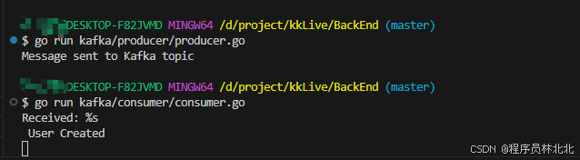

# 4.Kafka 在微服务中的应用

## 4.1 什么是 Kafka？
Kafka是一个分布式流处理平台，广泛用于构建实时数据流应用程序和数据管道。在微服务架构中，Kafka常常作为服务之间的消息队列，负责处理高吞吐量、低延迟的消息传递。
Kafka具有以下特点：

- 高吞吐量：Kafka能够处理每秒数百万条消息，非常适合高负载的实时数据流处理。

- 持久性和可靠性：Kafka提供数据持久化，能够确保消息在系统崩溃时不会丢失。

- 分布式架构：Kafka本身支持水平扩展，能够根据需求自动增加节点，提供高可用性和负载均衡。

## 4.2 Kafka 在 Go 中的应用

在Go中使用Kafka，我们可以通过第三方库github.com/segmentio/kafka-go来进行消息的生产和消费。下面是如何在Go中实现Kafka消息的生产者和消费者。

步骤一：安装Kafka Go客户端

```bash
go get github.com/segmentio/kafka-go
```

步骤 二：实现 Kafka 生产者
internal/kafka/producer/producer.go

```go
package main

import (
	"context"
	"fmt"
	"log"

	"github.com/segmentio/kafka-go"
)

func main() {
	// 创建Kafka 写入器
	writer := kafka.NewWriter(kafka.WriterConfig{
		Brokers:  []string{"localhost:9092"},
		Topic:    "user-events",
		Balancer: &kafka.LeastBytes{},
	})

	// 写入消息
	err := writer.WriteMessages(context.Background(), kafka.Message{
		Key:   []byte("user1"),
		Value: []byte("User Created"),
	})
	if err != nil {
	    log.Fatal(err)
	}
	fmt.Println("Message sent to Kafka topic")
}
```

步骤三：实现 Kafka 消费者
BackEnd\kafka\consumer\consumer.go

```go
package main

import (
	"context"
	"fmt"
	"log"

	"github.com/segmentio/kafka-go"
)

func main() {
	// 创建Kafka读取器
	reader := kafka.NewReader(kafka.ReaderConfig{
		Brokers:  []string{"localhost:9092"},
		Topic:    "user-events",
		GroupID:  "test-group",
		MinBytes: 10e3, // 10KB
		MaxBytes: 10e6, // 10MB
	})

	// 消费消息
	for {
	    message, err := reader.ReadMessage(context.Background())
	    if err != nil {
	        log.Fatal(err)
	    }
		// 打印消息
		fmt.Println("Received: %s\n", string(message.Value))
	}
}
```

通过上述生产者和消费者实现，我们就可以利用 Kafka 在微服务之间传递消息。

