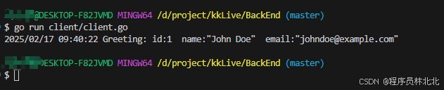

# 3.3. 微服务架构中的 gRPC 实践

## 3.1 什么是 gRPC？

gRPC（Google Remote Procedure Call）是 Google 开发的一款高性能、开源的远程过程调用（RPC）框架。它基于 HTTP/2 协议，支持多种语言（如 Go、Java、Python、C++ 等），能够让不同语言编写的微服务之间实现高效的通信。

gRPC 采用了 Protocol Buffers（protobuf）作为默认的接口定义语言（IDL）。它通过接口定义文件（.proto 文件）来定义服务的接口和消息类型，从而实现跨平台的服务调用。与传统的 REST API 相比，gRPC 提供了更高效的通信机制，尤其在高并发、高吞吐量的场景中表现尤为突出。

## 3.2 gRPC 在 Go 语言中的实现

在 Go 中实现 gRPC 服务相对简单。首先，需要安装 protoc 编译器和 Go 的 gRPC 插件。然后通过定义.proto文件来生成服务端和客户端代码。接下来，我们可以实现实际的 gRPC 服务和客户端。以下是 gRPC 在 Go 中的实现步骤：

步骤 1：安装依赖
首先，我们需要安装 protoc 和相关的插件：

```bash
# 安装 protobuf 编译器
brew install protobuf  # MacOS 使用 Homebrew 安装
# 也可以从 https://github.com/protocolbuffers/protobuf/releases 下载
# 安装 gRPC 和 Protobuf 插件
go install google.golang.org/grpc/cmd/protoc-gen-go-grpc@latest
go install google.golang.org/protobuf/cmd/protoc-gen-go@latest
```

步骤 2：定义 .proto 文件
在 .proto 文件中，我们可以定义服务接口和消息类型。例如，我们创建一个 user.proto 文件，定义了一个简单的服务：

```bash
syntax = "proto3";

package user;

option go_package = "./proto";

service UserService {
  rpc GetUser (UserRequest) returns (UserResponse);
}

message UserRequest {
    int32 id = 1;
}

message UserResponse {
    int32 id = 1;
    string name = 2;
    string email = 3;
}
```

此文件定义了一个 UserService 服务，包含一个 GetUser 的 RPC 方法，该方法接收一个 UserRequest 消息并返回一个 UserResponse 消息。

步骤 3：生成 Go 代码
使用 protoc 工具生成服务端和客户端的 Go 代码：

```bash
protoc --go_out=. --go-grpc_out=. user.proto
```

步骤 4：实现 gRPC 服务端
接下来，我们在 Go 中实现 gRPC 服务端：
server/server.go

```go
package main

import (
	"context"
	"fmt"
	"log"
	"my-ecommerce-app/userpb"
	"net"

	"google.golang.org/grpc"
)

// 定义 gRPC服务
type userServiceServer struct {
	userpb.UnimplementedUserServiceServer
}

// 实现 GetUser 方法
func (s *userServiceServer) GetUser(ctx context.Context, req *userpb.UserRequest) (*userpb.UserResponse, error) {
	// 模拟从数据库提取数据
	user := &userpb.UserResponse{
		Id:    req.GetId(),
		Name:  "John Doe",
		Email: "johndoe@example.com",
	}
	return user, nil
}

func main() {
	// 启动 gRPC 服务
	lis, err := net.Listen("tcp", ":50051") // 监听端口
	if err != nil {
		log.Fatalf("failed to listen: %v", err)
	}
	s := grpc.NewServer() // 创建 gRPC 服务器

	// 注册 gRPC 服务
	userpb.RegisterUserServiceServer(s, &userServiceServer{})

	// 启动服务器
	fmt.Println("Server started on port 50051...")
	if err := s.Serve(lis); err != nil {
		log.Fatalf("failed to serve: %v", err)
	}
}
```

步骤 5：实现 gRPC 客户端
然后，我们在客户端实现 gRPC 客户端代码：
client/client.go

```go
package main

import (
	"context"
	"log"
	"my-ecommerce-app/userpb"

	"google.golang.org/grpc"
)

func main() {
	// 连接到grpc服务器
	conn, err := grpc.Dial("localhost:50051", grpc.WithInsecure())
	if err != nil {
		log.Fatalf("did not connect: %v", err)
	}
	defer conn.Close()
	c := userpb.NewUserServiceClient(conn)

	// 调用grpc服务
	response, err := c.GetUser(context.Background(), &userpb.UserRequest{Id: 1})
	if err != nil {
		log.Fatalf("could not greet: %v", err)
	}
	log.Printf("Greeting: %s", response)
}
```

步骤 6：运行服务

1. 先启动服务端：

```bash
go run server.go
```

2. 然后再启动客户端：

```bash
go run client.go
```

这样，客户端就能够通过 gRPC 调用服务端的 GetUser 方法，并接收返回的数据。


