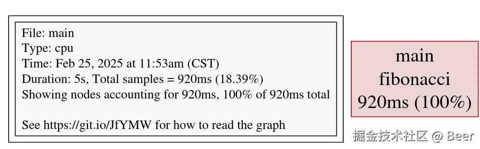
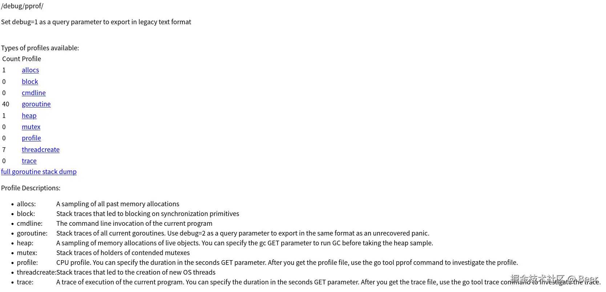
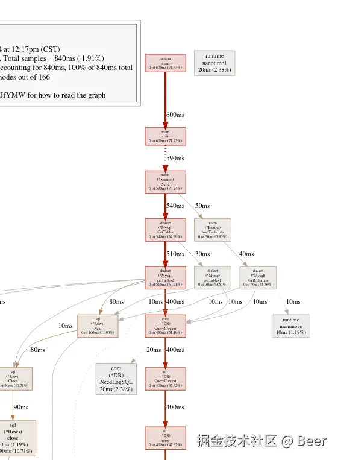

# [Golang pprof 性能分析工具](https://juejin.cn/post/7475174268873834536)

## pprof 介绍

pprof 是 Go 语言自带的一个性能分析工具，它提供了对程序不同方面性能数据的采集和分析功能，主要涉及 CPU 性能、内存分配、阻塞情况、锁竞争等方面。通过分析这些数据，开发者可以了解程序在运行过程中各个函数的资源消耗情况，进而有针对性地进行优化。

## 工作流程

- 采样: pprof 通过在程序运行期间按一定时间间隔对程序的状态进行采样，记录函数调用栈、内存分配等信息。
- 数据生产: 将采样得到的数据保存到文件中，这些文件通常以 .prof 为扩展名，包含了程序运行时的详细性能信息。
- 数据展示: 使用 go tool pprof 命令读取这些数据文件，以文本或可视化的方式展示分析结果，帮助开发者理解程序的性能状况。

## 如何使用

## CPU性能

利用 pprof 我们可以方便的得到一段代码中各个阶段占用的cpu时间，通常我们选取其中占用时间最多的进行有针对性的分析,达到优化软件性能的目的。下面以一个斐波那契数列的计算进行演示。原始代码如下：

```go
package main

import (
    "fmt"
    "time"
)

func fibonacci(n int) int {
    if n <= 1 {
        return n
    }
    return fibonacci(n-1) + fibonacci(n-2)
}

func main() {
    for i := 0; i < 40; i++ {
        go fibonacci(i) // 启动多个协程进行计算
    }
    fmt.Println("Calculating Fibonacci numbers...")
    time.Sleep(5 * time.Second) // 等待各个协程完成计算
}
```

1. 引入runtime/pprof包

```go
package main

import (
    ...
    "runtime/pprof"
    ...
)

...

func main() {
    // 创建一个文件用于保存 CPU 分析数据
    f, err := os.Create("cpu.prof")
    if err != nil {
        panic(err)
    }
    defer f.Close()

    // 开始 CPU 分析
    err = pprof.StartCPUProfile(f)
    if err != nil {
        panic(err)
    }
    defer pprof.StopCPUProfile()

    ...
    // 斐波那契数列计算执行
}
```

```bash
go run main.go
```

执行完成以上代码后，我们会得到一个cpu.prof文件，该文件包含了程序运行期间的 CPU 使用情况。

2. 使用pprof工具进行分析

```bash
go tool pprof cpu.prof
```

```rust
 File: main
 Type: cpu
 Time: Feb 25, 2025 at 11:53am (CST)
 Duration: 5s, Total samples = 920ms (18.39%)
 Entering interactive mode (type "help" for commands, "o" for options)
 (pprof) 
 ...
```

进入 pprof 交互界面后，我们可以使用 help 命令查看详细的帮助文档，具体的文档内容就不过多介绍了，这里简单讲讲几个常用的命令。

- top: 显示cpu占用最多的函数，可以跟上数字显示占用最多的n个(如 top3 显示占用最高的3个函数)

```bash
(pprof) top
Showing nodes accounting for 920ms, 100% of 920ms total
    flat  flat%   sum%        cum   cum%
    920ms   100%   100%      920ms   100%  main.fibonacci
```

- list <function_name>: 显示指定函数的源代码，并标注每行代码的 CPU 使用情况。

```bash
(pprof) list main.fibonacci
Total: 920ms
ROUTINE ======================== main.fibonacci in /home/beer/workspace/test/pprof/main.go
    920ms      1.34s (flat, cum) 145.65% of Total
    240ms      240ms     10:func fibonacci(n int) int {
    130ms      130ms     11:   if n <= 1 {
    50ms       50ms     12:           return n
        .          .     13:   }
    500ms      920ms     14:   return fibonacci(n-1) + fibonacci(n-2)
        .          .     15:}
        .          .     16:
        .          .     17:func main() {
        .          .     18:   // 创建一个文件用于保存 CPU 分析数据
        .          .     19:   f, err := os.Create("cpu.prof")
```

- web：打开一个可视化的调用图，直观地展示函数之间的调用关系和 CPU 使用情况。需要安装 graphviz 工具。
- dot: 也可以使用在线可视化工具如 GraphvizOnline ，可以使用 dot > cpu.dot 将结果导出成 dot 格式内容，将内容拷贝到在线工具中就可看到具体效果。



## 内存性能

利用 pprof 我们可以方便的得到一段代码在采样时的内存占用情况，可以定位到内存分配占用的具体代码，我们可以找出内存占用不合理的地方，进行更精确的内存优化。下面依旧使用斐波那契数列进行演示，为了保证采样数据的有效性，对函数进行了一些代码修改。

1. 引入runtime/pprof包，运行分析程序

```go
package main

import (
    "fmt"
    "os"
    "runtime/pprof"
    "time"
)

func fibonacci(n int) int {
    if n <= 1 {
        return n
    }
    fb := []int{0, 1}
    for i := 2; i <= n; i++ {
        fb = append(fb, fb[len(fb)-2]+fb[len(fb)-1])
    }
    time.Sleep(time.Second * 6) // 为了保证采样时 内存没有被释放掉
    return fb[n]
}

func main() {
    for i := 0; i < 80; i++ {
        go fibonacci(i)
    }
    fmt.Println("Calculating Fibonacci numbers...")
    time.Sleep(time.Second * 5)

    // 创建一个文件用于保存内存分析数据
    f, err := os.Create("mem.prof")
    if err != nil {
        panic(err)
    }
    defer f.Close()

    // 进行内存分析
    err = pprof.WriteHeapProfile(f)
    if err != nil {
        panic(err)
    }
}
```

执行完成以上代码后，我们会得到一个mem.prof文件，该文件包含了采样时程序的内存使用情况。

2. 使用pprof工具进行分析

```bash
go tool pprof mem.prof

File: main
Type: inuse_space
Time: Feb 25, 2025 at 1:58pm (CST)
Entering interactive mode (type "help" for commands, "o" for options)
(pprof) top
Showing nodes accounting for 512.03kB, 100% of 512.03kB total
    flat  flat%   sum%        cum   cum%
512.03kB   100%   100%   512.03kB   100%  main.fibonacci
```

使用list命令可以扛到具体的内存分配情况。

```bash
(pprof) list main.fibonacci
  Total: 512.03kB
  ROUTINE ======================== main.fibonacci in /home/beer/workspace/test/pprof/main.go
  512.03kB   512.03kB (flat, cum)   100% of Total
          .          .     10:func fibonacci(n int) int {
          .          .     11:   if n <= 1 {
          .          .     12:           return n
          .          .     13:   }
          .          .     14:   fb := []int{0, 1}
          .          .     15:   for i := 2; i <= n; i++ {
  512.03kB   512.03kB     16:           fb = append(fb, fb[len(fb)-2]+fb[len(fb)-1])
          .          .     17:   }
          .          .     18:   time.Sleep(time.Second * 6)
          .          .     19:   return fb[n]
          .          .     20:}
          .          .     21:
```

其他命令如top、list、web、dot等同cpu分析中用法是相同的用法，这里就不进行用于展示了。

## Web服务中的性能分析

上面介绍的CPU和内存分析，仅仅针对相对独立的代码片段进行的，而对于环境更加复杂的情况，pprof也提供了也写工具，如面对web服务时。
对于基于net/http构建的服务，我们可以直接引入net/http/pprof包，这个包会自动为我们添加好一系列测试接口。

```go
package main

import (
	"net/http"
	_ "net/http/pprof"
	"time"
)

func fibonacci(n int) int {
	if n <= 1 {
		return n
	}
	time.Sleep(time.Second * 2)
	return fibonacci(n-1) + fibonacci(n-2)
}

func main() {
	go func() {
		for i := 0; i < 40; i++ {
			go fibonacci(i)
		}
		time.Sleep(5 * time.Second)
	}()

	// 启动 pprof 服务
	go func() {
		http.ListenAndServe("localhost:8888", nil)
	}()

	select {}
}
```

运行程序后，可以通过以下 URL 访问不同的性能分析数据：

- [http://localhost:8888/debug/pprof/：查看所有可用的分析数据。](http://localhost:8888/debug/pprof)

  
- http://localhost:8888/debug/pprof/profile ：触发CPU采样并下载CPU 分析数据。

```bash
go tool pprof http://localhost:8888/debug/pprof/profile 
```

后续流程同cpu性能分析时一致。

- http://localhost:8888/debug/pprof/heap：触发内存采样并下载内存分析数据。

```bash
go tool pprof http://localhost:8888/debug/pprof/heap 
```

后续流程同cpu性能分析时一致。

注意：这里的接口都是在访问时触发采样，等待采样完成后下载结果数据。

对于常见的Web框架，对应的社区中也有相应工具库可以集成pprof，如：

- Gin框架

```go
package main

import (
	"net/http"

	"github.com/gin-contrib/pprof"
	"github.com/gin-gonic/gin"
)

func main() {
	r := gin.Default()
	pprof.Register(r)

	r.GET("/ping", func(ctx *gin.Context) {
		ctx.JSON(http.StatusOK, gin.H{
			"message": "pong",
		})
	})

	r.Run(":8888")
}
```

## 实例分析

在使用xorm同步数据库表结构时候发现，执行时间极长，代码由模板语法生成，大致内容如下：

```go
// InitSync 更新表结构到单库，用于测试和开发环境
// 快速同步表结构，以及dbdiff出表结构改动
func InitSync(orm *xorm.Engine) error {
	var err error

	err = sync(orm, &AccountAccount{})
	if err != nil {
		return fmt.Errorf("sync &AccountAccount error:%v", err)
	}

	...

	err = sync(orm, &TimeEvent{})
	if err != nil {
		return fmt.Errorf("sync &TimeEvent error:%v", err)
	}

	err = sync(orm, &Zone{})
	if err != nil {
		return fmt.Errorf("sync &Zone error:%v", err)
	}

	return nil
}
```

使用pprof分析同步代码，得到cpu时间占用图如下：



可以看到，中间一条路径中是执行最长的一条路径，沿着这条路径翻阅xorm代码，最后发现产生问题的地方：

```go
// .../go/pkg/mod/xorm.io/xorm@v1.3.2/engine.go
// Sync the new struct changes to database, this method will automatically add
// table, column, index, unique. but will not delete or change anything.
// If you change some field, you should change the database manually.
func (engine *Engine) Sync(beans ...interface{}) error {
	session := engine.NewSession()
	defer session.Close()
	return session.Sync(beans...)
}


// .../go/pkg/mod/xorm.io/xorm@v1.3.2/session_schema.go
// Sync synchronize structs to database tables
func (session *Session) Sync(beans ...interface{}) error {
	engine := session.engine

	if session.isAutoClose {
		session.isAutoClose = false
		defer session.Close()
	}

	tables, err := engine.dialect.GetTables(session.getQueryer(), session.ctx)
	if err != nil {
		return err
	}

	session.autoResetStatement = false
	defer func() {
		session.autoResetStatement = true
		session.resetStatement()
	}()
...
```

其中engine.dialect.GetTables方法会读取数据库中所有的表结构，用以和需要同步的表结构进行比较。同步代码中分开对每一个表结构进行同步，导致重复多次拉取所有表结构数据，实际上只需要拉取一次就可以实现功能。这里同步表的正确方式为：

```go
// 将所有表结构以为变长参数[切片]方式传入
err := orm.Sync(
    &AccountAccount{},
    ...
    &Zone{},
)
```