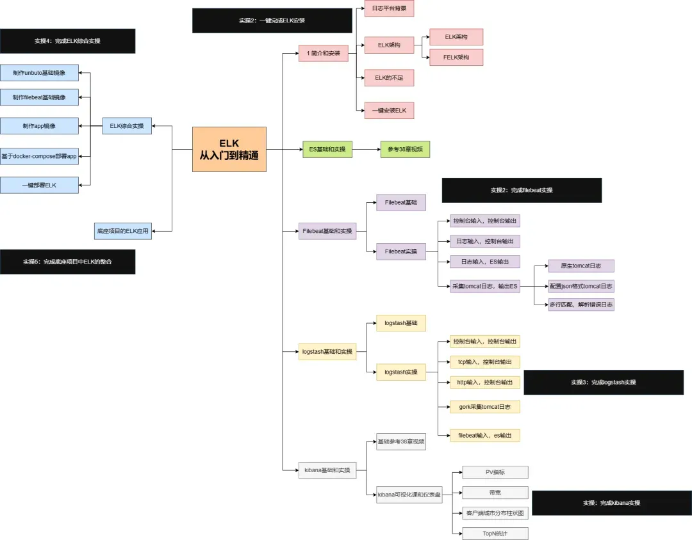
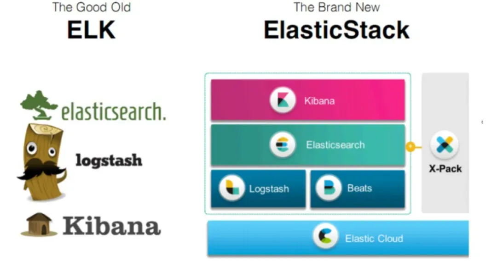
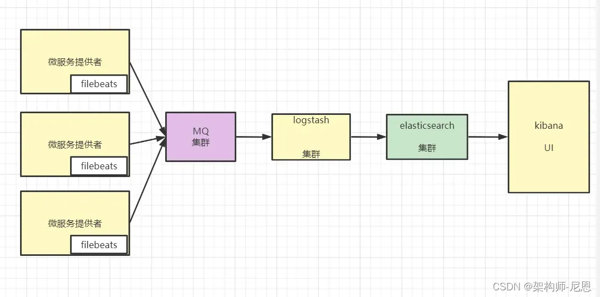
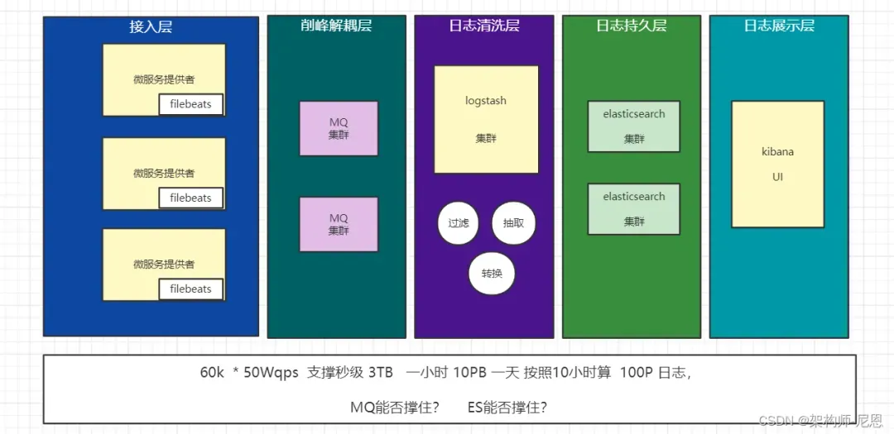
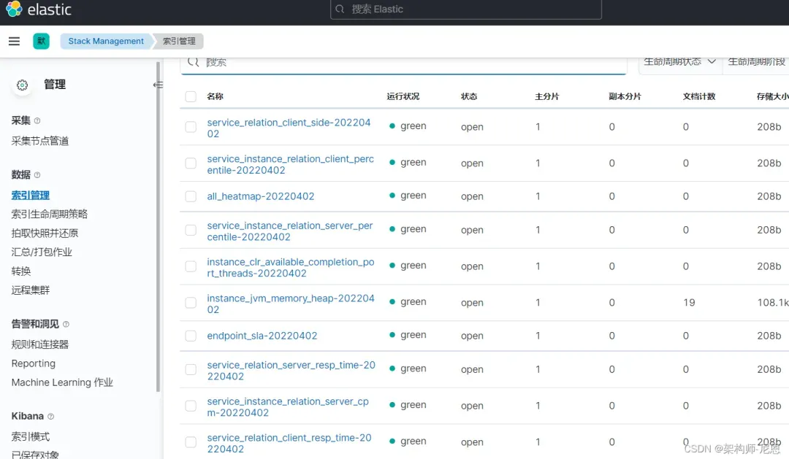
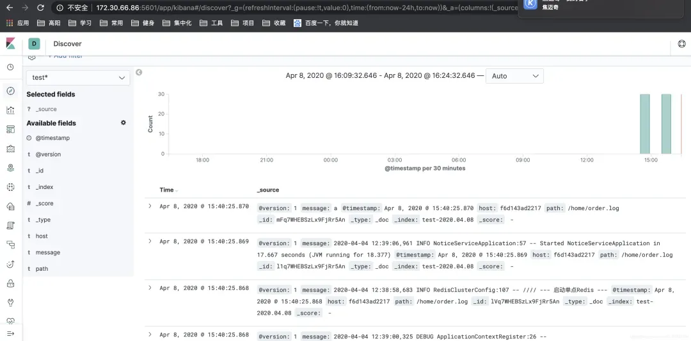
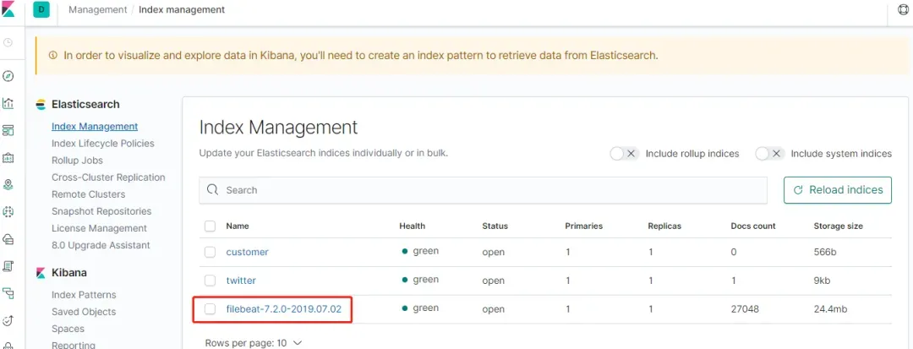
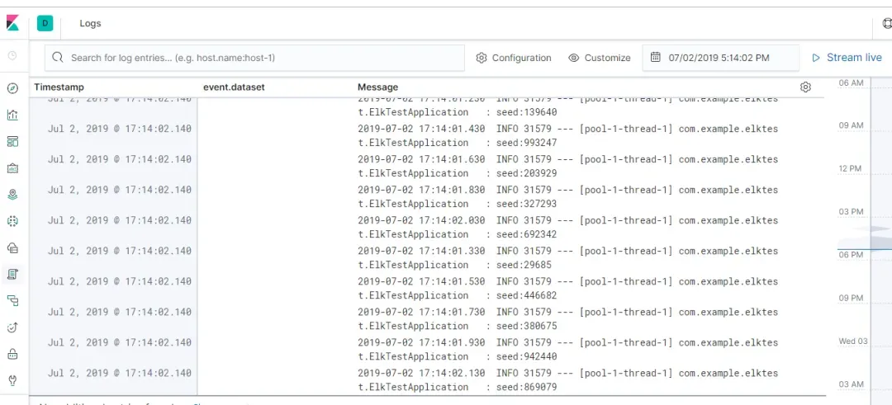
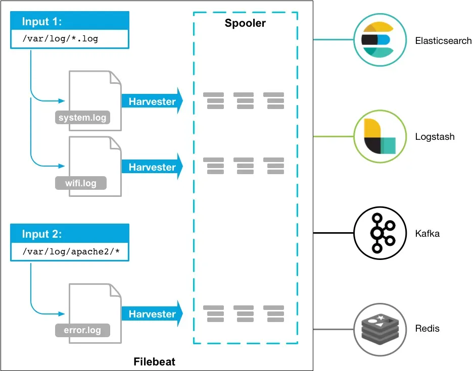

## ELK 其实并不是一款软件，而是一整套解决方案，是三个软件产品的首字母缩写

- Elasticsearch：负责日志检索和储存

- Logstash：负责日志的收集和分析、处理

- Kibana：负责日志的可视化

## 这三款软件都是开源软件，通常是配合使用，而且又先后归于 Elastic.co 公司名下，故被简称为 ELK

45岁老架构师尼恩团队打造，elk（Elasticsearch、Logstash、Kibana）从入门到精通的 学习路线



# 1 [ELK日志平台介绍](https://developer.aliyun.com/article/1639868)

Elasticsearch、Logstash、Kibana三大开源框架首字母大写简称。

## 1.1 基础日志平台的背景

日志主要包括系统日志、应用程序日志和安全日志。系统运维和开发人员可以通过日志了解服务器软硬件信息、检查配置过程中的错误及错误发生的原因。经常分析日志可以了解服务器的负荷，性能安全性，从而及时采取措施纠正错误。

通常，日志被分散的储存不同的设备上。

如果你管理数十上百台服务器，你还在使用依次登录每台机器的传统方法查阅日志。

这样是不是感觉很繁琐和效率低下。当务之急我们使用集中化的日志管理，例如：开源的syslog，将所有服务器上的日志收集汇总。

集中化管理日志后，日志的统计和检索又成为一件比较麻烦的事情，一般我们使用grep、awk和wc等Linux命令能实现检索和统计，但是对于要求更高的查询、排序和统计等要求和庞大的机器数量依然使用这样的方法难免有点力不从心。

随着服务容器化，跑在一台CentOS服务器上，服务器搭建了docker环境，安装了docker-compose或者k8s，但在日志处理方面，暂时没有一个好的方法能够收集完全的日志，

只能依赖进入至服务器后，以docker logs containerID的方法来进入查看，非常不方便，所以，基础日志平台就迫在眉睫。

## 1.2 ELK的关系



在ELK架构中，Elasticsearch、Logstash和Kibana三款软件作用如下：

1. Elasticsearch
Elasticsearch是一个高度可扩展的全文搜索和分析引擎，基于Apache Lucence（事实上，Lucence也是百度所采用的搜索引擎）构建，能够对大容量的数据进行接近实时的存储、搜索和分析操作。

2. Logstash
Logstash是一个数据收集引擎，它可以动态的从各种数据源搜集数据，并对数据进行过滤、分析和统一格式等操作，并将输出结果存储到指定位置上。Logstash支持普通的日志文件和自定义Json格式的日志解析。负责日志清洗： 日志 过滤，格式处理，等等。 有大量的 自定义完成。

3. Kibana
Kibana是一个数据分析和可视化平台，通常与Elasticsearch配合使用，用于对其中的数据进行搜索、分析，并且以统计图标的形式展示。

## 1.3 ELK的架构



如上图所示，filebeats 安装在各个设备上，用于收集日志信息，收集到的日志信息统一汇总到Elasticsearch上，然后由Kibana负责web端的展示。

其中，如果终端设备过多，会导致logstash 过载的现象，此时，我们可以采用一台 mq 设备作为消息队列，以暂时缓存数据，避免 logstash 压力突发。

### ELK架构优点如下：

1. 处理方式灵活。 Elasticsearch是全文索引，具有强大的搜索能力。

2. 配置相对简单。 Kibana的配置非常简单，Elasticsearch则全部使用Json接口，配置也不复杂，Logstash的配置使用模块的方式，配置也相对简单。

3. 检索性能高。 ELK架构通常可以达到百亿级数据的查询秒级响应。

4. 集群线性扩展。 Elasticsearch本身没有单点的概念，自动默认集群模式，Elasticsearch和Logstash都可以灵活扩展。

5. 页面美观。 Kibana的前端设计美观，且操作简单。

Logstash:从各种数据源搜集数据，并对数据进行过滤、分析、丰富、统一格式等操作，然后存储到 ES。

Elasticsearch:对大容量的数据进行接近实时的存储、搜索和分析操作。

Kibana：数据分析和可视化平台。与 Elasticsearch 配合使用，对数据进行搜索、分析和以统计图表的方式展示。

### 1.3.1 简单的ELK日志平台

elk 架构图解如下:


其中ElasticSearch 是三台服务器构成的集群，其中：

- ElasticSearch做倒排索引，

- Logstash跑在每个服务器上，各种日志通过Logstash搜集，Grok，Geoip等插件进行处理然后统一送到ElasticSearch的集群。

- Kibana做图形化的展示。

这种elk架构比较简单，也存在一些问题：

1. Logstash依赖Java虚拟机占用系统的内存和CPU都比较大，

2. Logstash在数据量较大的时候容易导致其他业务应用程序崩溃，影响业务正常使用

3. 随着时间的积累，es空间不能满足现状

4. Kibana没有安全管控机制，没有权限审核，安全性较差。

5. ElasticSearch 主节点也是数据节点，导致有时候查询较慢

### 1.3.2 ELK改进之引入Filebeat

ElasticSearch的版本，我们还是选择原来的 6.2.x的版本，然后重新搭建了一套ELK的日志系统。

ElasticSearch 6.x 的版本如果要做用于鉴权的话，必须依赖X-Pack，但是X-pack是付费的产品，所以，引入x-pack，虽然能实现 Index 级别的权限管控，确保数据安全，但是涉及到费用的问题。

于是，ElasticSearch的版本采用ElasticSearch 7.x的版本，用户鉴权采用其免费的 basic 认证实现（因为7.x的新版本在性能上优化，查询和写入速度会更快）

架构图解如下:


整个架构的具体的改进方法如下:

1. 客户端选用更轻量化的Filebeat，Filebeat 采用 Golang 语言进行编写的，优点是暂用系统资源小，收集效率高。

2. Filebeat 数据收集之后统一送到多个 Logstatsh进行统一的过滤，然后将过滤后的数据写入ElasticSearch集群。

3. 将原有的3个es节点增加至6个节点，其中3个ES节点是master节点，其余的节点是数据节点，如果磁盘不够用可以横向扩展数据节点。

6. ElasticSearch集群的硬盘采用 SSD的硬盘

7. ElasticSearch 做冷热数据分离

8. 60天之前的索引数据进行关闭，有需要用的时候手工打开

9. ElasticSearch的版本采用ElasticSearch 7.x的版本，用户鉴权采用其免费的 basic 认证实现（因为7.x的新版本在性能上优化，查询和写入速度会更快）

到此，我们的日志系统算暂时是正常并且能满足日志查日志的需求了，也很少出现卡顿的现象了，并且服务器的资源使用率直接下降了一半。

### 1.3.3 ELK的应用场景

- 异常分析
通过将应用的日志内容通过Logstash输入到Elasticsearch中来实现对程序异常的分析排查

- 业务分析
将消息的通讯结果通过Logstash输入到Elasticsearch中来实现对业务效果的整理

- 系统分析
将处理内容的延迟作为数据输入到Elasticsearch 中来实现对应用性能的调优

## 1.4 ELK的不足

#### es的资源占用
一般使用 ES 时，必须要事先评估好节点配置和集群规模，可以从以下几个方面进行评估：

#### 存储容量：
要考虑索引副本数量、数据膨胀、ES 内部任务额外占用的磁盘空间（比如 segment merge )以及操作系统占用的磁盘空间等因素，
如果再需要预留 50% 的空闲磁盘空间，那么集群总的存储容量大约为源数据量的 4 倍；

#### 计算资源：
主要考虑写入，2 核 8GB 的节点可以支持 5000 qps 的写入，随着节点数量和节点规格的提升，写入能力基本呈线性增长；

#### 索引和分片数量评估：

- 一般一个 shard 的数据量在 30-50 GB为宜，可以以此确定索引的分片数量以及确定按天还是按月建索引。

- 需要控制单节点总的分片数量，1GB 堆内存支持 20-30 个分片为宜。

- 另外需要控制集群整体的分片数量，集群总体的分片数量一般不要超过 3w 。

算下来 3W * 50G = 1500 T = 1.5P

那么，elk 如何支持 一天1000PB，一个月上万PB规模的日志量呢？



从吞吐量上来说，虽然mq进行扩展，能支撑100w 级别qps的吞吐量

但是， 后端的logstash 吞吐峰值15000 qps ，es的单节点写入 是 5000 qps 左右，

30K * 100Wqps 的日志吞吐量，如果不希望发生太大的日志延迟， 消息积压，

需要 100+个 logstash 节点， 300+个ES节点

这个需要庞大的资源成本，庞大的运维成本

#### 如何满足10w级、100Wqps吞吐量qps、EB级日志存储呢

参考23章视频：《100Wqps 超高并发日志平台》实操

如果又要兼顾吞吐量，又要 降低硬件成本和运维成本，必须要

- 缩短 日志传输和处理链路，
- 并采用更高性能，更大压缩比例的存储组件，如clickhouse。

架构如下：


clickhouse 的数据压缩比例，请参考另外一篇博客：

clickhouse 超底层原理 + 高可用实操 （史上最全）

最终，压缩后的数据，只剩下 原始数据的 20%-30% ， 单数据库这块，减少了50% 的硬盘容量，

使用elk方案，数据有多个副本，包括MQ（主副本2 份），数据库（1 份），现在减少到 数据库（1 份），这里至少减少50% 。

# 2 一键安装 es+logstash+ kibana

```dockerfile
version: "3.5"
services:
  elasticsearch:
     image: andylsr/elasticsearch-with-ik-icu:7.14.0
     container_name: elasticsearch
     hostname: elasticsearch
     restart: always
     ports:
       - 9200:9200
     volumes:
       - ./elasticsearch7/logs:/usr/share/elasticsearch/logs
       - ./elasticsearch7/data:/usr/share/elasticsearch/data
       - ./elasticsearch7/config/single-node.yml:/usr/share/elasticsearch/config/elasticsearch.yml
       - ./elasticsearch7/config/jvm.options:/usr/share/elasticsearch/config/jvm.options
       - ./elasticsearch7/config/log4j2.properties:/usr/share/elasticsearch/config/log4j2.properties
     environment:
       - "ES_JAVA_OPTS=-Xms512m -Xmx512m"
       - "TZ=Asia/Shanghai"
       - "TAKE_FILE_OWNERSHIP=true"   #volumes 挂载权限 如果不想要挂载es文件改配置可以删除
     ulimits:
       memlock:
         soft: -1
         hard: -1
     networks:
       base-env-network:
         aliases:
          - elasticsearch
  kibana:
    image: docker.elastic.co/kibana/kibana:7.14.0
    container_name: kibana
    volumes:
      - ./elasticsearch7/config/kibana.yml:/usr/share/kibana/config/kibana.yml
    ports:
      - 15601:5601
    ulimits:
      nproc: 65535
      memlock: -1
    depends_on:
       - elasticsearch
    networks:                    
       base-env-network:
         aliases:
          - kibana
  logstash:
    image:  logstash:7.14.0
    container_name: logstash
    hostname: logstash
    restart: always
    ports:
      - 19600:9600
      - 15044:5044
    volumes:
      - ./logstash/logstash.conf:/usr/share/logstash/pipeline/logstash.conf:rw
      - ./logstash/logstash.yml:/usr/share/logstash/config/logstash.yml
      - ./logstash/data:/home/logstash/data
    networks:
       base-env-network:
         aliases:
          - logstash
# docker network create base-env-network          
networks:
  base-env-network:
    external:
      name: "base-env-network"

```

#### 访问kibana

http://cdh1:15601

SkyWalking

http://cdh2:13800/

kibana



#### 在kibana显示的效果



在kibana组件上查看，可以看到创建了一个filebeat开头的数据索引，如下图:



在日志搜索界面，可以看到service-hi应用输出的日志，如图所示：



# 3 Elasticsearch基础和实操

Elasticsearch 是一个分布式的开源搜索和分析引擎，在 Apache Lucene 的基础上开发而成。

Lucene 是开源的搜索引擎工具包，Elasticsearch 充分利用Lucene，并对其进行了扩展，使存储、索引、搜索都变得更快、更容易， 而最重要的是， 正如名字中的“ elastic ”所示， 一切都是灵活、有弹性的。而且，应用代码也不是必须用Java 书写才可以和Elasticsearc兼容，完全可以通过JSON 格式的HTTP 请求来进行索引、搜索和管理Elasticsearch 集群。

如果你已经听说过Lucene ，那么可能你也听说了Solr，

Solr也是开源的基于Lucene 的分布式搜索引擎，跟Elasticsearch有很多相似之处。


但是Solr 诞生于2004 年，而Elasticsearch诞生于2010，Elasticsearch凭借后发优势和更活跃的社区、更完备的生态系统，迅速反超Solr，成为搜索市场的第二代霸主。

Elasticsearch具有以下优势：

- Elasticsearch 很快。 由于 Elasticsearch 是在 Lucene 基础上构建而成的，所以在全文本搜索方面表现十分出色。Elasticsearch 同时还是一个近实时的搜索平台，这意味着从文档索引操作到文档变为可搜索状态之间的延时很短，一般只有一秒。因此，Elasticsearch 非常适用于对时间有严苛要求的用例，例如安全分析和基础设施监测。

- Elasticsearch 具有分布式的本质特征。 Elasticsearch 中存储的文档分布在不同的容器中，这些容器称为分片，可以进行复制以提供数据冗余副本，以防发生硬件故障。Elasticsearch 的分布式特性使得它可以扩展至数百台（甚至数千台）服务器，并处理 PB 量级的数据。

- Elasticsearch 包含一系列广泛的功能。 除了速度、可扩展性和弹性等优势以外，Elasticsearch 还有大量强大的内置功能（例如数据汇总和索引生命周期管理），可以方便用户更加高效地存储和搜索数据。

- Elastic Stack 简化了数据采集、可视化和报告过程。 人们通常将 Elastic Stack 称为 ELK Stack（代指Elasticsearch、Logstash 和 Kibana），目前 Elastic Stack 包括一系列丰富的轻量型数据采集代理，这些代理统称为 Beats，可用来向 Elasticsearch 发送数据。通过与 Beats 和 Logstash 进行集成，用户能够在向 Elasticsearch 中索引数据之前轻松地处理数据。同时，Kibana 不仅可针对 Elasticsearch 数据提供实时可视化，同时还提供 UI 以便用户快速访问应用程序性能监测 (APM)、日志和基础设施指标等数据。

# 4 filebeat基础和实操

当你要面对成百上千、甚至成千上万的服务器、虚拟机和容器生成的日志时，Filebeat 将为你提供一种轻量型方法，用于转发和汇总日志与文件，让简单的事情不再繁杂。

关于Filebeat，记住两点：

- 轻量级日志采集器

- 输送至 Elasticsearch 或 Logstash，在 Kibana 中实现可视化

官网文档[https://www.elastic.co/guide/en/beats/filebeat/7.14/filebeat-overview.html](https://www.elastic.co/guide/en/beats/filebeat/7.14/filebeat-overview.html)

## 4.1 filebeat和beats的关系

filebeat是Beats中的一员。

Beats在是一个轻量级日志采集器，其实Beats家族有6个成员，目前Beats包含六种工具：

- Packetbeat：网络数据（收集网络流量数据）
- Metricbeat：指标（收集系统、进程和文件系统级别的CPU和内存使用情况等数据）
- Filebeat：日志文件（收集文件数据）
- Winlogbeat：windows事件日志（收集Windows事件日志数据）
- Auditbeat：审计数据（收集审计日志）
- Heartbeat：运行时间监控（收集系统运行时的数据）

## 4.2 Filebeat工作原理

Filebeat由两个主要组件组成：inputs 和 harvesters （直译：收割机，采集器）。

这些组件一起工作以跟踪文件，并将事件数据发送到你指定的输出。

Filebeat的工作方式如下：

<div style="border-left: 4px solid #ccc; padding-left: 10px; background-color: #f9f9f9;">
    启动Filebeat时，它将启动一个或多个输入，这些输入将在为日志数据指定的位置中查找。
</div>

对于Filebeat所找到的每个日志，Filebeat都会启动收割机。

每个收割机都读取一个日志以获取新内容，并将新日志数据发送到libbeat，libbeat会汇总事件并将汇总的数据发送到您为Filebeat配置的输出。



Filebeat是一个轻量级日志传输Agent，可以将指定日志转发到Logstash、Elasticsearch、Kafka、Redis等中。

Filebeat占用资源少，而且安装配置也比较简单，支持目前各类主流OS及Docker平台。

Filebeat是用于转发和集中日志数据的轻量级传送程序。

作为服务器上的代理安装，Filebeat监视您指定的日志文件或位置，收集日志事件，并将它们转发到Elasticsearch或Logstash进行索引。

#### harvester是什么

一个harvester负责读取一个单个文件的内容。

harvester逐行读取每个文件（一行一行地读取每个文件），并把这些内容发送到输出。

每个文件启动一个harvester。

harvester负责打开和关闭这个文件，这就意味着在harvester运行时文件描述符保持打开状态。

在harvester正在读取文件内容的时候，文件被删除或者重命名了，那么Filebeat会续读这个文件。

这就有一个问题了，就是只要负责这个文件的harvester没用关闭，那么磁盘空间就不会释放。

默认情况下，Filebeat保存文件打开直到close_inactive到达。

#### input是什么

一个input负责管理harvesters，并找到所有要读取的源。

如果input类型是log，则input查找驱动器上与已定义的glob路径匹配的所有文件，并为每个文件启动一个harvester。

每个input都在自己的Go例程中运行。

下面的例子配置Filebeat从所有匹配指定的glob模式的文件中读取行：

```dockerfile
filebeat.inputs:
- type: log
  paths:
    - /var/log/*.log
    - /var/path2/*.log
```

#### Filebeat如何保持文件状态

Filebeat 保存每个文件的状态，并经常刷新状态，并且将状态到磁盘上的注册文件（registry）。

状态用于记住harvester读取的最后一个偏移量，并确保所有日志行被发送（到输出）。

如果输出，比如Elasticsearch 或者 Logstash等，无法访问，那么Filebeat会跟踪已经发送的最后一行，并只要输出再次变得可用时继续读取文件。

当Filebeat运行时，会将每个文件的状态新保存在内存中。

当Filebeat重新启动时，将使用注册文件中的数据重新构建状态，Filebeat将在最后一个已知位置继续每个harvester。

对于每个输入，Filebeat保存它找到的每个文件的状态。

因为文件可以重命名或移动，所以文件名和路径不足以标识文件。对于每个文件，Filebeat存储惟一标识符，以检测文件是否以前读取过。

如果你的情况涉及每天创建大量的新文件，你可能会发现注册表文件变得太大了。

（画外音：Filebeat 保存每个文件的状态，并将状态保存到registry_file中的磁盘。当重新启动Filebeat时，文件状态用于在以前的位置继续读取文件。如果每天生成大量新文件，注册表文件可能会变得太大。为了减小注册表文件的大小，有两个配置选项可用：clean_remove 和 clean_inactive。对于你不再访问且被忽略的旧文件，建议您使用clean_inactive。如果想从磁盘上删除旧文件，那么使用clean_remove选项。）

Filebeat如何确保至少投递一次（at-least-once）？

Filebeat保证事件将被投递到配置的输出中至少一次，并且不会丢失数据。

Filebeat能够实现这种行为，因为它将每个事件的投递状态存储在注册文件中。

在定义的输出被阻塞且没有确认所有事件的情况下，Filebeat将继续尝试发送事件，直到输出确认收到事件为止。

如果Filebeat在发送事件的过程中关闭了，则在关闭之前它不会等待输出确认所有事件。当Filebeat重新启动时，发送到输出（但在Filebeat关闭前未确认）的任何事件将再次发送。

这确保每个事件至少被发送一次，但是你最终可能会将重复的事件发送到输出。你可以通过设置shutdown_timeout选项，将Filebeat配置为在关闭之前等待特定的时间。

## 4.3 Filebeat启动命令

下载地址：[https://www.elastic.co/cn/downloads/past-releases#filebeat](https://www.elastic.co/cn/downloads/past-releases?spm=a2c6h.12873639.article-detail.16.75fa1d00cZXWt1#filebeat)

```sh
./filebeat -e -c filebeat 配置文件
```

```sh
filebeat -e -c /path/to/your/filebeat.yml
```

- -e：会让 Filebeat 将日志输出到控制台。
- -c /path/to/your/filebeat.yml：会让 Filebeat 使用指定路径的配置文件，而不是默认的配置文件。