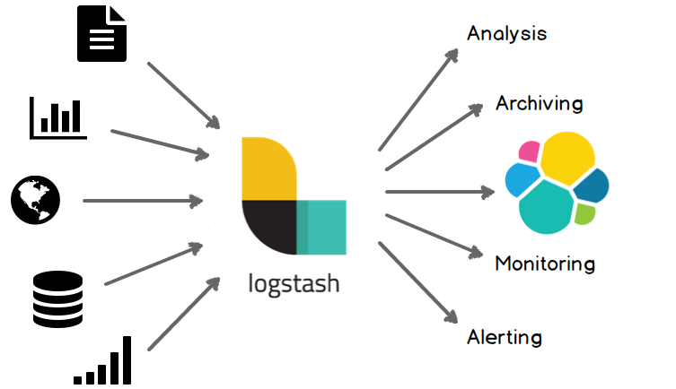
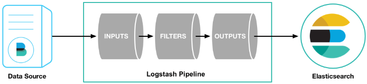
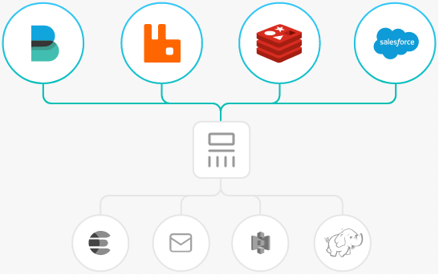
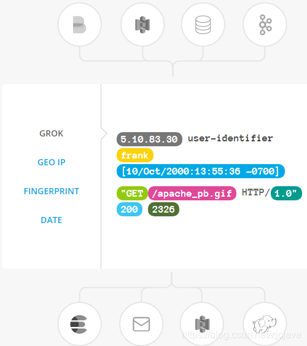
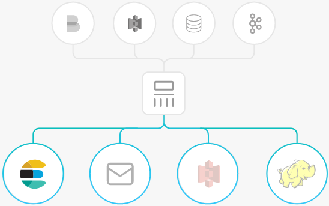

#### 目录

* [Logstash](#logstash)
* * [1.Logstash 介绍](#1logstash-介绍)
  * * [集中、转换和存储数据](#集中转换和存储数据)
  * [2. 安装 Logstash](#2-安装-logstash)
  * * [2.1 下载](#21-下载)
    * [2.2 HelloWord](#22-helloword)
    * [2.3 配置 Filebeat 来发送日志到 Logstash](#23-配置-filebeat-来发送日志到-logstash)
    * * [第一步：配置 filebeat.yml](#第一步配置-filebeatyml)
      * [第二步：在 logstash 下新建文件 `pipipeline.conf`](#第二步在-logstash-下新建文件-pipipelineconf)
      * [第三步：检查配置并启动 logstash](#第三步检查配置并启动-logstash)
      * [第四步：启动 filebeat](#第四步启动-filebeat)
    * [用 Grok 过滤器插件解析日志](#用-grok-过滤器插件解析日志)
    * [索引你的数据到 Elasticsearch](#索引你的数据到-elasticsearch)
  * [详解](#详解)
  * * [input 数据源](#input-数据源)
    * [数据过滤 filter](#数据过滤-filter)
    * [输出配置 output](#输出配置-output)

Logstash
--------

### 1.Logstash 介绍

Logstash 是一个开源数据收集引擎，具有实时管道功能。Logstash 可以动态地将来自不同数据源的数据统一起来，并将数据标准化到你所选择的目的地。



logstash 是一个数据分析软件，主要目的是分析 log 日志。整一套软件可以当作一个 MVC 模型，logstash 是 controller 层，Elasticsearch 是一个 model 层，kibana 是 view 层。



首先将数据传给 logstash，它将数据进行过滤和格式化（转成 JSON 格式），然后传给 Elasticsearch 进行存储、建搜索的索引，kibana 提供前端的页面再进行搜索和图表可视化，它是调用 Elasticsearch 的接口返回的数据进行可视化。logstash 和 Elasticsearch 是用 Java 写的，kibana 使用 node.js 框架。

它组要组成部分是数据输入，数据源过滤，数据输出三部分。

#### 集中、转换和存储数据

Logstash 是一个开源的服务器端数据处理管道，可以同时从多个数据源获取数据，并对其进行转换，然后将其发送到你最喜欢的 “存储”。（当然，我们最喜欢的是 Elasticsearch）

输入： **采集各种样式、大小和来源的数据**

数据往往以各种各样的形式，或分散或集中地存在于很多系统中。Logstash 支持各种输入选择 ，可以在同一时间从众多常用来源捕捉事件。能够以连续的流式传输方式，轻松地从您的日志、指标、Web 应用、数据存储以及各种 AWS 服务采集数据。



过滤器： **实时解析和转换数据**

Logstash 过滤器能够解析各个事件，识别已命名的字段以构建结构，并将它们转换成通用格式，以便更轻松、更快速地分析和实现商业价值。

Logstash 能够动态地转换和解析数据，不受格式或复杂度的影响：

* 利用 Grok 从非结构化数据中派生出结构
* 从 IP 地址破译出地理坐标
* 将 PII 数据匿名化，完全排除敏感字段
* 整体处理不受数据源、格式或架构的影响



输出： **选择你的存储，导出你的数据**

尽管 Elasticsearch 是我们的首选输出方向，能够为我们的搜索和分析带来无限可能，但它并非唯一选择。

Logstash 提供众多输出选择，您可以将数据发送到您要指定的地方，并且能够灵活地解锁众多下游用例。



### 2. 安装 Logstash

#### 2.1 下载

[下载地址](https://www.elastic.co/cn/downloads/past-releases#logstash)

#### 2.2 HelloWord

**运行**

在终端中，像下面这样运行命令来启动 Logstash 进程：

`# bin/logstash -e 'input{stdin{}}output{stdout{codec=>rubydebug}}'`

然后你会发现终端在等待你的输入。没问题，敲入 **Hello World**，回车，然后看看会返回什么结果！

**结果**

```
{
       "message" => "Hello World",
      "@version" => "1",
    "@timestamp" => "2014-08-07T10:30:59.937Z",
          "host" => "raochenlindeMacBook-Air.local",
}
```

搞定！

> 注意：这样启动只是临时的

#### 2.3 配置 Filebeat 来发送日志到 Logstash

在你创建 Logstash 管道之前，你需要先配置 Filebeat 来发送日志行到 Logstash。

Filebeat 客户端是一个轻量级的、资源友好的工具，它从服务器上的文件中收集日志，并将这些日志转发到你的 Logstash 实例以进行处理。
Filebeat 设计就是为了可靠性和低延迟。Filebeat 在主机上占用的资源很少，而且 Beats input 插件将对 Logstash 实例的资源需求降到最低。

##### 第一步：配置 filebeat.yml

```
filebeat.inputs:
- type: log
  paths:
    # 日志存放路径
    - /usr/local/programs/logstash/logstash-tutorial.log

output.logstash:
  hosts: ["localhost:5044"]
```

##### 第二步：在 logstash 下新建文件 `pipipeline.conf`

输入内容：

```
input {
    beats {
        port => "5044"
    }
}
output {
    stdout { codec => rubydebug }
}
```

> 说明：通常 Logstash 管理有三部分（输入、过滤器、输出），这里 input 下面 beats {port => “5044” } 的意思是用 Beats 输入插件，而 stdout { codec => rubydebug } 的意思是输出到控制台

##### 第三步：检查配置并启动 logstash

`bin/logstash -f conf/pipeline.conf --config.test_and_exit`

> 说明：
>
> -f 指定配置 (第二步生成的配置文件)
>
> –config.test_and_exit 选项的意思是解析配置文件并报告任何错误

`bin/logstash -f conf/pipeline.conf --config.reload.automatic`

> 说明：
>
> –config.reload.automatic 选项的意思是启用自动配置加载，以至于每次你修改完配置文件以后无需停止然后重启 Logstash

##### 第四步：启动 filebeat

`./filebeat -e -c filebeat.yml`

如果一切正常，你将会在 logstash 控制台看到日志输出

#### 用 Grok 过滤器插件解析日志

现在你有了一个工作管道，可以从 Filebeat 读取日志行。但是你可能已经注意到日志消息的格式并不理想。你想要解析日志消息，以便从日志中创建特定的、命名的字段。为此，您将使用 grok filter 插件。

grok 过滤器插件是 Logstash 中默认可用的几个插件之一。

grok 过滤器插件允许你将非结构化日志数据解析为结构化和可查询的数据。

因为 grok 过滤器插件在传入的日志数据中查找模式

**修改 pipeline.conf** 加入 `grok filter`

```
input {
    beats {
        port => "5044"
    }
}
filter {
    grok {
        match => { "message" => "(?m)^%{TIMESTAMP_ISO8601:timestamp}%{SPACE}%{NOTSPACE:loggerName}%{SPACE}-%{LOGLEVEL:logLevel}%{SPACE}%{SPACE}%{GREEDYDATA:message}"}
    
        #覆盖/重写参数（默认的message）
        overwrite => ["message"]
    }
    #可删
    mutate {
        convert => [ "request_time", "float"]
        add_field =>["response_time","%{request_time}"]
        convert => [ "response_time", "float"]
        add_field => [ "[@metadata][zabbix_key]" , "logstash-api-access" ]
        add_field => [ "[@metadata][zabbix_host]" , "dr-mysql01" ]
        add_field =>["messager","%{type}-%{message}"]
        remove_field =>["request_time"]
        remove_field =>["message"]
        # remove_field =>["messager"]
    }
}
output {
    stdout { codec => rubydebug }
}
```

在你保存完以后，因为你已经启动了自动加载配置，所以你不需要重启 Logstash 来应用你的修改。

#### 索引你的数据到 Elasticsearch

在之前的配置中，我们配置了 Logstash 输出到控制台，现在我们让它输出到 Elasticsearch 集群。

编辑 pipeline.conf 文件，替换 output 区域为：

```
output {
    elasticsearch {
        hosts => [ "localhost:9200" ]
        index => "lo-1212"
    }
}
```

在这段配置中，Logstash 用 http 协议连接到 Elasticsearch，而且假设 Logstash 和 Elasticsearch 允许在同一台机器上。你也可以指定一个远程的 Elasticsearch 实例，比如 host=>[“es-machine:9092”]

> 说明：
>
> hosts: Elasticsearch 地址
>
> index: Elasticsearch 索引名

重启后就可以在 Elasticsearch 中看到对应的索引数据

### 详解

#### input 数据源

input 及输入是指日志数据传输到 Logstash 中。其中常见的配置如下：

* file：从文件系统中读取一个文件，很像 UNIX 命令 “tail -0a”
* syslog：监听 514 端口，按照 RFC3164 标准解析日志数据
* redis：从 redis 服务器读取数据，支持 channel(发布订阅) 和 list 模式。redis 一般在 Logstash 消费集群中作为 "broker" 角色，保存 events 队列共 Logstash 消费。
* lumberjack：使用 lumberjack 协议来接收数据，目前已经改为 logstash-forwarder。

```
stdin { } # 从控制台中输入来源


file { # 从文件中来
        path => "E:/software/logstash-1.5.4/logstash-1.5.4/data/*" #单一文件
         #监听文件的多个路径
        path => ["E:/software/logstash-1.5.4/logstash-1.5.4/data/*.log","F:/*.log"]
        #排除不想监听的文件
        exclude => "1.log"
    
        #添加自定义的字段
        add_field => {"test"=>"test"}
        #增加标签
        tags => "tag1"

        #设置新事件的标志
        delimiter => "\n"

        #设置多长时间扫描目录，发现新文件
        discover_interval => 15
        #设置多长时间检测文件是否修改
        stat_interval => 1

         #监听文件的起始位置，默认是end
        start_position => beginning

        #监听文件读取信息记录的位置
        sincedb_path => "E:/software/logstash-1.5.4/logstash-1.5.4/test.txt"
        #设置多长时间会写入读取的位置信息
        sincedb_write_interval => 15
    }


 syslog { # 系统日志方式
  type => "system-syslog"  # 定义类型
   port => 10514    # 定义监听端口
 }


 beats { # filebeats方式
  port => 5044
 }
```

以上文件来源 file，syslog,beats 只能选择其中一种

> 注意：
>
> * 文件的路径名需要时绝对路径
> * 支持 globs 写法
> * 如果想要监听多个目标文件可以改成数组

**1. path**

path 是 file 中唯一必需的参数。其他都是可选参数

**2. exclude**

是不想监听的文件，logstash 会自动忽略该文件的监听。配置的规则与 path 类似，支持字符串或者数组，但是要求必须是绝对路径。

**3. start_position**

是监听的位置，默认是 end，即一个文件如果没有记录它的读取信息，则从文件的末尾开始读取，也就是说，仅仅读取新添加的内容。对于一些更新的日志类型的监听，通常直接使用 end 就可以了；相反，beginning 就会从一个文件的头开始读取。但是如果记录过文件的读取信息，这个配置也就失去作用了。

**4. sincedb_path**

这个选项配置了默认的读取文件信息记录在哪个文件中，默认是按照文件的 inode 等信息自动生成。其中记录了 inode、主设备号、次设备号以及读取的位置。因此，如果一个文件仅仅是重命名，那么它的 inode 以及其他信息就不会改变，因此也不会重新读取文件的任何信息。类似的，如果复制了一个文件，就相当于创建了一个新的 inode，如果监听的是一个目录，就会读取该文件的所有信息。

**5. 关于扫描和检测的时间**

按照默认的来就好了，如果频繁创建新的文件，想要快速监听，那么可以考虑缩短检测的时间。

**6. add_field**

就是增加一个字段，例如：

**7. tags**

用于增加一些标签，这个标签可能在后续的处理中起到标志的作用

#### 数据过滤 filter

Fillters 在 Logstash 处理链中担任中间处理组件。他们经常被组合起来实现一些特定的行为来，处理匹配特定规则的事件流。常见的 filters 如下：

* grok：解析无规则的文字并转化为有结构的格式。Grok 是目前最好的方式来将无结构的数据转换为有结构可查询的数据。有 120 多种匹配规则，会有一种满足你的需要。
* mutate：mutate filter 允许改变输入的文档，你可以从命名，删除，移动或者修改字段在处理事件的过程中。
* drop：丢弃一部分 events 不进行处理，例如：debug events。
* clone：拷贝 event，这个过程中也可以添加或移除字段。
* geoip：添加地理信息 (为前台 kibana 图形化展示使用)

它的主要作用就是把数据解析成规则的 json 键值对格式便于输出到其他组件中使用。

logstash 自带的文件正则支持 grok,date,geoip

```
filter {

  #定义数据的格式
  grok {
    match => { "message" => "%{DATA:timestamp}\|%{IP:serverIp}\|%{IP:clientIp}\|%{DATA:logSource}\|%{DATA:userId}\|%{DATA:reqUrl}\|%{DATA:reqUri}\|%{DATA:refer}\|%{DATA:device}\|%{DATA:textDuring}\|%{DATA:duringTime:int}\|\|"}
  }

 #定义时间戳的格式
  date {
    match => [ "timestamp", "yyyy-MM-dd-HH:mm:ss" ]
    locale => "cn"
  }

  #定义客户端的IP是哪个字段（上面定义的数据格式）
  geoip {
    source => "clientIp"
  }
}
```

#### 输出配置 output

outputs 是 logstash 处理管道的最末端组件。一个 event 可以在处理过程中经过多重输出，但是一旦所有的 outputs 都执行结束，这个 event 也就完成生命周期。一些常用的 outputs 包括：

* elasticsearch：如果你计划将高效的保存数据，并且能够方便和简单的进行查询.
* file：将 event 数据保存到文件中。
* graphite：将 event 数据发送到图形化组件中，一个很流行的开源存储图形化展示的组件。http://graphite.wikidot.com/。
* statsd：statsd 是一个统计服务，比如技术和时间统计，通过 udp 通讯，聚合一个或者多个后台服务，如果你已经开始使用 statsd，该选项对你应该很有用。

默认情况下将过滤扣的数据输出到 elasticsearch，当我们不需要输出到 ES 时需要特别声明输出的方式是哪一种，同时支持配置多个输出源

```
output {
  #将输出保存到elasticsearch，如果没有匹配到时间就不保存，因为日志里的网址参数有些带有换行
  if [timestamp] =~ /^\d{4}-\d{2}-\d{2}/ {
        elasticsearch { host => localhost }
  }

   #输出到stdout
#  stdout { codec => rubydebug }

#定义访问数据的用户名和密码
#  user => webService
#  password => 1q2w3e4r
}
```
