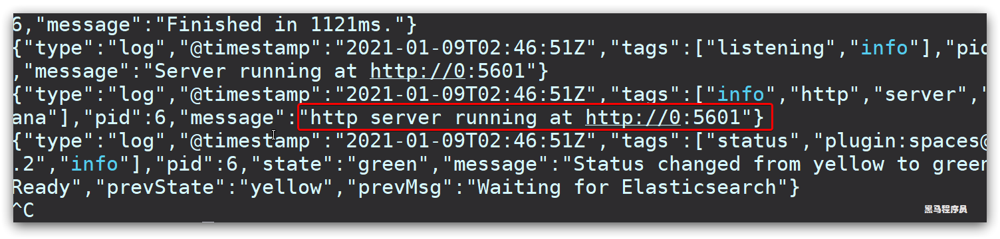
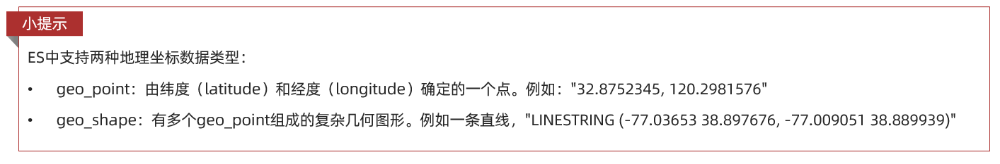

# [ES分布式搜索引擎](https://www.cnblogs.com/buchizicai/p/17093719.html)


<div style="border-left: 4px solid #ccc; padding-left: 10px; background-color: #f9f9f9;">
    注意： 在没有创建库的时候搜索，ES会创建一个库并自动创建该字段并且设置为String类型也就是text
</div>

## 什么是elasticsearch？

* 一个开源的分布式搜索引擎，可以用来实现搜索、日志统计、分析、系统监控等功能

## 什么是elastic stack（ELK）？

* 是以elasticsearch为核心的技术栈，包括beats、Logstash、kibana、elasticsearch

## 什么是Lucene？

* 是Apache的开源搜索引擎类库，提供了搜索引擎的核心API

elasticsearch是一款非常强大的开源搜索引擎，具备非常多强大功能，可以帮助我们从海量数据中快速找到需要的内容

## ELK技术栈


<div style="border-left: 4px solid #ccc; padding-left: 10px; background-color: #f9f9f9;">
    本文只使用了elasticsearch，以及kibana做可视化界面
</div>

elasticsearch结合kibana、Logstash、Beats，也就是elastic stack（ELK）。被广泛应用在日志数据分析、实时监控等领域：


而elasticsearch是elastic stack的核心，负责存储、搜索、分析数据。

## 2. 倒排索引

倒排索引的概念是基于MySQL这样的正向索引而言的。

### 2.1 正向索引


<div style="border-left: 4px solid #ccc; padding-left: 10px; background-color: #f9f9f9;">
    设置了索引的话挺快的，但要是模糊查询则就很慢！
</div>

那么什么是正向索引呢？例如给下表（tb_goods）中的id创建索引：


如果是根据id查询，那么直接走索引，查询速度非常快。

但如果是基于title做模糊查询，只能是逐行扫描数据，流程如下：

1）用户搜索数据，条件是title符合"%手机%"

2）逐行获取数据，比如id为1的数据

3）判断数据中的title是否符合用户搜索条件

4）如果符合则放入结果集，不符合则丢弃。回到步骤1

逐行扫描，也就是全表扫描，随着数据量增加，其查询效率也会越来越低。当数据量达到数百万时，就是一场灾难。

### 2.2 倒排索引

倒排索引中有两个非常重要的概念：

* 文档（`Document`）：用来搜索的数据，其中的每一条数据就是一个文档。例如一个网页、一个商品信息

* 词条（`Term`）：对文档数据或用户搜索数据，利用某种算法分词，得到的具备含义的词语就是词条。例如：我是中国人，就可以分为：我、是、中国人、中国、国人这样的几个词条

创建倒排索引是对正向索引的一种特殊处理，流程如下：

* 将每一个文档的数据利用算法分词，得到一个个词条

* 创建表，每行数据包括词条、词条所在文档id、位置等信息

* 因为词条唯一性，可以给词条创建索引，例如hash表结构索引

如图：


倒排索引的搜索流程如下（以搜索"华为手机"为例）：

1）用户输入条件"华为手机"进行搜索。

2）对用户输入内容分词，得到词条：华为、手机。

3）拿着词条在倒排索引中查找，可以得到包含词条的文档id：1、2、3。

4）拿着文档id到正向索引中查找具体文档。

如图：


虽然要先查询倒排索引，再查询正排索引，但是无论是词条、还是文档id都建立了索引，查询速度非常快！无需全表扫描。

### 正向和倒排对比

概念区别：

* 索引是最传统的，根据id索引的方式。但根据词条查询时，必须先逐条获取每个文档，然后判断文档中是否包含所需要的词条，是根据文档找词条的过程。

* 排索引则相反，是先找到用户要搜索的词条，根据词条得到保护词条的文档的id，然后根据id获取文档。是根据词条找文档的过程。

优缺点：

#### 正向索引:

* 优点：

    - 多个字段创建索引

    - 根据索引字段搜索、排序速度非常快

- 缺点：

    - 索引字段，或者索引字段中的部分词条查找时，只能全表扫描。

#### 倒排索引：

- 优点：

    * 根据词条搜索、模糊搜索时，速度非常快

- 缺点：

    * 只能给词条创建索引，而不是字段 

    - 无法根据字段做排序

## 3. ES数据库基本概念

elasticsearch中有很多独有的概念，与mysql中略有差别，但也有相似之处。

### 3.1.文档和字段

<div style="border-left: 4px solid #ccc; padding-left: 10px; background-color: #f9f9f9;">
    一个文档就像数据库里的一条数据，字段就像数据库里的列
</div>

elasticsearch是面向文档（Document）存储的，可以是数据库中的一条商品数据，一个订单信息。文档数据会被序列化为json格式后存储在elasticsearch中：


而Json文档中往往包含很多的字段（Field），类似于mysql数据库中的列。

### 3.2.索引和映射

<div style="border-left: 4px solid #ccc; padding-left: 10px; background-color: #f9f9f9;">
   索引就像数据库里的表，映射就像数据库中定义的表结构
</div>

索引（Index），就是相同类型的文档的集合【类似mysql中的表】

例如：

- 所有用户文档，就可以组织在一起，称为用户的索引；

- 所有商品的文档，可以组织在一起，称为商品的索引；

- 所有订单的文档，可以组织在一起，称为订单的索引；


因此，我们可以把索引当做是数据库中的表。

数据库的表会有约束信息，用来定义表的结构、字段的名称、类型等信息。因此，索引库中就有映射（mapping），是索引中文档的字段约束信息，类似表的结构约束。

### 3.3.mysql与elasticsearch

<div style="border-left: 4px solid #ccc; padding-left: 10px; background-color: #f9f9f9;">
各自长处：

- Mysql：擅长事务类型操作，可以确保数据的安全和一致性

- Elasticsearch：擅长海量数据的搜索、分析、计算
</div>

我们统一的把mysql与elasticsearch的概念做一下对比：


| MySQL | Elasticsearch |说明|
| --- | --- | --- |
|Table|Table|索引(index)，就是文档的集合，类似数据库的表(table)|
|Row|Document|文档（Document），就是一条条的数据，类似数据库中的行（Row），文档都是JSON格式|
|Column|Field|字段（Field），就是JSON文档中的字段，类似数据库中的列（Column）|
|Schema|Mapping|Mapping（映射）是索引中文档的约束，例如字段类型约束。类似数据库的表结构（Schema）|
|SQL|DSL|DSL是elasticsearch提供的JSON风格的请求语句，用来操作elasticsearch，实现CRUD|

在企业中，往往是两者结合使用：

- 对安全性要求较高的写操作，使用mysql实现

- 对查询性能要求较高的搜索需求，使用elasticsearch实现

- 两者再基于某种方式，实现数据的同步，保证一致性


## 4. 安装es、kibana、分词器

<div style="border-left: 4px solid #ccc; padding-left: 10px; background-color: #f9f9f9;">
分词器的作用是什么？

- 创建倒排索引时对文档分词
- 用户搜索时，对输入的内容分词

IK分词器有几种模式？

- ik_smart：智能切分，粗粒度
- ik_max_word：最细切分，细粒度

IK分词器如何拓展词条？如何停用词条？

- 利用config目录的IkAnalyzer.cfg.xml文件添加拓展词典和停用词典
- 在词典中添加拓展词条或者停用词条
</div>

### 4.1 部署单点es

#### 4.1.1.创建网络

因为我们还需要部署kibana容器，因此需要让es和kibana容器互联。这里先创建一个网络

```bash
docker network create es-net
```

#### 4.1.2.加载镜像

这里我们采用elasticsearch的7.12.1版本的镜像，这个镜像体积非常大，接近1G。不建议大家自己pull。

课前资料提供了镜像的tar包：


大家将其上传到虚拟机中，然后运行命令加载即可：

```bash
docker load -i es.tar
```

注意：同理还有kibana的tar包也需要这样做。

#### 4.1.3.运行

运行docker命令，部署单点es：

```bash
docker run -d \
	--name es \
    -e "ES_JAVA_OPTS=-Xms512m -Xmx512m" \
    -e "discovery.type=single-node" \
    -v es-data:/usr/share/elasticsearch/data \
    -v es-plugins:/usr/share/elasticsearch/plugins \
    --privileged \
    --network es-net \
    -p 9200:9200 \
    -p 9300:9300 \
elasticsearch:7.12.1
```

命令解释：

- -e "cluster.name=es-docker-cluster"：设置集群名称

- -e "http.host=0.0.0.0"：监听的地址，可以外网访问

- -e "ES_JAVA_OPTS=-Xms512m -Xmx512m"：内存大小

- -e "discovery.type=single-node"：非集群模式

- -v es-data:/usr/share/elasticsearch/data：挂载逻辑卷，绑定es的数据目录

- -v es-logs:/usr/share/elasticsearch/logs：挂载逻辑卷，绑定es的日志目录

- -v es-plugins:/usr/share/elasticsearch/plugins：挂载逻辑卷，绑定es的插件目录

- --privileged：授予逻辑卷访问权

- --network es-net ：加入一个名为es-net的网络中

- -p 9200:9200：端口映射配置

在浏览器中输入：http://192.168.194.131/:9200 即可看到elasticsearch的响应结果：


### 4.2.部署kibana

kibana可以给我们提供一个elasticsearch的可视化界面，便于我们学习。

#### 4.2.1.部署

**创建网络后，导入kibana压缩包，然后创建并启动相应容器。【和前面部署单点es一样做法】**

再运行docker命令，部署kibana

```bash
docker run -d \
--name kibana \
-e ELASTICSEARCH_HOSTS=http://es:9200 \
--network=es-net \
-p 5601:5601  \
kibana:7.12.1
```

- --network es-net ：加入一个名为es-net的网络中，与elasticsearch在同一个网络中

- -e ELASTICSEARCH_HOSTS=http://es:9200"： 设置elasticsearch的地址，因为kibana已经与elasticsearch在一个网络，因此可以用容器名直接访问elasticsearch

- -p 5601:5601：端口映射配置

kibana启动一般比较慢，需要多等待一会，可以通过命令：

```bash
docker logs -f kibana
```

查看运行日志，当查看到下面的日志，说明成功：



此时，在浏览器输入地址访问：http://192.168.194.131:5601， 即可看到结果如下图：


kibana左侧中提供了一个DevTools界面：


这个界面中可以编写DSL来操作elasticsearch。并且对DSL语句有自动补全功能。

### 4.3.安装IK分词器

#### 4.3.1.在线安装ik插件（较慢）

```bash
# 进入容器内部
docker exec -it elasticsearch /bin/bash

# 在线下载并安装
./bin/elasticsearch-plugin  install https://github.com/medcl/elasticsearch-analysis-ik/releases/download/v7.12.1/elasticsearch-analysis-ik-7.12.1.zip

#退出
exit
#重启容器
docker restart elasticsearch
```

#### 4.3.2.离线安装ik插件（推荐）

## 1）查看数据卷目录

安装插件需要知道elasticsearch的plugins目录位置，而我们用了数据卷挂载，因此需要查看elasticsearch的数据卷目录，通过下面命令查看:

```bash
docker volume inspect es-plugins
```

显示结果：

```json
[
    {
        "CreatedAt": "2022-05-06T10:06:34+08:00",
        "Driver": "local",
        "Labels": null,
        "Mountpoint": "/var/lib/docker/volumes/es-plugins/_data",
        "Name": "es-plugins",
        "Options": null,
        "Scope": "local"
    }
]
```

说明plugins目录被挂载到了：/var/lib/docker/volumes/es-plugins/_data 这个目录中。

## 2）解压缩分词器安装包

下面我们需要把课前资料中的ik分词器解压缩，重命名为ik


## 3）上传到es容器的插件数据卷中

也就是/var/lib/docker/volumes/es-plugins/_data：


## 4）重启容器

```bash
# 4、重启容器
docker restart es
# 查看es日志
docker logs -f es
```

## 5）测试：

IK分词器包含两种模式：

- ik_smart：最少切分

- ik_max_word：最细切分

在kibana的Dev tools中输入以下代码：

<div style="border-left: 4px solid #ccc; padding-left: 10px; background-color: #f9f9f9;">
”analyzer“ 就是选择分词器模式
</div>

```json
GET /_analyze
{
  "analyzer": "ik_max_word",
  "text": "黑马程序员学习java太棒了"
}
```

结果：

```json
{
  "tokens" : [
    {
      "token" : "黑马",
      "start_offset" : 0,
      "end_offset" : 2,
      "type" : "CN_WORD",
      "position" : 0
    },
    {
      "token" : "程序员",
      "start_offset" : 2,
      "end_offset" : 5,
      "type" : "CN_WORD",
      "position" : 1
    },
    {
      "token" : "程序",
      "start_offset" : 2,
      "end_offset" : 4,
      "type" : "CN_WORD",
      "position" : 2
    },
    {
      "token" : "员",
      "start_offset" : 4,
      "end_offset" : 5,
      "type" : "CN_CHAR",
      "position" : 3
    },
    {
      "token" : "学习",
      "start_offset" : 5,
      "end_offset" : 7,
      "type" : "CN_WORD",
      "position" : 4
    },
    {
      "token" : "java",
      "start_offset" : 7,
      "end_offset" : 11,
      "type" : "ENGLISH",
      "position" : 5
    },
    {
      "token" : "太棒了",
      "start_offset" : 11,
      "end_offset" : 14,
      "type" : "CN_WORD",
      "position" : 6
    },
    {
      "token" : "太棒",
      "start_offset" : 11,
      "end_offset" : 13,
      "type" : "CN_WORD",
      "position" : 7
    },
    {
      "token" : "了",
      "start_offset" : 13,
      "end_offset" : 14,
      "type" : "CN_CHAR",
      "position" : 8
    }
  ]
}
```

#### 4.3.3 扩展词词典

随着互联网的发展，“造词运动”也越发的频繁。出现了很多新的词语，在原有的词汇列表中并不存在。比如：“奥力给”，“白嫖” 等。

所以我们的词汇也需要不断的更新，IK分词器提供了扩展词汇的功能。

1）打开IK分词器config目录：


2）在IKAnalyzer.cfg.xml配置文件内容添加：

```xml
<?xml version="1.0" encoding="UTF-8"?>
<!DOCTYPE properties SYSTEM "http://java.sun.com/dtd/properties.dtd">
<properties>
        <comment>IK Analyzer 扩展配置</comment>
        <!--用户可以在这里配置自己的扩展字典 *** 添加扩展词典-->
        <entry key="ext_dict">ext.dic</entry>
</properties>
```

3）新建一个 ext.dic，可以参考config目录下复制一个配置文件进行修改

```ch
白嫖
奥力给
```

4）重启elasticsearch

```bash
docker restart es

# 查看 日志
docker logs -f elasticsearch
```


日志中已经成功加载ext.dic配置文件

5）测试效果：

```json
GET /_analyze
{
  "analyzer": "ik_max_word",
  "text": "欢迎来到我的博客！"
}
```

<div style="border-left: 4px solid #ccc; padding-left: 10px; background-color: #f9f9f9;">
注意当前文件的编码必须是 UTF-8 格式，严禁使用Windows记事本编辑
</div>

#### 4.3.4 停用词词典

在互联网项目中，在网络间传输的速度很快，所以很多语言是不允许在网络上传递的，如：关于宗教、政治等敏感词语，那么我们在搜索时也应该忽略当前词汇。

IK分词器也提供了强大的停用词功能，让我们在索引时就直接忽略当前的停用词汇表中的内容。

1）IKAnalyzer.cfg.xml配置文件内容添加：

```xml
<?xml version="1.0" encoding="UTF-8"?>
<!DOCTYPE properties SYSTEM "http://java.sun.com/dtd/properties.dtd">
<properties>
        <comment>IK Analyzer 扩展配置</comment>
        <!--用户可以在这里配置自己的扩展字典-->
        <entry key="ext_dict">ext.dic</entry>
         <!--用户可以在这里配置自己的扩展停止词字典  *** 添加停用词词典-->
        <entry key="ext_stopwords">stopword.dic</entry>
</properties>
```

3）在 stopword.dic 添加停用词

```ch
大帅逼
```

4）重启elasticsearch

```bash
# 重启服务
docker restart es
docker restart kibana

# 查看 日志
docker logs -f elasticsearch
```

日志中已经成功加载stopword.dic配置文件

5）测试效果：

```json
GET /_analyze
{
  "analyzer": "ik_max_word",
  "text": "我是真的会谢Java就业率超过95%,大帅逼都点赞白嫖,奥力给！"
}
```

<div style="border-left: 4px solid #ccc; padding-left: 10px; background-color: #f9f9f9;">
注意当前文件的编码必须是 UTF-8 格式，严禁使用Windows记事本编辑
</div>

# 索引库操作

索引库就类似数据库表，mapping映射就类似表的结构。

我们要向es中存储数据，必须先创建“库”和“表”。

## 1. Mapping映射属性

mapping是对索引库中文档的约束，常见的mapping属性包括：

- type：字段数据类型，常见的简单类型有：

    - 字符串：text（可分词的文本）、keyword（精确值，例如：品牌、国家、ip地址）

    - 数值：long、integer、short、byte、double、float、

    - 布尔：boolean

    - 日期：date

    - 对象：object

<div style="border-left: 4px solid #ccc; padding-left: 10px; background-color: #f9f9f9;">
keyword类型只能整体搜索，不支持搜索部分内容
</div>

- index：是否创建索引，默认为true

- analyzer：使用哪种分词器

- properties：该字段的子字段

例如下面的json文档：

```json
{
    "age": 21,
    "weight": 52.1,
    "isMarried": false,
    "info": "真相只有一个！",
    "email": "zy@itcast.cn",
    "score": [99.1, 99.5, 98.9],
    "name": {
        "firstName": "柯",
        "lastName": "南"
    }
}
```

对应的每个字段映射（mapping）：

- age：类型为 integer；参与搜索，因此需要index为true；无需分词器

- weight：类型为float；参与搜索，因此需要index为true；无需分词器

- isMarried：类型为boolean；参与搜索，因此需要index为true；无需分词器

- info：类型为字符串，需要分词，因此是text；参与搜索，因此需要index为true；分词器可以用ik_smart

- email：类型为字符串，但是不需要分词，因此是keyword；不参与搜索，因此需要index为false；无需分词器

- score：虽然是数组，但是我们只看元素的类型，类型为float；参与搜索，因此需要index为true；无需分词器

- name：类型为object，需要定义多个子属性

    - name.firstName；类型为字符串，但是不需要分词，因此是keyword；参与搜索，因此需要index为true；无需分词器

    - name.lastName；类型为字符串，但是不需要分词，因此是keyword；参与搜索，因此需要index为true；无需分词器

## 2. 索引库的CRUD

<div style="border-left: 4px solid #ccc; padding-left: 10px; background-color: #f9f9f9;">
CRUD简单描述：

- 创建索引库：PUT /索引库名
- 查询索引库：GET /索引库名
- 删除索引库：DELETE /索引库名
- 修改索引库（添加字段）：PUT /索引库名/_mapping
</div>

这里统一使用Kibana编写DSL的方式来演示。

### 2.1 创建索引库和映射

基本语法：

- 请求方式：PUT

- 请求路径：/索引库名，可以自定义

- 请求参数：mapping映射

格式：

```json
PUT /索引库名称
{
  "mappings": {
    "properties": {
      "字段名":{
        "type": "text",
        "analyzer": "ik_smart"
      },
      "字段名2":{
        "type": "keyword",
        "index": "false"
      },
      "字段名3":{
        "properties": {
          "子字段": {
            "type": "keyword"
          }
        }
      },
      // ...略
    }
  }
}
```

示例：

```json
PUT /conan
{
  "mappings": {
    "properties": {
      "column1":{
        "type": "text",
        "analyzer": "ik_smart"
      },
      "column2":{
        "type": "keyword",
        "index": "false"
      },
      "column3":{
        "properties": {
          "子字段1": {
            "type": "keyword"
          },
          "子字段2": {
            "type": "keyword"
          }
        }
      },
      // ...略
    }
  }
}
```

### 2.2 查询索引库

基本语法：

- 请求方式：GET

- 请求路径：/索引库名

- 请求参数：无

格式：

```json
GET /索引库名
```


### 2.3 修改索引库

这里的修改是只能增加新的字段到mapping中

倒排索引结构虽然不复杂，但是一旦数据结构改变（比如改变了分词器），就需要重新创建倒排索引，这简直是灾难。因此索引库**一旦创建，无法修改mapping。**

虽然无法修改mapping中已有的字段，但是却允许添加新的字段到mapping中，因为不会对倒排索引产生影响。

**语法说明：**

```json
PUT /索引库名/_mapping
{
  "properties": {
    "新字段名":{
      "type": "integer"
    }
  }
}
```

示例：


2.4 删除索引库

语法：

- 请求方式：DELETE

- 请求路径：/索引库名

- 请求参数：无

格式：

```json
DELETE /索引库名
```

在kibana中测试：


# 文档操作

<div style="border-left: 4px solid #ccc; padding-left: 10px; background-color: #f9f9f9;">
文档操作有哪些？

- 创建文档：POST /{索引库名}/_doc/文档id
- 查询文档：GET /{索引库名}/_doc/文档id
- 删除文档：DELETE /{索引库名}/_doc/文档id
- 修改文档：
- 全量修改：PUT /{索引库名}/_doc/文档id
- 增量修改：POST /{索引库名}/_update/文档id { "doc": {字段}}
</div>

## 1. 文档的CRUD

### 1.1 新增文档

语法：

```json
POST /索引库名/_doc/文档id
{
    "字段1": "值1",
    "字段2": "值2",
    "字段3": {
        "子属性1": "值3",
        "子属性2": "值4"
    },
    // ...
}
```

示例：

```json
POST /heima/_doc/1
{
    "info": "真相只有一个！",
    "email": "zy@itcast.cn",
    "name": {
        "firstName": "柯",
        "lastName": "南"
    }
}
```

响应：


### 1.2 查询文档

根据rest风格，新增是post，查询应该是get，不过查询一般都需要条件，这里我们把文档id带上。

语法：

```json
GET /{索引库名称}/_doc/{id}
//批量查询：查询该索引库下的全部文档
GET /{索引库名称}/_search
```

通过kibana查看数据：

```json
GET /heima/_doc/1
```

查看结果：


### 1.3 删除文档

删除使用DELETE请求，同样，需要根据id进行删除：

语法：

```json
DELETE /{索引库名}/_doc/id值
```

示例：

```json
# 根据id删除数据
DELETE /heima/_doc/1
```

结果：


### 1.4 修改文档

修改有两种方式：

- 全量修改：直接覆盖原来的文档

- 增量修改：修改文档中的部分字段

#### 1.4.1 全量修改

全量修改是覆盖原来的文档，其本质是：

- 根据指定的id删除文档

- 新增一个相同id的文档

注意：如果根据id删除时，id不存在，第二步的新增也会执行，也就从修改变成了新增操作了。

语法：

```json
PUT /{索引库名}/_doc/文档id
{
    "字段1": "值1",
    "字段2": "值2",
    // ... 略
}
```

示例：

```json
PUT /heima/_doc/1
{
    "info": "黑马程序员高级Java讲师",
    "email": "zy@itcast.cn",
    "name": {
        "firstName": "云",
        "lastName": "赵"
    }
}
```

#### 1.4.2 增量修改

增量修改是只修改指定id匹配的文档中的部分字段。

语法：

```json
POST /{索引库名}/_update/文档id
{
    "doc": {
         "字段名": "新的值",
    }
}
```

示例：

```json
POST /heima/_update/1
{
  "doc": {
    "email": "ZhaoYun@itcast.cn"
  }
}
```

# RestAPI

ES官方提供了各种不同语言的客户端，用来操作ES。这些客户端的本质就是组装DSL语句，通过http请求发送给ES。官方文档地址：https://www.elastic.co/guide/en/elasticsearch/client/index.html

其中的Java Rest Client又包括两种：

- Java Low Level Rest Client
- Java High Level Rest Client


我们使用的是Java HighLevel Rest Client客户端API

# API操作索引库

<div style="border-left: 4px solid #ccc; padding-left: 10px; background-color: #f9f9f9;">
JavaRestClient操作elasticsearch的流程基本类似。核心是client.indices()方法来获取索引库的操作对象。

索引库操作的基本步骤：【可以根据发送请求那步的第一个参数，发过来判断需要创建什么XXXXRequest】

- 初始化RestHighLevelClient
- 创建XxxIndexRequest。XXX是Create、Get、Delete
- 准备DSL（ Create时需要，其它是无参）
- 发送请求。调用RestHighLevelClient#indices().xxx()方法，xxx是create、exists、delete
</div>

## 1. mapping映射分析

<div style="border-left: 4px solid #ccc; padding-left: 10px; background-color: #f9f9f9;">
根据MySQL数据库表结构（建表语句），去写索引库结构JSON。表和索引库一一对应

注意：地理坐标、组合字段。索引库里的地理坐标是一个字段：坐标：维度,精度 。copy_to组合字段作用是供用户查询（输入关键字可以查询多个字段）
</div>

创建索引库，最关键的是mapping映射，而mapping映射要考虑的信息包括：

- 字段名

- 字段数据类型

- 是否参与搜索

- 是否需要分词

- 如果分词，分词器是什么？

其中：

- 字段名、字段数据类型，可以参考数据表结构的名称和类型

- 是否参与搜索要分析业务来判断，例如图片地址，就无需参与搜索

- 是否分词呢要看内容，内容如果是一个整体就无需分词，反之则要分词

- 分词器，我们可以统一使用ik_max_word

来看下酒店数据的索引库结构:

```json
PUT /hotel
{
  "mappings": {
    "properties": {
      "id": {
        "type": "keyword"
      },
      "name":{
        "type": "text",
        "analyzer": "ik_max_word",
        "copy_to": "all"
      },
      "address":{
        "type": "keyword",
        "index": false
      },
      "price":{
        "type": "integer"
      },
      "score":{
        "type": "integer"
      },
      "brand":{
        "type": "keyword",
        "copy_to": "all"
      },
      "city":{
        "type": "keyword",
        "copy_to": "all"
      },
      "starName":{
        "type": "keyword"
      },
      "business":{
        "type": "keyword"
      },
      "location":{
        "type": "geo_point"
      },
      "pic":{
        "type": "keyword",
        "index": false
      },
      "all":{
        "type": "text",
        "analyzer": "ik_max_word"
      }
    }
  }
}
```

几个特殊字段说明：

- location：地理坐标，里面包含精度、纬度

- all：一个组合字段，其目的是将多字段的值 利用
copy_to合并，提供给用户搜索

地理坐标说明：



copy_to说明：


## 2.初始化RestClient

在elasticsearch提供的API中，与elasticsearch一切交互都封装在一个名为RestHighLevelClient的类中，必须先完成这个对象的初始化，建立与elasticsearch的连接。

分为三步：

1）引入es的RestHighLevelClient依赖：

```xml
<dependency>
    <groupId>org.elasticsearch.client</groupId>
    <artifactId>elasticsearch-rest-high-level-client</artifactId>
</dependency>
```

2）因为SpringBoot默认的ES版本是7.6.2，所以我们需要覆盖默认的ES版本：

```xml
<properties>
    <java.version>1.8</java.version>
    <elasticsearch.version>7.12.1</elasticsearch.version>
</properties>
```

3）初始化RestHighLevelClient：这里一般在启动类或者配置类里注入该Bean，用于告诉Java 访问ES的ip地址

初始化的代码如下：

```java
@Bean
public RestHighLevelClient client(){
    return new RestHighLevelClient(RestClient.builder(
        HttpHost.create("http://192.168.150.101:9200")
	));
}
```

这里为了单元测试方便，我们创建一个测试类HotelIndexTest，然后将初始化的代码编写在@BeforeEach方法中：


```xml
package cn.itcast.hotel;

import org.apache.http.HttpHost;
import org.elasticsearch.client.RestHighLevelClient;
import org.junit.jupiter.api.AfterEach;
import org.junit.jupiter.api.BeforeEach;
import org.junit.jupiter.api.Test;

import java.io.IOException;

public class HotelIndexTest {
    private RestHighLevelClient client;

    @BeforeEach
    void setUp() {
        this.client = new RestHighLevelClient(RestClient.builder(
                HttpHost.create("http://192.168.150.101:9200")
        ));
    }

    @AfterEach
    void tearDown() throws IOException {
        this.client.close();
    }
}
```

## 3. 索引库CRUD

### 3.1 创建索引库

代码分为三步：

1）创建Request对象。因为是创建索引库的操作，因此Request是CreateIndexRequest。
2）添加请求参数，其实就是DSL的JSON参数部分。因为json字符串很长，这里是定义了静态字符串常量MAPPING_TEMPLATE，让代码看起来更加优雅。
3）发送请求，client.indices()方法的返回值是IndicesClient类型，封装了所有与索引库操作有关的方法。

创建索引库的API如下：


# ES搜索引擎

elasticsearch的查询依然是基于JSON风格的DSL来实现的。

## 1. DSL设置查询条件

### 1.1 DSL查询分类

Elasticsearch提供了基于JSON的DSL（Domain Specific Language）来定义查询。常见的查询类型包括：

- 查询所有：查询出所有数据，一般测试用。例如：match_all

- 全文检索（full text）查询：利用分词器对用户输入内容分词，然后去倒排索引库中匹配。例如：

  - match_query
  - multi_match_query

-精确查询：根据精确词条值查找数据，一般是查找keyword、数值、日期、boolean等类型字段。例如：

  - ids

  - range

  - term

- 地理（geo）查询：根据经纬度查询。例如：

  - geo_distance

  - geo_bounding_box

- 复合（compound）查询：复合查询可以将上述各种查询条件组合起来，合并查询条件。例如：

  - bool

  - function_score

查询的语法基本一致：

```json
GET /indexName/_search
{
  "query": {
    "查询类型": {
      "查询条件": "条件值"
    }
  }
}
```

我们以查询所有为例，其中：

- 查询类型为match_all

- 没有查询条件

```json
// 查询所有
GET /indexName/_search
{
  "query": {
    "match_all": {
    }
  }
}
```

其它查询无非就是**查询类型、查询条件**的变化。

### 1.2 全文检索查询

match和multi_match的区别是什么？

- match：根据一个字段查询【推荐：使用copy_to构造all字段】

- multi_match：根据多个字段查询，参与查询字段越多，查询性能越差

注：搜索字段越多，对查询性能影响越大，因此建议采用copy_to，然后单字段查询的方式。

#### 1.2.1 使用场景

全文检索查询的基本流程如下：

- 对用户搜索的内容做分词，得到词条

- 根据词条去倒排索引库中匹配，得到文档id

- 根据文档id找到文档，返回给用户

比较常用的场景包括：

- 商城的输入框搜索

- 百度输入框搜索

例如京东：


因为是拿着词条去匹配，因此参与搜索的字段也必须是可分词的text类型的字段。

常见的全文检索查询包括：

- match查询：单字段查询

- multi_match查询：多字段查询，任意一个字段符合条件就算符合查询条件

#### 1.2.2 match查询

match查询语法如下：

```json
GET /indexName/_search
{
  "query": {
    "match": {
      "FIELD": "TEXT"
    }
  }
}
```

match查询示例：


#### 1.2.3 mulit_match查询

mulit_match语法如下：

```json
GET /indexName/_search
{
  "query": {
    "multi_match": {
      "query": "TEXT",
      "fields": ["FIELD1", " FIELD12"]
    }
  }
}
```

multi_match查询示例：


## 1.3 精准查询

精准查询类型：

- term查询：根据词条精确匹配，一般搜索keyword类型、数值类型、布尔类型、日期类型字段

- range查询：根据数值范围查询，可以是数值、日期的范围

精确查询一般是查找keyword、数值、日期、boolean等类型字段。所以不会对搜索条件分词。常见的有：

- term：根据词条精确值查询

- range：根据值的范围查询

#### 1.3.1 term查询

因为精确查询的字段搜时不分词的字段，因此查询的条件也必须是不分词的词条。查询时，用户输入的内容跟自动值完全匹配时才认为符合条件。如果用户输入的内容过多，反而搜索不到数据。

语法说明：

```json
// term查询
GET /indexName/_search
{
  "query": {
    "term": {
      "FIELD": {
        "value": "VALUE"
      }
    }
  }
}
```

示例：

当我搜索的是精确词条时，能正确查询出结果：


但是，当我搜索的内容不是词条，而是多个词语形成的短语时，反而搜索不到：


#### 1.3.2 range查询

范围查询，一般应用在对数值类型做范围过滤的时候。比如做价格范围过滤。

基本语法：

```json
// range查询
GET /indexName/_search
{
  "query": {
    "range": {
      "FIELD": {
        "gte": 10, // 这里的gte代表大于等于，gt则代表大于
        "lte": 20 // lte代表小于等于，lt则代表小于
      }
    }
  }
}
```

示例：


### 1.4 地理坐标查询

所谓的地理坐标查询，其实就是根据经纬度查询，官方文档：https://www.elastic.co/guide/en/elasticsearch/reference/current/geo-queries.html

常见的使用场景包括：

- 携程：搜索我附近的酒店

- 滴滴：搜索我附近的出租车

- 微信：搜索我附近的人

近的酒店：


附近的车：


#### 1.4.1 矩形范围查询

很少有业务有这种需求

矩形范围查询，也就是geo_bounding_box查询，查询坐标落在某个矩形范围的所有文档：


查询时，需要指定矩形的左上、右下两个点的坐标，然后画出一个矩形，落在该矩形内的都是符合条件的点。

语法如下：

```json
// geo_bounding_box查询
GET /indexName/_search
{
  "query": {
    "geo_bounding_box": {
      "FIELD": {
        "top_left": { // 左上点
          "lat": 31.1,
          "lon": 121.5
        },
        "bottom_right": { // 右下点
          "lat": 30.9,
          "lon": 121.7
        }
      }
    }
  }
}
```

#### 1.4.2 附近(圆形)查询

附近查询，也叫做距离查询（geo_distance）：查询到指定中心点小于某个距离值的所有文档。

换句话来说，在地图上找一个点作为圆心，以指定距离为半径，画一个圆，落在圆内的坐标都算符合条件：


语法说明：

```json
// geo_distance 查询
GET /indexName/_search
{
  "query": {
    "geo_distance": {
      "distance": "15km", // 半径
      "FIELD": "31.21,121.5" // 圆心
    }
  }
}
```

示例：

我们先搜索陆家嘴附近15km的酒店：


发现共有47家酒店。

### 1.5 复合查询

复合（compound）查询：复合查询可以将其它简单查询组合起来，实现更复杂的搜索逻辑。常见的有两种：

- fuction score：算分函数查询，可以控制文档相关性算分，控制文档排名

- bool query：布尔查询，利用逻辑关系组合多个其它的查询，实现复杂搜索

#### 1.5.0 复合查询归纳

```json
GET /hotel/_search
{
  "query": {
    "function_score": {           
      "query": { // 原始查询，可以是任意条件
          "bool": {
              "must": [
                  {"term": {"city": "上海" }}
              ],
              "should": [
                  {"term": {"brand": "皇冠假日" }},
                  {"term": {"brand": "华美达" }}
              ],
              "must_not": [
                  { "range": { "price": { "lte": 500 } }}
              ],
              "filter": [
                  { "range": {"score": { "gte": 45 } }}
              ]
          }
      },
      "functions": [ // 算分函数
        {
          "filter": { // 满足的条件，品牌必须是如家【品牌是如家的才加分，这里是加分条件】
            "term": {
              "brand": "如家"
            }
          },
          "weight": 2 // 算分权重为2
        }
      ],
      "boost_mode": "sum" // 加权模式，求和
    }
  }  
}
```

#### 1.5.1 相关性算分

elasticsearch会根据词条和文档的相关度做打分，算法由两种：

- TF-IDF算法

- BM25算法，elasticsearch5.1版本后采用的算法

当我们利用match查询时，文档结果会根据与搜索词条的关联度打分（_score），返回结果时按照分值降序排列。

例如，我们搜索 "虹桥如家"，结果如下：

```json
[
  {
    "_score" : 17.850193,
    "_source" : {
      "name" : "虹桥如家酒店真不错",
    }
  },
  {
    "_score" : 12.259849,
    "_source" : {
      "name" : "外滩如家酒店真不错",
    }
  },
  {
    "_score" : 11.91091,
    "_source" : {
      "name" : "迪士尼如家酒店真不错",
    }
  }
]
```

在elasticsearch中，早期使用的打分算法是TF-IDF算法，公式如下：


在后来的5.1版本升级中，elasticsearch将算法改进为BM25算法，公式如下：


TF-IDF算法有一个缺陷，就是词条频率越高，文档得分也会越高，单个词条对文档影响较大。而BM25则会让单个词条的算分有一个上限，曲线更加平滑：


#### 1.5.2 算分函数查询

在搜索出来的结果的分数基础上，再手动与指定的数字进行一定运算来改变算分，从而改变结果的排序。

function score query定义的三要素是什么？

- 过滤条件：哪些文档要加分

- 算分函数：如何计算function score

- 加权方式：function score 与 query score如何运算

根据相关度打分是比较合理的需求，但合理的不一定是产品经理需要的。

以百度为例，你搜索的结果中，并不是相关度越高排名越靠前，而是谁掏的钱多排名就越靠前。如图：


要想认为控制相关性算分，就需要利用elasticsearch中的function score 查询了。

function score 查询

##### 1）语法说明


function score 查询中包含四部分内容：

- **原始查询**条件：query部分，基于这个条件搜索文档，并且基于BM25算法给文档打分，原始算分（query score)

- **过滤条件**：filter部分，符合该条件的文档才会重新算分

- **算分函数**：符合filter条件的文档要根据这个函数做运算，得到的**函数算分**（function score），有四种函数

  - weight：函数结果是常量

  - field_value_factor：以文档中的某个字段值作为函数结果

  - random_score：以随机数作为函数结果

  - script_score：自定义算分函数算法

- **运算模式**：算分函数的结果、原始查询的相关性算分，两者之间的运算方式，包括：

  - multiply：相乘

  - replace：用function score替换query score

  - 其它，例如：sum、avg、max、min

function score的运行流程如下：

- 1）根据原始条件查询搜索文档，并且计算相关性算分，称为原始算分（query score）

- 2）根据过滤条件，过滤文档

- 3）符合过滤条件的文档，基于算分函数运算，得到函数算分（function score）

- 4）将原始算分（query score）和函数算分（function score）基于运算模式做运算，得到最终结果，作为相关性算分。

##### 2）举例

需求：给“如家”这个品牌的酒店排名靠前一些

翻译一下这个需求，转换为之前说的四个要点：

- 原始条件：不确定，可以任意变化

- 过滤条件：brand = "如家"

- 算分函数：可以简单粗暴，直接给固定的算分结果，weight

- 运算模式：比如求和

因此最终的DSL语句如下：

```json
GET /hotel/_search
{
  "query": {
    "function_score": {
      "query": {  .... }, // 原始查询，可以是任意条件
      "functions": [ // 算分函数
        {
          "filter": { // 满足的条件，品牌必须是如家【品牌是如家的才加分，这里是加分条件】
            "term": {
              "brand": "如家"
            }
          },
          "weight": 2 // 算分权重为2
        }
      ],
      "boost_mode": "sum" // 加权模式，求和
    }
  }
}
```

测试，在未添加算分函数时，如家得分如下：


添加了算分函数后，如家得分就提升了：


#### 1.5.3 布尔查询

布尔查询是一个或多个查询子句的组合，每一个子句就是一个子查询。子查询的组合方式有：

- must：必须匹配每个子查询，类似“与”

- should：选择性匹配子查询，类似“或”

- must_not：必须不匹配，不参与算分，类似“非”

- filter：必须匹配，不参与算分

注意：尽量在筛选的时候多使用不参与算分的must_not和filter，以保证性能良好

比如在搜索酒店时，除了关键字搜索外，我们还可能根据品牌、价格、城市等字段做过滤：


每一个不同的字段，其查询的条件、方式都不一样，必须是多个不同的查询，而要组合这些查询，就必须用bool查询了。

需要注意的是，搜索时，参与**打分的字段越多，查询的性能也越差**。因此这种多条件查询时，建议这样做：

- 搜索框的关键字搜索，是全文检索查询，使用must查询，参与算分

- 其它过滤条件，采用filter查询。不参与算分

bool查询

##### 1）语法

```json
GET /hotel/_search
{
  "query": {
    "bool": {
      "must": [
        {"term": {"city": "上海" }}
      ],
      "should": [
        {"term": {"brand": "皇冠假日" }},
        {"term": {"brand": "华美达" }}
      ],
      "must_not": [
        { "range": { "price": { "lte": 500 } }}
      ],
      "filter": [
        { "range": {"score": { "gte": 45 } }}
      ]
    }
  }
}
```

##### 2）示例

需求：搜索名字包含“如家”，价格不高于400，在坐标31.21,121.5周围10km范围内的酒店。

分析：

- 名称搜索，属于全文检索查询，应该参与算分。放到must中

- 价格不高于400，用range查询，属于过滤条件，不参与算分。放到must_not中

- 周围10km范围内，用geo_distance查询，属于过滤条件，不参与算分。放到filter中


## 2. 设置搜索结果

搜索的结果可以按照用户指定的方式去处理或展示。

2.0 搜索结果种类

查询的DSL是一个大的JSON对象，包含下列属性：

- query：查询条件

- from和size：分页条件

- sort：排序条件

- highlight：高亮条件

- aggs：定义聚合

示例：


### 2.1 排序

在使用排序后就不会进行算分了，根据排序设置的规则排列

普通字段是根据字典序排序

地理坐标是根据举例远近排序

#### 2.1.1普通字段排序

keyword、数值、日期类型排序的排序语法基本一致。

语法：

排序条件是一个数组，也就是可以写多个排序条件。按照声明的顺序，当第一个条件相等时，再按照第二个条件排序，以此类推
（可以参考下面的图片案例）

```json
GET /indexName/_search
{
  "query": {
    "match_all": {}
  },
  "sort": [
    {
      "FIELD": "desc"  // 排序字段、排序方式ASC、DESC
    }
  ]
}
```

示例：

需求描述：酒店数据按照用户评价（score)降序排序，评价相同的按照价格(price)升序排序


#### 2.1.2 地理坐标排序

地理坐标排序略有不同。

**语法说明：**

```json
GET /indexName/_search
{
  "query": {
    "match_all": {}
  },
  "sort": [
    {
      "_geo_distance" : {
          "FIELD" : "纬度，经度", // 文档中geo_point类型的字段名、目标坐标点
          "order" : "asc", // 排序方式
          "unit" : "km" // 排序的距离单位
      }
    }
  ]
}
```

这个查询的含义是：

- 指定一个坐标，作为目标点

- 计算每一个文档中，指定字段（必须是geo_point类型）的坐标 到目标点的距离是多少

- 根据距离排序
示例：

需求描述：实现对酒店数据按照到你的位置坐标的距离升序排序

提示：获取你的位置的经纬度的方式：https://lbs.amap.com/demo/jsapi-v2/example/map/click-to-get-lnglat/

假设我的位置是：31.034661，121.612282，寻找我周围距离最近的酒店。


### 2.2 分页

elasticsearch会禁止from+ size 超过10000的请求

elasticsearch 默认情况下只返回top10的数据。而如果要查询更多数据就需要修改分页参数了。elasticsearch中通过修改from、size参数来控制要返回的分页结果：

- from：从第几个文档开始

- size：总共查询几个文档

类似于mysql中的limit ?, ?

#### 2.2.1 基本分页

分页的基本语法如下：

```json
GET /hotel/_search
{
  "query": {
    "match_all": {}
  },
  "from": 0, // 分页开始的位置，默认为0
  "size": 10, // 期望获取的文档总数
  "sort": [
    {"price": "asc"}
  ]
}
```

#### 2.2.2 深度分页

原理：elasticsearch内部分页时，必须先查询 0~1000条，然后截取其中的990 ~ 1000的这10条

现在，我要查询990~1000的数据，查询逻辑要这么写：

```json
GET /hotel/_search
{
  "query": {
    "match_all": {}
  },
  "from": 990, // 分页开始的位置，默认为0
  "size": 10, // 期望获取的文档总数
  "sort": [
    {"price": "asc"}
  ]
}
```

这里是查询990开始的数据，也就是 第990~第1000条 数据。

**集群情况的深度分页**

针对深度分页，ES提供了两种解决方案，官方文档：

- search after：分页时需要排序，原理是从上一次的排序值开始，查询下一页数据。【官方推荐】

- scroll：原理将排序后的文档id形成快照，保存在内存。

不过，elasticsearch内部分页时，必须先查询 0~1000条，然后截取其中的990 ~ 1000的这10条：


查询TOP1000，如果es是单点模式，这并无太大影响。

但是elasticsearch将来一定是集群，例如我集群有5个节点，我要查询TOP1000的数据，并不是每个节点查询200条就可以了。

因为节点A的TOP200，在另一个节点可能排到10000名以外了。

因此要想获取整个集群的TOP1000，必须先查询出每个节点的TOP1000，汇总结果后，重新排名，重新截取TOP1000。


那如果我要查询9900~10000的数据呢？是不是要先查询TOP10000呢？那每个节点都要查询10000条？汇总到内存中？

当查询分页深度较大时，汇总数据过多，对内存和CPU会产生非常大的压力，因此**elasticsearch会禁止from+ size 超过10000的请求。**

### 2.3 高亮

注意：

- 高亮是对关键字高亮，因此**搜索条件必须带有关键字**，而不能是范围这样的查询。

- 默认情况下，**高亮的字段，必须与搜索指定的字段一致**，否则无法高亮

- 如果要对非搜索字段高亮，则需要添加一个属性：required_field_match=false

使用场景：在百度等搜索后，会对结果中出现搜索字段的部分进行高亮处理。

高亮原理

高亮显示的实现分为两步：

- 1）给文档中的所有关键字都添加一个标签，例如<em>标签

- 2）页面给<em>标签编写CSS样式

##### 实现高亮

##### 1）语法

```json
GET /hotel/_search
{
  "query": {
    "match": {
      "FIELD": "TEXT" // 查询条件，高亮一定要使用全文检索查询
    }
  },
  "highlight": {
    "fields": { // 指定要高亮的字段
      "FIELD": { //【要和上面的查询字段FIELD一致】
        "pre_tags": "<em>",  // 用来标记高亮字段的前置标签
        "post_tags": "</em>" // 用来标记高亮字段的后置标签
      }
    }
  }
}
```

##### 2）示例：组合字段all的案例


### 2.4 数据聚合

类似于mysql中的**【度量（Metric）聚合】**聚合语句实现AVG，MAX，MIN；以及【桶（Bucket）聚合】GroupBy实现分组

**聚合（aggregations）**可以让我们极其方便的实现对数据的统计、分析、运算。例如：

- 什么品牌的手机最受欢迎？

- 这些手机的平均价格、最高价格、最低价格？

- 这些手机每月的销售情况如何？

实现这些统计功能的比数据库的sql要方便的多，而且查询速度非常快，可以实现近实时搜索效果。

aggs代表聚合，与query同级，此时query的作用是？

- 限定聚合的的文档范围

聚合必须的三要素：

- 聚合名称

- 聚合类型

- 聚合字段

聚合可配置属性有：

- size：指定聚合结果数量

- order：指定聚合结果排序方式

- field：指定聚合字段

#### 2.4.1 聚合种类

注意：参加聚合的字段必须是keyword、日期、数值、布尔类型

聚合常见的有三类：

- 桶（Bucket）聚合：用来对文档做分组

  - TermAggregation：按照文档字段值分组，例如按照品牌值分组、按照国家分组
  
  - Date Histogram：按照日期阶梯分组，例如一周为一组，或者一月为一组

- 度量（Metric）聚合：用以计算一些值，比如：最大值、最小值、平均值等

  - Avg：求平均值

  - Max：求最大值

  - Min：求最小值

  - Stats：同时求max、min、avg、sum等

- 管道（pipeline）聚合：其它聚合的结果为基础做聚合

如：用桶聚合实现种类排序，然后使用度量聚合实现各个桶的最大值、最小值、平均值等

#### 2.4.2 桶(Bucket)聚合

以统计酒店品牌种类，并对其进行数据分组

```json
GET /hotel/_search
{
  "query": { //限定要聚合的文档范围，只要添加query条件【一般在没搜索关键字时不写query】
    "range": {
      "price": {
        "lte": 200 // 只对200元以下的文档聚合
      }
    }
  }, 
  "size": 0,  // 设置size为0，结果中不包含查询结果文档，只包含聚合结果
  "aggs": { // 定义聚合
    "brandAgg": { //给聚合起个名字
      "terms": { // 聚合的类型，按照品牌值聚合，所以选择term
        "field": "brand", // 参与聚合的字段
        "order": {
          "doc_count": "asc" // 对聚合结果按照doc_count升序排列
        },
        "size": 20 // 希望获取的聚合结果数量【设置多少就最多只显示多少】
      }
    }
  }
}
```

 

#### 2.4.3 度量(Metric) and 管道(pipeline)聚合

度量聚合很少单独使用，一般是和桶聚合一并结合使用

我们对酒店按照品牌分组，形成了一个个桶。现在我们需要对桶内的酒店做运算，获取每个品牌的用户评分的min、max、avg等值。

这就要用到Metric聚合了，例如stat聚合：就可以获取min、max、avg等结果。

语法如下：

这次的score_stats聚合是在brandAgg的聚合内部嵌套的子聚合。因为我们需要在每个桶分别计算。

```json
GET /hotel/_search
{
  "size": 0, 
  "aggs": {
    "brandAgg": { 
      "terms": { 
        "field": "brand", 
        "order": {
          "scoreAgg.avg": "desc" // 对聚合结果按照指定字段降序排列
        },
        "size": 20
      },
      "aggs": { // 是brands聚合的子聚合，也就是分组后对每组分别计算
        "score_stats": { // 聚合名称
          "stats": { // 聚合类型，这里stats可以计算min、max、avg等
            "field": "score" // 聚合字段，这里是score
          }
        }
      }
    }
  }
}
```

另外，我们还可以给聚合结果做个排序，例如按照每个桶的酒店平均分做排序：


## 3. RestClient查询文档

文档的查询同样适用昨天学习的 RestHighLevelClient对象，基本步骤包括：

- 1）准备Request对象

- 2）准备请求参数

- 3）发起请求

- 4）解析响应

### 3.1 快速入门

查询的基本步骤是：

1. 创建SearchRequest对象

2. 准备Request.source()，也就是DSL。

  ① QueryBuilders来构建查询条件

  ② 传入Request.source() 的 query() 方法

3. 发送请求，得到结果

4. 解析结果（参考JSON结果，从外到内，逐层解析）