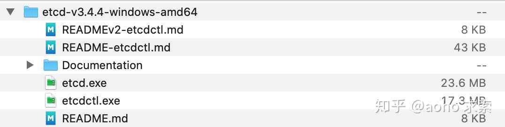

# [彻底搞懂 etcd 系列文章（二）：etcd 的多种安装姿势](https://zhuanlan.zhihu.com/p/144056143)

## 1 etcd 安装与使用

在上一篇主要介绍了 etcd 的相关概念和使用场景，本篇主要介绍 etcd 的多种安装使用方式。

### 1.1 etcd 概念词汇表

在开始 etcd 的安装使用之前，我们先了解下 etcd 的概念词汇表，以便于下文的理解。

- Raft：etcd所采用的保证分布式系统强一致性的算法。
- Node：一个Raft状态机实例。
- Member： 一个etcd实例。它管理着一个Node，并且可以为客户端请求提供服务。
- Cluster：由多个Member构成可以协同工作的etcd集群。
- Peer：对同一个etcd集群中另外一个Member的称呼。
- Client： 向etcd集群发送HTTP请求的客户端。
- WAL：预写式日志，etcd用于持久化存储的日志格式。
- snapshot：etcd防止WAL文件过多而设置的快照，存储etcd数据状态。
- Proxy：etcd的一种模式，为etcd集群提供反向代理服务。
- Leader：Raft算法中通过竞选而产生的处理所有数据提交的节点。
- Follower：竞选失败的节点作为Raft中的从属节点，为算法提供强一致性保证。
- Candidate：当Follower超过一定时间接收不到Leader的心跳时转变为Candidate开始竞选。
- Term：某个节点成为Leader到下一次竞选时间，称为一个Term。
- Index：数据项编号。Raft中通过Term和Index来定位数据。

## 2 etcd 单机安装部署

etcd 的安装有多种方式，以 Centos 7 和 MacOS 10.15 为例，可以通过 yum install etcd 和 brew install etcd进行安装。

然而通过系统工具安装的 etcd 版本比较滞后，如果需要安装最新版本的 etcd ，我们可以通过二进制包、源码编译以及 docker 容器安装。

### 2.1 二进制安装

目前最新的 etcd 版本为 3.4.4。在 macOS 下，执行如下的脚本：

```bash
ETCD_VER=v3.4.4
GITHUB_URL=https://github.com/etcd-io/etcd/releases/download
DOWNLOAD_URL=${GITHUB_URL}

rm -f /tmp/etcd-${ETCD_VER}-darwin-amd64.zip
rm -rf /tmp/etcd-download-test && mkdir -p /tmp/etcd-download-test

curl -L ${DOWNLOAD_URL}/${ETCD_VER}/etcd-${ETCD_VER}-darwin-amd64.zip -o /tmp/etcd-${ETCD_VER}-darwin-amd64.zip
unzip /tmp/etcd-${ETCD_VER}-darwin-amd64.zip -d /tmp && rm -f /tmp/etcd-${ETCD_VER}-darwin-amd64.zip
mv /tmp/etcd-${ETCD_VER}-darwin-amd64/* /tmp/etcd-download-test && rm -rf mv /tmp/etcd-${ETCD_VER}-darwin-amd64

/tmp/etcd-download-test/etcd --version
/tmp/etcd-download-test/etcdctl version
```

即可输出如下的结果：

```bash
etcd Version: 3.4.4
Git SHA: c65a9e2dd
Go Version: go1.12.12
Go OS/Arch: darwin/amd64
```

可以看到，我们已经成功包装了 etcd 3.4.4，且该版本基于的 Go 版本为 1.12.12。

同样，我们在 Centos 7 上面使用如下的脚本进行安装：

```bash
ETCD_VER=v3.4.4

GITHUB_URL=https://github.com/etcd-io/etcd/releases/download
DOWNLOAD_URL=${GITHUB_URL}

rm -f /tmp/etcd-${ETCD_VER}-linux-amd64.tar.gz
rm -rf /tmp/etcd-download-test && mkdir -p /tmp/etcd-download-test

curl -L ${DOWNLOAD_URL}/${ETCD_VER}/etcd-${ETCD_VER}-linux-amd64.tar.gz -o /tmp/etcd-${ETCD_VER}-linux-amd64.tar.gz
tar xzvf /tmp/etcd-${ETCD_VER}-linux-amd64.tar.gz -C /tmp/etcd-download-test --strip-components=1
rm -f /tmp/etcd-${ETCD_VER}-linux-amd64.tar.gz

/tmp/etcd-download-test/etcd --version
/tmp/etcd-download-test/etcdctl version
```

下载可能比较慢，执行完之后，结果如下：

```bash
etcd Version: 3.4.4
Git SHA: e784ba73c
Go Version: go1.12.12
Go OS/Arch: linux/amd64
```

这样我们在 macOS 和 Linux 都已安装成功，关于 Windows 系统的安装比较简单，下载好安装包后，直接执行。其中 etcd.exe 是服务端，etcdctl.exe 是客户端。



### 2.2 源码安装

使用源码安装，首先需要确保本地的 Go 语言环境。如未安装，请参考 [https://golang.org/doc/install](https://go.dev/doc/install)。

对于那些想尝试最新版本的人，可以从 master 分支构建 etcd。需要 Go 版本为 1.13+，来构建最新版本的 etcd。 本地的 Go 版本为：

```bash
$ go version
$ go version go1.13.6 linux/amd64
```

基于 master 分支构建 etcd，脚本如下：

```bash
git clone https://github.com/etcd-io/etcd.git
cd etcd
./build
```

执行测试命令，确保 etcd 编译安装成功：

```bash
$ ./etcdctl version

etcdctl version: 3.4.4
API version: 3.4
```

经过如上的步骤，已经通过源码编译安装成功 etcd。

### 2.3 docker 容器安装

etcd 使用 gcr.io/etcd-development/etcd 作为容器仓库源，而 quay.io/coreos/etcd 作为辅助容器注册表。

```bash
REGISTRY=quay.io/coreos/etcd
# available from v3.2.5
REGISTRY=gcr.io/etcd-development/etcd
rm -rf /tmp/etcd-data.tmp && mkdir -p /tmp/etcd-data.tmp && \
  docker rmi gcr.io/etcd-development/etcd:v3.4.7 || true && \
  docker run \
  -p 2379:2379 \
  -p 2380:2380 \
  --mount type=bind,source=/tmp/etcd-data.tmp,destination=/etcd-data \
  --name etcd-gcr-v3.4.7 \
  gcr.io/etcd-development/etcd:v3.4.7 \
  /usr/local/bin/etcd \
  --name s1 \
  --data-dir /etcd-data \
  --listen-client-urls http://0.0.0.0:2379 \
  --advertise-client-urls http://0.0.0.0:2379 \
  --listen-peer-urls http://0.0.0.0:2380 \
  --initial-advertise-peer-urls http://0.0.0.0:2380 \
  --initial-cluster s1=http://0.0.0.0:2380 \
  --initial-cluster-token tkn \
  --initial-cluster-state new \
  --log-level info \
  --logger zap \
  --log-outputs stderr

docker exec etcd-gcr-v3.4.7 /bin/sh -c "/usr/local/bin/etcd --version"
docker exec etcd-gcr-v3.4.7 /bin/sh -c "/usr/local/bin/etcdctl version"
docker exec etcd-gcr-v3.4.7 /bin/sh -c "/usr/local/bin/etcdctl endpoint health"
docker exec etcd-gcr-v3.4.7 /bin/sh -c "/usr/local/bin/etcdctl put foo bar"
docker exec etcd-gcr-v3.4.7 /bin/sh -c "/usr/local/bin/etcdctl get foo"
```

执行如下命令，确认容器安装的 etcd 的状态：

```bash
$ etcdctl --endpoints=http://localhost:2379 version

etcdctl version: 3.4.4
API version: 3.4
```

## 3. etcd 集群部署

在生产环境中，为了整个集群的高可用，etcd 正常都会集群部署，避免单点故障。本节将会介绍如何进行 etcd 集群部署。

### 3.1 本地运行一个 etcd 集群

如果想要在一台机器上实践 etcd 集群的搭建，可以通过 goreman 工具。

goreman 是一个 Go 语言编写的多进程管理工具，是对 Ruby 下广泛使用的 foreman 的重写（foreman 原作者也实现了一个 Go 版本：forego，不过没有 goreman 好用）。

我们前面已经确认过 Go 安装环境，直接执行：
