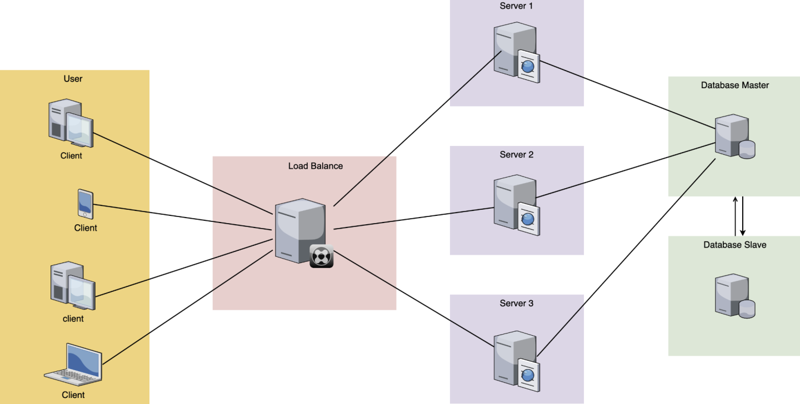
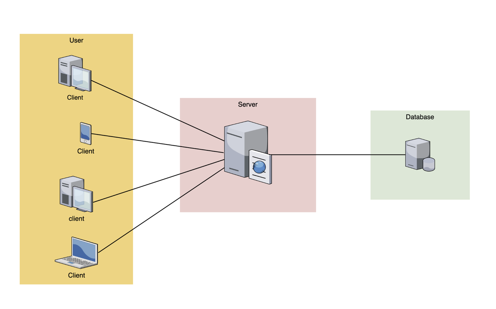
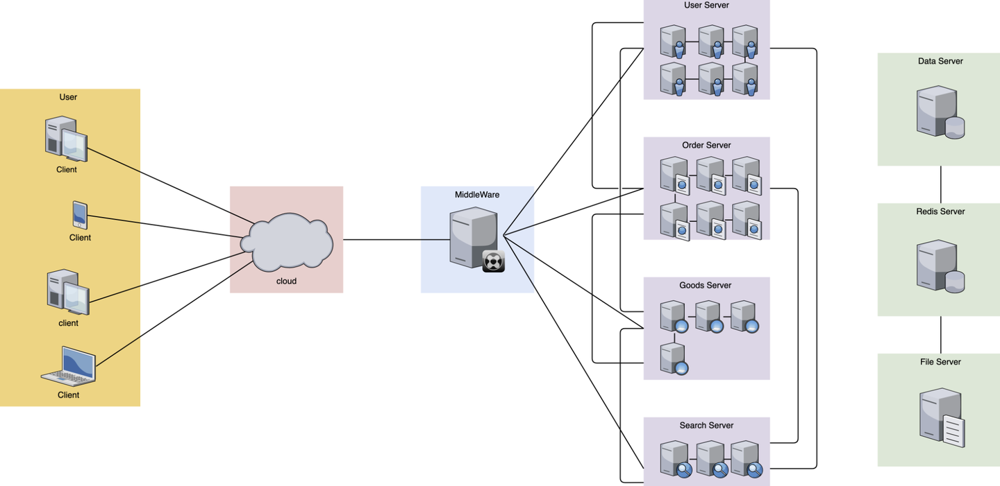
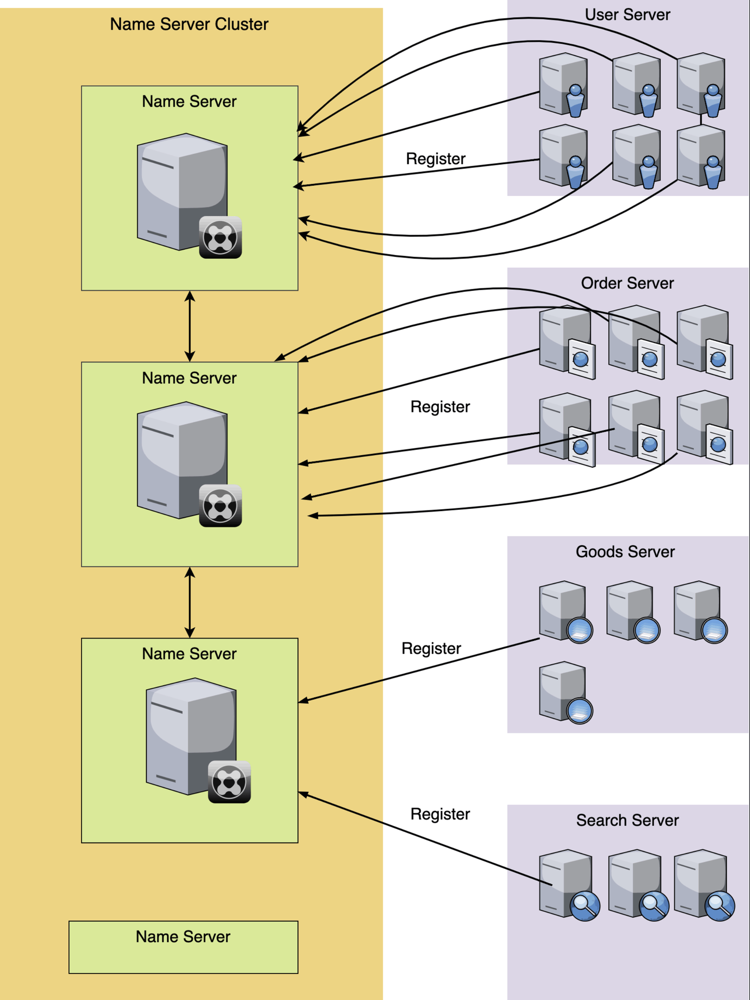
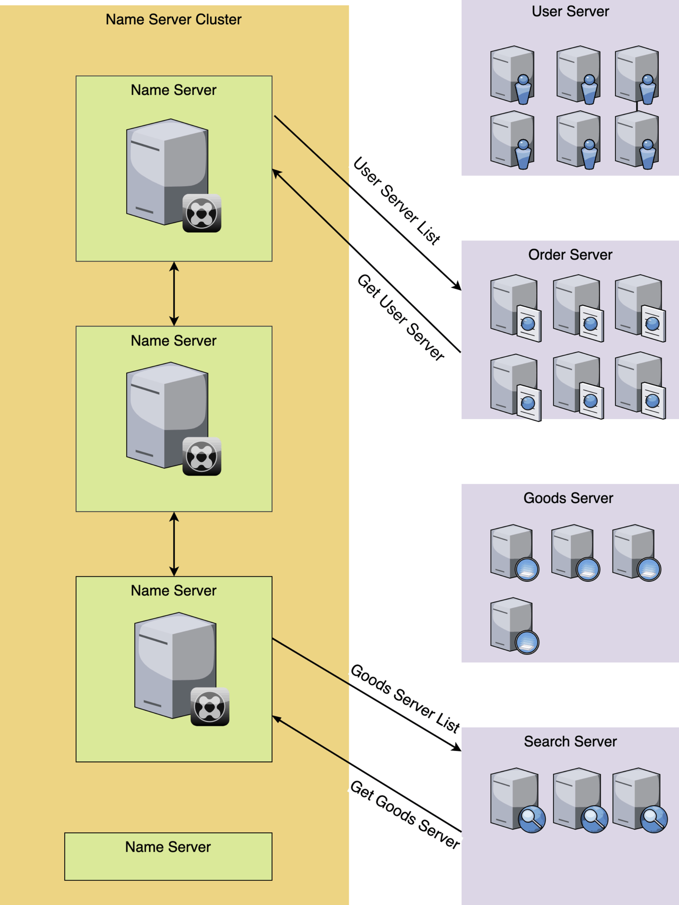
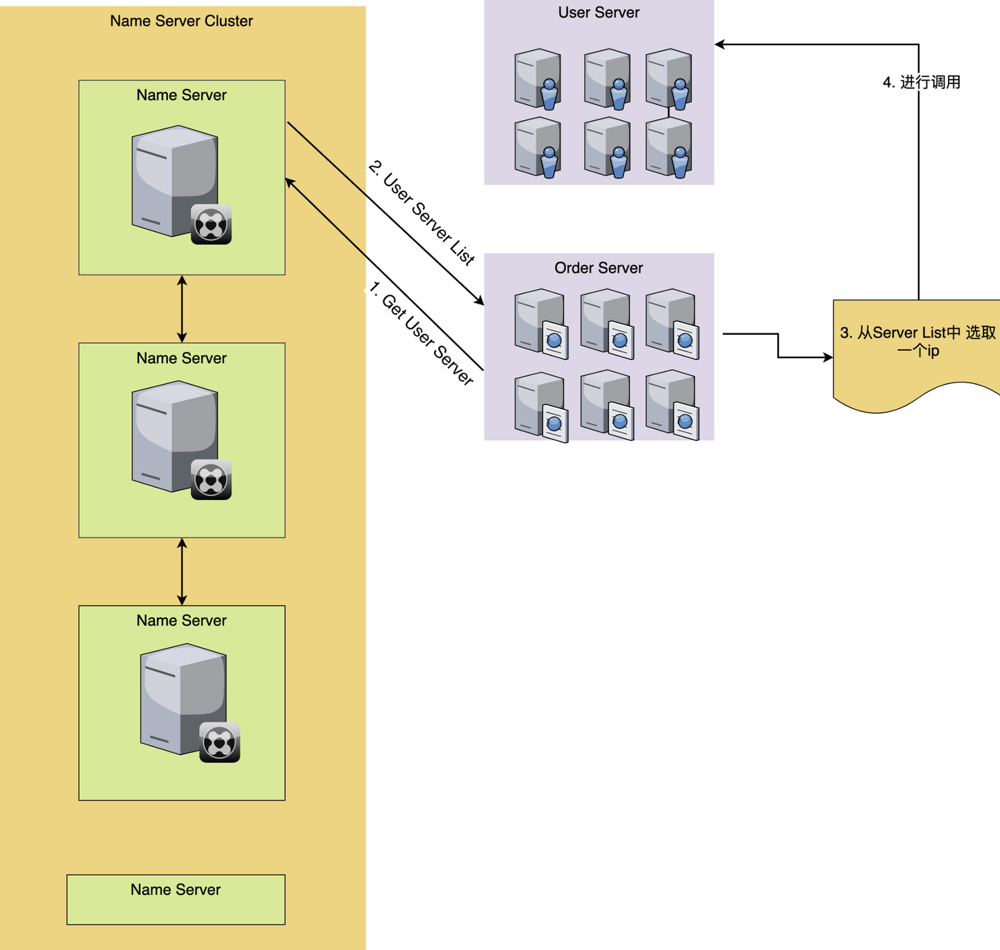
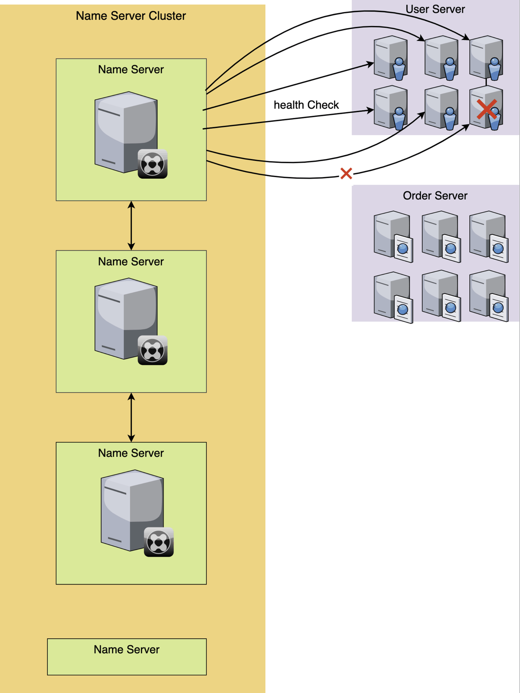
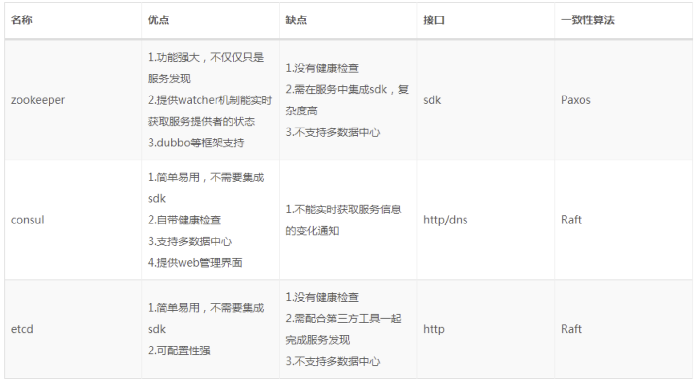
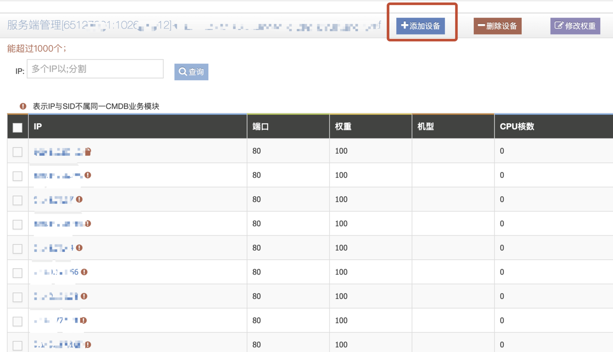

# 深入了解服务注册与发现

## 1. 什么是服务注册与发现

我们先来看下什么是服务注册与服务发现？

**服务注册**，就是将提供某个服务的模块信息(通常是这个服务的ip和端口)注册到1个公共的组件上去（比如: [zookeeper](https://github.com/llohellohe/zookeeper)\\[consul](https://github.com/hashicorp/consul)）。

**服务发现**，就是新注册的这个服务模块能够及时的被其他调用者发现。不管是服务新增和服务删减都能实现自动发现。

你可以理解为：

```txt
//服务注册
NameServer->register(newServer); 

//服务发现
NameServer->getAllServer(); 
```

那么，为啥要这样弄呢？在回答这个问题前，我们先来看下数据请求模型的进化史。

## 2. web1.0数据请求模型架构

在传统的数据请求架构中，其实是没有什么服务注册和发现之说的。因为请求模型足够的简单。下图是传统的服务请求模型图：



各个客户端请求server服务器，所有的业务逻辑都是在这个server端内完成，这是常见的网络请求模型架构，对于小型的服务而已，这个架构是最合适的，因为它稳定且简单。server服务器的更新和维护也很简单。

## 3. web2.0数据请求模型架构

后期，随着我们的用户数渐渐变多，单台服务器的压力扛不住的时候，我们就要用到负载均衡技术，增加多台服务器来抗压，后端的数据库也可以用主从的方式来增加并发量，模型如下图所示:


然而这个时候，依然没有服务发现和注册的影子，因为这个架构依然足够的简单和清晰。只要不断的增加后端的server服务器的数量，那么我们的整体稳定性就会得到保证。各个server服务器的更新和维护也依旧很简单。

那么啥时候才需要用到服务注册和发现呢？答案是**分布式微服务时代**。

## 4. 微服务时代的服务管理

在微服务时代，我们所有的服务都被劲量拆分成最小的粒度，原先所有的服务都在混在1个server里，现在就被按照功能或者对象拆分成N个服务模块，这样做的好处是深度解耦，1个模块只负责自己的事情就好，能够实现快速的迭代更新。坏处就是服务的管理和控制变得异常的复杂和繁琐，人工维护难度变大。还有排查问题和性能变差（服务调用时的网络开销）

比如还是上面的模型架构，在微服务时代就会变成这样子：



**各个微服务相互独立，每个微服务，由多台机器或者单机器不同的实例组成，各个微服务之间错综复杂的相互关联调用。**

比如上面的图中，我们将原先1个server的服务进行了拆分，拆出了User服务，Order服务，Goods服务，Search服务等等。每个服务里有N台机器或者实例。每个服务还相互关联和调动。这种错综复杂的网络架构，使得这种服务的维护成本变得比之前困难了很多。

**在不用服务注册之前，我们可以想象一下，怎么去维护这种复制的关系网络呢？答案就是：写死！**。将其他模块的ip和端口写死在自己的配置文件里，甚至写死在代码里，每次要去新增或者移除1个服务的实例的时候，就得去通知其他所有相关联的服务去修改。随之而来的就是各个项目的配置文件的反复更新、每隔一段时间大规模的ip修改和机器裁撤，非常的痛苦。

在微服务时代，我们会上云，会用k8s，会有docker，这样一个服务从创建到上线会变得异常的频繁，每一个接口依赖的服务，可能会随时的动态改变，靠人手的去写配置和变更配置，对于运维和开发同学来说简直就是灾难。

那么如何去解决这种问题呢？于是聪明的人类发明了服务注册和服务发现这种聪明的东西，来解放双手，提高效率。

## 5. 服务注册

还是上面服务模块的例子，我们看下用了服务注册和服务发现之后，我们的网络请求模块，发生了怎么的变化呢？先来看下，服务注册是怎么操作的。看下面的图：



每一个服务对应的机器或者实例在启动运行的时候，都去向名字服务集群注册自己，比如图中，User服务有6个docker实例，那么每个docker实例，启动后，都去把自己的信息注册到名字服务模块上去，同理Order服务也是一样。

对应的伪代码可以表示如下：

```txt
//给User服务申请1个独有的专属名字
UserNameServer = NameServer->apply('User');

//User服务下的6台docker实例启动后，都去注册自己
UserServer1 = {ip: 192.178.1.1, port: 3445}
UserNameServer->register(UserServer1);

......

UserServer6 = {ip: 192.178.1.6, port: 3445}
UserNameServer->register(UserServer6);

//给Order服务申请1个独有的专属名字
OrderNameServer = NameServer->apply('Order');

//开始注册
OrderServer1 = {ip: 192.178.1.1, port: 3446}
OrderNameServer->register(OrderServer1);

//给Search服务申请1个独有的专属名字
SearchNameServer = NameServer->apply('Search');

//开始注册
SearchServer1 = {ip: 192.178.1.1, port: 3447}
SearchNameServer->register(SearchServer1);
```

这样，每个服务的机器实例在启动后，就完成了注册的操作。注册的方式有很多的形式，不同的名字服务软件方式不一样，有HTTP接口形式，有RPC的方式，也有使用JSON格式的配置表的形式的。方式虽然不同，但是结果都是一样。

实例注册到名字服务上之后，接下来就是服务发现了。

## 6. 服务发现

我们把每个服务的机器实例注册到了名字服务器上之后，接下来，我们如何去发现我们需要调用的服务的信息呢？这就是服务发现了。

我们看下，服务发现是怎么做的：



在上图中，Order服务想要获取User服务相关的信息，首先向注册集群中心发送请求获取，然后就能收到User服务相关的信息。

伪代码可以表示如下：

```json
//服务发现，获取User服务的列表
list = NameServer->getAllServer('User'); 

//list的内容
[
    {
        "ip": "192.178.1.1",
        "port": 3445
    },
    {
        "ip": "192.178.1.2",
        "port": 3445
    },
    ......
    {
        "ip": "192.178.1.6",
        "port": 3445
    }
]

//服务发现，获取Goods服务的列表
list = NameServer->getAllServer('Goods');

//list的内容
[
    {
        "ip": "192.178.1.1",
        "port": 3788
    },
    {
        "ip": "192.178.1.2",
        "port": 3788
    },
    ......
    {
        "ip": "192.178.1.4",
        "port": 3788
    }
]
```

我们通过服务发现，就获得了User模块的所有的ip列表，然后，我们再用一定的负载均衡算法，或者干脆随机取1个ip，进行调用。

当然，也有些注册服务软件也提供了DNS解析功能或者负载均衡功能，它会直接返回给你一个可用的ip，你直接调用就可以了，不用自己去做选择。

这样，我们获取了服务的IP信息后，就可以进行调用了，如图所示：



和服务注册的方式一样，服务发现的方式，不同的名字服务软件的方式也会不一样，有的是得自己发送HTTP接口去**轮训调用**，如果发现有更新，就更新自己本地的配置文件。有的是可以通过实时的**sub/pub**的方式实现的**自动发现服务**，当我订阅的这个服务内容发生了更新，就实时更新自己的配置文件。也有的是通过RPC的方式。方式虽然不同，但是结果都是一样。

**这样一来，我们就可以通过服务注册和发现的方式，维护各个服务IP列表的更新，各个模块只需要向名字服务中心去获取某个服务的IP就可以了，不用再写死IP。整个服务的维护也变得轻松了很多。彻底解放了双手！**

## 7. 健康检查

可能你会说，这样加了1个中间代理，饶了一个大圈子，感觉也挺费劲的，难道仅仅是为了解决新增服务，动态获取IP的问题吗？

当然不是！服务注册和服务发现，不仅仅解决了服务调用这种写死IP以及杂乱无章的管理的状态，更重要的一点是它还管理了服务器的存活状态，也就是健康检查。

很多名字服务软件都会提供健康检查功能。注册服务的这一组机器，当这个服务组的某台机器，如果出现宕机或者服务死掉的时候，就会标记这个实例的状态为故障，或者干脆剔除掉这台机器。这样一来，就实现了自动监控和管理。

健康检查有多重实现方式，比如有几秒就发一次健康检查心跳，如果返回的HTTP状态不是200，那么就判断这台服务不可用，对它进行标记。也可以执行一个shell脚本，看执行的返回结果，来标记状态等等。



上图中，用心跳发送的方式来检查健康状态，当有1台机器出现异常，这样我们获取服务的时候，就能知道服务的健康状态了。

比如伪代码如下：

```json
//服务发现，获取User服务的列表
list = NameServer->getAllServer('User'); 

//list的内容
[
    {
        "ip": "192.178.1.1",
        "port": 3445,
        "status": "success"
    },
    {
        "ip": "192.178.1.2",
        "port": 3445,
        "status": "success"
    },
    ......
    {
        "ip": "192.178.1.6",
        "port": 3445
        "status": "error" //故障,出现错误
    }
]
```

我们通过判断列表里的status的状态是不是success来确认调用的服务是可用的。有些名字服务会提供DNS解析功能，直接就会把有问题的机器给去掉，你服务发现后的机器服务就是正常可用的。

同时，当服务不可用的时候，有些名字服务软件也会提供发送邮件或者消息功能，及时的提示你服务出现故障。这样一来，我们就通过健康检查功能，来帮我们及时的去规避问题，降低影响。

当出现故障的服务被修复后，服务重新启动后，健康检查会检查通过，然后这台机器就会被标记为健康，这样，服务发现，就又可以发现这台机器了。

这样，整个服务注册和服务发现，就实现了闭环。

## 8. 服务注册和服务发现的难点

上面通过一系列的例子，我们解释了服务注册和服务发现的整个过程，以及通过它给我们带来的一系列优秀的变化。那如果我要自己去做一个提供服务注册和发现的这样一款软件，难吗？

答案是：**难！非常难！**

我们先看下这个软件的功能清单:

1. **集群：** 得组成集群，这样单台出现故障，不至于服务宕机
2. **数据同步：** 组成了集群，得要数据同步，注册的信息，在1台注册了，在其他机器上也能看到，不然的话，1台挂了，他这台的数据都丢失了。
3. **强一致性：** 数据同步，在多台要有一致性的要求，保证数据不会出现不一致的情况。
4. **高并发高可用：** 要能保证请求量比较大的情况下，服务还能保持高可用。
5. **选举机制：** 在有集群和数据同步以及一致性要求的情况下，得有一个master来主持整个运作，那就要有选取机制，确保选举公平和稳定。
6. **分布式:** 随着微服务上云，各个机器可能近在眼前，却远在天边，如何支撑分布式上的不同环境的机器互联，这也是一个很大的问题。
7. **安装简单：** 一个软件好不好用，是否亲民，安装的易用性是一个很大的因素，如果一个软件安装简单，调试方便，那么就会很受欢迎。

所以，你看，开发一款注册发现的软件还是有非常大的挑战的。

## 9. 市面上业界的解决方案

目前市面上已经有了服务注册和服务发现的解决方案，代表作是：zookeeper和consul以及etcd,他们功能强大，安全稳定，高并发高可用，强一致性，目前市面上都是用这几个来实现自己的服务注册和发现的。

以下是这3款软件的优缺点对比:



其中，consul 是后起之秀，源于它安装简单，功能强大，提供健康检查，web管理后台，支持多数据中心，暴露了方便的HTTP接口，使得它被更多的人所使用，**唯一不足的是它不支持sub/pub订阅机制，所以服务发现，得使用者自己去HTTP轮训发现变更。**

## 10. 鹅厂的服务注册和服务发现解决方案

我们大鹅厂，也有自己的服务注册和服务发现解决方案，我们每天都在用，可能你没发现而已，那就是大名鼎鼎的L5。

L5已经深入到鹅厂开发的每一个角落，现在服务提供者几乎都在使用L5来提供服务发现功能。

还记得L5是如何使用的吗？

**第一步，我们创建1个SID**，由2个数子组成，比如：13232323:5332323232，这个SID就相当于服务注册里面的服务名，我们通过这个唯一的名字，来实现服务注册和服务发现。

伪代码可以表示如下：

```php
//其他生成
UserNameServer = NameServer->apply('User');

//L5生成
UserNameServer = L5->apply('User');
//UserNameServer=> 13232323:5332323232
```

**第二步，服务注册**，我们需要把机器的ip和port注册到SID上去，我们可以通过接口加入，也可以通过CL5平台提供的界面操作加入：



**第三步，服务发现**，我们在代码里直接通过相关语言的L5扩展函数，就可以实现发现服务功能。值得一说的是，L5也实现了负载均衡功能，服务发现并不是给你所有的IP列表，而是通过负载均衡算法，直接给出了你一个可用的IP和port，非常方便。

以下代码是PHP语言获取L5服务发现的简略过程：

```php
    $l5Info = [
        'modId' => $modId,
        'cmdId' => $cmdId,
    ];

    $ret = L5ApiGetRoute($l5Info, 0.2);
    
    //获得IP和port
    $ip = $l5Info['hostIp'];
    $port = $l5Info['hostPort'];
   
   //其他业务逻辑和上报逻辑省略
```

好了，服务注册和服务发现就说完了，希望这篇文章足够的清晰和简单，让你能明白为什么要用服务注册和发现，以及用了之后，实实在在的给我们开发者提供了优秀的生产力功能。

最后总结一下：

`. 本文介绍什么是服务注册与发现。

2. 为什么要用这个东西？

3. 这个东西好在哪里？

4. 最后对比了业界的常用方案以及鹅厂的解决方案。