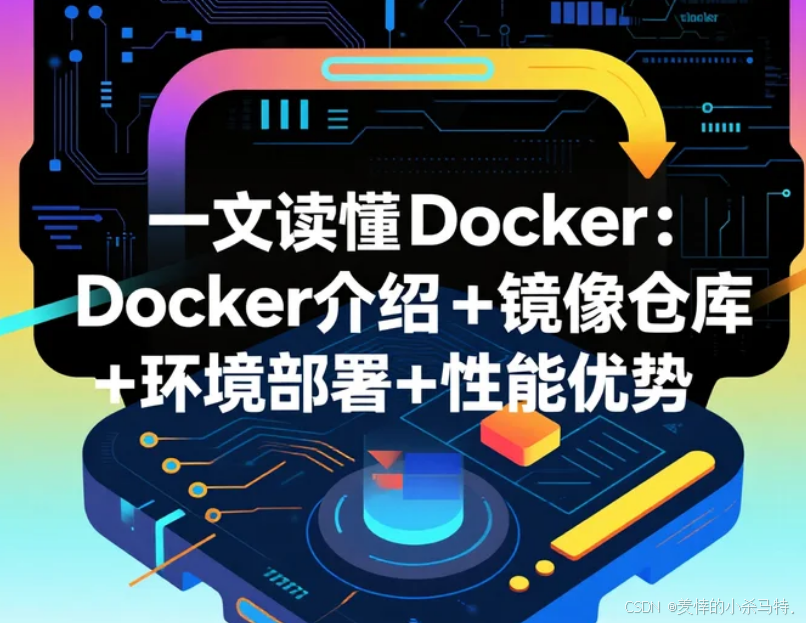
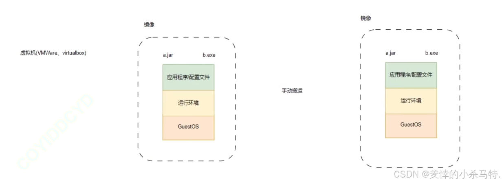
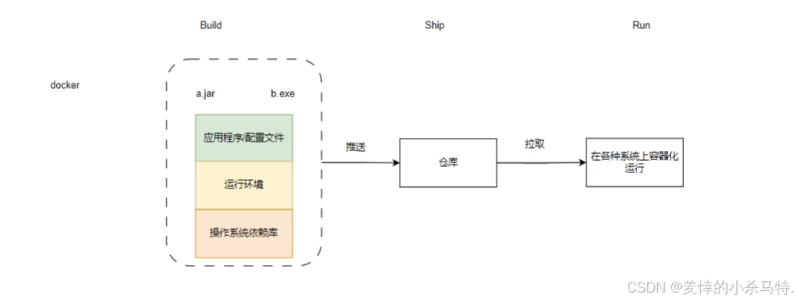

# [一文读懂Docker：Docker介绍+镜像仓库+环境部署+性能优势，开发者的效率工具箱](https://blog.csdn.net/2401_82648291/article/details/150585109)

本文全面介绍Docker，涵盖其与虚拟机的资源效率差异、核心架构（C/S模式）、镜像仓库（如Docker Hub）功能，以及Ubuntu安装方法。通过对比隔离性、启动速度等，阐明Docker轻量化、高效部署的优势，适合快速构建标准化应用环境。

# vDocker介绍

## 简介

Docker(镜像)是LXC(模版)增强版、容器易用工具，本质是开源Go项目，目标是“一次封装，到处运行”。早期用LXC做引擎，靠镜像技术简化容器创建，只需简单命令就能操作容器。

早期基于 LXC，成熟后自研 libcontainer，CNCF 介入后开发出工业化标准引擎 runC，新版 Docker 采用 runC。

## Docker与虚拟机区别

### 资源占用与性能

1. 磁盘占用

   - 传统虚拟机：几个 GB 到几十 GB。
   - Docker 容器：几十 MB 到几百 MB。
2. CPU/内存占用

   - 传统虚拟机：虚拟操作系统本身占资源，需通过虚拟层调用，占用率高。
   - Docker 容器：Docker 引擎轻量，直接利用硬件，资源占用少。
3. 启动速度

   - 传统虚拟机：从开机到运行项目，需几分钟。
   - Docker 容器：从启动容器到运行项目，只需几秒。

### 使用与管理

4. 安装管理

   - 传统虚拟机：需专门运维技术。
   - Docker 容器：安装、管理更简便。
5. 应用部署

   - 传统虚拟机：手动部署，速度慢。
   - Docker 容器：体系化/自动化部署，速度快。

如：

VM：

Docker：

### 隔离与封装

6. 隔离性
    - 传统虚拟机：系统级隔离（每个虚拟机独立 OS）。
    - Docker 容器：进程级隔离（共享宿主机 OS，仅隔离应用进程）。

7. 封装程度
    - 传统虚拟机：封装整个操作系统。
    - Docker 容器：仅封装应用代码 + 依赖，更轻量。

也就是，Docker 比虚拟机更轻量、启动快、资源省，核心在于共享宿主机 OS 而非虚拟完整系统，同时通过容器化实现快速部署与隔离。

**Docker**为什么比虚拟机资源利用率高，启动快？
