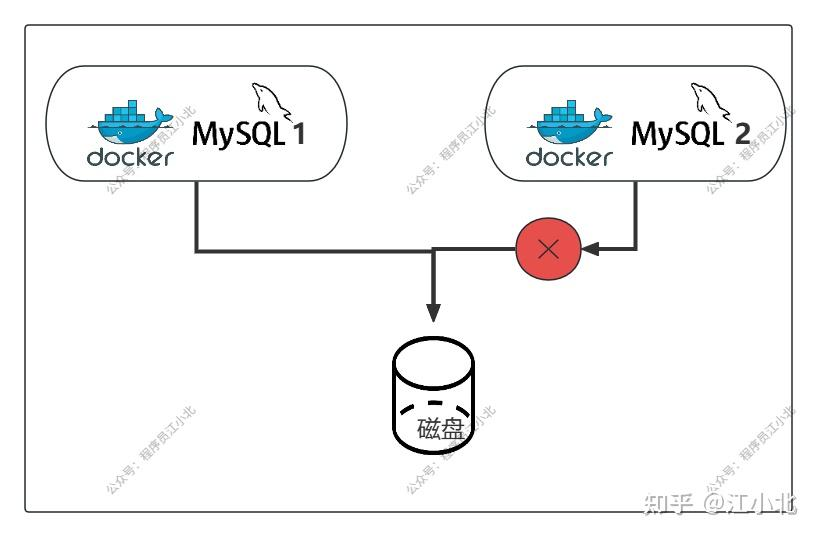
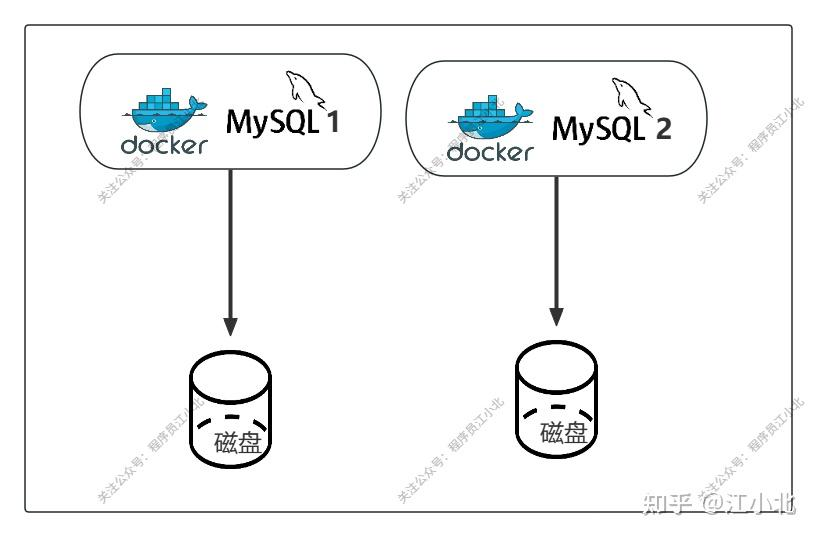

## 第一步：在宿主机上创建存储目录

首先，我们需要在宿主机上创建目录，用来存储 MySQL 的数据、日志和配置文件。使用以下命令：

```bash
mkdir -p /data/mysql/{data,logs,conf}
```

- data：存放 MySQL 数据文件
- logs：存放 MySQL 日志文件
- conf：存放 MySQL 配置文件

## 第二步：拉取 MySQL 镜像

通过 Docker Hub 拉取 MySQL 的官方镜像：

```bash
docker pull mysql:latest
```

## 第三步：配置 MySQL

在宿主机的 /data/mysql/conf 目录下，创建一个名为 my.cnf 的配置文件。配置文件内容如下：

```yaml
[mysqld]
character-set-server=utf8mb4
collation-server=utf8mb4_unicode_ci
datadir=/var/lib/mysql
log-error=/var/log/mysqld.log
```

这段配置做了以下几件事：

- 设置字符集为 utf8mb4，保证支持更多字符
- 设置排序规则为 utf8mb4_unicode_ci
- 配置数据文件和日志文件的路径

## 第四步：启动 MySQL 容器

使用以下命令启动 MySQL 容器，并将宿主机的目录挂载到容器内，确保数据、日志和配置文件持久化：

```bash
docker run -d \
  --name mysql-server \
  -p 3306:3306 \
  -e MYSQL_ROOT_PASSWORD=your_password \
  -v /data/mysql/data:/var/lib/mysql \
  -v /data/mysql/logs:/var/log/mysqld \
  -v /data/mysql/conf/my.cnf:/etc/mysql/my.cnf \
  mysql:latest
```

解释：

- -d：后台运行容器
- --name mysql-server：指定容器名称为 mysql-server
- -p 3306:3306：将容器的 3306 端口映射到宿主机的 3306 端口
- -e MYSQL_ROOT_PASSWORD=your_password：设置 MySQL 的 root 用户密码（请替换 your_password）
- -v：将宿主机的目录挂载到容器中

  - /data/mysql/data:/var/lib/mysql：挂载数据文件
  - /data/mysql/logs:/var/log/mysqld：挂载日志文件
  - /data/mysql/conf/my.cnf:/etc/mysql/my.cnf：挂载配置文件

这样配置后，MySQL 数据库的所有数据、日志和配置文件都会保存在宿主机上，即使容器重启或删除，数据也不会丢失。

# 容器部署 MySQL 的扩容困境

你可能会想：Docker 启动 MySQL 多方便啊，直接 docker run 搞定，为什么还说它不适合扩容？

问题的关键是：数据没法共享。

当你的业务增长，数据库读写压力变大，需要扩容多个 MySQL 实例时，就会遇到严重的数据隔离问题。

举个例子：

- 你已经有一个运行中的 MySQL 容器 mysql1，挂载了宿主机的数据目录 /data/mysql1/data
- 然后你想再启动一个 mysql2 容器，希望也访问这个数据目录

BUT！容器之间不能同时读写这个宿主目录。因为数据库的数据文件是“容器独占”的，两个实例**不能共享一个数据源**，否则数据就乱套了，直接崩。



> Docker 官方也不建议将数据直接保存在容器内，容器随时可能停止或被删除，数据就跟着没了。所以数据要通过挂载卷方式保存，确保持久化。

所以，**扩容的唯一方式是：每个容器实例都使用一套独立的存储目录**。

这也就意味着：你不是在扩“一个数据库”，而是开了“多个数据库”。多实例 ≠ 自动扩容。

如下图所示：



# 何用 Docker 本地跑多个 MySQL 实例？

虽然共享数据难搞，但如果你只是为了测试、练习，想本地跑两套 MySQL，其实是可以的。

我们可以给每个实例分配独立的目录和端口，互不影响，互不干扰。

## 步骤 1：创建两套独立目录

在宿主机上为两个实例分别创建目录（包含数据、日志、配置）：

```bash
mkdir -p /data/mysql1/{data,logs,conf}
mkdir -p /data/mysql2/{data,logs,conf}
```

## 步骤 2：创建两个配置文件

分别在每套目录里创建 my.cnf 文件。

MySQL 1 的配置：（/data/mysql1/conf/my.cnf）

```yaml
[mysqld]
character-set-server=utf8mb4
collation-server=utf8mb4_unicode_ci
datadir=/var/lib/mysql
log-error=/var/log/mysqld.log
```

MySQL 2 的配置：（/data/mysql2/conf/my.cnf）

```yaml
[mysqld]
character-set-server=utf8mb4
collation-server=utf8mb4_unicode_ci
datadir=/var/lib/mysql
log-error=/var/log/mysqld.log
```

>这里两个配置其实是一样的，重点在于：每个容器内部都用的是自己的配置和数据目录，互不干扰。

## 步骤 3：启动两个容器

启动第一个 MySQL 容器（**监听 3306 端口**）：

```bash
docker run -d \
  --name mysql1 \
  -p 3306:3306 \
  -e MYSQL_ROOT_PASSWORD=your_password1 \
  -v /data/mysql1/data:/var/lib/mysql \
  -v /data/mysql1/logs:/var/log/mysqld \
  -v /data/mysql1/conf/my.cnf:/etc/mysql/my.cnf \
  mysql:latest
```

启动第二个 MySQL 容器（**监听 3307 端口**）：

```bash
docker run -d \
  --name mysql2 \
  -p 3307:3306 \
  -e MYSQL_ROOT_PASSWORD=your_password2 \
  -v /data/mysql2/data:/var/lib/mysql \
  -v /data/mysql2/logs:/var/log/mysqld \
  -v /data/mysql2/conf/my.cnf:/etc/mysql/my.cnf \
  mysql:latest
```

>注意：这里 -p 3307:3306 的意思是把宿主机的 3307 映射到容器内部的 3306（MySQL 默认端口），这样两个容器就不会端口冲突。