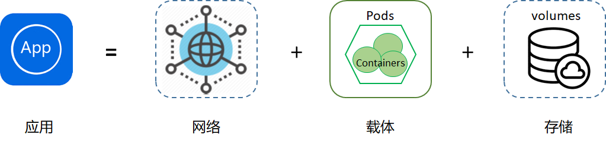

# 一、为什么要有控制器

K8S是容器资源管理和调度平台，容器跑在Pod里，Pod是K8S里最小的单元。所以，这些Pod作为一个个单元我们肯定需要去操作它的状态和生命周期。那么如何操作？这里就需要用到控制器了。

这里一个比较通俗的公式：应用APP = 网络 + 载体 + 存储

这里应用一般分为无状态应用、有状态应用、守护型应用、批处理应用这四种。

**无状态应用**：应用实例不涉及事务交互，不产生持久化数据存储在本地，并且多个应用实例对于同一个请求响应的结果是完全一致的。举例：nginx或者tomcat

**有状态应用**：有状态服务可以说是需要数据存储功能的服务或者指多线程类型的服务、队列等。举例：mysql数据库、kafka、redis、zookeeper等。

**守护型应用**：类似守护进程一样，长期保持运行，监听持续的提供服务。举例：ceph、logstash、fluentd等。

**批处理应用**：工作任务型的服务，通常是一次性的。举例：运行一个批量改文件夹名字的脚本。
