# 目录

- [1、简介](1、简介)
- [2、K8s基础知识](2、K8s基础知识)
  - [2.1、理论介绍](2.1、理论介绍)
    - [2.1.1、kubernetes名词解释](2.1.1、kubernetes名词解释)
    - [2.1.2、deploylment、rs、pod之间的关系](2.1.2、deploylment、rs、pod之间的关系)
  - [2.2、基础操作](2.2、基础操作)
  - [2.3、基本命令格式](2.3、基本命令格式)
  - [2.4、软件包组成](2.4、软件包组成)
- [3、K8s基础操作](3、K8s基础操作)

## 1、简介

Kubernetes，简称K8s，是用8代替8个字符“ubernete”而成的缩写。是一个开源的，用于管理云平台中多个主机上的容器化的应用，Kubernetes的目标是让部署容器化的应用简单并且高效（powerful），Kubernetes提供了应用部署，规划，更新，维护的一种机制。

传统的应用部署方式是通过插件或脚本来安装应用。这样做的缺点是应用的运行、配置、管理、所有生存周期将与当前操作系统绑定，这样做并不利于应用的升级更新/回滚等操作，当然也可以通过创建虚拟机的方式来实现某些功能，但是虚拟机非常重，并不利于可移植性。

新的方式是通过部署容器方式实现，每个容器之间互相隔离，每个容器有自己的文件系统 ，容器之间进程不会相互影响，能区分计算资源。相对于虚拟机，容器能快速部署，由于容器与底层设施、机器文件系统解耦的，所以它能在不同云、不同版本操作系统间进行迁移。

官网地址：

[https://kubernetes.io/](https://kubernetes.io/)

## 2、K8s基础知识

### 2.1、理论介绍

#### 2.1.1、kubernetes名词解释

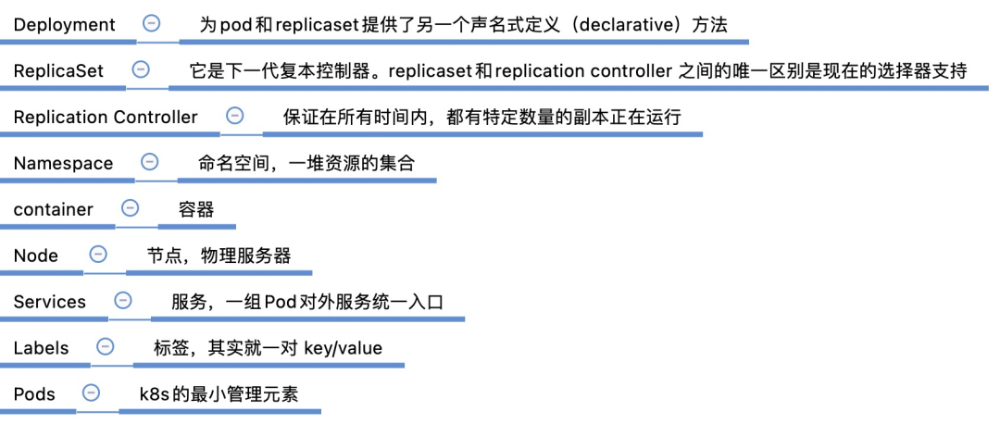

pod控制器类型：

（1）HPA（Horizontal Pod Autoscaler）

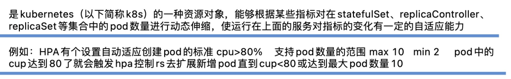

（2）StatefulSet 为有状态服务的，持久化储存，稳定的网络，有序部署和删除

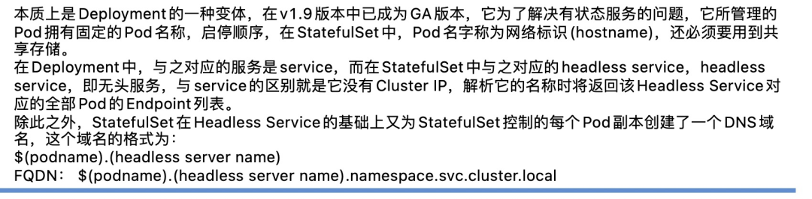

（3）daemonset  它有且只有一个pod负责创建

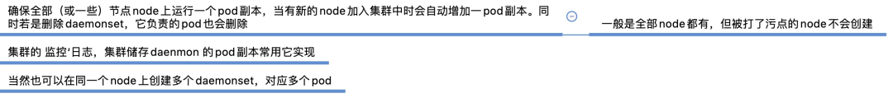

（4）job/cron job

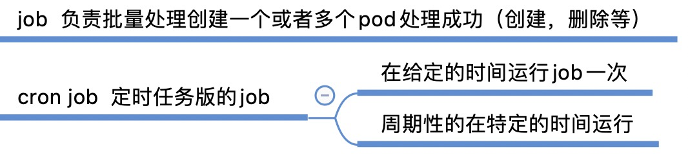

2.1.2、deploylment、rs、pod之间的关系


### 2.2、基础操作

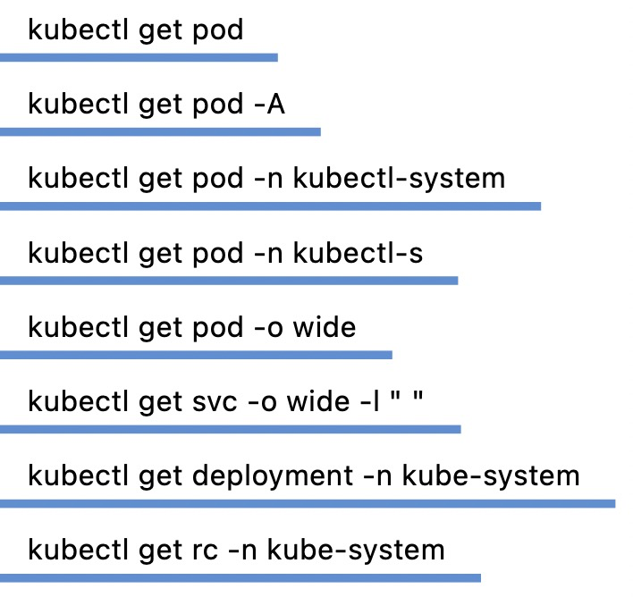

### 2.3、基本命令格式

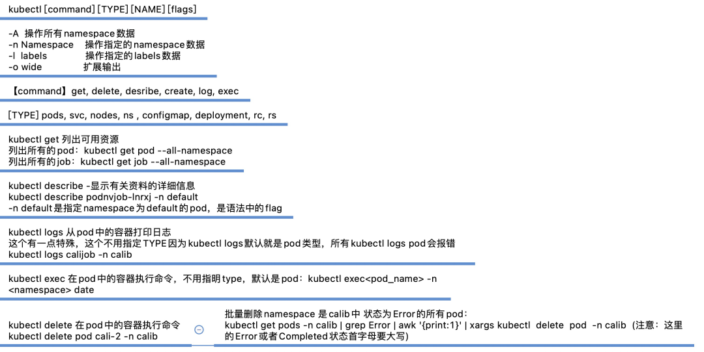

### 2.4、软件包组成

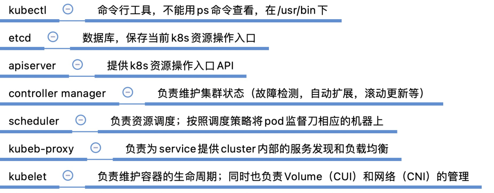

## 3、K8s基础操作

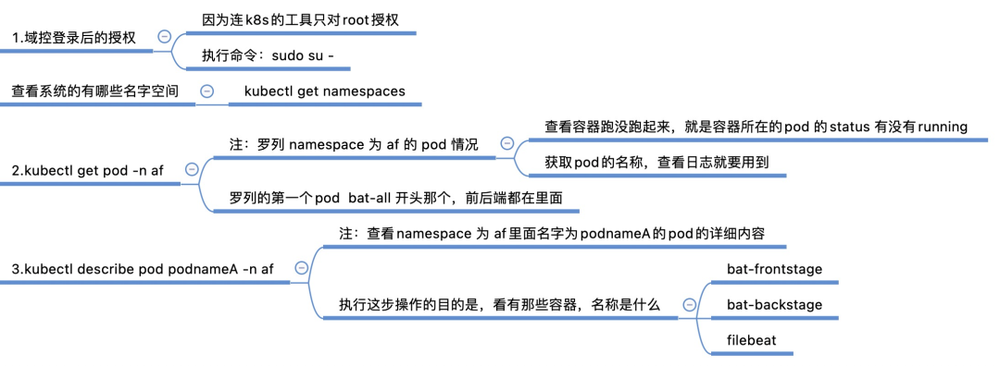

查看日志（通过2.3步已获取到pod名称和容器名称）：

（1）直接查看指定容器的debug日志

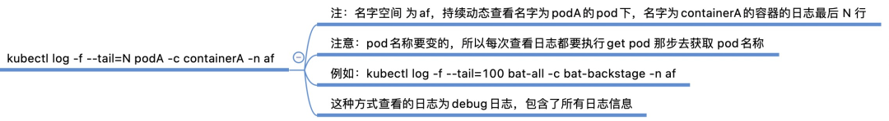

（2）进入容器里面，找到特定的日志查看

```bash
kubectl get svc -n af 
```

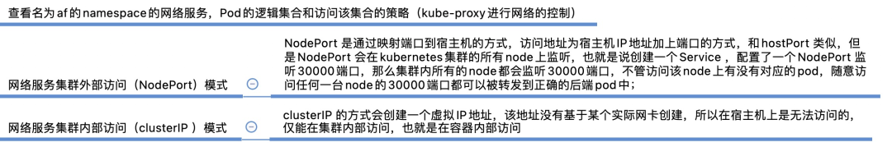

```bash
kubectl edit deployment deploymentName -n namespace
```

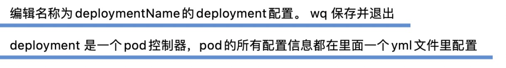
