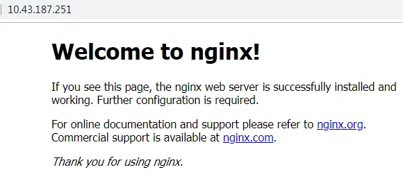
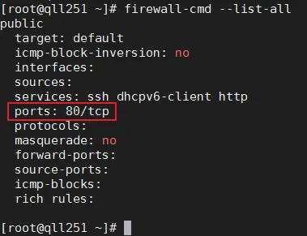
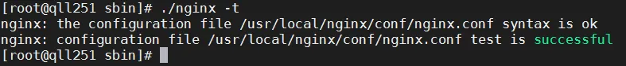
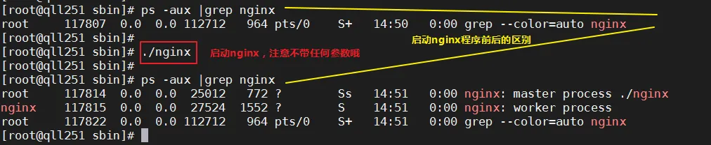

# 验证nginx服务是否启动

浏览器上输入：http://主机IP，页面显示如下，表示服务已启动



不显示说明服务器安全组限制了80或者443端口，请检查

禁用防火墙或放通80端口（nginx默认使用80端口）

```bash
//关闭及禁用防火墙
systemctl stop firewalld && systemctl disable firewalld

=========或者放通80端口
firewall-cmd --add-service=http --permanent
firewall-cmd --add-port=80/tcp --permanent
firewall-cmd --reload
```

如图所示，表示已放通80端口



访问成功


# Nginx常用命令

进入 nginx 目录中: cd /usr/local/nginx/sbin


## 1）查看 nginx 版本号


## 2）检查nginx配置文件语法是否有错误



## 3）启动nginx程序



## 4）重新加载nginx（平滑重启）

```bash
./nginx -s reload
```

## 5）停止 nginx

```bash
./nginx -s stop
```

## 6）将nginx加入开机自启动

```bash
echo "/usr/local/nginx/sbin/nginx &" >> /etc/rc.local
```