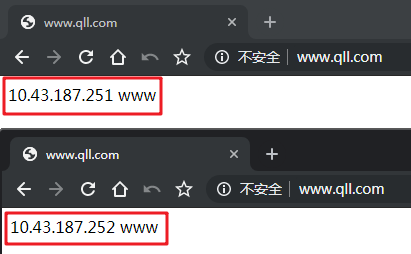

# [干货|Nginx负载均衡原理以及配置实例](https://www.cnblogs.com/qinlulu/p/12821289.html)

# 前言 

## nginx

Nginx是一款高性能的http 服务器/反向代理服务器及电子邮件（IMAP/POP3）代理服务器。官方测试nginx能够支撑5万并发连接，并且cpu、内存等资源消耗却非常低，运行非常稳定。

## 负载均衡

什么是负载均衡，单从字面理解可以解释为N台服务器平均分担负载，不会因为某台服务器负载高宕机而出现某台服务器闲置的情况。那么负载均衡的前提就是要有多台服务器才能实现，目的是达到整个系统的高性能和高可用性。

# 1、Nginx负载均衡介绍 

反向代理与负载均衡概念简介
严格地说，Nginx仅仅是作为Nginx Proxy反向代理使用的，因为这个反向代理功能表现的效果是负载均衡集群的效果，所以本文称之为Nginx负载均衡。那么，反向代理和负载均衡有什么区别呢？

- 普通负载均衡软件，例如大名鼎鼎的LVS，其实功能只是对请求数据包的转发（也可能会改写数据包）、传递。其中DR模式明显的特征是：从负载均衡下面的节点服务器来看，接收到的请求还是来自访问负载均衡器的客户端的真实用户。

- 而反向代理就不一样了，反向代理接收访问用户的请求后，会代理用户重新发起请求代理下的节点服务器，最后把数据返回给客户端用户，在节点服务器看来，访问的节点服务器的客户端用户就是反向代理服务器了，而非真实的网站访问用户。

- 一句话，LVS等的负载均衡是转发用户请求的数据包，而Nginx反向代理是接收用户的请求后，会代理用户重新发起请求代理下的节点服务器。

# 2、Nginx负载均衡组件模块 
实现Nginx负载均衡的组件主要有两个：

- **ngx_http_upstream_module**
负载均衡模块，可以实现网站的负载均衡功能及节点的健康检查

- **ngx_http_proxy_module**
proxy代理模块，用于把请求转发给服务器节点或upstream服务器池

## 2.1、upstream模块
### （1）upstream模块介绍

upstream模块允许Nginx定义一组或多组节点服务器组，使用时可以通过proxy_pass代理方式把网站的请求发送到事先定义好的对应upstream组的名字上，具体写法为：

```yml
proxy_pass http://server_pools
```

其中server_pools就是一个upstream节点服务器组名字。

### （2）upstream配置案例

```yml
#范例1：基本的upstream配置案例：
upstream server_pools {

# upstream是关键字必须有，后面的server_pools是upstream集群组的名字，可自定义名称，调用时就用这个名字。

server 192.168.1.251:80 weight=5;
server 192.168.1.252:80 weight=10;
server 192.168.1.253:80 weight=15;
}

# server关键字是固定的，后面可以接域名或IP。如果不指定端口，默认是80端口。weight代表权重，数值越大被分配的请求越多。

#范例2：较完整的upstream配置案例：

upstream blog__pools {

server 192.168.0.223;   #这行标签和下行是等价的
server 192.168.0.224:80 weight=1 max_fails=1 fail_timeout=10s;       #这行标签和上一行是等价的，此行多余的部分就是默认配置，不写也可以。

server 192.168.0.225:80 weight=1 max_fails=2 fail_timeout=20s backup;

#   server最后面可以加很多参数，具体参数作用看下文
}
```

### （3）upstream模块参数

- server
负载后面的RS配置，可以是ip或者域名。

- weight
请求服务器的权重。默认值为1，越大表示接受的请求比例越大。

- max_fails 
nginx 尝试连接后端主机失败的次数。这个数值需配合proxy_net_upstream，fastcgi_next_upstream和memcached_next_upstream这三个参数来使用的。当nginx接收后端服务器返回这三个参数定义的状态码时，会将这个请求转发给正常工作的后端服务器，例如404，502，503

- fail_timeout
在max_fails定义的失败次数后，距离下次检查的时间间隔，默认10s

- backup
热备配置，标志这台服务器作为备份服务器，若主服务器全部宕机了，就会向它转发请求

- down
表示这个服务器永不可用，可配合ip_hash使用

```yml
upstream web_pools {

server linux.example.com weight=5;
server 127.0.0.1:8080 max_fail=5 fail_timeout=10s;
# 当5次连续检查失败后，间隔10s后重新检测。
server linux.example.com:8080 backup;
# 指定备份服务器。作用：等上面服务器全部不可访问时就向它转发请求。

}
```

## 2.2、http_proxy_module模块
### （1）proxy_pass指令介绍

**proxy_pass**指令属于**ngx_http_proxy_module**模块，此模块可以将请求转发到另一台服务器上。在实际的反向代理工作中，会通过**location**功能匹配指定的URI，然后把接收到的符合匹配URI的请求通过**proxy_pas**s抛给定义好的**upstream**节点池。

location内容，参考： 一文彻底读懂nginx中的location指令

### （2）proxy_pass的使用案例

```yml
location /web/ {

proxy_pass http://127.0.0.1/abc/;

}

#将匹配URI为web的请求抛给http://127.0.0.1/abc/
```

### （3）http proxy模块参数

- proxy_set_header

设置http请求header项传给后端服务器节点。例如，可以实现让代理后端的服务器节点获取访问客户端用户真实的IP地址

- client_body_buffer_size

用于指定客户端请求主题缓冲区大小

- proxy_connect_timeout

表示反向代理与后端节点服务器连接的超时时间，即发起握手等候响应的超时时间

- proxy_send_timeout

表示代理后端服务器的数据回传时间，即在规定时间之内，后端服务器必须传完所有的数据，否则，nginx将断开这个连接

- proxy_read_timeout

设置nginx从代理的后端服务器获取信息的时间，表示连接建立成功后，nginx等待后端服务器的响应时间，其实是nginx在后端排队等候处理的时间

- proxy_buffer_size

设置缓冲区大小，默认该缓冲区大小等于指令proxy_buffers设置的大小

- proxy_buffers

设置缓冲区的数量和大小，nginx从代理的后端服务器获取的响应信息，会放置在缓冲区

- proxy_busy_buffers_size

用于设置系统很忙时可以使用的proxy_buffers大小，官方推荐的大小为proxy_bufer*2

- proxy_temp_file_write_size

指定proxy缓存临时文件的大小

# 3、Nginx负载均衡调度算法

### （1）rr轮询（默认）

默认调度算法，按照客户端请求逐一分配到不同的后端服务器，宕机的服务器会自动从节点服务器池中剔除。

```yml
upstream server_pools {
    server 192.168.1.251;
    server 192.168.1.252;
    }

#注意：对于服务器性能不同的集群，该算法容易引发资源分配不合理等问题。
```

### （2）wrr加权轮询（weight）

在rr轮询算法的基础上加上权重，权重和用户访问成正比，权重值越大，被转发的请求也就越多

```yml
upstream server_pools {
    server 192.168.1.251 weight=5;
    server 192.168.1.252 weight=10;
}

#加权轮询应用于服务器性能不等的集群中，使资源分配更加合理化。
```

### （3）ip_hash（会话保持）

每个请求按访问 IP 的hash结果分配，每个访客固定访问一个后端服务器，可解决session不共享的问题。

```yml
upstream server_pools {
    ip_hash;
    server 192.168.1.251;
    server 192.168.1.252;
    }

#Session 不共享是说，假设用户已经登录过，此时发出的请求被分配到了 A 服务器，但 A 服务器突然宕机，用户的请求则会被转发到 B 服务器。但由于 Session 不共享，B 无法直接读取用户的登录信息来继续执行其他操作。
```

### （4）fair（动态调度算法）

根据后端节点服务器的响应时间来分配请求，响应时间短的优先分配。

```yml
upstream server_pools {
    server 192.168.1.251;
    server 192.168.1.252;
    fair;
    }

#这是更加智能的调度算法，但Nginx本身不支持fair调度算法。如果需要使用fair调度，必须下载Nginx相关模块upstream_fair。
```

### （5）url_hash算法(web缓存节点)

根据访问URL的hash结果来分配请求，让每个URL定向到同一个后端服务器。

```yml
upstream server_pools {

server qll:9001;
server qll:9002;
hash $request_uri;
hash_method crc32;

}

#同样，Nginx本身是不支持url_hash，如果需要使用这种调度算法，必须安装Nginx的hash模块软件包。
```

# 4、Nginx负载均衡配置实例 

### （1）实现效果

在浏览器上输入地址http://www.qll.com,实现负载均衡效果（平均访问到两台服务器）

### （2）准备工作

#### a）准备3台nginx服务器，如下：

| 服务器名称 | IP地址 | 角色说明 |
| :----: | :----: | :----: |
| web01	 | 10.43.187.251	 | nginx web01服务器 |
| web02 | 10.43.187.252 | nginx web01服务器 |
| lb | 10.43.187.253 | nginx 负载均衡服务器 |

#### b）三台服务器均安装nginx

安装nginx，参考:[Nginx编译安装及常用命令](https://gitee.com/jing-haijun/golang-guild/blob/master/%E6%9C%8D%E5%8A%A1%E5%99%A8%E8%BF%90%E8%A1%8C%E5%B7%A5%E5%85%B7/nginx/%E5%AE%89%E8%A3%85%E9%85%8D%E7%BD%AE/nginx%E5%AE%89%E8%A3%85%E9%85%8D%E7%BD%AE.md)

#### c）配置用于测试的Web服务

```yml
#注意：本小节是在两台Nginx Web服务器上操作

[root@web01 nginx]# cat conf/nginx.conf
worker_processes  1;
events {
    worker_connections  1024;
}
http {
    include       mime.types;
    default_type  application/octet-stream;
    sendfile        on;
    keepalive_timeout  65;
    
    server {
        listen       80;
        server_name  localhost;
        location / {
            root   html/www;
            index  index.html index.htm;
        }
	access_log logs/access_www.log main;
    }

}
```

创建测试文件数据

```bash
[root@web01 ~]# cd /usr/local/nginx/html/
[root@web01 html]# mkdir www
[root@web01 www]# echo "`hostname -I` www" > index.html

查看创建的文件内容：
[root@qll251 www]# cat index.html
10.43.187.251 www
```

别忘记启动nginx服务哦

#### d）配置nginx 负载均衡服务器

```bash
[root@lb01 nginx]# cat conf/nginx.conf
worker_processes  1;
events {
    worker_connections  1024;
}
http {
    include       mime.types;
    default_type  application/octet-stream;
    sendfile        on;
    keepalive_timeout  65;
    upstream www_server_pools {         #这里定义Web服务器池，包含了251，252两个Web节点

	server 10.43.187.251:80 weight=1;

	server 10.43.187.252:80 weight=1;

	}
    server {            #这里定义代理的负载均衡域名虚拟主机
        listen       80;
        server_name  www.qll.com;
        location / {
		proxy_pass http://www_server_pools;     #访问www.qll.com,请求发送给www_server_pools里面的节点
        }
    }
}
```

#### e）域名解析

由于不是真实环境，域名使用www.qll.com用作测试，所以www.qll.com的解析只能在hosts文件设置。

打开：

**C:\Windows\System32\drivers\etc\hosts**

在末尾添加:

**10.43.187.253 www.qll.com**

（3）测试验证

打开浏览器访问**www.qll.com**，不断刷新会发现所有请求被负载均衡器（10.43.187.253）均分配到web01（10.43.187.251）和web02（10.43.187.252）上，实现了负载均衡的效果。



#### f）代理到后端服务

```nginx
server {
    listen 80;
    server_name your_domain.com;

    location / {
        proxy_pass http://localhost:your_backend_port;
        proxy_set_header Host $host;
        proxy_set_header X-Real-IP $remote_addr;
        proxy_set_header X-Forwarded-For $proxy_add_x_forwarded_for;
        proxy_set_header X-Forwarded-Proto $scheme;
    }
}
```

将 your_domain.com 替换为你的域名或服务器 IP 地址，your_backend_port 替换为后端服务的实际运行端口

#### g）支撑cors跨域

```nginx
server {
    listen 80;
    server_name example.com;

    location / {
        add_header 'Access-Control-Allow-Origin' '*';
        add_header 'Access-Control-Allow-Methods' 'GET, POST, OPTIONS';
        add_header 'Access-Control-Allow-Headers' 'DNT,User-Agent,X-Requested-With,If-Modified-Since,Cache-Control,Content-Type,Range';
        add_header 'Access-Control-Expose-Headers' 'Content-Length,Content-Range';

        # 处理 OPTIONS 预检请求
        if ($request_method = 'OPTIONS') {
            add_header 'Access-Control-Max-Age' 1728000;
            add_header 'Content-Type' 'text/plain; charset=utf-8';
            add_header 'Content-Length' 0;
            return 204;
        }

        proxy_pass http://backend;
    }
}
```

##### 允许特定域名跨域访问

如果只想允许特定域名跨域，可以将 Access-Control-Allow-Origin 设置为具体的域名：

```nginx
server {
    listen 80;
    server_name example.com;

    location / {
        add_header 'Access-Control-Allow-Origin' 'https://example.com';
        add_header 'Access-Control-Allow-Methods' 'GET, POST, OPTIONS';
        add_header 'Access-Control-Allow-Headers' 'DNT,User-Agent,X-Requested-With,If-Modified-Since,Cache-Control,Content-Type,Range';
        add_header 'Access-Control-Expose-Headers' 'Content-Length,Content-Range';

        # 处理 OPTIONS 预检请求
        if ($request_method = 'OPTIONS') {
            add_header 'Access-Control-Max-Age' 1728000;
            add_header 'Content-Type' 'text/plain; charset=utf-8';
            add_header 'Content-Length' 0;
            return 204;
        }

        proxy_pass http://backend;
    }
}
```

##### 允许多个域名跨域访问

Nginx 原生不支持直接配置多个域名，但可以通过变量和条件判断实现：

```nginx
map $http_origin $cors_origin {
    default "";
    "~^https://example.com$" $http_origin;
    "~^https://another.com$" $http_origin;
}

server {
    listen 80;
    server_name example.com;

    location / {
        add_header 'Access-Control-Allow-Origin' $cors_origin;
        add_header 'Access-Control-Allow-Methods' 'GET, POST, OPTIONS';
        add_header 'Access-Control-Allow-Headers' 'DNT,User-Agent,X-Requested-With,If-Modified-Since,Cache-Control,Content-Type,Range';
        add_header 'Access-Control-Expose-Headers' 'Content-Length,Content-Range';

        # 处理 OPTIONS 预检请求
        if ($request_method = 'OPTIONS') {
            add_header 'Access-Control-Max-Age' 1728000;
            add_header 'Content-Type' 'text/plain; charset=utf-8';
            add_header 'Content-Length' 0;
            return 204;
        }

        proxy_pass http://backend;
    }
}
```

##### 配置静态文件的跨域

如果 Nginx 直接提供静态文件服务，可以在 location 块中添加跨域头：

```nginx
server {
    listen 80;
    server_name example.com;

    location /static/ {
        add_header 'Access-Control-Allow-Origin' '*';
        add_header 'Access-Control-Allow-Methods' 'GET, OPTIONS';
        add_header 'Access-Control-Allow-Headers' 'DNT,User-Agent,X-Requested-With,If-Modified-Since,Cache-Control,Content-Type,Range';

        # 处理 OPTIONS 预检请求
        if ($request_method = 'OPTIONS') {
            add_header 'Access-Control-Max-Age' 1728000;
            add_header 'Content-Type' 'text/plain; charset=utf-8';
            add_header 'Content-Length' 0;
            return 204;
        }

        alias /path/to/static/files/;
    }
}
```

配置完成后，重启 Nginx 并测试跨域是否生效：

```bash
sudo nginx -t  # 测试配置文件语法
sudo systemctl restart nginx  # 重启 Nginx
```