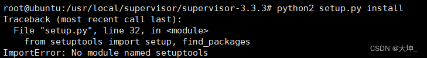
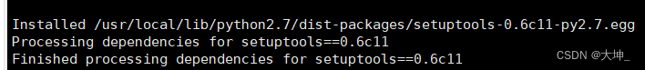

# Supervisor 详解及部署

## 1.介绍

Supervisor（监督人），在Linux中Supervisor是一个进程管理工具，当进程中断的时候Supervisor能自动重新启动它。可以运行在各种类Linux/unix的机器上，supervisor是用Python开发的一套通用的进程管理程序，能将一个普通的命令行进程变为后台daemon，并监控进程状态，异常退出时能自动重启。

## 2.supervisord & supervisorctl

- supervisord ：运行supervisor时会启动一个进程，叫supervisord，它负责启动所管理的进程，并将所管理的进程作为自己的子进程来启动，而且可以在所管理的进程出现崩溃时自动重启。
- supervisorctl：是命令行管理工具，可以用来执行 stop、start、restart 等命令，来对这些子进程进行管理。
- supervisor：是所有进程的父进程，管理着启动的子进程，supervisor以子进程的PID来管理子进程，当子进程异常退出时supervisor可以收到相应的信号量。

## 3.安装supervisor

方案一：yum 安装，简单方便，但是要可以连外网

```bash
yum -y install supervisor 
```

方案二：源码安装（我用的这种）
背景：Ubuntu server 22.04

```bash
mkdir /usr/local/supervisor
cd  /usr/local/supervisor
wget https://pypi.python.org/packages/source/s/supervisor/supervisor-3.3.3.tar.gz
tar -xf supervisor-3.3.3.tar.gz (-x：从存档文件中提取文件（eXtract）。 -f：指定存档文件的名称（File）。)
cd supervisor-3.3.3
python setup.py install
```

提示

```bash
Command 'python' not found, did you mean:
  command 'python3' from deb python3
  command 'python' from deb python-is-python3
```

按照提示 我们使用python3安装

```bash
python3 setup.py install
Supervisor requires Python 2.4 or later but does not work on any version of Python 3.  You are using version 3.10.12 (main, Jun 11 2023, 05:26:28) [GCC 11.4.0].  Please install using a supported version.
```

尴尬了，我们需要python2.*版本

```bash
sudo apt update
apt install python2
python2 -version
```

继续执行
注意：源码安装过程中，可能出现以下报错 ，提示你没有setuptools模块，需要安装模块



安装 setuptools 模块

```bash
cd /usr/local/supervisor
wget https://pypi.python.org/packages/source/s/setuptools/setuptools-0.6c11.tar.gz
tar -xf setuptools-0.6c11.tar.gz  && cd setuptools-0.6c11
python2 setup.py build
python setup.py install

返回继续安装

cd .. && cd supervisor-3.3.3
python2 setup.py install  
```



提示需要meld3模块，下载安装

```bash
cd ../
wget https://pypi.python.org/packages/45/a0/317c6422b26c12fe0161e936fc35f36552069ba8e6f7ecbd99bbffe32a5f/meld3-1.0.2.tar.gz#md5=3ccc78cd79cffd63a751ad7684c02c91
tar -xf meld3-1.0.2.tar.gz && cd meld3-1.0.2
python setup.py install
```

返回继续安装

```bash
cd ../ && cd supervisor-3.3.3
python2 setup.py install
```

验证是否安装完成

```bash
supervisorctl --help
```

## 4.创建配置文件

```bash
mkdir -p /etc/supervisor/conf.d
echo_supervisord_conf > /etc/supervisord.conf
```

注意：可能echo_supervisord_conf不在你的环境变量目录下，可能要查找，通常在python环境的bin目录下，如果不在可以去这个目录查找。

修改配置文件

```bash
vim /etc/supervisord.conf
#在最后处
[include]                     				  # 打开注释
files = /etc/supervisord/conf.d/*.ini         # 打开注释，将路径修改为/etc/supervisord/conf.d/
```

启动supervisor

```bash
supervisord -c /etc/supervisord.conf 
#查看状态
ps -ef |grep supervisor
```

### 1.设置为开机启动
找到Supervisord及Supervisorctl命令的路径，例如使用which命令：

```bash
root@ubuntu:/usr/local/supervisor/supervisor-3.3.3# which supervisord /usr/local/bin/supervisord
/usr/local/bin/supervisord
/usr/local/bin/supervisord
root@ubuntu:/usr/local/supervisor/supervisor-3.3.3# which supervisorctl /usr/local/bin/supervisorctl
/usr/local/bin/supervisorctl
/usr/local/bin/supervisorctl
```

### 2.建立Supervisord.service文件，例如使用vi编辑器：

```bash
vim /usr/lib/systemd/system/supervisord.service

[Unit]
Description=Supervisor daemon
Documentation=http://supervisord.org
After=network.target

[Service]
ExecStart=/usr/local/bin/supervisord -n -c /etc/supervisor/supervisord.conf
ExecStop=/usr/local/bin/supervisorctl shutdown
ExecReload=/usr/local/bin/supervisorctl -c /etc/supervisor/supervisord.conf reload
KillMode=process
Restart=on-failure
RestartSec=50s

[Install]
WantedBy=multi-user.target
```

## 5.配置文件详解

```yaml
; Sample supervisor config file.
 
[unix_http_server]
file=/var/run/supervisor/supervisor.sock   ; socket 路径
 
;chmod=0700                 ; socket 文件的权限
;chown=nobody:nogroup       ; socket 所属用户及组
;username=user              ; 用户名
;password=123               ; 密码
 
;[inet_http_server]         ; 是否启用服务，默认是关闭的（启用的话可以看到supervisor 管理的服务状态）
;port=127.0.0.1:9001        ; 监听的IP及端口
;username=user              ; 用户名
;password=123               ; 密码
 
[supervisord]               ; supervisord 全局配置
logfile=/var/log/supervisor/supervisord.log  ; supervisor 日志路径
logfile_maxbytes=50MB       ; 单个日志文件最大数
logfile_backups=10          ; 保留多少个日志文件（默认10个）
loglevel=info               ; (log level;default info; others: debug,warn,trace)
pidfile=/var/run/supervisord.pid ; pid 文件路径
nodaemon=false              ; 启动是否丢到前台，设置为false ，表示以daemon 的方式启动
minfds=1024                 ; 最小文件打开数，对应系统limit.conf 中的nofile ,默认最小为1024，最大为4096
minprocs=200                ; 最小的进程打开数，对应系统的limit.conf 中的nproc,默认为200
;umask=022                  ; (process file creation umask;default 022)
;user=chrism                 ; 启动supervisord 服务的用户，默认为root
;identifier=supervisor       ; (supervisord identifier, default is 'supervisor')
;directory=/tmp              ; 这里的目录指的是服务的工作目录
;nocleanup=true              ; (don't clean up tempfiles at start;default false)
;childlogdir=/tmp            ; ('AUTO' child log dir, default $TEMP)
;environment=KEY=value       ; (key value pairs to add to environment)
;strip_ansi=false            ; (strip ansi escape codes in logs; def. false)
 
; the below section must remain in the config file for RPC
; (supervisorctl/web interface) to work, additional interfaces may be
; added by defining them in separate rpcinterface: sections
[rpcinterface:supervisor]
supervisor.rpcinterface_factory = supervisor.rpcinterface:make_main_rpcinterface
 
[supervisorctl]
serverurl=unix:///var/run/supervisor/supervisor.sock ; use a unix:// URL  for a unix socket
;serverurl=http://127.0.0.1:9001 ; use an http:// url to specify an inet socket
;username=chris              ; should be same as http_username if set
;password=123                ; should be same as http_password if set
;prompt=mysupervisor         ; cmd line prompt (default "supervisor")
;history_file=~/.sc_history  ; use readline history if available
 
; The below sample program section shows all possible program subsection values,
; create one or more 'real' program: sections to be able to control them under
; supervisor.
 
;[program:theprogramname]      ; 定义一个守护进程 ，比如下面的elasticsearch 
;command=/bin/cat              ; 启动程序使用的命令，可以是绝对路径或者相对路径
;process_name=%(program_name)s ; 一个python字符串表达式，用来表示supervisor进程启动的这个的名称，默认值是%(program_name)s
;numprocs=1                    ; Supervisor启动这个程序的多个实例，如果numprocs>1，则process_name的表达式必须包含%(process_num)s，默认是1
;directory=/tmp                ; supervisord在生成子进程的时候会切换到该目录
;umask=022                     ; umask for process (default None)
;priority=999                  ; 权重，可以控制程序启动和关闭时的顺序，权重越低：越早启动，越晚关闭。默认值是999
;autostart=true                ; 如果设置为true，当supervisord启动的时候，进程会自动启动
;autorestart=true              ; 设置为随 supervisord 重启而重启，值可以是false、true、unexpected。false：进程不会自动重启
;startsecs=10                  ; 程序启动后等待多长时间后才认为程序启动成功，默认是10秒
;startretries=3                ; supervisord尝试启动一个程序时尝试的次数。默认是3
;exitcodes=0,2                 ; 一个预期的退出返回码，默认是0,2。
;stopsignal=QUIT               ; 当收到stop请求的时候，发送信号给程序，默认是TERM信号，也可以是 HUP, INT, QUIT, KILL, USR1, or USR2
;stopwaitsecs=10               ; 在操作系统给supervisord发送SIGCHILD信号时等待的时间
;user=chrism                   ; 如果supervisord以root运行，则会使用这个设置用户启动子程序
;redirect_stderr=true          ; 如果设置为true，进程则会把标准错误输出到supervisord后台的标准输出文件描述符
;stdout_logfile=/a/path        ; 把进程的标准输出写入文件中，如果stdout_logfile没有设置或者设置为AUTO，则supervisor会自动选择一个文件位置
;stdout_logfile_maxbytes=1MB   ; 标准输出log文件达到多少后自动进行轮转，单位是KB、MB、GB。如果设置为0则表示不限制日志文件大小
;stdout_logfile_backups=10     ; 标准输出日志轮转备份的数量，默认是10，如果设置为0，则不备份
;stdout_capture_maxbytes=1MB   ; 当进程处于stderr capture mode模式的时候，写入FIFO队列的最大bytes值，单位可以是KB、MB、GB
;stdout_events_enabled=false   ; 如果设置为true，当进程在写它的stderr
;stderr_logfile=/a/path        ; 把进程的错误日志输出一个文件中，除非redirect_stderr参数被设置为true
;stderr_logfile_maxbytes=1MB   ; 错误log文件达到多少后自动进行轮转，单位是KB、MB、GB。如果设置为0则表示不限制日志文件大小
;stderr_logfile_backups=10     ; 错误日志轮转备份的数量，默认是10，如果设置为0，则不备份
;stderr_capture_maxbytes=1MB   ; 当进程处于stderr capture mode模式的时候，写入FIFO队列的最大bytes值，单位可以是KB、MB、GB
;stderr_events_enabled=false   ; 如果设置为true，当进程在写它的stderr到文件描述符的时候，PROCESS_LOG_STDERR事件会被触发
;environment=A=1,B=2           ; 一个k/v对的list列表
;serverurl=AUTO                ; 是否允许子进程和内部的HTTP服务通讯，如果设置为AUTO，supervisor会自动的构造一个url
 
; The below sample eventlistener section shows all possible
; eventlistener subsection values, create one or more 'real'
; eventlistener: sections to be able to handle event notifications
; sent by supervisor.
 #这个地方是自定义一个守护进程
[program:elasticsearch]                       ; 定义一个守护进程 elasticsearch
environment=ES_HOME=/usr/local/elasticsearch  ; 设置ES_HOME 环境变量
user=elk                                      ; 启动elasticsearch 的用户
directory=/usr/local/elasticsearch            ; 进入到这个目录中
command=/usr/local/elasticsearch/bin/elasticsearch ; 执行启动命令
numprocs=1                                    ; Supervisor启动这个程序的多个实例，如果numprocs>1，则process_name的表达式必须包含%(process_num)s，默认是1
autostart=true                                ; 设置为随 supervisord 启动而启动
autorestart=true                              ; 设置为随 supervisord 重启而重启
startretries=3                                ; 设置elasticsearch 重启的重试次数
priority=1                                    ; 权重，可以控制程序启动和关闭时的顺序，权重越低：越早启动，越晚关闭。默认值是999  
 
;[eventlistener:theeventlistenername]
;command=/bin/eventlistener    ; the program (relative uses PATH, can take args)
;process_name=%(program_name)s ; process_name expr (default %(program_name)s)
;numprocs=1                    ; number of processes copies to start (def 1)
;events=EVENT                  ; event notif. types to subscribe to (req'd)
;buffer_size=10                ; event buffer queue size (default 10)
;directory=/tmp                ; directory to cwd to before exec (def no cwd)
;umask=022                     ; umask for process (default None)
;priority=-1                   ; the relative start priority (default -1)
;autostart=true                ; start at supervisord start (default: true)
;autorestart=unexpected        ; restart at unexpected quit (default: unexpected)
;startsecs=10                  ; number of secs prog must stay running (def. 1)
;startretries=3                ; max # of serial start failures (default 3)
;exitcodes=0,2                 ; 'expected' exit codes for process (default 0,2)
;stopsignal=QUIT               ; signal used to kill process (default TERM)
;stopwaitsecs=10               ; max num secs to wait b4 SIGKILL (default 10)
;user=chrism                   ; setuid to this UNIX account to run the program
;redirect_stderr=true          ; redirect proc stderr to stdout (default false)
;stdout_logfile=/a/path        ; stdout log path, NONE for none; default AUTO
;stdout_logfile_maxbytes=1MB   ; max # logfile bytes b4 rotation (default 50MB)
;stdout_logfile_backups=10     ; # of stdout logfile backups (default 10)
;stdout_events_enabled=false   ; emit events on stdout writes (default false)
;stderr_logfile=/a/path        ; stderr log path, NONE for none; default AUTO
;stderr_logfile_maxbytes=1MB   ; max # logfile bytes b4 rotation (default 50MB)
;stderr_logfile_backups        ; # of stderr logfile backups (default 10)
;stderr_events_enabled=false   ; emit events on stderr writes (default false)
;environment=A=1,B=2           ; process environment additions
;serverurl=AUTO                ; override serverurl computation (childutils)
 
; The below sample group section shows all possible group values,
; create one or more 'real' group: sections to create "heterogeneous"
; process groups.
 
;[group:thegroupname]          ; 服务组管理，可以将多个服务名写到这里管理(组名自定义）
;programs=progname1,progname2  ; 上面配置好的服务名，比如elasticsearch,kibana,logstash
;priority=999                  ; the relative start priority (default 999)
 
; The [include] section can just contain the "files" setting.  This
; setting can list multiple files (separated by whitespace or
; newlines).  It can also contain wildcards.  The filenames are
; interpreted as relative to this file.  Included files *cannot*
; include files themselves.
 
[include]
files = supervisord.d/*.ini  ;默认放在安装目录的supervisord.d目录下，可以指定一个或多个以.ini结束的配置文件。
```

## 6.进程配置文件

```yaml
vim /etc/supervisor/conf.d/uefun.ini

[program:uefun]  ;项目名
command=/data/uefun/uefun -config=/data/uefun/config.conf  ; 被监控的进程路径
priority=1                    ; 数字越高，优先级越高
numprocs=1                    ; 启动几个进程
autostart=true                ; 随着supervisord的启动而启动
autorestart=true              ; 自动重启
startretries=10               ; 启动失败时的最多重试次数
exitcodes=0                   ; 正常退出代码
stopsignal=KILL               ; 用来杀死进程的信号
stopwaitsecs=10               ; 发送SIGKILL前的等待时间
redirect_stderr=true          ; 重定向stderr到stdout
```