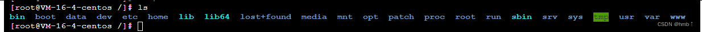
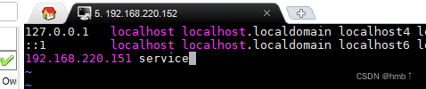
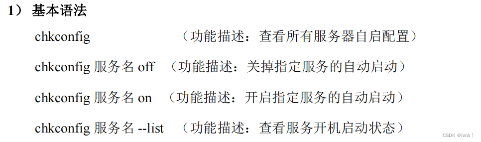

# 一、为什么要学[linux](https://blog.csdn.net/leah126/article/details/131558171?ops_request_misc=%257B%2522request%255Fid%2522%253A%25222b48086c48e5f6300e160389c75202b9%2522%252C%2522scm%2522%253A%252220140713.130102334..%2522%257D&request_id=2b48086c48e5f6300e160389c75202b9&biz_id=0&utm_medium=distribute.pc_search_result.none-task-blog-2~all~top_positive~default-2-131558171-null-null.142^v102^pc_search_result_base5&utm_term=linux&spm=1018.2226.3001.4187)

因为我们要部署服务，Linux系统一直以其稳定性而闻名，它们可以连续运行多年而不发生任何重大问题。事实上，很多Linux用户都从未在自己的环境中遇到过系统崩溃的情况。相对windows而言，挂起和崩溃完全是一种常态。

Windows由于是商业产品，源代码封闭，我们无法知道微软在里面做了什么手脚。而Linux由于是源代码开放操作系统，不存在这个问题


# 二、目录介绍

linux系统中一切皆文件





- /bin

是binary的缩写，这个目录存放着最经常使用的命令，通过上方桌面可以看到bin文件夹有个箭头，是链接到 /usr/bin下，相当于快捷方式，进入/bin和/usr/bin下是一模一样的


- /sbin
  s就是super User的意思，这里存放的是系统管理员使用的系统管理程序。
- /home
  存放普通用户的主目录，在Linux中每个用户都有一个自己的目录，一版该目录名是以用户的账号命名的。
- /root
  该目录为系统管理员，也称为超级权限者的用户主目录。
- /lib
  系统开机所需要最基本的动态连接共享库，其作用类似于windows里的DLL文件。几乎所有的应用程序都需要用到这些共享库。
- /etc
  所有的系统管理所需要的配置文件和子目录。
- /usr
  这是一个非常重要的目录，用户的很多应用程序和文件都放在这个目录下，类似于windows下的program fies目录。
- /boot
  这里存放的是启动linux时使用的一些核心文件，包括一些连接文件以及镜像文件，自己的安装别放这里。
- /proc
  这个目录是一个虚拟目录，它是系统内存的映射，我们可以通过直接访问这个目录来获取系统信息。
- /srv
  service缩写，该目录存放一些服务启动之后需要提取的数据。
- /sys
  这是linux2.6内核的一个很大的变化。该目录下安装了2.6内核中新出现的一个文件系统sysfs。
- /tmp
  这个目录是用来存放一些临时文件的。
- /dev
  类似于windows的设备管理器，把所有的硬件用文件的形式存储。管理着所有设备，例如CPU、硬盘等等
- /media
  linux系统会自动识别一些设备，例如U盘、光驱等等，当识别后，linux会把识别的设备挂载到这个目录下。
  centos7迁移到/run/media
- /mnt
  系统提供该目录是为了让用户临时挂载别的文件系统的，我们可以将外部的存储挂载在/mnt上，然后进入该目录就可以查看里面的内容了。和media差不多
- /opt
  这是给主机额外安装软件所摆放的目录。比如你安装一个mysql数据库则就可以放在这个目录下。默认是空的。
- /var
  这个目录中存放着在不断扩充的东西，我们习惯将那些经常被修改的目录放在这个目录下。包括各种日志文件。
- /lost+found
  这个目录一般情况下是空的，当系统非法关机后，这里就存放了一些文件。
- /www
  /www目录可以用于存储Web应用程序或网站文件，/www目录没有特别的用途，它只是一个常规目录，可以根据需要进行使用和管理。

# 三、vi / vim编辑器

用户@主机名 组成， ~号代表当前目录位置，#号代表管理员用户，普通用户都是$号


VI 是 Unix 操作系统和类 Unix 操作系统中最通用的文本编辑器。VIM 编辑器是从 VI 发展出来的一个性能更强大的文本编辑器。可以主动的以字体颜色辨别语法的正确性，方便程序设计。VIM 与 VI 编辑器完全兼容。


**模式转换**

进来默认一般模式，想要编辑文本就按i进入编辑模式


vim常用语法

**一般模式**


**编辑模式**


按『Esc』键 退出编辑模式，之后所在的模式为一般模式。

**命令模式**


# 四、网络配置

## 4.1、修改 IP 地址

```bash
vim /etc/sysconfig/network-scripts/ifcfg-ens33
```


执行 `service network restart` 重启网络，使网络生效。

## 4.2、配置主机名

### 4.2.1、修改主机名称

1) 、查看当前服务器主机名称

```bash
hostname
```

2) 、通过编辑/etc/hostname 文件修改主机名

```bash
vim /etc/hostname
```

修改完重启后就生效了。

### 4.2.2、修改 hosts 映射文件

```bash
vim /etc/hosts
```

添加映射，保存后，可以直接访问service，就可以访问到220.151 ip了



# 五、系统配置

## 5.1、service 服务管理

Linux 中的进程和服务

计算机中，一个正在执行的程序或命令，被叫做“进程”（process）。

启动之后一只存在、常驻内存的进程，一般被称作“服务”（service）。

```bash
service 服务名 start | stop |· restart | status
```

查看服务的方法：/etc/init.d/服务名 ,发现只有两个服务保留在 service


chkconfig 设置后台服务的自启配置



2) 、开启/关闭 network(网络)服务的自动启动

```bash
chkconfig network on

chkconfig network off
```

3) 、开启/关闭 network 服务指定级别的自动启动

```bash
chkconfig --level 指定级别 network on
```

## 5.2、systemctl

1) 、基本语法

```bash
systemctl start | stop | restart | status 服务名
```

2) 、查看服务的方法：/usr/lib/systemd/system

```bash
cd /usr/lib/systemd/system
```


systemctl 设置后台服务的自启配置

1. 查看所有服务开机启动状态

```bash
systemctl list-unit-files
```

2. 关掉指定服务的自动启动

```bash
systemctl disable service_name
```

3. 开启指定服务的自动启动

```bash
systemctl enable service_name
```

## 5.3、防火墙

1) 、查看、更改防火墙状态

```bash
systemctl status firewalld  #查看防火墙状态

systemctl stop firewalld # 关闭防火墙

systemctl start firewalld # 开启防火墙

systemctl enable firewalld.service  # 开机自启动防火墙

systemctl disable firewalld.service # 开机不自启动防火墙
```
