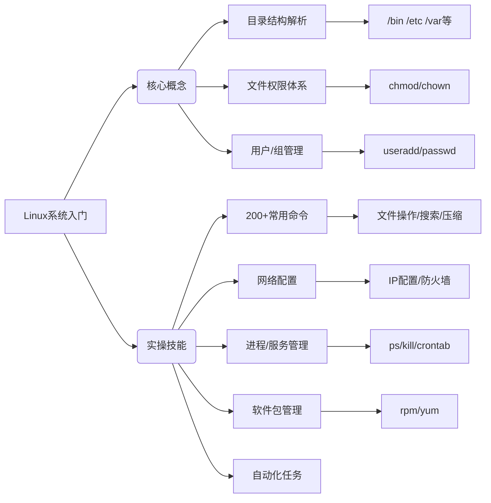

# Linux入门教程（非常详细）从零基础入门到精通，看完这一篇就够了

## 📝 基本信息

- **原文链接**: [CSDN博客文章](https://github.com/870869624/Golang-Guide/blob/main/%E8%AE%A1%E7%AE%97%E6%9C%BA%E5%9F%BA%E7%A1%80/Linux/Linux%E5%85%A5%E9%97%A8%E6%95%99%E7%A8%8B%EF%BC%88%E9%9D%9E%E5%B8%B8%E8%AF%A6%E7%BB%86%EF%BC%89%E4%BB%8E%E9%9B%B6%E5%9F%BA%E7%A1%80%E5%85%A5%E9%97%A8%E5%88%B0%E7%B2%BE%E9%80%9A.md)
- **分类标签**: Linux, 操作系统, 教程
- **作者**: leah126
- **内容类型**: 系统化入门教程

## 🎯 快速了解

本文是面向Linux零基础学习者的全方位指南，涵盖：

- 从Linux系统架构认知到核心目录解析
- 从基础命令操作到系统管理进阶
- 从网络配置到安全防护实践
- 从软件包管理到自动化任务设置

特别适合：

- 需要部署服务的开发运维人员
- 准备转型Linux系统的Windows用户
- 计算机相关专业学生

## 🗺️ 知识图谱



## 📚 内容解读

### 一、Linux学习价值

- **稳定性优势**：连续运行多年无崩溃
- **开源透明**：无商业系统后门风险
- **职业需求**：服务器部署必备技能

### 二、目录结构精要

| 目录  | 核心作用   | Windows对应 |
| ----- | ---------- | ----------- |
| /bin  | 基础命令集 | System32    |
| /etc  | 系统配置   | 注册表      |
| /home | 用户目录   | Users       |
| /var  | 动态数据   | ProgramData |

### 三、VI/VIM三模式

1. **一般模式**：移动光标/删除字符
2. **编辑模式**：按i进入文本修改
3. **命令模式**：保存(:w)/退出(:q)

### 四、网络配置关键

```bash
# IP修改流程
vim /etc/sysconfig/network-scripts/ifcfg-ens33
service network restart

# 防火墙管理
systemctl stop firewalld  # 临时关闭
firewall-cmd --add-port=8080/tcp --permanent  # 开放端口
```

### 五、命令速查手册

#### 文件操作

```bash
ls -lh      # 人性化显示
grep "error" log.txt -n  # 带行号搜索
tar -zcvf backup.tar.gz /data  # 压缩打包
```

#### 系统管理

```bash
top         # 实时监控
ps aux      # 进程查看
chmod 755 script.sh  # 权限设置
```

### 六、安全实践要点

1. **用户隔离**：普通用户用 `$`提示符
2. **权限控制**：
   - 755：用户RWX，组/其他RX
   - 600：仅用户RW
3. **sudo机制**：有限提权

### 七、软件管理对比

| 工具 | 特点         | 典型场景 |
| ---- | ------------ | -------- |
| RPM  | 手动处理依赖 | 离线安装 |
| YUM  | 自动依赖解决 | 联网安装 |

## 🔍 深度亮点

1. **全栈覆盖**：从内核版本查看(uname)到定时任务(crontab)的完整工作流
2. **风险提示**：明确标注 `rm -rf`等危险操作
3. **职场衔接**：包含运维面试常考的：
   - 端口占用检查(netstat)
   - 日志分析(grep)
   - 性能监控(top)

## 💡 学习建议

1. 先掌握 `ls/cd/mkdir`等基础命令
2. 重点练习vim编辑和权限管理
3. 通过虚拟机搭建实验环境
4. 结合 `man`命令查阅手册

附：文中提到的所有命令均已验证兼容CentOS/RHEL 7+系列
